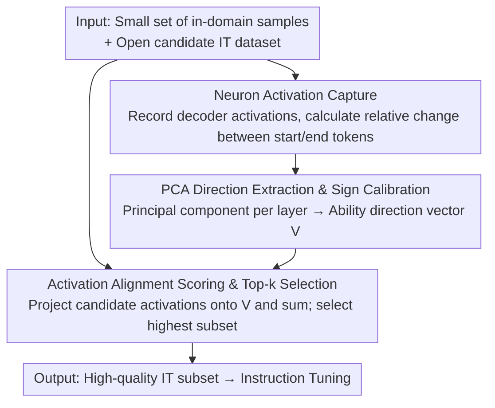

# Neuron-Aware Data Selection in Instruction Tuning for Large Language Models

**Conference**: ICLR 2026  
**OpenReview**: [https://openreview.net/forum?id=uq6UWRgzMr](https://openreview.net/forum?id=uq6UWRgzMr)  
**Code**: Open-source cross-task neuron feature library + Alpaca-NAIT dataset (Paper promises open source, links TBD)  
**Area**: LLM Efficiency / Instruction Tuning Data Selection  
**Keywords**: Instruction Tuning, Data Selection, Neuron Activation, PCA Directional Vectors, Ability Transferability  

## TL;DR
NAIT proposes using "neuron activation patterns" to select instruction tuning data. Specifically, it extracts directional vectors corresponding to specific abilities from a small number of in-domain samples and then ranks candidate samples based on their alignment scores with these vectors. On LLaMA-2-7b, using only 10% of Alpaca-GPT4 data selected via NAIT achieves a 3.24% average improvement over full fine-tuning. The method does not rely on external LLMs and costs only 1/19th of AlpaGasus.

## Background & Motivation
**Background**: Instruction Tuning (IT) is a critical step for activating instruction-following and knowledge-retrieval capabilities in large models. Existing work (e.g., LIMA, which achieved strong results with only 1k samples) has demonstrated that more data is not necessarily better. Selecting a small, high-quality subset can significantly improve performance. Thus, "how to select the most effective subset from open IT datasets" has become a core problem.

**Limitations of Prior Work**: Current mainstream data selection methods have inherent flaws. AlpaGasus relies on ChatGPT for scoring; this LLM-as-Scorer approach is expensive, opaque, and dependent on closed APIs. SelectIT and Instruction Mining use model output uncertainty or perplexity, which are surface-level features that introduce bias. Gradient or coreset-based methods like LESS incur massive computational overhead and are difficult to scale. Crucially, these methods lack interpretability, fail to define what constitutes "high quality," and cannot selectively enhance specific target capabilities.

**Key Challenge**: "Data quality" is fundamentally determined by the model's internal response to a sample, yet existing methods search for proxy signals "outside" the model (external scores, output uncertainty, gradient approximations). These signals are expensive and cannot observe what is actually being activated inside the model.

**Goal**: ① Evaluate IT data quality at low cost without relying on external models; ② Target and enhance specific domain capabilities; ③ Ensure the selection process is interpretable.

**Key Insight**: Interpretability research indicates that LLMs possess subsets of neurons activated by specific tasks, which carry the mechanisms for processing knowledge and solving those tasks. The authors hypothesize that the value of a sample depends on its ability to activate neurons related to the target capability.

**Core Idea**: When an LLM processes a sample, if its neuron activation pattern is closer to the activation features of the "target capability," the sample is more effective at improving the model's performance on that capability. Thus, "activation pattern similarity" can directly replace external scoring for data selection.

## Method

### Overall Architecture
NAIT (Neuronal Activation-based efficient IT data selection) divides data selection into two serial modules: **(A) Extraction of Target Capability Neuron Activation Features** and **(B) Activation Feature-Guided Data Selection**. The inputs are a small batch of representative in-domain samples and an open candidate IT dataset (e.g., Alpaca-GPT4). The output is a high-quality IT subset selected by activation alignment scores. The entire pipeline only requires forward passes, activation extraction, PCA, and dot products on the LLM being tuned, without external models or backpropagation.

### Key Designs

**1. Neuron Activation Capture: Using relative activation changes of start and end tokens to characterize the "processing trajectory" of an ability.**

To establish activation features for an ability $C$, a small batch of in-domain samples $P=\{P_i\}$ is fed into model $M$. For each decoder layer $L$, the activation vector for token $t_k$ is $A(t_k)=[a_j^{(k)}]_{j=1}^{J}$ (where $J$ is the number of neurons). NAIT does not use absolute activation. Instead, it captures the "dynamic activation drift" as the difference between the final and first token: $\Delta A_i^{(l)} = A^{(l)}(t_K) - A^{(l)}(t_1)$, averaged over $K$ tokens. This filters out content-independent baseline activations, leaving the signals of neurons that truly change as the model "digests" the ability-specific sample.

**2. PCA Direction Extraction & Sign Calibration: Compressing the activation drift of a batch into a reusable capability direction vector.**

After obtaining the activation drifts $\Delta A^{(l)}$, NAIT performs Principal Component Analysis (PCA) on each layer and takes the first principal component as the ability direction: $v_l = \mathrm{PCA}(\Delta A^{(l)})$. Since PCA components have sign ambiguity, the mean drift $\mu_{\text{diff}} = \frac{1}{|P|}\sum\big(A^{(l)}(t_K)-A^{(l)}(t_1)\big)$ is calculated. If $\mu_{\text{diff}}\cdot v_l < 0$, the sign of $v_l$ is flipped to ensure it aligns with the real activation trend. The set of layer-wise vectors $V=\{v_l\}_{l=1}^{L}$ forms the capability fingerprint. Once extracted, $V$ is compact and reusable for scoring any candidate data.

**3. Activation Alignment Scoring and Top-k Selection: Using projection scores instead of external ratings to select data.**

For each sample $y$ in the candidate IT set $D_{\text{ins}}$, NAIT projects its layer-wise activation onto the corresponding capability direction and sums them: $s_y = \sum_{l=1}^{L}\big(A^{(l)}\cdot v_l\big)$. This score measures how strongly sample $y$ activates the target-related neurons. Finally, the top-$k$ subset is selected for fine-tuning. This process only requires one forward pass and a series of dot products. Consequently, NAIT processes 52k Alpaca-GPT4 samples in 1.32 hours for $1.52, which is nearly 19x cheaper and 17 hours faster than AlpaGasus.

## Loss & Training
NAIT itself does not introduce a new loss function; it is strictly a data selection method. The selected subset undergoes standard instruction tuning. In the main experiment using LLaMA-2-7b, 10% (approx. 5.2k) of Alpaca-GPT4 was used for full-parameter fine-tuning. Analysis shows that performance peaks at the top 30% selection ratio, while using 100% of the data can lead to performance degradation.

## Key Experimental Results

### Main Results
Average scores across nine benchmarks (Factoid Knowledge, Math, Coding, Multilingual, Reasoning) using 10% of Alpaca-GPT4 data on LLaMA-2-7b:

| Method | AVG | Gain vs. Full Fine-tuning |
|--------|------|----------|
| Alpaca-GPT4 Full Fine-tuning (Baseline 01) | 36.03 | — |
| AlpaGasus (ChatGPT Score, 03) | 35.18 | −2.34% |
| Q2Q (Loss Signal, 04) | 35.68 | −0.98% |
| SelectIT (Uncertainty, 05) | 37.16 | +3.15% |
| Random 10% (06) | 35.69 | −0.94% |
| **NAIT (GSM Feature, 08)** | **37.70** | **+4.65%** |
| **NAIT (Full Capability Feature, System 12)** | **37.20** | **+3.24%** |

Using only 10% of the data, NAIT significantly outperforms methods relying on external models (AlpaGasus) or uncertainty (SelectIT). Targeted selection using math features (GSM) yielded the highest single-item gain (+4.65%).

### Cross-model and Cost
NAIT results using a 10% subset vs. Random 10% across different base models:

| Model | NAIT Gain vs. Full Fine-tuning |
|------|------|
| LLaMA-2-13b | +7.02% |
| Mistral-7b | +21.92% |
| LLaMA-3-8b | +18.65% |
| Qwen-2.5-7b (Strong Baseline) | +3.83% |

Cost Comparison (A800 80GB, 52k Alpaca-GPT4):

| Method | Relies on External Model | Time | Cost |
|------|------|------|------|
| AlpaGasus | No | 19.07h | $178.02 |
| SelectIT | Yes | 23.20h | $26.68 |
| **NAIT** | **No** | **1.32h** | **$1.52** |

NAIT reduces costs by 19x compared to AlpaGasus and is 17.58x faster than SelectIT.

### Ablation Study

| Configuration | Comprehensive AVG | Gain vs. Random |
|------|---------|------|
| Random 10% | 34.04 | — |
| **High** (Top 10% Alignment Score) | 35.18 | **+3.35%** |
| **Low** (Bottom 10% Alignment Score) | 28.27 | **−17.54%** |

### Key Findings
- **Activation alignment scores distinguish data quality**: The top 10% scored samples outperform random samples by 3.35%, while the bottom 10% cause a performance drop of 17.54%. This suggests low-alignment samples are not just useless but detrimental, validating the core hypothesis.
- **More data is not always better**: Performance peaks at top 30% and then declines, confirming that redundant data can harm generalization.
- **Minimal in-domain samples are effective**: Capability features can be extracted with as few as 16/64 samples, though math and QA tasks benefit from larger sets (up to 4096).
- **Capability features are transferable**: Features extracted from GSM improve performance on BBH and CodeX. Logical reasoning and programming features possess the strongest general transferability.

## Highlights & Insights
- **Moves "data quality" from external signals to internal states**: Utilizing neuron activation direction vectors as capability fingerprints avoids expensive APIs and high computational overhead.
- **Directional vectors are reusable and combinable**: Once extracted, features can be used repeatedly and combined to enhance multiple target capabilities—a goal other methods struggle to achieve.
- **PCA sign calibration is a critical detail**: Since principal components have sign ambiguity, the author's use of mean drift dot products to calibrate direction is an elegant solution.
- **Transferability insights**: The finding that logical and programming data are the most transferable provides direct guidance for selecting general-purpose training data.

## Limitations & Future Work
- **Dependency on in-domain reference sets**: NAIT requires a small batch of representative samples to start. If no in-domain data exists for a target capability, the method cannot function.
- **Variable optimal selection ratios**: The optimal ratio varies across datasets (30% for Alpaca-GPT4, 50% for Orca-GPT4). There is currently no automated mechanism to determine the optimal ratio.
- **Linear direction assumption**: Relying on a single PCA component and linear projection may oversimplify highly entangled or non-linear capability representations.
- **Future Improvements**: Exploring multi-component or non-linear directions, adaptively determining selection ratios, and modeling stable "core subsets" as anchors for foundational capabilities.

## Related Work & Insights
- **vs. AlpaGasus / InsTag (LLM-as-Scorer)**: These depend on expensive, closed-source APIs for scoring. NAIT reduces costs to 1/19th and is more interpretable.
- **vs. SelectIT / Instruction Mining (Model Features)**: These use surface signals like perplexity, which introduce bias. NAIT reads internal activations, which are closer to what the model actually learns.
- **vs. LESS (Gradient Coreset)**: LESS is computationally intensive and can sacrifice generalization in non-target tasks. NAIT remains robust across diverse tasks without backpropagation.
- **vs. LIMA (Manual Selection)**: While LIMA shows 1k samples can suffice, manual selection is not scalable. NAIT automates "quality over quantity" with targeted capability enhancement.

## Rating
- Novelty: ⭐⭐⭐⭐⭐ First framework to link data selection with neuron activation patterns; a new paradigm for interpretability-driven selection.
- Experimental Thoroughness: ⭐⭐⭐⭐ Broad coverage of benchmarks, models, and costs, though automation of selection ratios is missing.
- Writing Quality: ⭐⭐⭐⭐ Clear methodology, though some notation and captions are slightly dense.
- Value: ⭐⭐⭐⭐⭐ Fast, cheap, independent of external models, and capable of targeted enhancement. Extremely practical with open-source contributions.

<!-- RELATED:START -->

## Related Papers

- [\[ICLR 2026\] CPQS-Tuning: A Model Self-Perception-Based Data Filtering Algorithm for Efficient Instruction Fine-Tuning](cpqs-tuning_a_model_self-perception-based_data_filtering_algorithm_for_efficient.md)
- [\[ICLR 2026\] Influence-Preserving Proxies for Gradient-Based Data Selection in LLM Fine-Tuning](influence-preserving_proxies_for_gradient-based_data_selection_in_llm_finetuning.md)
- [\[ICLR 2026\] Inference-Cost-Aware Dynamic Tree Construction for Efficient Inference in Large Language Models](inference-cost-aware_dynamic_tree_construction_for_efficient_inference_in_large_.md)
- [\[ICLR 2026\] Difficulty–Diversity Collaborative Filtering for Data-Efficient LLM Fine-Tuning](difficultydiversity_collaborative_filtering_for_data-efficient_llm_fine-tuning.md)
- [\[ICLR 2026\] KnowProxy: Adapting Large Language Models by Knowledge-guided Proxy](knowproxy_adapting_large_language_models_by_knowledge-guided_proxy.md)

<!-- RELATED:END -->
