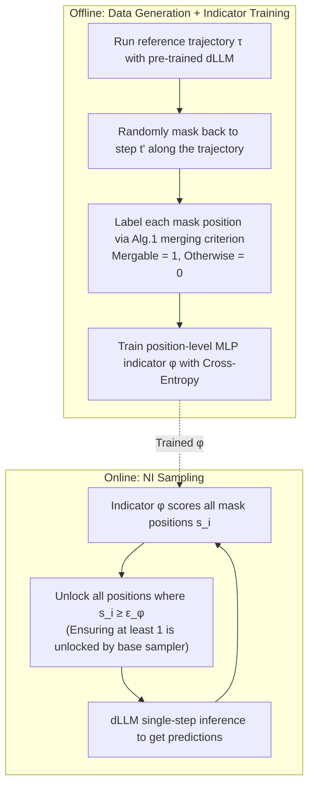

# NI Sampling: Accelerating Discrete Diffusion Sampling by Token Order Optimization

**Conference**: ICLR 2026  
**OpenReview**: [https://openreview.net/forum?id=rrD1U0Izt5](https://openreview.net/forum?id=rrD1U0Izt5)  
**Code**: [https://github.com/imagination-research/NI-Sampling](https://github.com/imagination-research/NI-Sampling)  
**Area**: LLM Inference Acceleration / Discrete Diffusion Language Models  
**Keywords**: Discrete Diffusion (dLLM), Sampling Order Optimization, Parallel Decoding, Neural Indicator, Trajectory Preservation, Inference Acceleration  

## TL;DR
The study transforms the conservative "unlocking only a few tokens per step" sampling of Discrete Diffusion Language Models (dLLMs) into "unlocking all correctly predictable tokens at once." It replaces fixed confidence thresholds with a lightweight neural network (Neural Indicator) to perform this judgment. Compared to full-step sampling, it achieves up to 14.3× acceleration (25.0× when combined with KV caching) on LLaDA / Dream with almost no performance degradation.

## Background & Motivation

**Background**: Discrete Diffusion Language Models (dLLMs, such as LLaDA, Dream, and industrial systems like Mercury / Gemini Diffusion) represent a new paradigm beyond autoregressive LLMs. Starting from a full [MASK] sequence, they gradually fill masked positions with real tokens through reverse denoising. Naturally supporting arbitrary-order generation and single-step parallel decoding of multiple tokens, they are expected to surpass autoregressive models in efficiency.

**Limitations of Prior Work**: While theoretically parallelizable, they are not fast in practice. When sampling multiple mask positions in the same step, the predictions $p_\theta(x_0^{i_1}|x_t)$ and $p_\theta(x_0^{i_2}|x_t)$ at different positions cannot see each other's sampling results (all remain masked). Simultaneous decoding can break inter-token dependencies and degrade quality. Consequently, default samplers (top-1 probability / probability margin / entropy) follow an extremely conservative route: **unlocking only 1 token per step**. For a sequence of length 256, this requires 256 steps, making it prohibitively slow. Confidence threshold sampling (proposed by Fast-dLLM) improves this by unlocking all positions where the predicted probability exceeds a threshold $\epsilon$ (typically 0.9), balancing efficiency and accuracy, but it remains conservative.

**Key Challenge**: The authors observed that the real waste lies in the fact that **the model actually predicts a large number of tokens correctly at each step** (their top-1 tokens match the final generated tokens), but heuristic methods dare not unlock them because their confidence scores do not meet the threshold. This severely wastes the model's predictive power per step and unnecessarily lengthens the sampling process.

**Goal**: To formally study "sampling order optimization" as an independent dimension, quantify its acceleration upper bound, and provide a general framework that does not rely on fixed thresholds to fully utilize the model's per-step predictions.

**Core Idea**: **[Trajectory-Preserving Merging Criterion]** First, prove the potential—if all tokens that match the reference trajectory and are currently predicted correctly are unlocked per step, the number of steps can be compressed to 1/24 without changing the final output. **[Neural Indicator Replacing Thresholds]** Then, model the decision of "whether to unlock a position" as a binary classification task for a lightweight neural network. Offline training is conducted once using supervision signals generated by the aforementioned criterion, enabling plug-and-play use during inference.

## Method

### Overall Architecture

NI Sampling consists of two parts: **(1) Offline Analysis and Training**—running reference trajectories with a pre-trained dLLM, labeling each mask position with 0/1 based on the "trajectory preservation criterion," and training a position-level MLP indicator $\phi$; **(2) Online Sampling**—after each dLLM inference step, the indicator scores all remaining mask positions $s_i$, and all positions with scores exceeding the threshold $\epsilon_\phi$ are unlocked at once. The indicator is extremely small, and its overhead is included in throughput statistics, still yielding significant acceleration.

### Key Designs

**1. Trajectory-Preserving Step Merging Criterion: Quantifying the Acceleration Upper Bound.** Sampling order optimization is formalized as an **ordered partition** $A=(A_1,\dots,A_n)$ of the token position set $S=\{1,\dots,N\}$. The goal is to minimize the number of steps $n$ while maintaining performance. The authors provide a provably lossless merging rule: consider step $k$ of the trajectory; if all positions in the next step $A_{k+1}$ are already predicted correctly under the current state $x_k$—i.e., $\forall i\in A_{k+1},\ \arg\max_j p_\theta(x_0^i=j|x_k)=x_*^i$ (where $x_*^i$ is the final token for that position in the reference trajectory)—then steps $k$ and $k+1$ can be merged without changing the subsequent trajectory. This merging can iterate until conditions are no longer met (Alg. 1/2). Note a subtle "order constraint": even if a token is predicted correctly, it cannot be unlocked early if its predecessor in the reference trajectory is not yet correctly predicted (see the example of token F in Fig. 2 of the original paper). Applying this criterion to LLaDA's top-1 full-step trajectory achieves a speedup of 24.3× over full-step and over 3× over confidence thresholding without any loss in precision, proving the massive acceleration potential hidden in the sampling order.

**2. Neural Indicator: Replacing Fixed Thresholds with a Lightweight Network.** While the criterion is powerful, it cannot be used directly during inference because there is no "reference trajectory" for comparison. Thus, the authors train a position-level indicator $\phi$ to approximate this judgment. After dLLM inference, for the remaining $M$ mask positions, the indicator outputs a score $s_i$, functioning as a "smarter confidence score" than raw probability. All positions with $s_i \ge \epsilon_\phi$ are unlocked (to prevent zero unlocks, a subset is first unlocked using an existing sampler). The key insight is that using model output probability as confidence is merely a special case of this framework; the indicator makes better decisions by encoding richer information than "raw probability vectors" through supervision. The threshold $\epsilon_\phi$ provides a continuous knob for the speed-accuracy trade-off.

**3. Supervision Signal Construction via Random Masking Along Trajectories.** Training data is constructed as follows: use the pre-trained dLLM to generate a batch of trajectories $\tau_d$. During training, sample a trajectory and **randomly roll back** along it—select a random $t'\in\{0,\dots,n-1\}$, mask positions for all steps $k > t'$, and use the merging criterion from Alg. 1 to determine which subsequent steps can be merged. Positions in mergable steps are labeled 1, others 0, and the MLP is trained via cross-entropy. This "trajectory-preserving" labeling ensures the indicator recovers high-quality original trajectories with drastically fewer steps when optimized. Moreover, data can be generated using any sampler (LLaDA uses 0.8 threshold confidence sampling for efficiency; Dream uses full-step trajectories), making NI Sampling compatible with existing samplers.

**4. Input Features and Position-level MLP Architecture.** For each mask position, the indicator takes three types of inputs: ① Embeddings of the top-$K_1$ predicted tokens (top-1 is the sampling result, top-2 to $K_1$ provide semantic context); ② The hidden state from the last layer (carrying global context of the sequence); ③ Top-$K_2$ logits (enabling the indicator to perceive dLLM confidence). The architecture uses a **position-level MLP**—positions are processed independently without explicit interaction, as context is already injected via the hidden states. Different features pass through linear layers, are concatenated, and fed into backbone blocks (two-layer linear + activation + residual). A projection head yields 2D logits followed by softmax to get $s_i$. The parameter count is kept small to ensure negligible computational overhead. This indicator is **trained once** and generalizes across tasks and generation lengths.

## Key Experimental Results

### Main Results (LLaDA-8B-Instruct / LLaDA-1.5 vs. Full and Threshold Sampling)

| Dataset | Method | LLaDA-8B Acc | Steps | Token/s | LLaDA-1.5 Acc | Steps | Token/s |
|---|---|---|---|---|---|---|---|
| GSM8K-512 | Full | 74.83 | 512 | 14.4 | 80.67 | 512 | 15.0 |
| | Threshold | 75.28 | 73.29 | 104.4 (7.2×) | 80.89 | 72.38 | 105.6 (7.0×) |
| | **NI Sampling** | **76.57** | **51.08** | **147.0 (10.2×)** | **81.20** | **53.56** | **140.6 (9.4×)** |
| HumanEval-512 | Full | 35.37 | 512 | 31.5 | 40.85 | 512 | 32.1 |
| | Threshold | 35.37 | 158.6 | 100.8 (3.2×) | 39.02 | 158.4 | 101.1 (3.1×) |
| | **NI Sampling** | **35.98** | **69.54** | **219.3 (7.0×)** | **39.63** | **105.3** | **144.2 (4.5×)** |
| MBPP-512 | Full | 36.80 | 512 | 19.1 | 37.80 | 512 | 18.7 |
| | Threshold | 37.60 | 38.75 | 250.2 (13.1×) | 38.60 | 44.38 | 215.8 (11.5×) |
| | **NI Sampling** | **38.00** | **35.25** | **263.9 (13.8×)** | **38.80** | **34.62** | **268.0 (14.3×)** |

NI Sampling achieves up to ~15× speedup compared to full-step sampling with almost no drop in accuracy (some datasets even show slight gains, likely due to evaluation variance). Compared to confidence threshold sampling, throughput is up to 2.2× faster (219.3 vs 100.8 token/s), and the accuracy-step trade-off curve is Pareto-dominant across all settings.

### Cache Integration and Cross-model Generalization

| Dataset | Method | Acc | Step | Token/s |
|---|---|---|---|---|
| GSM8K-512 | NI Sampling | 75.44 | 44.85 | 197.7 (13.7×) |
| | **NI Sampling+Dual Cache** | 73.84 | 50.76 | **360.6 (25.0×)** |
| GSM8K-256 (Dream-7B-Base) | Full | 75.05 | 256 | 23.0 |
| | Threshold | 72.78 | 161.95 | 36.4 (1.6×) |
| | **NI Sampling** | **74.45** | **108.26** | **52.1 (2.3×)** |

When combined with Fast-dLLM’s Dual Cache, it achieves up to 25.0× speedup. It also consistently outperforms threshold sampling on Dream-7B-Base (fine-tuned from an AR LLM), proving the framework is model-agnostic.

### Key Findings
- **Potential Analysis**: The ideal "trajectory-preserving order" can achieve 11.4×~24.3× speedup on LLaDA without any loss in accuracy, revealing an order-of-magnitude faster sampling space available for free.
- **Training Distribution Matching**: Indicators trained on GSM8K+MATH perform better on math tests but worse on code; indicators trained on ShareGPT are more balanced across domains.
- **Generality**: A single indicator trained once can generalize across various tasks and generation lengths (128/256/512).

## Highlights & Insights
- **Isolating "Sampling Order" as an independent optimization dimension**: Quantifying the upper bound with a provably lossless merging criterion (up to 24×) before implementing the method provides a very clean and convincing logical chain.
- **Indicator as a Superset of Existing Methods**: Since using probability as confidence is a special case, the theoretical lower bound is the existing threshold method, making it a "no-lose" improvement.
- **Position-level MLP + Offline One-time Training**: This engineering choice injects context into input features, allowing positions to be processed in parallel with negligible overhead and cross-task reusability.
- **Orthogonal and Stackable with KV/Dual Cache**: Highly practical for deployment, with the 25× speedup representing actual end-to-end throughput.

## Limitations & Future Work
- The indicator requires offline generation of 200,000 trajectories for training, incurring a one-time data/training cost. Retraining may be needed when significantly changing the base model or generation distribution.
- The trajectory-preserving criterion sacrifices some potential for the sake of "strict output preservation"—more aggressive strategies in the appendix reach 36.8×, suggesting a gap between the online method and the absolute upper bound.
- Experiments focus on math/code reasoning benchmarks. Performance in open-ended long-text generation and diverse (non-greedy) sampling needs further verification.
- The indicator architecture (position-level MLP) is intentionally simple; whether introducing inter-position interactions or stronger features (like attention) can closer approach the upper bound is worth exploring.

## Related Work & Insights
- **Discrete Diffusion Language Models**: LLaDA, Dream, Mercury, Gemini Diffusion, etc., provide foundations for arbitrary-order and parallel decoding.
- **dLLM Sampling Strategies**: Conservative single-step strategies based on top-1 probability/margin/entropy, and Fast-dLLM's confidence thresholding and Dual Cache. This work is a direct continuation and expansion of this line of research.
- **Insight**: Upgrading the decision of "when to unlock" from manual thresholds to a "learnable decider" is a transferable paradigm. Any scenario relying on fixed thresholds for parallelization or early exiting (e.g., speculative decoding acceptance, early-exit, token pruning) could benefit from similar lightweight indicators with behavior-preserving supervision.

## Rating
- **Novelty**: ⭐⭐⭐⭐ Formally modeling sampling order as an ordered partition optimization and approaching it by "proving the bound then learning the indicator" is novel and well-motivated; replacing thresholds with indicators is simple yet effective.
- **Experimental Thoroughness**: ⭐⭐⭐⭐ Covers 3 base models (including AR-tuned Dream), 4 benchmarks, 3 generation lengths, and includes trade-off curves, cache stacking, and training distribution ablations. Non-greedy sampling and open-ended generation are slightly lacking.
- **Writing Quality**: ⭐⭐⭐⭐ Logic is clear; the structure of quantifying potential in Sec. 3 followed by the method in Sec. 4 is persuasive. Figures illustrating the labeling rules are intuitive.
- **Value**: ⭐⭐⭐⭐ dLLM inference acceleration is a current hot topic. A 14.3×~25× end-to-end speedup that is plug-and-play and orthogonal to caching has high engineering value.

<!-- RELATED:START -->

## Related Papers

- [\[ICLR 2026\] Parallel Sampling from Masked Diffusion Models via Conditional Independence Testing](parallel_sampling_from_masked_diffusion_models_via_conditional_independence_test.md)
- [\[ICLR 2026\] Global Resolution: Optimal Multi-Draft Speculative Sampling via Convex Optimization](global_resolution_optimal_multi-draft_speculative_sampling_via_convex_optimizati.md)
- [\[ICLR 2026\] Cactus: Accelerating Auto-Regressive Decoding with Constrained Acceptance Speculative Sampling](cactus_accelerating_auto-regressive_decoding_with_constrained_acceptance_specula.md)
- [\[ICLR 2026\] vAttention: Verified Sparse Attention via Sampling](vattention_verified_sparse_attention_via_sampling.md)
- [\[ICLR 2026\] Learning to Parallel: Accelerating Diffusion Large Language Models via Learnable Parallel Decoding](learning_to_parallel_accelerating_diffusion_large_language_models_via_learnable_.md)

<!-- RELATED:END -->
