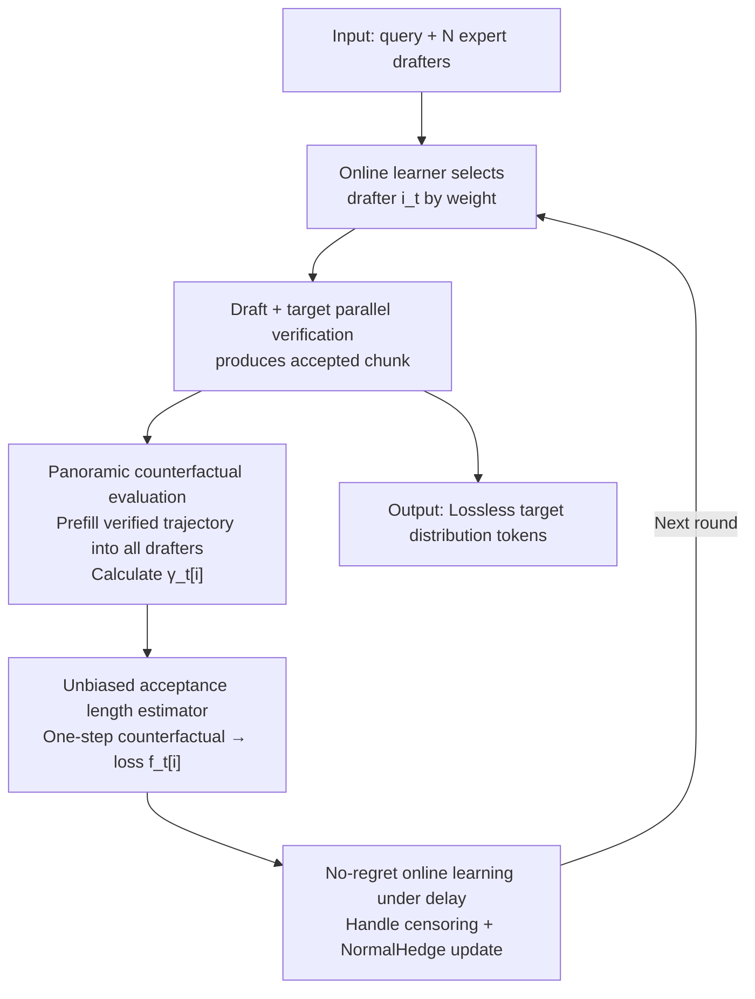

# Not-a-Bandit: Provably No-Regret Drafter Selection in Speculative Decoding for LLMs

**Conference**: ICLR 2026  
**Code**: Yes (Code available here)  
**Area**: LLM Efficiency / Speculative Decoding / Online Learning  
**Keywords**: Speculative Decoding, Drafter Selection, Full-information Online Learning, No-regret Algorithm, Acceptance Length

## TL;DR
Addressing the problem of "how to dynamically select the optimal drafter from multiple domain experts for each query," this paper points out that **exploration is redundant** in speculative decoding. A single trajectory verified by the target can counterfactually evaluate all drafters. Thus, the original multi-armed bandit problem is transformed into a full-information online learning problem. The proposed HedgeSpec achieves no-regret across $N$ drafters, accelerating EAGLE-3 by up to 83.7% and improving MAT by up to 49% compared to bandit baselines.

## Background & Motivation
**Background**: Speculative decoding uses a small drafter model to predict tokens followed by parallel verification by a large target model. Correct guesses allow one expensive target forward pass to produce multiple tokens, reducing per-token latency. EAGLE-3 is currently the most popular implementation.

**Limitations of Prior Work**: A single drafter may excel in certain tasks but fail in others. Retrieval-based drafters work well when output matches input but fail otherwise; domain experts (code, science, math) outperform generalists in their fields but fall behind EAGLE in general tasks. Table 1 shows that 7 expert drafters achieve MAT as high as 7–8.5 in-domain, but average only 3.2–4.5, **generally lower than the 5.69 of a generalist EAGLE**. Using them for mixed query streams results in unstable service quality and long-tail latency.

**Key Challenge**: Given a pool of drafters, how to dynamically select the "hindsight optimal" one for each query? MetaSD and BanditSpec model this as a multi-armed bandit, balancing exploration (trying different drafters) and exploitation (using the empirical best). However, bandits only observe feedback for the **selected drafter** each round; more candidates lead to higher exploration costs and slower convergence, with regret growing linearly with the number of drafters $N$.

**Goal**: Design a drafter selection algorithm that approaches the performance of the "hindsight optimal drafter" for every query with controllable overhead, universal to any speculative decoding method (single/multi-drafter, draft-tree).

**Key Insight**: The authors make a "surprising" observation: **exploration is entirely unnecessary**. Speculative decoding is lossless, meaning the target always provides a ground-truth verification trajectory. By feeding this trajectory into all other unselected drafters, one can counterfactually calculate "how well they would have performed" **without additional queries to the expensive target model**.

**Core Idea**: Upgrade drafter selection from **bandit-feedback** to **full-information feedback**. Use one verification trajectory to evaluate all $N$ drafters simultaneously and apply full-information no-regret algorithms like Hedge or NormalHedge, improving convergence speed from linear to logarithmic relative to $N$.

## Method

### Overall Architecture
HedgeSpec inserts a lightweight **evaluation phase** between the "drafting" and "verification" steps of standard speculative decoding. It diffuses single-trajectory information into panoramic feedback for all drafters, which the online learner uses to decide the next drafter. The pipeline is a self-loop: the online learner selects drafter $i_t$ based on current weights → generates $K$ draft tokens → the target verifies them and produces an accepted chunk → this verified chunk is prefilled into all other drafters to counterfactually calculate acceptance probabilities $\gamma_t[i]$ → an unbiased acceptance length estimator is constructed and converted to loss $f_t[i]$ → NormalHedge weights are updated under delayed feedback → proceed to the next round.

Crucially, because speculative decoding is lossless (Theorem 1/2), changing drafters only affects generation speed, **not the output distribution**. Thus, this "counterfactual evaluation + adaptive selection" is sample-lossless. Evaluation only requires forward passes of lightweight drafters (EAGLE drafters are single-layer transformers, costing ~1/25 of the target), and evaluations are independent and parallelizable.

### Key Designs

**1. Panoramic Counterfactual Evaluation: HedgeSpec is not a bandit**

This step removes the fundamental bottleneck of bandits (only seeing selected feedback). To evaluate unselected drafters, a naive approach would run them against the target, multiplying target costs by $N$. The insight is: **a trajectory verified by the target is counterfactual evidence for all drafters**. Once a chunk $x_{t+1:t+k}$ is verified, prefilling it into all $q_i$ yields the acceptance probability vector $\gamma_t[i] := P_i[x_t \text{ accepted} \mid x_{\le t-1}]$. For standard single drafting, $\gamma_{j,i} = 1 - \mathrm{TV}[p, q_i]$ (Theorem 1); for EAGLE draft-trees, $\gamma_{j,i}$ is the total probability of all children in the draft tree (Theorem 2). This shifts the problem to full-information online learning, where regret depends only on $\log N$.

**2. Unbiased Acceptance Length Estimator**

End-to-end efficiency depends on **acceptance length**, a random variable. Directly calculating $\mathbb{E}[\text{accepted tokens}]$ requires enumerating all combinatorial rollouts. Theorem 3 provides a "one-step counterfactual" estimator that recovers the unbiased expected acceptance length of any drafter from just one realized trajectory:

$$\widehat{\mathrm{AcceptLength}}_{t,K}[M] = \sum_{k=1}^{K+1} k\,(1-\gamma_k)\prod_{j=1}^{k-1}\gamma_j,\qquad \mathbb{E}_M\!\left[\widehat{\mathrm{AcceptLength}}_{t,K}[M]\mid x_{\le t}\right] = \mathbb{E}_M[\text{\# accepted}\mid x_{\le t}].$$

The estimator is bounded in $[1, K+1]$, with variance controlled by $K^2/4$. In contrast, BanditSpec (EXP3-Spec) has a variance of $O(NK^2)$, which **grows with $N$**. This explains HedgeSpec’s stability even with large drafter pools.

**3. No-regret Online Learning under Delayed Feedback**

Accepted tokens are revealed in blocks, not immediately. There is also a **censoring** problem: unless the selected drafter maximizes the chunk length, there isn't enough information to calculate the estimator for others. The authors model this as "delayed feedback." The loss function is:

$$f_t[i] = 1 - \frac{1}{K+1}\sum_{k=1}^{K+1} k\,(1-\gamma_{t+k-1}[i])\prod_{j=1}^{k-1}\gamma_{t+j-1}[i],$$

measuring how much more potential length can be extracted compared to the maximum chunk $K+1$. Using a black-box reduction for delayed feedback (Joulani et al. 2013), they prove Theorem 4: the average acceptance rate gap compared to the hindsight optimal drafter is $O(\sqrt{(K+1)^3\log N / T})$ for length optimization.

**4. Efficient System Implementation**

Table 2 breaks down the costs: a Llama target forward pass takes 75.7 ms, while an EAGLE drafter forward takes only 2.5 ms (~1/25). NormalHedge updates take 0.41 ms. If HedgeSpec gains just 1 MAT, it offsets the cost of evaluating 25 drafters sequentially. In practice, evaluations are parallelized. The authors curated 21 drafters (7 per target model) using SpecForge to prove the pool outperforms single generalists.

## Key Experimental Results

### Main Results
Targets: Llama-3.1-8B-IT / Qwen-3-8B / Qwen-3-32B. Drafters: EAGLE-3. Metrics: MAT (Mean Acceptance Tokens) and Tokens/s.

| Target | Method | Avg MAT | Avg Token/s |
|--------|--------|---------|-------------|
| Llama-3.1-8B-IT | EAGLE | 5.69 | 74.34 |
| Llama-3.1-8B-IT | UCBSpec | 5.09 | 68.89 |
| Llama-3.1-8B-IT | EXP3Spec | 4.86 | 65.22 |
| Llama-3.1-8B-IT | **HedgeSpec** | **7.15** | **90.41** |
| Qwen-3-8B | EAGLE | 4.23 | 47.53 |
| Qwen-3-8B | **HedgeSpec** | **6.37** | **69.44** |
| Qwen-3-32B | EAGLE | 2.88 | 20.76 |
| Qwen-3-32B | **HedgeSpec** | **6.21** | **40.41** |

- Peak speedup: SQL tasks on Qwen (MAT 4.2 → 7.52, +79%; Token/s 44.6 → 81.94, +83.7%).
- Average improvement: 46.1% over EAGLE; up to 49% MAT improvement over bandit baselines.

### Ablation Study

| Analysis | Key Finding |
|----------|-------------|
| Cumulative Regret | HedgeSpec converges to near-zero regret in a few steps; bandits adapt slowly due to partial feedback. |
| Pool Scalability | HedgeSpec is virtually unaffected by $N$; bandits degrade sharply due to exploration costs. |
| vs. Offline Router | Offline routers fail under distribution shifts (e.g., natural prompt variants), while HedgeSpec adapts online. |

### Key Findings
- **Full information is the main driver**: Panoramic feedback enables faster convergence and higher acceptance rates than bandits.
- **Longer reasoning chains amplify gains**: Qwen-3 reasoning models produce longer outputs, giving the learner more time to converge.
- **Robustness to OOD**: Offline BERT routers fail on natural prompt variations, whereas HedgeSpec remains robust via runtime feedback.

## Highlights & Insights
- **Exploration is unnecessary**: Losslessness implies the target provides counterfactual evidence for free.
- **Zero extra target calls**: Panoramic evaluation is performed using lightweight drafters only.
- **One-step counterfactual estimator**: A structural advancement in off-policy evaluation for "verify-then-feedback" systems.
- **Orthogonality**: Compatible with any sampling or drafter innovation.

## Limitations & Future Work
- Dependency on **drafter pool diversity**.
- Assumptions of iid/Markovian settings for the delayed feedback reduction.
- Scaling evaluation costs (memory/parallelism) for extremely large pools or batch sizes.
- Initial latency during the convergence phase for highly OOD queries.

## Related Work & Insights
- **vs. BanditSpec/MetaSD**: Shifts the problem from $O(N)$ regret to $O(\log N)$ by exploiting counterfactuals.
- **vs. EAGLE-3**: Complements generalists by orchestrating a pool of experts.
- **vs. Offline Routers**: Replaces "guessing" a category with "learning" from runtime feedback.

## Rating
- Novelty: ⭐⭐⭐⭐⭐ "Exploration is redundant" is a profound, counter-intuitive insight.
- Experimental Thoroughness: ⭐⭐⭐⭐ Extensive targets and datasets, though batch > 1 scenarios are primarily in appendices.
- Writing Quality: ⭐⭐⭐⭐ Clear motivation, though mathematical notation is dense.
- Value: ⭐⭐⭐⭐⭐ Practical for multi-expert serving systems.

<!-- RELATED:START -->

## Related Papers

- [\[ACL 2026\] Multi-Drafter Speculative Decoding with Alignment Feedback](../../ACL2026/llm_efficiency/multi-drafter_speculative_decoding_with_alignment_feedback.md)
- [\[ICLR 2026\] Speculative Speculative Decoding](speculative_speculative_decoding.md)
- [\[ICLR 2026\] Guided Speculative Inference for Efficient Test-Time Alignment of LLMs](guided_speculative_inference_for_efficient_test-time_alignment_of_llms.md)
- [\[ICLR 2026\] Overcoming Joint Intractability with Lossless Hierarchical Speculative Decoding](overcoming_joint_intractability_with_lossless_hierarchical_speculative_decoding.md)
- [\[ICLR 2026\] Learning To Draft: Adaptive Speculative Decoding with Reinforcement Learning](learning_to_draft_adaptive_speculative_decoding_with_reinforcement_learning.md)

<!-- RELATED:END -->
## Related Papers

- [\[ACL 2026\] Multi-Drafter Speculative Decoding with Alignment Feedback](../../ACL2026/llm_efficiency/multi-drafter_speculative_decoding_with_alignment_feedback.md)
- [\[ICLR 2026\] SpecBranch: Speculative Decoding via Hybrid Drafting and Rollback-Aware Branch Parallelism](specbranch_speculative_decoding_via_hybrid_drafting_and_rollback-aware_branch_pa.md)
- [\[ICLR 2026\] Training-Free Loosely Speculative Decoding: Accepting Semantically Correct Drafts Beyond Exact Match](training-free_loosely_speculative_decoding_accepting_semantically_correct_drafts.md)
- [\[ICLR 2026\] Self-Speculative Decoding Accelerates Lossless Inference in Any-Order and Any-Subset Autoregressive Models](self-speculative_decoding_accelerates_lossless_inference_in_any-order_and_any-su.md)
- [\[ICLR 2026\] Let's (not) just put things in Context: Test-time Training for Long-context LLMs](lets_not_just_put_things_in_context_test-time_training_for_long-context_llms.md)

<!-- RELATED:END -->
