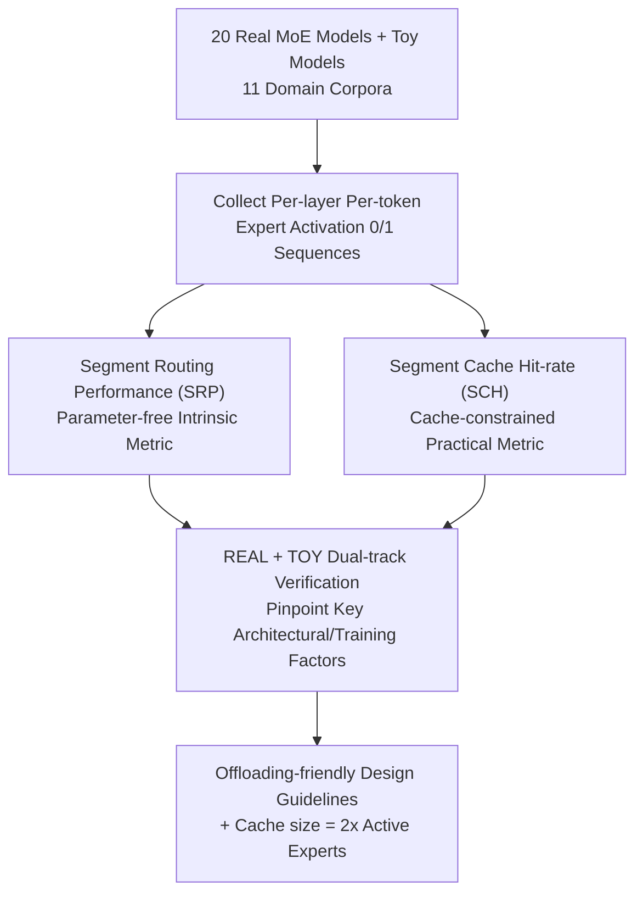

# Not All Models Suit Expert Offloading: On Local Routing Consistency of Mixture-of-Expert Models

**Conference**: ICLR 2026  
**OpenReview**: [https://openreview.net/forum?id=2XMAUP74ig](https://openreview.net/forum?id=2XMAUP74ig)  
**Code**: https://github.com/ljcleo/moe-lrc  
**Area**: LLM Efficiency  
**Keywords**: Mixture-of-Experts, Expert Offloading, Routing Consistency, Cache Hit Rate, Edge Deployment

## TL;DR
This paper proposes two metrics, SRP and SCH, to quantify the "Local Routing Consistency" (whether consecutive tokens tend to activate the same set of experts) of MoE models. Through systematic analysis of 20 real-world MoE LLMs and a series of controlled TOY models, it reveals trade-offs between local load balancing and routing consistency. Key findings include that shared experts hurt consistency while domain-specialized experts enhance it. The paper concludes with the deployment insight that a cache size of twice the number of active experts is most cost-effective.

## Background & Motivation

**Background**: MoE models utilize sparse activation to scale LLM parameters while keeping inference costs constant. However, naive implementations require all experts to reside in VRAM, which is prohibitive for memory-constrained devices like smartphones. Consequently, "expert offloading" has emerged: caching a subset of experts in fast memory (GPU) while keeping the rest in slow memory (CPU/Disk). During decoding, if a token activates an uncached expert, it is either computed on the CPU or swapped using rules like LRU.

**Limitations of Prior Work**: In scenarios with long contexts or frequent topic switching, frequent CPU offloading or on-demand loading significantly slows down inference. Existing works have observed and utilized "expert activation locality"—the tendency of consecutive tokens to activate similar experts—to reduce swapping. However, the strength of this locality and its variance across different models have not been systematically quantified.

**Key Challenge**: Not all MoE models possess this consecutive routing characteristic uniformly; its strength varies significantly by model (e.g., in Figure 1 of the paper, the routing map of GRIN-MoE is "clean" with SRP=65, while Jamba-Mini, with similar size and expert count, appears chaotic with SRP=38). Blindly applying expert offloading without knowing a model's routing consistency may be inefficient—hence the premise that "not all models suit expert offloading."

**Goal**: (1) Define a measurable attribute to characterize this consecutive routing tendency; (2) Measure its distribution across a large number of real-world models; (3) Identify the architectural/training factors that determine it, thereby guiding the design of "offloading-friendly" MoE models.

**Key Insight**: The property of "whether expert activation is consistent within a sequence of tokens" is formalized into a computable intrinsic metric that is independent of specific caching algorithms. The authors reflect consistency by measuring how well a simplified segment-based router/cacher can approximate the original token-wise router—better approximation indicates higher intra-segment routing consistency.

**Core Idea**: Quantify local routing consistency using "segment-level optimal approximation capability." The authors provide two measures: the parameter-free, fine-grained SRP and the practical SCH, which aligns with real-world offloading. Consistency factors are verified using a dual-track approach involving real models and controlled TOY models.

## Method

### Overall Architecture

Rather than proposing a new model, this paper introduces an analytical framework for "measurement + attribution." The workflow is as follows: given a set of MoE models and corpora covering 11 domains, the routing decisions (activated experts) for each MoE layer and token are collected. These 0/1 activation sequences are then compressed into comparable consistency scores using two complementary metrics: SRP for parameter-free fine-grained intrinsic measurement, and SCH for hit rate under real-world cache constraints. Finally, a dual-track verification—"REAL (heterogeneous but realistic) + TOY (controlled single-variable architecture/training hyperparameters)"—is used to identify factors driving consistency, leading to design and deployment recommendations for offloading-friendly MoE.

### Key Designs

**1. SRP: Measuring Intrinsic Consistency via Optimal Segment-level Approximation**

To address the need for a consistency metric that is independent of caching algorithms and granular down to individual experts, the authors first consider a single expert. Its activation across a sequence is a series of 0s and 1s. A "segment estimator" with segment length $m$ is defined to predict a uniform result (all active or all inactive) for the segment from $i$ to $i+m-1$. SRP is defined as the optimal F1 score achievable by such a segment estimator. F1 is chosen over recall/hit rate because missing primary activations is worse than mis-activating secondary experts, and recall can be trivially inflated without an activation frequency limit. A key conclusion is that the optimal F1 is reached when predicting activation for all segments where the activation frequency exceeds a certain threshold. Thus, SRP depends only on the expert itself and segment length $m$, representing an intrinsic property.

When extended to a group of experts (layer-wise or model-wise) under token-choice routing, experts are not activated independently. A "segment router" is used to decide which experts to activate per segment. SRP is defined as the upper bound of the F1 score between the segment router and the original router's decisions. To prevent the segment router from inflating F1 by over-activating experts, the segment routing scale ratio $\hat{\rho}$ (average segment-activated experts / original activated experts) is introduced as an auxiliary metric: a smaller $\hat{\rho}$ indicates higher consistency, as real demand is covered without excessive selection. Higher SRP and lower $\hat{\rho}$ make a model more suitable for segment-level routing/caching.

**2. SCH: Measuring Oracle Cache Hit Rate under Real-world Cache Limits**

While SRP is parameter-free and expert-specific, it diverges from real offloading in two ways: real systems have hard cache limits, and hit rate (recall) is more intuitive than F1 for cache performance. SCH is designed to address this. The cache ratio $\rho$ is defined as cache size / number of active experts. Like an actual offloading system, this segment cache swaps in required but uncached experts for each token while swapping out an equal number of unused experts—specifically, those activated least frequently within the next $m$ tokens. SCH is the hit rate of this segment cache.

SCH is more practical because the upper bound of any cache hit rate is given by a clairvoyant replacement algorithm (swapping out the expert with the latest next activation). The oracle information relied upon by SCH—future activation frequency—is easier to learn and predict than precise future activation times, making SCH more approachable for real algorithms. SCH shares the same segment-level intuition as SRP, bridging the gap between intrinsic measurement and real system efficiency.

**3. REAL + TOY Dual-track: Establishing Causality via Controlled Experiments**

To address the heterogeneity of 20 real models where correlation does not imply causation, the authors use a dual-track approach. The REAL track covers 20 models (3B to 57B parameters) like SwitchTransformer, Mixtral, and DeepSeek-V2 to measure real consistency distributions, grouping them into four categories. To isolate factors, the TOY track pre-trains OLMoE-like small models (1.43B), varying only one variable at a time: expert granularity, number of shared experts, load balancing loss coefficient, number of activated experts, and placement of dense layers. This methodology allows the authors to definitively identify factors like "shared experts hurt consistency" by de-confounding variables.

### Mechanism

Using the specific calculation of SCH as an example: assume a routing sequence uses "8-choose-2" activation (2 experts per token), a cache ratio $\rho=2$ (cache capacity of 4 experts), and segment length $m=4$. For each token, if the required expert is in the cache, it is a hit. If not, it is swapped in, replacing the cached expert with the lowest activation frequency in the next 4 tokens. Dividing total hits by total requirements yields the SCH (e.g., $13/18 \approx 0.722$). Both SCH and SRP (which measures how well a segment router replicates token-wise decisions) are built on the intuition of intra-segment consistency.

## Key Experimental Results

### Main Results

20 models were grouped by SRP at $m=16$. Differences became pronounced as $m$ increased:

| Group | Representative Models | SRP ($m=16$) | $\hat{\rho}$ | Interpretation |
|-------|-----------------------|--------------|--------------|----------------|
| Group 1 | LLaMA-MoE-v2 / OLMoE | > 0.5 (LLaMA-MoE-v2: 78.16) | ~1.25 | Strongest long-term consistency; best for offloading |
| Group 2 | Mixtral-8x7B / LLaMA-MoE-v1 | ~0.48 | ~2.5 | Strong, but requires larger cache |
| Group 3 | XVERSE-MoE / DeepSeekMoE | ~0.36 | ~2.0 | Significantly lower |
| Group 4 | NLLB-MoE / SwitchTransformers | < 0.31 (SwitchTF: ~19) | High even for short $m$ | Worst; almost no segment-level consistency |

SCH experiments further confirm that only Group 1 models show a rapid SCH increase with $\rho$, reaching an inflection point at $\rho \approx 2$. Groups 3 and 4 show nearly linear, slow growth. This supports the conclusion that a cache size of 2x active experts is optimal.

### Ablation Study

Controlled single-variable TOY model results ($m=16$, SRP vs. Load Balancing LB measured by SD of activation frequency; larger SD is less balanced):

| Configuration | SRP | LB(SD) | Description |
|---------------|-----|--------|-------------|
| Baseline | 43.56 | 4.02 | Base configuration |
| NoLB | 56.42 | 13.21 | Consistency spikes; highly imbalanced |
| OverLB | 36.42 | 1.79 | Balanced but lowest consistency |
| ActMore (Activate more experts) | 55.69 | 6.54 | Larger combination space -> Higher consistency |
| ActFewer (Activate fewer experts) | 27.13 | 1.14 | Smaller combination space -> Lower consistency |
| 1ShrExp / 2ShrExp (Shared experts) | 41.38 / 38.79 | 3.43 / 3.06 | More shared experts -> Lower SRP |
| FewerExp (Fewer total experts) | 41.62 | 3.63 | Smaller combination space -> Slight decrease |

### Key Findings

- **Trade-off between Local Load Balancing and Routing Consistency**: High SRP is almost always accompanied by high imbalance (SD). The NoLB vs. OverLB comparison shows that for offloading efficiency in edge scenarios, it is worthwhile to sacrifice some load balancing for consistency.
- **Global Balance can Coexist with Local Consistency**: Qwen3 and GRIN-MoE achieve both high SRP and moderate load balancing. Single queries activate only specific experts, but queries from different topics activate different sets, covering all experts globally via domain specialization.
- **Shared Experts Hurt Consistency**: Groups 1 and 2 have no shared experts. TOY tracks show that shared experts lower SRP even at similar perplexity. This is due to the "bypass effect" (more info through shared experts, MoE parts become secondary) and the compression of the expert combination space.
- **Domain Specialization > Vocabulary Specialization**: Domain-specialized experts contribute significantly more to consistency than vocabulary-specialized ones, especially in models with both high consistency and global balance.
- **SCH Highly Correlates with Real Cache Algorithms**: The correlation coefficient between SCH and LRU/LFU hit rates exceeds 0.88 for $m \ge 16$. SCH at $\rho=2$ reaches 90.55% of the clairvoyant optimal, making it a practical "ideal upper bound."

## Highlights & Insights
- **Formalized "Routing Locality" into Scalable Metrics**: SRP is parameter-free and decoupled from cache algorithms, while SCH is practical and aligns with deployment. Proving their high correlation creates a robust logical loop.
- **REAL + TOY Dual-track Methodology**: This approach provides both external validity and causal attribution, avoiding the pitfalls of drawing conclusions from heterogeneous real-world models alone. This sets a paradigm for "architectural factor → emergent property" attribution research.
- **"Cache size = 2x active experts"**: A directly applicable engineering conclusion derived from SCH inflection points, allowing for cache sizing based on memory budgets without full benchmarking.
- **Rethinking Load Balancing**: While training usually targets maximum balance, for edge deployment involving expert offloading, moderate imbalance is actually beneficial—a counter-intuitive but evidence-based insight.

## Limitations & Future Work
- **Dependency on Oracle Information**: SCH's eviction strategy uses future activation frequency. While more approachable than clairvoyant algorithms, the gap between real-world caches and SCH may still vary.
- **Static Corpora Analysis**: The analysis is based on routing records from fixed 512-token samples. Whether these patterns hold under topic drift in streaming decoding or extremely long contexts needs online verification.
- **Factors are not Absolute Laws**: The "combination space" rule is less prominent than load balancing or shared experts. Models like Phi or GRIN do not strictly follow every trend, as sparse activation and dense layer placement create confounding effects.
- **Lack of Consistency-Optimized Training**: The paper focuses on measurement and attribution. It identifies design principles (fewer shared experts, larger spaces, tolerate local imbalance) but does not yet train an "offloading-optimized" model to verify end-to-end gains.

## Related Work & Insights
- **vs. Expert Offloading Systems (Eliseev & Mazur 2023 / EdgeMoE)**: Traditional works optimize the cache strategy for a given model. Ours asks what models are inherently suited for caching, approaching from the model side rather than the system side.
- **vs. Expert Specialization (Muennighoff et al. 2025)**: Inherits definitions of domain/vocabulary specialization but links them to routing consistency and offloading efficiency for the first time.
- **vs. Load Balancing (Lepikhin 2021 / DeepSeek)**: Previous works use biases for balance or caching; Ours quantifies the intrinsic tension between the two, providing a metric for the trade-off.

## Rating
- Novelty: ⭐⭐⭐⭐⭐ First to formalize and quantify MoE local routing consistency with rigorous metrics.
- Experimental Thoroughness: ⭐⭐⭐⭐⭐ Extensive dual-track coverage of 20 real models and controlled TOY models.
- Writing Quality: ⭐⭐⭐⭐ Clear definitions and intuitive visualizations, though some attributions include necessary caveats.
- Value: ⭐⭐⭐⭐⭐ Provides actionable design guidelines and engineering rules of thumb for MoE offloading.

<!-- RELATED:START -->

## Related Papers

- [\[ICLR 2026\] Expert Divergence Learning for MoE-based Language Models](expert_divergence_learning_for_moe-based_language_models.md)
- [\[ICLR 2026\] Expert Merging in Sparse Mixture of Experts with Nash Bargaining](expert_merging_in_sparse_mixture_of_experts_with_nash_bargaining.md)
- [\[ICLR 2026\] Not All Bits Are Equal: Scale-Dependent Memory Optimization Strategies for Reasoning Models](not_all_bits_are_equal_scale-dependent_memory_optimization_strategies_for_reason.md)
- [\[ACL 2026\] Alloc-MoE: Budget-Aware Expert Activation Allocation for Efficient Mixture-of-Experts Inference](../../ACL2026/llm_efficiency/alloc-moe_budget-aware_expert_activation_allocation_for_efficient_mixture-of-exp.md)
- [\[ICML 2026\] TEAM: Temporal-Spatial Consistency Guided Expert Activation for MoE Diffusion Language Model Acceleration](../../ICML2026/llm_efficiency/team_temporal-spatial_consistency_guided_expert_activation_for_moe_diffusion_lan.md)

<!-- RELATED:END -->
