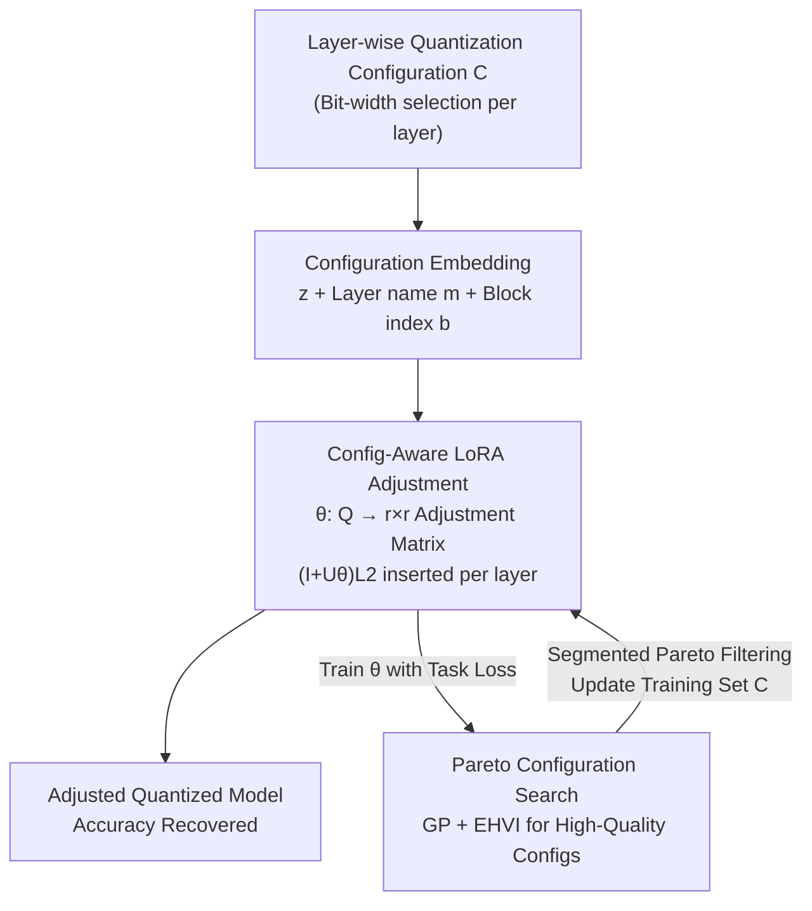

# On-the-Fly Adaptation to Quantization: Configuration-Aware LoRA for Efficient Fine-Tuning of Quantized LLMs

**Conference**: ICLR 2026  
**OpenReview**: [https://openreview.net/forum?id=9OUg0nJE72](https://openreview.net/forum?id=9OUg0nJE72)  
**Code**: https://github.com/rG223/CoA-LoRA  
**Area**: LLM Efficiency / Model Compression  
**Keywords**: Quantization, LoRA, Configuration-Aware, Pareto Search, Edge Deployment

## TL;DR
CoA-LoRA trains a "configuration-aware model" that directly maps any layer-wise quantization configuration to lightweight low-rank adjustments. This allows a single LoRA adapter to adapt to various bit-width combinations without per-configuration fine-tuning. Combined with a Pareto-based Gaussian Process configuration search to select high-quality training sets, it achieves a $1.74\%–8.89\%$ accuracy improvement over SOTA on four GLUE tasks, with total fine-tuning time staying nearly constant regardless of the number of configurations.

## Background & Motivation
**Background**: The mainstream approach for deploying large models to edge devices is "quantize then fine-tune with LoRA." Quantization compresses weights to low bits to save memory, while LoRA (e.g., QLoRA, LQ-LoRA) recovers accuracy loss. The core factor determining the compression rate is the **quantization configuration**: the selection of bit-widths for each layer, which collectively determines the average bit-width and compression level.

**Limitations of Prior Work**: Existing methods are designed for **single fixed configurations** and fail to generalize. In reality, edge devices ranging from smartphones to laptops have varying capabilities and require different compression levels. Consequently, one must either use a Shared-LoRA (which suffers significant accuracy drops) or fine-tune a separate LoRA for each configuration (QLoRA/LQ-LoRA, where fine-tuning time grows linearly with the number of configurations). Figure 1 in the paper illustrates this dilemma on SST-2: Shared-LoRA saves time but has a clear accuracy gap, while per-configuration fine-tuning maintains accuracy but leads to escalating cumulative time.

**Key Challenge**: A trade-off exists between accuracy and fine-tuning cost—covering more heterogeneous configurations requires more fine-tuning sessions, while saving time necessitates sacrificing accuracy.

**Goal**: Design a method to efficiently adapt LoRA adapters to **any** quantization configuration without repeated fine-tuning. This decomposes into two sub-problems: (1) how to prevent the output space of the "configuration $\to$ full LoRA parameters" mapping from becoming too large to learn; and (2) how to construct a high-quality training configuration set, as uniform bit-width distribution ignores sensitivity differences between layers.

**Key Insight**: Instead of retraining LoRA for every configuration, it is better to learn a **function** that takes a configuration as input and outputs a "micro-adjustment" for the existing LoRA. Once this function is learned, a new configuration only requires a head-forward pass to generate the adapter, with zero additional fine-tuning time.

**Core Idea**: Use a configuration-aware model $\theta$ to map each layer's configuration to a compact $r \times r$ adjustment matrix $U_\theta$, performing a re-parameterized adjustment of $L_2$ as $(I+U\theta)L_2$. Then, use Pareto Gaussian Process search to iteratively optimize the training configuration set to improve mapping accuracy.

## Method

### Overall Architecture
CoA-LoRA aims to allow "one LoRA to adapt to any quantization configuration without retraining." It consists of two complementary components: **Configuration-Aware LoRA Adjustment** learns the mapping from "configuration $\to$ low-rank adjustment," and **Pareto Configuration Search** feeds high-quality training sets into this mapping. The workflow is an **iterative cycle**: each epoch trains the configuration-aware model $\theta$ on the current set $\mathcal{C}$, followed by expanding and refining $\mathcal{C}$ using gradient-guided search and diversity-preserving Pareto filtering.

The input is a layer-wise quantization configuration $C$. The output is an adapted LoRA for that configuration. The process involves three steps: embedding discrete configurations into continuous vectors, letting $\theta$ generate $r \times r$ adjustment matrices for each layer, and continuously improving the training set via configuration search.

### Key Designs

**1. Compact Embedding and Layer-wise Parallel Adjustment: Reducing Exponential Space**
A direct mapping from "configuration $\to$ full LoRA parameters" is infeasible. According to Table 1, under NF quantization, each layer has 5 parameters $c_i=[b_0,b_1,b_2,B_0,B_1]$. For $N$ layers, the search space is $(4\cdot4\cdot3\cdot3\cdot3)^N$, which explodes exponentially. The paper embeds each layer's config $c_i$ as $z_i$ and adds layer name $m$ and block index $b$ to get $Q_i^{(j)}$. The model generates adjustments **layer-wise in parallel**, reducing the output dimension from "all LoRA parameters" to "one small matrix per layer," significantly lowering the learning burden and the size of $\theta$.

**2. Configuration-Aware Model & $L_2$ Re-parameterization: Adjusting the Informative Half**
The authors observe that LoRA adaptation signals are mostly concentrated in $L_2$. Thus, $\theta$ only needs to learn a mapping $\theta: \mathbb{R}^{|Q_i|} \to \mathbb{R}^{r \times r}$ to produce $U_\theta(Q_i)$. The $L_{2,i}$ is re-parameterized as $(I+U_\theta(Q_i))L_{2,i}$ ($I$ is the identity matrix, ensuring fallback to the original LoRA when $U_\theta=0$). The adjusted weights are:

$$\widetilde{W}^{\text{LoRA}}_C = \text{InsertLoRA}\Big(\widetilde{W}_C,\ \big\{L^{(C)}_{1,i}(I+U_\theta(Q_i))L^{(C)}_{2,i}\big\}_{i=1}^{N}\Big),$$

where $L^{(C)}_{1,i}, L^{(C)}_{2,i}$ are obtained via SVD of the residual between pre-trained and quantized weights. The objective is to minimize expected task loss: $\theta=\arg\min_\theta \mathbb{E}_{C\in\mathcal{C}}[\mathcal{L}(\widetilde{W}^{\text{LoRA}}_C; D)]$.

**3. Pareto Gaussian Process Configuration Search: High-Quality Training Distributions**
The mapping quality depends on the training set. The paper formalizes "picking configurations" as a bi-objective optimization: task performance $f_1$ and average bit-width $f_2$, i.e., $\min_C f(C)=[f_1(C),f_2(C)]^\top$. Since $f_1$ is an expensive black box, Bayesian optimization is used. Performance is modeled with a Gaussian Process $\hat f_1(C)\sim \mathcal{G}(m(C),k(C,C'))$. **Expected Hypervolume Improvement (EHVI)** $\arg\max_C \mathbb{E}[\text{HVI}(f(C),\mathcal{C})]$ identifies configurations that contribute most to the Pareto front. Gradients are approximated via **finite difference**:

$$\frac{\partial\alpha_{\text{EHVI}}}{\partial C_i}\approx\frac{\alpha(C+\delta e_i)-\alpha(C-\delta e_i)}{2\delta}$$

**4. Segmented Pareto Filtering: Diversity and Excellence**
To prevent suboptimal configurations from degrading the model, the merged set $\mathcal{C} \cup \mathcal{C}'$ is partitioned into $U$ continuous bit-width segments $\mathcal{C}_1,\dots,\mathcal{C}_U$. Intra-segment Pareto fronts $\mathcal{C}^{(u)}_{\text{Pareto}}$ are calculated, and their union forms the new training set. This ensures high-quality representatives across the entire bit-width range (from low to high), which is crucial for servicing heterogeneous devices.

### Loss & Training
The core objective is the expected task loss (Cross-Entropy for GLUE, Perplexity for C4). The strategy is iterative: train $\theta \to$ search for configs $\to$ filter $\to$ retrain $\theta$. LoRA rank is 64, learning rate is $1\times10^{-4}$. Non-uniform NormalFloat (NF) quantization is used.

## Key Experimental Results

### Main Results
On RoBERTa-Large across four GLUE tasks, evaluated by Hypervolume (HV), Accuracy Gap relative to QLoRA, and total time. CoA-LoRA uses **one** training session to serve all configurations.

| Method | Configs Served | QNLI HV / Gap / Time | MNLI HV / Gap / Time | SST-2 HV / Gap / Time | QQP HV / Gap / Time |
| :--- | :--- | :--- | :--- | :--- | :--- |
| QLoRA | 6 | 0.58 / — / 119m | 0.54 / — / 208m | 0.63 / — / 97m | 0.54 / — / 189m |
| LQ-LoRA | 6 | 0.59 / +2.81% / 108m | 0.57 / +8.13% / 183m | 0.64 / +1.54% / 91m | 0.54 / +0.47% / 172m |
| Shared-LoRA | 1 | 0.60 / +2.90% / 21m | 0.57 / +8.11% / 35m | 0.61 / **−5.06%** / 19m | 0.53 / **−1.18%** / 32m |
| **CoA-LoRA** | $\infty$ | **0.62 / +4.34% / 57m** | **0.59 / +8.89% / 91m** | **0.67 / +1.74% / 52m** | **0.60 / +7.87% / 88m** |

Key takeaway: CoA-LoRA learns to serve all configurations in about an hour, leading in HV across all tasks and improving accuracy by $1.74\%–8.89\%$ over SOTA.

### Ablation Study
Ablation of configuration search (Fig. 8) and rank (Table 3):

| Configuration | Key Findings |
| :--- | :--- |
| Full (Config search) | Optimal HV and Accuracy |
| Frozen config set | Accuracy drops ~2% on QNLI/SST-2 (mapping is inaccurate) |
| Random extension | Performance similar to Frozen (adding random configs is ineffective) |

### Key Findings
*   **Search is Critical**: Removing search drops performance by ~2% on QNLI/SST-2. Randomly adding configurations does not help, proving that gains come from **guided optimization** of high-quality candidates.
*   **Zero-Shot Generalization**: Accuracy curves for seen and unseen configurations overlap closely (Fig. 7).
*   **Robustness Across Scales**: Consistently outperforms Shared-LoRA on Qwen2.5 (1.5B/3B) and LLaMA-2 (7B).
*   **Universal Quantization**: Maintains superiority when switched to integer mixed-precision (int2/3/4/8).

## Highlights & Insights
*   **Amortized Generation**: Shifting from "tuning a LoRA per config" to "learning a config-to-adjustment function" amortizes training costs into a one-time investment.
*   **Efficiency via $L_2$ Focus**: Leveraging the observation that adaptation signals cluster in $L_2$ allows the use of very small adjustment matrices, ensuring the mapping is both cheap and safe (falls back to original LoRA at $U_\theta=0$).
*   **Pareto-Driven Training Distributions**: Treating training data selection as a bi-objective optimization (Performance vs. Bits) is a strategy transferable to other heterogeneous adaptation scenarios (e.g., multi-resolution or multi-sparsity).

## Limitations & Future Work
*   Generalization to unseen configurations is slightly weaker on simpler tasks like SST-2.
*   Validation is primarily on GLUE; generative/reasoning downstream tasks are not yet extensively tested.
*   Hyperparameter complexity is high (GP, EHVI, finite difference, segmented filtering parameters).
*   Search efficiency in high-dimensional spaces for very large models ($N$ layers) needs further evaluation.

## Related Work & Insights
*   **vs. QLoRA / LQ-LoRA**: These require linear time growth relative to configuration counts; CoA-LoRA is nearly constant.
*   **vs. Shared-LoRA**: Shared-LoRA is fast but suffers massive accuracy drops; CoA-LoRA avoids this via config-specific adjustments.
*   **vs. LoRA Generation**: Unlike Diffusion or ICL-based LoRA generators that require pre-existing expert LoRAs, CoA-LoRA focuses on lightweight adaptation specifically for quantized LLMs.

## Rating
*   Novelty: ⭐⭐⭐⭐⭐ 
*   Experimental Thoroughness: ⭐⭐⭐⭐ 
*   Writing Quality: ⭐⭐⭐⭐ 
*   Value: ⭐⭐⭐⭐⭐ 

<!-- RELATED:START -->

<!-- RELATED:END -->

## Related Papers

- [\[ICLR 2026\] LoRA-S: An Efficient Low Rank Adaptation scheme via Sylvester equation](lora-s_an_efficient_low_rank_adaptation_scheme_via_sylvester_equation.md)
- [\[ICLR 2026\] Developmental Federated Tuning: A Cognitive-Inspired Paradigm for Efficient LLM Adaptation](developmental_federated_tuning_a_cognitive-inspired_paradigm_for_efficient_llm_a.md)
- [\[ICLR 2026\] Difficulty–Diversity Collaborative Filtering for Data-Efficient LLM Fine-Tuning](difficultydiversity_collaborative_filtering_for_data-efficient_llm_fine-tuning.md)
- [\[ICLR 2026\] PLoP: Precise LoRA Placement for Efficient Finetuning of Large Models](plop_precise_lora_placement_for_efficient_finetuning_of_large_models.md)
- [\[ICLR 2026\] FLoRG: Federated Fine-tuning with Low-rank Gram Matrices and Procrustes Alignment](florg_federated_fine-tuning_with_low-rank_gram_matrices_and_procrustes_alignment.md)

<!-- RELATED:END -->
