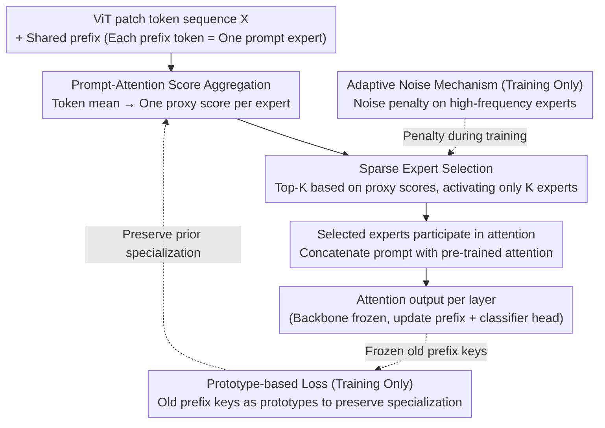

# One-Prompt Strikes Back: Sparse Mixture of Experts for Prompt-based Continual Learning

**Conference**: ICLR 2026  
**arXiv**: [2509.24483](https://arxiv.org/abs/2509.24483)  
**Code**: [https://github.com/Minhchuyentoancbn/SMoPE](https://github.com/Minhchuyentoancbn/SMoPE)  
**Area**: LLM Efficiency  
**Keywords**: continual learning, prompt tuning, Mixture of Experts, Sparse MoE, Prefix Tuning

## TL;DR
The SMoPE framework is proposed, organizing a single shared prompt into multiple prompt experts within a sparse MoE structure. By implementing dynamic sparse activation via prompt-attention score aggregation, it significantly alleviates knowledge interference while maintaining high parameter efficiency, achieving SOTA results across multiple continual learning benchmarks.

## Background & Motivation

**Background**: Prompt-based Continual Learning (CL) methods, which adapt new tasks by adding learnable prompts to frozen pre-trained Vision Transformers (ViT), have become a mainstream paradigm for mitigating catastrophic forgetting. Representative methods include DualPrompt, HiDe-Prompt, and NoRGa.

**Limitations of Prior Work**: Mainstream methods assign independent prompt subsets to each task (task-specific prompting), leading to two issues: (a) inference requires a forward pass through the full pre-trained model to select prompts, resulting in high computational overhead; (b) prompt parameters grow linearly with the number of tasks, causing poor scalability and hindering cross-task knowledge sharing.

**Key Challenge**: Methods like OVOR use a single shared prompt to address efficiency; however, since all prompt parameters are continuously updated, they suffer from severe knowledge interference, underperforming task-specific methods. There is a fundamental conflict between efficiency and performance.

**Goal**: How to maintain the parameter efficiency of a single prompt while avoiding the knowledge interference caused by sharing? Specifically: (a) How to perform sparse selection within the multi-head attention gate of an MoE; (b) How to balance expert utilization; (c) How to maintain expert specialization in the absence of old data.

**Key Insight**: Based on insights from Le et al. (2024a), each attention head can be viewed as a combination of multiple MoE models, and prefix tuning essentially adds new prompt experts into these MoEs. Since it is already an MoE, sparse selection can be naturally introduced.

**Core Idea**: Treat each prefix token in the shared prompt as an independent expert. Calculate a unified proxy score via prompt-attention score aggregation to achieve Top-K sparse activation, thereby obtaining an implicit parameter partitioning effect on a single prompt.

## Method

### Overall Architecture

SMoPE aims to resolve the contradiction where a single shared prompt must be parameter-efficient but not compromised by knowledge interference. The approach re-imagines a single shared prompt as a sparse MoE: the input is a sequence of ViT patch tokens $\mathbf{X} \in \mathbb{R}^{N \times d}$. The model maintains shared prefix keys $\mathbf{P}^K \in \mathbb{R}^{N_p \times d}$ and prefix values $\mathbf{P}^V \in \mathbb{R}^{N_p \times d}$, which are prepended to the keys and values of the attention mechanism in each MSA layer. Each prefix token is treated as an independent prompt expert. Thus, a single forward pass proceeds in three steps: first, aggregate scores via prompt-attention score aggregation to obtain a unified proxy score for each expert; second, perform Top-K sparse selection based on these scores to activate only the most relevant experts; finally, allow the selected experts to participate in the attention calculation to output results for each layer. During training, two auxiliary loops are used: adaptive noise penalizes high-frequency experts before selection, and prototype loss uses old prefix keys to maintain expert specialization. The entire pipeline only updates prefix parameters and the classifier head, keeping the backbone frozen.

### Key Designs

**1. Prompt-Attention Score Aggregation: Compressing N scores per expert into a single proxy score**

The difficulty in applying standard SMoE lies here—in prefix tuning, each prompt expert corresponds to $N$ score functions (one per output token). Performing Top-K selection across $N$ scores individually is intractable. SMoPE addresses this by averaging the attention scores of all tokens for a specific expert to obtain a unified proxy score:

$$\tilde{s}_{j'}(\mathbf{X}) = \frac{\tilde{\mathbf{x}}^\top W_l^Q {W_l^K}^\top \mathbf{p}_{j'}^K}{\sqrt{d_v}}, \quad \tilde{\mathbf{x}} = \frac{1}{N}\sum_{i=1}^N \mathbf{x}_i$$

Where $\tilde{\mathbf{x}}$ is the mean representation of all tokens. All proxy scores can be obtained with a single calculation. This reduces the scoring complexity per expert from $\mathcal{O}(N d_k)$ to $\mathcal{O}(d_k)$. The authors demonstrate that this aggregation maintains the same $\mathcal{O}(\tau^{-4})$ sample complexity as standard MoE, making Top-K selection feasible without sacrificing theoretical statistical efficiency.

**2. Sparse Expert Selection: Using proxy scores for Top-K to activate only K experts**

After obtaining proxy scores, the attention matrix is split into prompt and pre-trained components $\tilde{A}_l = [\tilde{A}_l^{\text{prompt}}, A_l^{\text{pre-trained}}]$. The prompt component undergoes sparse selection:

$$\tilde{A}_l^{\text{prompt}} = \text{TopK}\!\left(\tilde{\mathbf{x}}^\top W_l^Q {W_l^K}^\top \mathbf{P}^K / \sqrt{d_v}\right).\text{expand}(N, -1)$$

Scores for the selected $K$ experts are expanded to all $N$ query tokens, while scores for unselected experts are set to zero. This step is critical for mitigating interference: whereas single-prompt methods like OVOR update all prompt parameters at every step (overwriting old knowledge), sparse activation introduces implicit parameter partitioning in a shared prompt. Different tasks tend to fall into different expert subsets, significantly reducing the probability of overlap. Furthermore, expert selection depends only on the current layer input, avoiding the full model forward pass required by task-specific retrieval methods.

**3. Adaptive Noise Mechanism: Penalizing high-frequency experts to encourage underutilized ones**

Sparse selection can lead to a common issue in standard SMoE where a few experts dominate routing, causing severe utilization imbalance. In CL, this is worse because repeated use of the same experts forces knowledge from multiple tasks into a few parameters, re-introducing interference. During training, SMoPE tracks the activation frequency $F_{j'}$ of each expert and applies a noise penalty to experts with frequencies above the average to reduce their selection probability. The penalty magnitude is scaled by the dynamic range of current scores:

$$\epsilon_{j'} = \epsilon \cdot \left(\max_j \tilde{s}_j - \min_j \tilde{s}_j\right), \quad \epsilon \in [0,1]$$

Experts below average frequency are not penalized. Scaling by dynamic range prevents noise from overwhelming true scores. This mechanism is only active during training, avoiding inference jitter. Compared to traditional load-balancing auxiliary loss, it is gentler as it only suppresses high-frequency experts without forcibly disrupting established routing.

**4. Prototype-based Loss: Using prefix keys as task prototypes to maintain specialization**

The previous steps address selection and balance, but CL also faces the challenge of lack of old data—learned specialization for old experts can be washed away during new task training. SMoPE employs two complementary losses: $\mathcal{L}_{\text{router}}$ encourages the scores of selected experts to be higher than unselected ones on the current task data to promote differentiation; $\mathcal{L}_{\text{proto}}$ uses prefix keys from the end of the previous training round as prototypes to constrain the routing of old experts, preserving learned specialization without old samples. To avoid noise, the prototype set only retains frequently activated experts.

### Loss & Training

Final loss: $\mathcal{L} = \mathcal{L}_{ce} + \alpha_{\text{router}} \cdot \mathcal{L}_{\text{router}} + \alpha_{\text{proto}} \cdot \mathcal{L}_{\text{proto}}$

Where $\mathcal{L}_{ce}$ is standard cross-entropy, and $\alpha_{\text{router}}, \alpha_{\text{proto}}$ are weight hyperparameters. Training only updates prefix parameters and the classifier head; the backbone remains frozen. The first task uses dense expert training for the initial epochs to establish stable expert representations. Task-adaptive prediction is also used to correct classifier bias toward new classes.

## Key Experimental Results

### Main Results

| Dataset | Metric | SMoPE (Ours) | Prev. SOTA (VQ-Prompt) | Gain |
|--------|------|-------|---------------------|------|
| ImageNet-R (10-task) | FAA | **79.32** | 78.71 | +0.61 |
| ImageNet-R (10-task) | CAA | **84.39** | 83.24 | +1.15 |
| CIFAR-100 (10-task) | FAA | **89.23** | 88.73 | +0.50 |
| CIFAR-100 (10-task) | CAA | **93.67** | 92.84 | +0.83 |
| CUB-200 (10-task) | FAA | **87.43** | 86.72 | +0.71 |
| CUB-200 (10-task) | CAA | **91.11** | 90.33 | +0.78 |

Self-supervised pre-training (ImageNet-R): iBOT-1K FAA 72.17 / DINO-1K FAA 68.61, both surpassing all baselines.

### Ablation Study

| Configuration | FAA (CUB-200) | CAA | Description |
|------|---------------|-----|------|
| One Prompt (baseline) | 75.23 | 83.61 | Single prompt without enhancements |
| + Score Aggregation | 75.49 | 83.65 | Unified proxy score, minor improvement |
| + Sparse Expert Selection | 79.12 | 87.16 | **+3.63 FAA**, sparse selection is core |
| + Adaptive Noise | 85.36 | 89.12 | **+6.24 FAA**, significant utilization balance |
| + Task-Adaptive Prediction | 86.03 | 90.09 | Corrects classifier bias |
| + Initial Dense Training | 86.27 | 90.23 | Stabilizes initial expert representation |
| + Router Loss | 87.05 | 90.47 | Promotes expert specialization |
| + Prototype Loss (Full) | **87.43** | **91.11** | Maintains old expert specialization |

### Key Findings
- **Sparse Selection + Adaptive Noise** contribution is the largest: from 75.49 to 85.36, a total of +9.87 FAA.
- Parameters total only 0.38M, which is 8% of Deep L2P++ (4.78M); training/inference GFLOPs are 50% of other methods.
- $\epsilon$ hyperparameter ablation: $\epsilon=0$ leads to expert monopoly, $\epsilon=1$ leads to excessive exploration; optimal near $\epsilon=0.5$.
- SMoPE outperforms all task-specific prompt methods using a single shared prompt, challenging the assumption that shared prompts inevitably perform poorly.

## Highlights & Insights
- **Ingenious MoE Perspective on Prefix Tuning**: Viewing each prefix token as an expert within the attention head makes sparse selection naturally applicable. This perspective is transferable to any prefix tuning scenario.
- **Prompt-Attention Score Aggregation**: Replacing $N$ score calculations with a single calculation for the token mean provides efficiency without losing sample complexity, representing theory-driven efficient engineering.
- **Adaptive Noise Suitability for CL**: Unlike traditional load balancing losses that force balance and may disrupt knowledge, adaptive noise only penalizes high-frequency experts during training, making it more controlled.
- **Prefix Key as Prototype**: This idea can be migrated to NLP prefix tuning for any incremental learning task requiring consistent routing without old data.

## Limitations & Future Work
- Experiments were restricted to ViT-B/16; generalization for larger models or NLP tasks remains unverified.
- Top-K is a hard selection, which may be less flexible than learnable soft routing (e.g., Gumbel-Softmax).
- The $\epsilon$ parameter for adaptive noise requires manual tuning and may need searching for different datasets.
- Prototype loss only uses prefix keys from the immediately preceding round; long-sequence tasks may suffer from prototype drift.
- The impact of prompt length $N_p$ and Top-K ratios over varying task counts has not been fully explored.

## Related Work & Insights
- **vs. OVOR**: Both use a single prompt, but OVOR updates all prompts while SMoPE uses sparse activation to reduce interference. OVOR performs 4-10 points lower than SMoPE on most benchmarks.
- **vs. VQ-Prompt**: VQ-Prompt utilizes vector quantization for selection; SMoPE uses attention scores directly within an MoE framework, which is more natural and reduces computation (50% vs 100%).
- **vs. HiDe-Prompt/NoRGa**: These use task-specific prompts + extra forward passes for retrieval, requiring over 10x the parameters of SMoPE. SMoPE demonstrates that a single prompt can outperform task-specific methods with correct architectural design.

## Rating
- Novelty: ⭐⭐⭐⭐ Theoretical novelty in the MoE view of prefix tuning, though SMoE itself is established.
- Experimental Thoroughness: ⭐⭐⭐⭐⭐ Three datasets + two pre-training paradigms + detailed ablation + computational cost analysis.
- Writing Quality: ⭐⭐⭐⭐ Clear derivations, natural transition from theory to implementation.
- Value: ⭐⭐⭐⭐ Significant push for prompt-based CL with a practical 50% reduction in computation.

<!-- RELATED:START -->

## Related Papers

- [\[AAAI 2026\] Resource Efficient Sleep Staging via Multi-Level Masking and Prompt Learning](../../AAAI2026/llm_efficiency/resource_efficient_sleep_staging_via_multi-level_masking_and_prompt_learning.md)
- [\[ICLR 2026\] Expert Merging in Sparse Mixture of Experts with Nash Bargaining](expert_merging_in_sparse_mixture_of_experts_with_nash_bargaining.md)
- [\[ICLR 2026\] Merge before Forget: A Single LoRA Continual Learning via Continual Merging](merge_before_forget_a_single_lora_continual_learning_via_continual_merging.md)
- [\[ICLR 2026\] RESA: Bringing Back What Sparse Attention Ignores with Residual Estimation](resa_bringing_back_what_sparse_attention_ignores_with_residual_estimation.md)
- [\[ICML 2026\] Turning Back Without Forgetting: Selective Backward Refinement for Parameter-Efficient Continual Learning](../../ICML2026/llm_efficiency/turning_back_without_forgetting_selective_backward_refinement_for_parameter-effi.md)

<!-- RELATED:END -->
