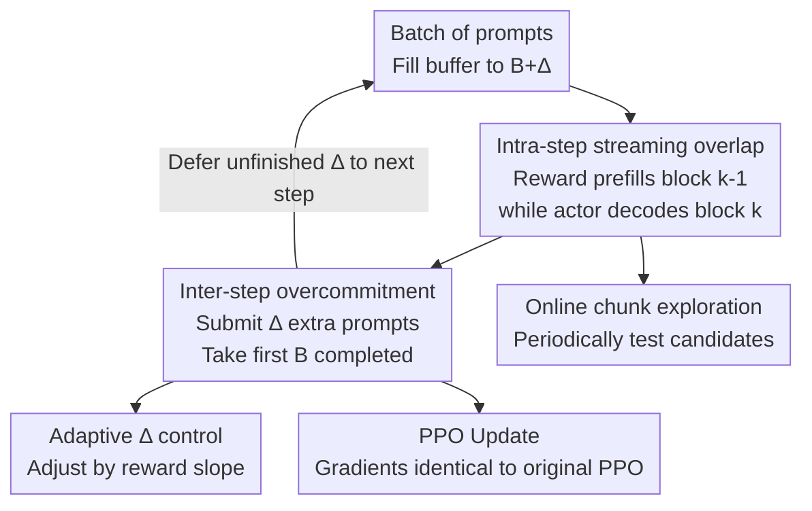

# OPPO: Accelerating PPO-based RLHF via Pipeline Overlap

**Conference**: ICLR 2026  
**OpenReview**: [https://openreview.net/forum?id=31Mr6wLBeF](https://openreview.net/forum?id=31Mr6wLBeF)  
**Code**: TBD  
**Area**: LLM Efficiency / RLHF Systems  
**Keywords**: PPO, RLHF, Pipeline Overlap, Tail Latency, Training Acceleration

## TL;DR
OPPO is a lightweight, model-agnostic framework for accelerating PPO-RLHF training. By overlapping actor generation and reward scoring via chunked streaming within a single step and utilizing inter-step "overcommitment" to defer tail latencies, it achieves training speedups of 1.8×–2.8× and increases GPU utilization by 1.4×–2.1× without altering PPO updates or degrading convergence quality.

## Background & Motivation

**Background**: PPO-based RLHF is the de facto standard for aligning LLMs with human preferences. A standard PPO-RLHF pipeline concurrently involves four models: actor (policy), critic (value function), reference (frozen base model for KL regularization), and reward (human preference scoring). Each training step is strictly divided into three sequential phases: generation (actor produces responses) → scoring (evaluation by critic/reference/reward) → training (actor and critic updates via advantages and gradients).

**Limitations of Prior Work**: This pipeline suffers from low efficiency due to "multi-model serial dependency" combined with "long-tail response length." First, computational characteristics across the four models differ significantly: actor autoregressive decoding is memory-bound (GPU utilization often below 40%), while scoring/training phases (especially long-context prefill) are compute-bound. This mismatch in computational demand leads to substantial GPU idle time. Second, response lengths follow a long-tail distribution: while most sequences are short, a few over-long responses delay the entire phase completion (tail stragglers), which is further exacerbated by distribution shifts during training stages (warm-up vs. convergence).

**Key Challenge**: Accelerating training requires breaking serial dependencies, but existing approaches impose costs. Algorithmic variants like DPO/GRPO remove value or reward models but can be unstable due to sparse rewards and require extensive rollouts. System-level asynchronous RLHF (e.g., AReaL) evaluates previous actor outputs to reduce dependency but introduces staleness. Experimental data in the paper (Figure 2c) shows that staleness values as low as 5 slow down reward convergence and degrade final model quality. Thus, the goal is to **eliminate serial idling without exposing PPO updates to stale data**.

**Goal**: Maximize pipeline execution overlap without altering PPO algorithmic semantics or introducing harmful staleness to fill idle time caused by serial dependencies and tail stragglers.

**Key Insight**: An overlooked opportunity exists: while the actor is performing memory-bound decoding, the downstream reward model remains idle. The reward model could perform prefill on the "already generated prefixes." Similarly, since over-long sequences are rare, one can submit extra prompts, utilize those that finish first, and defer unfinished ones to the next step.

**Core Idea**: Use "intra-step chunked streaming overlap" to hide reward prefill latency and "inter-step overcommitment + deferred execution" to absorb tail stragglers. These two orthogonal components, both featuring online adaptive control, serve as a lightweight wrapper for existing PPO implementations.

## Method

### Overall Architecture

OPPO takes a batch of prompts and a standard four-model RLHF configuration as input and outputs a training process with consistent convergence trajectories. It transforms serial steps into overlapping execution across two dimensions: within a step (interleaving reward prefill and actor decoding) and between adjacent steps (deferring incomplete long sequences). The scheduling is managed via a FIFO buffer with capacity $B+\Delta$: each step fills the buffer to $B+\Delta$; the generation phase decodes in chunks while streaming chunks to the reward model for incremental prefilling; the first $B$ completed sequences are used for the PPO update, while the remaining $\Delta$ incomplete sequences are retained in the buffer for the next round. Two online controllers adapt the chunk size and overcommitment degree $\Delta$.

### Key Designs

**1. Intra-step streaming overlap: Reward prefill during actor decoding**

This design targets the bottleneck where the reward model idles until the actor completes a full sequence. OPPO partitions actor generation into chunks of optimal size. Each generated block is streamed to the reward model for incremental prefilling. While the actor decodes block $k$, the reward model concurrently processes the prefill for block $k-1$. At the end of the step, the reward model only needs to prefill the final block before calculating the full sequence score. Since actor decoding is memory-bound and reward prefill is compute-bound, their hardware requirements are complementary, allowing overlap even in collocated model settings.

Importantly, this streaming **does not change PPO update semantics**. It does not modify final responses $y_i$, policy log-probabilities, or critic/value terms. The paper formalizes the streaming gradient estimation: let $y_i$ be the complete response and $y_i^{(1)},\dots,y_i^{(T_i)}$ its prefixes where $y_i^{(T_i)}=y_i$. Then:

$$\hat{g}_{\text{str}}(\theta)=\frac{1}{B}\sum_{i=1}^{B}\sum_{t=1}^{T_i}\mathbf{1}^{(i,t)}_{\text{fin}}\,\hat{A}(y_i)\,\nabla_\theta\log\pi_\theta(y_i\mid x_i)$$

Where $\mathbf{1}^{(i,t)}_{\text{fin}}$ is 1 only for the final prefix. Since each sample follows the identical prefix path, the inner sum collapses into a single term, making $\hat{g}_{\text{str}}(\theta)\equiv\hat{g}_{\text{std}}(\theta)$ point-wise identical. This provides the theoretical guarantee for "acceleration without convergence loss."

**2. Online adaptive chunk size control: Balancing overlap gain and resource contention**

Streaming introduces a trade-off: large chunks (e.g., 3K tokens) reduce overlap, reverting to serial execution; small chunks (e.g., 10 tokens) cause severe resource contention due to frequent GPU context switching between models. OPPO utilizes two observations: the trade-off between chunk size and overlap efficiency is monotonic and predictable; and PPO provides ample exploration opportunities over hundreds of steps. Every 50 steps, the system tests candidate chunk sizes (e.g., 128, 256, 512) and selects the best configuration for the subsequent window.

**3. Inter-step overcommitment: Deferring tail stragglers rather than dropping them**

Intra-step overlap cannot solve tail latencies caused by length heterogeneity within a batch. If the target batch size is $B$, OPPO runs $B+\Delta$ prompts per step. Since sequence generation is often not compute-limited, increasing the prompt count slightly has a marginal effect on per-batch time but significantly mitigates the impact of tail stragglers. Each step only uses the **first $B$ completed** sequences for PPO updates. The $\Delta$ unfinished sequences (with their partial work preserved) are deferred to the next step. This ensures long sequences are not starved and are ultimately completed while maintaining a consistent batch size of $B$.

**4. Online adaptive overcommitment degree $\Delta$: Balancing throughput and staleness**

$\Delta$ is a double-edged sword: too small and the GPU remains idle due to tails; too large and it increases per-step latency while introducing staleness. OPPO adapts $\Delta$ dynamically. Let $R_t$ be the average reward at step $t$ and define the improvement slope $s_t$ over a sliding window $w$:

$$\Delta_{t+1}=\begin{cases}\min(\Delta_{\max},\,\Delta_t+\delta_{\text{inc}}) & \text{if } s_t>0\\[2pt]\max(\Delta_{\min},\,\Delta_t-\delta_{\text{dec}}) & \text{if } s_t\le 0\end{cases}$$

Positive reward gains ($s_t>0$) suggest aggressive overcommitment for throughput. As the model converges ($s_t\to 0$), $\Delta_t$ naturally decays to $\Delta_{\min}$ (typically 0), disabling overcommitment during final convergence to avoid staleness.

### Loss & Training
OPPO does not modify the PPO objective. The actor optimizes the clipped surrogate objective $L_{\text{clip}}(\theta_j)=\mathbb{E}_t[\min(r_t(\theta_j)\hat{A}_t,\,\text{clip}(r_t(\theta_j),1-\epsilon,1+\epsilon)\hat{A}_t)]$. Advantages are calculated via GAE $\hat{A}_t=\sum_{\ell=0}^{T-t-1}(\gamma\lambda)^\ell\delta_{t+\ell}$ where $\delta_t=r_t+\gamma V(s_{t+1})-V(s_t)$. OPPO's contributions are located at the execution layer (how these quantities are computed concurrently) rather than the algorithmic layer.

## Key Experimental Results

Experiments were conducted on high-end GPUs (8×H200 / 4×GH200 / 8×A100). Actors included Qwen2.5-7B/3B variants; rewards utilized Qwen2.5-7B or rule-based evaluators.

### Main Results

| Task / Model | Metric | OPPO | TRL Baseline | Gain |
|---|---|---|---|---|
| Stack-Exchange / Qwen2.5-7B-Instruct | Time to reward 4.17 | 2,300 min | 4,300 min | 1.9× |
| Stack-Exchange / Qwen2.5-3B-Instruct | Time to reward 5.12 | 5,200 min | 13,000 min | 2.5× |
| OpenCoder-SFT (Stage2) / Qwen2.5-3B-Instruct | Training Time | — | — | 2.4× |
| GSM8K / Qwen2.5-7B | Training Time | — | — | 2.8× |
| Stack-Exchange / 7B-Instruct (2×4×A100) | Per-step Latency | 111.08 s | 498.30 s | 4.49× |

GPU Utilization: On Stack-Exchange, 7B-Instruct increased from 50.6%→71.0% (1.4×), while OpenCoder-3B increased from 35.7%→74.1% (2.1×). Compared to systems like VeRL and AReaL, OPPO achieves lower per-step latency because it targets the reward-idle bottleneck orthogonal to sequence parallelism.

### Ablation Study

| Configuration | Qwen2.5-7B (min to 4.17) | 7B Gain | Qwen2.5-3B (min to 5.12) | 3B Gain |
|---|---|---|---|---|
| TRL Baseline | 4,200 min | 1.0× | 13,000 min | 1.0× |
| Intra-step only | 3,500 min | 1.2× | 10,000 min | 1.3× |
| Inter-step only | 2,700 min | 1.6× | 6,300 min | 2.06× |

### Key Findings
- **Orthogonal Overlap**: Intra-step overlap alone hides ~17% of scoring latency and is limited by per-batch stragglers. Inter-step overlap provides larger gains (1.6x–2.06x). Combining both yields 1.8x–2.8x speedups.
- **Convergence Preservation**: Step-to-reward curves for OPPO and baselines are nearly identical, following the same learning phases.
- **Dynamic $\Delta$ Superiority**: Fixed $\Delta=4$ is too conservative; fixed $\Delta=8$ is fast early but ignores convergence needs. Dynamic $\Delta$ is optimal throughout.
- **Chunk Size Sensitivity**: In a 7B actor/reward setup, chunk=500 is optimal; extremely large or small chunks degrade performance.

## Highlights & Insights
- **Provable Equivalence**: Proving that intra-step streaming gradients are point-wise identical to standard PPO allows speedup to be decoupled from convergence quality.
- **Overcommitment as a Precise Solution**: Instead of dropping or waiting for tails, "submit more, use the first finishers, and defer the slow ones" amortizes tail latency across steps while preserving partial work.
- **Online AB Testing for Training**: Using the natural duration of PPO training to explore hyperparameters (chunk/$\Delta$) avoids manual tuning.
- **Orthogonal Compatibility**: As a wrapper, it does not conflict with sequence parallelism in frameworks like VeRL or AReaL.

## Limitations & Future Work
- **Reliance on Compute Mismatch**: Gains depend on the actor being memory-bound and the reward being compute-bound; benefits decrease if the reward model is significantly smaller or highly optimized.
- **Statistical Bias in Inter-step Overlap**: While reward curves match, the fact that deferred sequences are generated from a slightly older policy is not fully characterized theoretically.
- **Evaluation Breadth**: Results are centered on the Qwen2.5 family and three tasks; robustness across more diverse architectures or longer contexts remains to be seen.

## Related Work & Insights
- **vs. DPO / GRPO**: Algorithmic model removal leads to instability or reward design challenges; OPPO retains the four-model setup but overlaps execution.
- **vs. Asynchronous RLHF**: Async approaches accept staleness to reduce dependency; OPPO guarantees intra-step equivalence and minimizes inter-step staleness via adaptive $\Delta$.
- **vs. System Frameworks (VeRL/AReaL)**: These focus on parallelization and communication; OPPO targets the independent "reward-idle" bottleneck and can be combined with them.

## Rating
- Novelty: ⭐⭐⭐⭐
- Experimental Thoroughness: ⭐⭐⭐⭐
- Writing Quality: ⭐⭐⭐⭐
- Value: ⭐⭐⭐⭐⭐

<!-- RELATED:START -->

[1] Schulman et al. **Proximal Policy Optimization Algorithms**. arXiv 2017.
[2] Dou et al. **AReaL: Asynchronous RLHF Framework for LLM Training**. arXiv 2024.
[3] Sheng et al. **VeRL: Volcano Engine Reinforcement Learning for LLMs**. GitHub 2024.

<!-- RELATED:END -->

## Related Papers

- [\[ICLR 2026\] PARD: Accelerating LLM Inference with Low-Cost Parallel Draft Model Adaptation](pard_accelerating_llm_inference_with_lowcost_parallel_draft_model_adaptation.md)
- [\[ICLR 2026\] SonicMoE: Accelerating MoE with IO and Tile-aware Optimizations](sonicmoe_accelerating_moe_with_io_and_tile-aware_optimizations.md)
- [\[ICLR 2026\] Cactus: Accelerating Auto-Regressive Decoding with Constrained Acceptance Speculative Sampling](cactus_accelerating_auto-regressive_decoding_with_constrained_acceptance_specula.md)
- [\[ICLR 2026\] NI Sampling: Accelerating Discrete Diffusion Sampling by Token Order Optimization](ni_sampling_accelerating_discrete_diffusion_sampling_by_token_order_optimization.md)
- [\[ICLR 2026\] LycheeDecode: Accelerating Long-Context LLM Inference via Hybrid-Head Sparse Decoding](lycheedecode_accelerating_long-context_llm_inference_via_hybrid-head_sparse_deco.md)

<!-- RELATED:END -->
