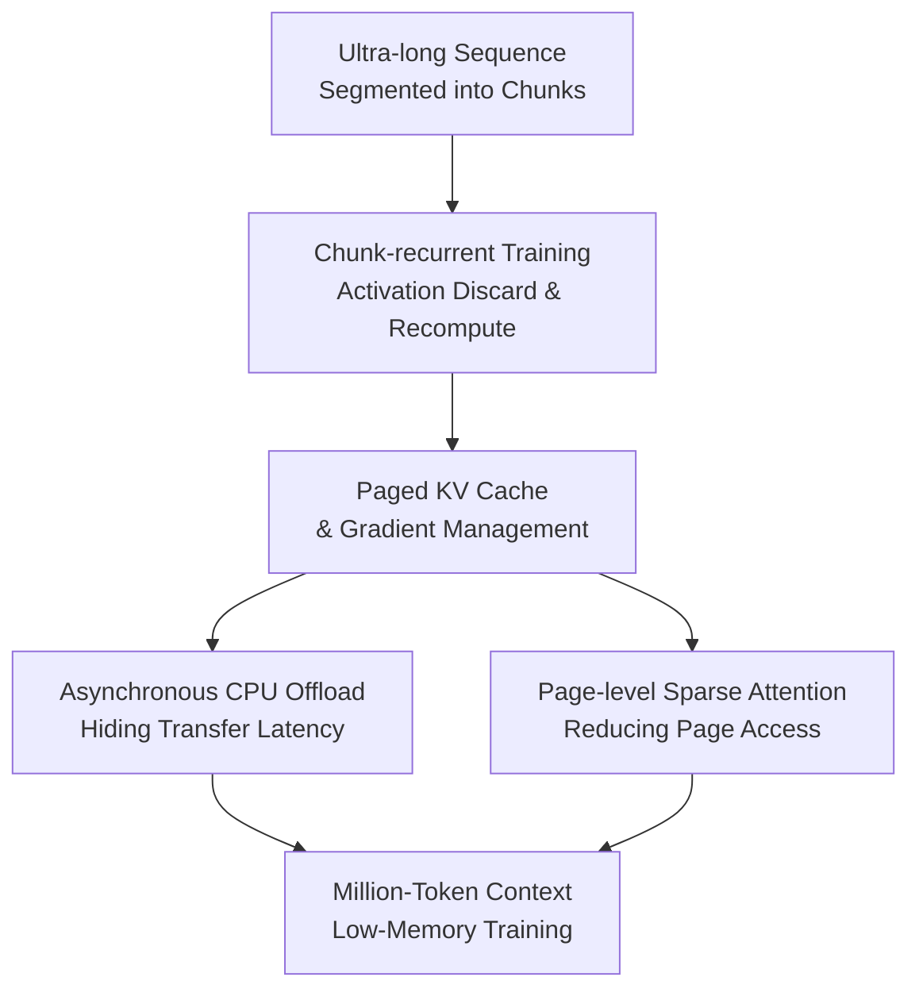

# Out of the Memory Barrier: A Highly Memory-Efficient Training System for LLMs with Million-Token Contexts

**Conference**: ICLR2026  
**OpenReview**: [https://openreview.net/forum?id=dSa3ImCQr7](https://openreview.net/forum?id=dSa3ImCQr7)  
**Code**: https://github.com/wenhaoli-xmu/OOMB  
**Area**: LLM Efficiency  
**Keywords**: Long-context training, memory optimization, KV Cache, sparse attention, CPU Offload

## TL;DR
OOMB transforms million-token context LLM training into a system that proceeds serially by chunks, discards activations immediately, and recomputes them during the backward pass. It utilizes paged KV cache, asynchronous CPU offloading, and page-level sparse attention to manage the states that truly grow with sequence length, enabling Qwen2.5-7B to be trained with 4M token contexts on a single H200.

## Background & Motivation

**Background**: Long-context LLMs typically require continued pre-training or fine-tuning to truly learn how to handle ultra-long sequences. While positional interpolation, training-free context extension, or retrieval-based techniques can "stretch" the window, the paper notes that metrics like perplexity and needle retrieval do not always represent deep long-range reasoning capabilities. If the goal is stable long-context capability, training on continuous long sequences remains unavoidable.

**Limitations of Prior Work**: The actual bottleneck for training is not the parameters or optimizer states, nor purely the number of training steps, but rather the activations and KV cache that grow linearly with sequence length in each iteration. For instance, in a model with a 4x GQA ratio, a single KV cache for 256K context could require approximately 64GB. On an A100, this already approaches or exceeds the limit even before accounting for other activations. Solutions like ZeRO-3, tensor parallelism, and Ring Attention distribute states across multiple cards, but at the cost of larger clusters and heavier communication overhead.

**Key Challenge**: The computation graph for long-context training aims to see the entire sequence at once, but GPU memory cannot simultaneously hold intermediate activations and cross-layer KV states for all tokens. Parallel training offers high throughput but causes memory to grow at $O(N)$; serial processing saves memory but often sacrifices training efficiency. Furthermore, unlike inference which only requires forward KV cache, Transformer training must also handle gradients.

**Goal**: The authors aim to solve a system problem: training million-token contexts on minimal GPU resources while maintaining precise or controllable approximate attention, back-propagatable KV cache management, and acceptable end-to-end latency.

**Key Insight**: OOMB observes that the data volume for long-context fine-tuning is usually not massive, and the number of training steps might be limited. In such cases, memory capacity is more critical than extreme throughput. Consequently, the system can accept serialization between chunks, processing each chunk internally in parallel, and then using recomputation and specialized kernels to shift memory growth from activations to the more controllable KV cache.

**Core Idea**: Use chunk-recurrent training to compress activation memory to $O(1)$, and then co-design paged management, asynchronous offloading, and page-level sparse attention around the new KV cache bottleneck to overcome the memory wall of million-token training.

## Method

### Overall Architecture

The overall workflow of OOMB can be understood as "chunk-based recurrence for Transformer training." An ultra-long sequence is first segmented into multiple chunks, which the model processes sequentially. During the forward pass, each chunk can access the KV cache generated by previous chunks; however, its own standard activations are discarded immediately after the forward pass and recomputed on the fly when needed for backpropagation. Consequently, the primary objects retained long-term in memory are no longer the activations of all tokens across all layers, but the KV cache and its gradients, which grow with the context.

To address this new bottleneck, OOMB does more than just adding an offload switch; it redesigns the KV cache storage format, backpropagation method, CPU/GPU migration, and attention access patterns. Paged management allows the KV cache to be appended and indexed like paged attention in inference systems. Specialized Triton kernels enable KV cache gradients to be accumulated in-place, bypassing the extra buffers typically saved by PyTorch autograd. Asynchronous CPU offloading moves temporarily unused pages to the CPU, while page-level sparse attention further reduces the number of pages that need to be moved back to the GPU or participate in attention calculations.

### Key Designs

**1. Chunk-recurrent Training: Converting Linearly Growing Activation Memory to Constant Memory per Chunk**

Standard Transformer training processes the entire sequence in one forward pass and retains intermediate activations for every layer until the backward pass, causing activation memory to grow linearly with the context length $N$. OOMB draws inspiration from sequential training in RNNs by dividing the long sequence into $S$ chunks: the output $Y_i$ of the $i$-th chunk depends on the current input $X_i$ and the historical KV cache $\{M_1, \dots, M_{i-1}\}$. After the forward pass, the standard activations $A_i$ of the current chunk are not retained. When backpropagation reaches this chunk, $A_i$ is recomputed using the same input and historical state, followed by the calculation of parameter and history KV cache gradients.

The key to this design is the isolation of the activation lifecycle to a single chunk. The system no longer needs to store the entire chain $A_1$ to $A_S$; the activation part becomes $O(1)$, determined by the chunk size. The cost is an additional forward-style recomputation during the backward pass, but long-context fine-tuning is often more memory-constrained. Without this step, subsequent paging and offloading would only alleviate KV cache issues without solving the linear explosion of standard activations.

**2. Paged KV Cache and Gradient Management: Making Training KV States Appendable, Indexable, and Recyclable**

Chunk-recurrent training shifts the primary bottleneck to the KV cache: for every chunk, the system must append new keys/values and derive their gradients during backpropagation. Appending using direct tensor concatenation leads to repeated allocation, copying, and fragmentation; the paper notes that non-paged implementations can cause hardware memory growth to hit nearly 3x the theoretical requirement. OOMB therefore places both KV cache and KV gradients into a paged memory manager, using fixed pages to manage long-sequence states.

Training is more complex than inference because paged attention in inference only concerns the forward pass, whereas this system must handle backpropagation. The authors implemented custom Triton kernels that handle both forward and backward passes simultaneously, making the KV cache nearly "opaque" to PyTorch autograd. Gradients are accumulated in-place into the corresponding pages via `atomic_add`, avoiding the storage of intermediate buffers for autograd and preventing PyTorch from saving another copy of the KV cache as a standard activation. This design places storage, indexing, and gradient write-back under direct system control, forming the foundation for subsequent offloading and sparse access.

**3. Asynchronous CPU Offload: Retaining Only Currently Required KV Pages on GPU**

Even with paging, the KV cache for million tokens will grow with length beyond what GPU memory can accommodate. OOMB's approach is to migrate the KV cache and gradients to the CPU as early as possible using pinned CPU memory, independent CUDA streams, and DMA for asynchronous transfers. For dense and local attention, the KV pages required for the next layer are known in advance, allowing the system to prefetch the KV cache for layer $i$ while computing layer $i-1$. Backpropagation follows a symmetric prefetching strategy.

For retrieval-based sparse attention, the relevant pages must be calculated based on the current query during the forward pass, meaning the access set is not known entirely in advance. OOMB initiates page retrieval and data transfer immediately after the query projection, overlapping the transfer latency with the subsequent computation time of key/value projections. During backpropagation, it reuses the page indices cached during the forward pass and reverts to a simpler prefetching strategy. The paper reports an end-to-end overhead of less than 5% for dense/local offloading, indicating that the value lies in "computation-communication overlap" rather than just moving data.

**4. Page-level Sparse Attention: Reducing Computation and KV Page Transfers**

The computational complexity of long-context attention itself is also a bottleneck. OOMB leverages the paging structure to naturally support page-level sparse attention. For dense attention models like Qwen2.5, the system first calculates an average representation vector $K_{avg}$ for each key page. It then scores the current query token against all page representation vectors, aggregating them via softmax and voting to select the Top-K relevant key pages for each query page. Simply put, the score of the $i$-th query page for the $k$-th key page is derived from the accumulation of attention preferences of multiple tokens within that page:

$$
Score_{page}[i,k] = \sum_j softmax(Q[i,j]^\top K_{avg}[k])
$$

This sparsity does not involve arbitrary token pruning but rather selects historical blocks at a page granularity. It aligns naturally with paged management: selected pages serve as direct inputs for the attention kernel and dictate which KV pages must be moved back from the CPU. For natively sparse models like GPT-OSS, dense layers still use Top-K page retrieval, while local attention layers only fetch recent KV pages. Thus, sparse attention simultaneously reduces computational complexity and CPU-GPU communication volume.

### Loss & Training

OOMB is not a new language modeling objective but a training system; therefore, it follows standard autoregressive language modeling objectives. Experiments use Qwen2.5-7B for full-parameter fine-tuning with bfloat16 precision, the Adam optimizer, a learning rate of $5\times 10^{-5}$, and betas of $(0.9, 0.98)$. The per-GPU batch size is set to 1 to isolate the impact of context length on system performance.

Key system-level hyperparameters include chunk size, KV page size, and sparse retrieval budget. On the H200, a page size of 128 was used. The study systematically compared chunk sizes of 4K, 8K, and 12K, alongside sparse budgets such as `4K+512`, `4K+2048`, `4K+8192`, and `4K+32768`. Larger chunks generally improve hardware utilization but increase single-chunk activation occupancy. A larger retrieval budget is closer to dense attention but increases computation and communication.

## Key Experimental Results

### Main Results

The main experiments evaluate the efficiency of long-context training for Qwen2.5-7B on H200, comparing against a parallel training baseline (FlashAttention + gradient checkpointing) and context parallelism represented by Ring Flash Attention (RFA). The most significant conclusion is that the baseline OOMs at 128K, while OOMB maintains memory usage around 34GB for 256K training via offloading and sparse attention. Extension experiments demonstrate that a single H200 can train 4M token contexts.

| Method | HW/Config | Attention | Max Context | Peak Memory Trend | Key Conclusion |
|------|-----------|--------|----------------|--------------|----------|
| FlashAttention baseline | 1x H200, ckpt | dense exact | 128K OOM | 32K: 64,985MB; 64K: ~100GB; 128K: OOM | Parallel training activations/KV grow linearly |
| OOMB + Dense Attn | 1x H200, chunk 4K, ckpt+offload | dense exact | 256K | 8K: 33,686MB; 256K: 37,129MB | Memory hardly grows under exact attention |
| OOMB + Sparse Attn | 1x H200, chunk 4K, `4K+8192`, ckpt+offload | page sparse | 256K | 8K: 33,669MB; 256K: 34,083MB | Sparse attn reduces latency; memory constant |
| OOMB Extension | 1x/4x H200 | dense/sparse | 4M to 8M | +10MB per 10K tokens (Qwen2.5-7B) | Million-context training becomes a single-card task |

Regarding throughput, OOMB is not merely "memory-efficient but unusable." Table 3 shows that at 256K context, RFA on 4x H200 achieves approximately 218.41 tokens/sec per device. OOMB with dense attention on a single H200 reaches 266.13 tokens/sec, and OOMB with sparse attention on a single H200 reaches 1301.60 tokens/sec. This comparison indicates that the overhead from serial chunks can be offset by reduced communication and sparse access.

### Ablation Study

Ablation primarily verifies the effectiveness of activation recomputation, CPU offloading latency, sparse attention acceleration, and the impact of chunk/retrieval budgets on accuracy and efficiency. The following data highlights the 256K configuration.

| Config | 256K Latency/Iter | 256K Peak Memory | Description |
|------|---------------|---------------|------|
| OOMB Dense, chunk 4K, ckpt, no offload | 1015.9s | 76,650MB | Chunk/recompute is scalable, but KV cache consumes memory |
| OOMB Dense, chunk 4K, offload, no ckpt | 899.6s | 60,788MB | Offload reduces KV cache memory without severe latency penalty |
| OOMB Dense, chunk 4K, ckpt+offload | 985.8s | 37,129MB | Lowest memory under exact attention, but recomputation cost added |
| OOMB Sparse, chunk 4K, `4K+8192`, ckpt+offload | 201.4s | 34,083MB | Sparse attention reduces 256K latency from ~986s to ~201s |
| OOMB Sparse, chunk 12K, `12K+512`, ckpt+offload | 146.4s | 42,774MB | Larger chunk improves utilization; memory is higher but controllable |

The accuracy of sparse attention was also validated. The paper analyzes gradient approximation errors across 16K, 64K, 256K, and 1M contexts with 4 retrieval budgets. For 64K, the dense loss is 1.22387, while both `4K+8192` and `4K+32768` reach 1.21875. For 256K, the dense loss is 2.21875, with both budgets achieving the same 2.21875. At 1M context, the loss is higher, and the 32K budget shows slight instability later on, which the authors attribute to learning rate and RoPE extrapolation limits.

### Key Findings

- OOMB's core contribution is $O(1)$ activation memory via recomputation; without this, KV cache optimization alone cannot solve the long-context memory wall.
- Paged KV cache is more than a minor engineering optimization. Non-paged appending leads to reallocation and fragmentation. Figure 4 shows that actual memory growth can hit 3x the theoretical requirement.
- The usability of CPU offloading depends on hiding transfers within computation. OOMB uses cross-layer prefetching for dense/local attention and immediate retrieval for sparse attention to keep overhead low.
- Sparse attention yields massive gains for long contexts: at 256K, the latency of the sparse version is roughly one-fifth that of the dense version, while memory usage is slightly lower.
- Regarding training quality, page-level sparse attention loss is close to dense attention at 64K/256K, though 1M scenarios reveal issues with positional encoding extrapolation and ultra-long training stability.

## Highlights & Insights

- **Accurate Problem Decomposition**: The paper does not simply claim that "long-context training uses too much memory." It first compresses activations to a constant using chunk-recurrence and then identifies the KV cache as the new bottleneck. This decomposition provides a clear target for subsequent optimizations.
- **Paged Management for both KV Cache and Gradients**: While many inference systems manage forward KV cache, OOMB extends this to training gradient write-back. Using custom kernels to bypass autograd's storage of the KV cache is a critical differentiator for training scenarios.
- **Synergy between Offloading and Sparse Attention**: Sparse attention does more than save FLOPs; it reduces the number of pages that must be moved from the CPU to the GPU. The paged structure also directs sparse retrieval toward transportable memory units, creating a more integrated strategy than offloading alone.
- **Significant Resource Efficiency**: Demonstrating 4M context training for Qwen2.5-7B on a single H200 shifts a task that previously required massive context parallelism clusters down to few-card or single-card setups, which is particularly valuable for smaller research teams.
- **Extensible Methodology**: The core concept is not tied to a specific model but rather the principle of "transforming uncontrollable linear activation growth into a paged, schedulable, and sparsely accessible state management problem." This can migrate to long-video, multi-modal long-sequences, or agent-trace training.

## Limitations & Future Work

- **Throughput is Not Free**: Serial processing between chunks introduces latency, especially for dense exact attention at 256K. For large-scale pre-training requiring extreme tokens/sec, context parallelism may still be more appropriate.
- **Sparse Attention is an Approximation**: Qwen2.5's dense attention is approximated by Top-K page retrieval. While loss and gradient error experiments are acceptable, whether this harms tasks requiring fine-grained global dependencies needs more comprehensive downstream evaluation.
- **Dependence on CPU-GPU Bandwidth**: The effectiveness of asynchronous offloading relies on PCIe/NVLink and DMA overlap. If hardware interconnects are weak, transfer latency may not be fully hidden.
- **Incomplete Validation of Million-token Model Quality**: The paper mainly validates system efficiency, loss, and gradient errors. It does not systemically demonstrate downstream task performance or real-world application benefits for million-token contexts.
- **High Engineering Complexity**: Custom Triton kernels, paged gradients, and asynchronous streams increase maintenance costs. Transitioning to general training frameworks would require better interface abstraction and cross-model adaptation.

## Related Work & Insights

- **vs. LongLoRA / Position Extension**: Methods like LongLoRA focus on local attention or RoPE tricks to reduce fine-tuning costs but struggle to eliminate activation memory growth. OOMB is a system-level solution aimed at enabling full training of million-token sequences.
- **vs. SeCO**: SeCO explored chunk-wise long-context training but lacked the operator, paged memory, offloading, and sparse attention joint optimization found in OOMB. Consequently, its context support was more limited.
- **vs. Ring Attention / Ring Flash Attention**: Context parallelism splits sequences across multiple GPUs using communication for memory savings; OOMB processes sequences serially on single/few devices, using KV page access and offloading. The former is for clusters, the latter for resource-constrained setups.
- **vs. vLLM / PagedAttention**: OOMB adopts paged KV cache ideas from inference but adapts them for backpropagation and KV gradients. The key insight is that training systems can also benefit from page-based memory scheduling.
- **Inspiration for Future Work**: Long-context training may not rely solely on more GPUs. A promising direction is the co-design of attention patterns, KV lifecycle, memory hierarchies, and training objectives, moving training from "full graph retention" to "on-demand recomputation and access."

## Rating
- Novelty: ⭐⭐⭐⭐⭐ The systemization of chunk-recurrent training, paged KV cache/gradients, asynchronous offloading, and page-level sparse attention addresses the heavy bottleneck of million-context training.
- Experimental Thoroughness: ⭐⭐⭐⭐☆ System efficiency and ablation are solid, though downstream task evaluation for million-token contexts is still limited.
- Writing Quality: ⭐⭐⭐⭐☆ Problem decomposition and component explanations are clear. Some ultra-long extension results rely on charts, requiring the reader to synthesize the quality conclusions.
- Value: ⭐⭐⭐⭐⭐ If reproducible, OOMB directly lowers the resource threshold for long-context LLM training, especially for teams without large-scale GPU clusters.

<!-- RELATED:START -->

## Related Papers

- [\[ICLR 2026\] Cache What Lasts: Token Retention for Memory-Bounded KV Cache in LLMs](cache_what_lasts_token_retention_for_memory-bounded_kv_cache_in_llms.md)
- [\[ICLR 2026\] IceCache: Memory-Efficient KV-cache Management for Long-Sequence LLMs](icecache_memory-efficient_kv-cache_management_for_long-sequence_llms.md)
- [\[ICLR 2026\] Cascadia: An Efficient Cascade Serving System for Large Language Models](cascadia_an_efficient_cascade_serving_system_for_large_language_models.md)
- [\[ACL 2025\] EpMAN: Episodic Memory AttentioN for Generalizing to Longer Contexts](../../ACL2025/llm_efficiency/epman_episodic_memory_attention_for_generalizing_to_longer_contexts.md)
- [\[ICLR 2026\] UltraMemV2: Memory Networks Scaling to 120B Parameters with Superior Long-Context Learning](ultramemv2_memory_networks_scaling_to_120b_parameters_with_superior_long-context.md)

<!-- RELATED:END -->
