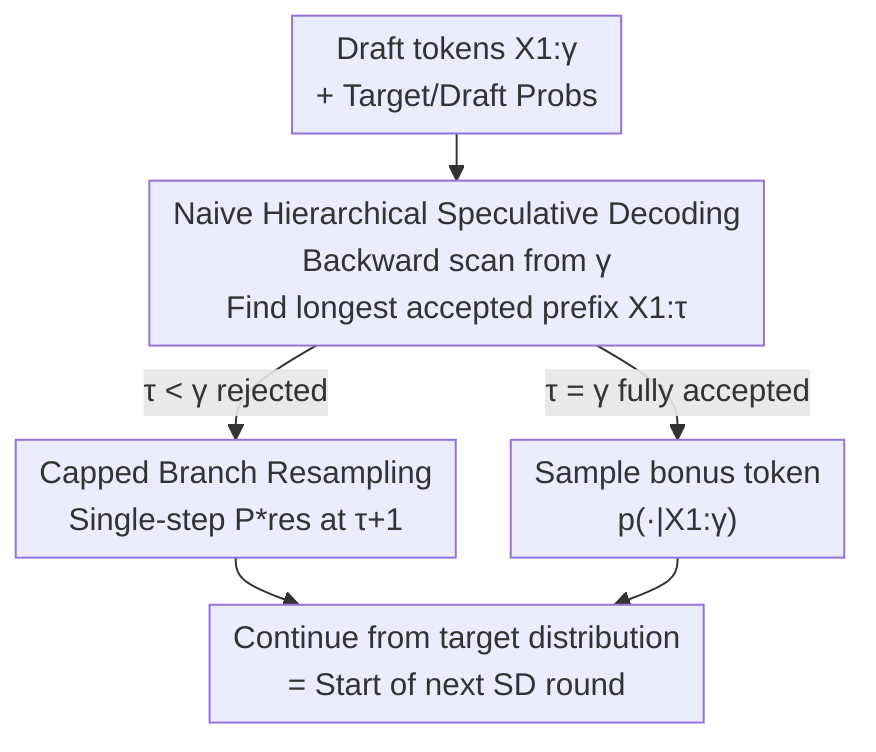

# Overcoming Joint Intractability with Lossless Hierarchical Speculative Decoding

**Conference**: ICLR 2026  
**OpenReview**: [https://openreview.net/forum?id=LaVrNaBNwM](https://openreview.net/forum?id=LaVrNaBNwM)  
**Code**: https://github.com/ZhouYuxuanYX/Hierarchical-Speculative-Decoding  
**Area**: LLM Efficiency / Speculative Decoding  
**Keywords**: Speculative Decoding, Lossless Verification, Joint Intractability, Hierarchical Resampling, Inference Acceleration

## TL;DR
This paper proposes Hierarchical Speculative Decoding (HSD), a novel verification strategy using "hierarchical branch resampling + capping." Without altering the target model distribution (provably lossless), it significantly improves the number of draft tokens accepted per step, increasing average decoding speed by 6.7%, with gains exceeding 12% when integrated into EAGLE-3.

## Background & Motivation
**Background**: Speculative Decoding is a mainstream lossless solution for accelerating autoregressive LLMs. It involves a small draft model proposing $\gamma$ tokens, which are then verified and accepted in parallel by a large target model, accelerating inference while strictly preserving the target distribution. Recent research has shifted from improving "drafting" (how to generate better drafts) to "verification," as drafting gains are diminishing and verification has become the bottleneck.

**Limitations of Prior Work**: It has been observed that "tokenwise verification" has a structural weakness: it decides acceptance bit-by-bit from left to right. If the first position is rejected with probability $h_1=\min\{1,p/q\}$, the entire draft is discarded. While some work moved toward "sequence-level/joint verification" to accept more tokens, joint verification encounters **joint intractability**: to recover the target distribution losslessly, naive resampling requires calculating full joint probabilities for all possible decoding paths, which is inaccessible for autoregressive models.

**Key Challenge**: Existing approaches either sacrifice fidelity (e.g., MTAD using lossy acceptance with fixed thresholds) or remain lossless but flawed. Blockwise Verification can provably recover the target distribution but fails to reach the ideal acceptance count, and its internal mechanisms and compatibility with multi-candidate frameworks remain unclear. Specifically, "losslessness" and "high acceptance + interpretability + composability" have not been achieved simultaneously.

**Goal**: Design a verification method that is provably lossless, approaches the ideal acceptance count, and can be integrated as a plug-and-play component into existing speculative decoding frameworks (especially multi-candidate drafting).

**Key Insight**: The authors observe a critical fact: although joint probabilities of the full space are unavailable, given a prefix $X_{1:t-1}$, the probabilities for all next tokens in the vocabulary $V$ are **accessible** (accessible branch). While the "deficiency" within a single branch cannot be compensated for internally, the **excess probability mass from certain branches can statistically compensate for the deficiency in others**. This provides a path to bypass joint intractability.

**Core Idea**: Organize multiple resampling distributions into a "hierarchical structure" based on prefix levels. Each level recovers a local target distribution within its accessible branches, and "capping" is used to compress multi-step resampling into a single step. This recovers the full target distribution in statistical expectation while maximizing the expected number of accepted tokens.

## Method

### Overall Architecture
HSD is a replacement component for the "verification side." The draft model proposes $\gamma$ tokens as usual, and the target model provides probabilities for each position in parallel. HSD then takes over the "accept/reject/resample" steps. During runtime, it performs three tasks: first, it executes a **backward scan** from the end of the draft $\gamma$ to find the longest accepted prefix $X_{1:\tau}$; then, it performs **one capped resampling** at position $\tau+1$ using the corresponding distribution in the hierarchy; finally, it continues directly from the target distribution, which seamlessly serves as the next round of speculative decoding without extra target model calls.

This process is supported by a theoretical foundation (generalized/branch divergence and recoverability), which determines how acceptance probabilities $h_t$ and resampling distributions are calculated to ensure losslessness. The runtime pipeline is illustrated below:

### Key Designs

**1. Generalized Divergence and Branch Recoverability: Decomposing "Joint Intractability"**

The essence of lossless speculative decoding is that accepted drafts are directly output, while rejected parts are "compensated" via resampling to return to the target distribution. In the tokenwise case, this is simple because each token probability is accessible; however, joint sequence-level probabilities are not. The authors break this by generalizing the divergence $D$ to any subset $\Omega'$: defining generalized divergence $D_{\Omega'}(p,q)=\sum_{\tilde\omega\in\Omega'}\max\{p(\tilde\omega)-q(\tilde\omega),0\}$, which measures the **deficient quality** of the draft relative to the target on $\Omega'$. The reverse $D_{\Omega'}(q,p)$ measures the **excess quality**. On the full space, these are equal, reducing to standard tokenwise verification.

This leads to actionable conclusions: **Theorem 1 (Partial Distribution Recovery)**—The target distribution on subset $\Omega'$ can be fully recovered via resampling if and only if $D_{\Omega'}(p,q)\le D_{\Omega'}(q,p)$. By setting $\Omega'$ to the accessible branch $\mathrm{Branch}(X_{1:t-1})=\{(X_{1:t-1},\tilde x_t)\mid \tilde x_t\in V\}$ and defining the branch asymmetry $\Delta_{\mathrm{Branch}}(X_{1:t-1})=D_{\mathrm{Branch}}(p,q)-D_{\mathrm{Branch}}(q,p)$, **Theorem 2** yields a simple identity:

$$\Delta_{\mathrm{Branch}}(X_{1:t-1}) = p(X_{1:t-1}) - q(X_{1:t-1}).$$

Thus, whether a single branch is self-consistently recoverable depends only on whether the joint probability ratio $r(X_{1:t-1})=p/q$ is $\le 1$. When some branches cannot be fully compensated, **Theorem 4 (Hierarchy of Divergence)** ensures that the sum of positive asymmetries of all sub-branches equals the divergence of the parent branch. This hierarchical conservation allows excess mass from surplus branches to "converge upward" and be redistributed to deficient branches.

**2. Naive Hierarchical Speculative Decoding: Backward Scanning + Hierarchical Resampling**

Based on this theory, a naive version (Algorithm 1) is derived. It performs a **backward scan** from $\gamma$ to $1$ for the candidate sequence $X_{1:\gamma}$. For each position, it samples $\eta_t\sim U(0,1)$; if $h_t\ge\eta_t$, it sets $\tau=t$ and breaks (finding the longest accepted prefix); otherwise, it sets $\tau=t-1$ and continues moving backward. The acceptance probability $h_t$ for $t<\gamma$ is calculated using branch divergence:

$$h_t = \frac{D_{\mathrm{Branch}}(p,q\mid X_{1:t})}{\max\{D_{\mathrm{Branch}}(p,q\mid X_{1:t}),\,D_{\mathrm{Branch}}(q,p\mid X_{1:t})\}},$$

with $h_\gamma=\min\{r(X_{1:\gamma}),1\}$. Once $\tau$ is determined, bitwise compensation for $\tau+1\dots\gamma$ is performed using the branch resampling probability $P_{\mathrm{res}}$. The authors prove that the resulting sequence distribution exactly matches the target $p(X_{1:\gamma})$. However, bitwise recovery would require $\gamma-\tau+1$ additional target model calls—an overhead that must be eliminated.

**3. Capped Branch Resampling: Single-step Recovery with Zero Extra Target Calls**

Capping is the key to making HSD an efficient algorithm (Algorithm 2). First, define the **maximum prefix ratio index** $m(X_{1:t})=\arg\max_{1\le i<t} r(X_{1:i})$ (or 0 if no prefix ratio exceeds 1). Then, define the **capped prefix ratio** $r^*(X_{1:t})=\min\{r(X_{1:m}),1\}\,r(X_{m+1:t})$. Intuitively, this "clamps" any segment of the prefix that is already in excess ($r>1$) to 1, allowing only the ratio of the latter segment $X_{m+1:t}$ to take effect. 

The beauty of this is that for branches with negative asymmetry (surplus available), **only one resampling at $\tau+1$** is needed to recover the target distribution of the entire path in statistical expectation. The remaining positions are sampled directly from the target model—which is exactly what the next round of speculative decoding would have done anyway. This results in nearly zero additional overhead during the verification phase (experimentally <1% of total decoding time).

### Example: Capped Acceptance on GSM8K
Consider a GSM8K snippet ($\gamma=10$, draft: she/work/ed/45/-/40/=/5/hours/of). The joint probability ratios $\{r(X_{1:t})\}$ for the early tokens are $\{0.82, 1.03, 1.59, 6.12, 0,\dots\}$. At $t=2,3,4$, the ratios exceed 1 (excess), then collapse to 0 at $t\ge5$ due to zero target probability. After capping, $\{r^*\}=\{0.82,1,1,1,0,\dots\}$, and the hierarchical acceptance probabilities $\{h_t\}=\{0.123,1,1,1,0,\dots\}$ saturate at $t=2,3,4$. Thus, the first 4 tokens are accepted at once ($n_{\text{match}}=4$). In contrast, the tokenwise baseline would gamble at the 1st token with $h_1=0.82$; if rejected, the entire draft is discarded. HSD avoids this fragility via backward scanning and capping.

## Key Experimental Results

### Main Results
Default Setup: 8-bit GPTQ quantized Qwen2.5 series, 0.5B draft, 14B/32B/72B target, temperature 1, single H20 GPU. Metrics: Block Efficiency (BE, tokens produced per target call) and Decoding Speed (DS, tokens/sec).

| Dataset | Metric(Target Size) | Tokenwise | Blockwise | HSD(Ours) |
|--------|------|------|----------|------|
| GSM8K | BE@14B | 5.99 | 6.13 (+2.3%) | 6.30 (+5.2%) |
| GSM8K | DS@14B | 82.28 | 86.06 (+4.6%) | 91.05 (+10.7%) |
| HumanEval | BE@32B | 4.89 | 5.15 (+5.3%) | 5.49 (+12.3%) |
| HumanEval | DS@32B | 45.68 | 48.15 (+5.4%) | 50.88 (+11.4%) |
| CNN/DM | BE@14B | 2.39 | 2.50 (+4.6%) | 2.59 (+8.4%) |

On average, HSD improves BE by ~6.2% and DS by ~6.7% over Tokenwise/Blockwise baselines, with peak gains of 12.3% on specific datasets.

### Ablation Study

| Config | Key Metric | Description |
|------|---------|------|
| Multi-candidate (11 candidates) | DS CNN/DM +8.9% | Additive gain when combined with RRS multi-candidate drafting. |
| Temperature 0.6/0.8/1.0 | BE Superior | Robust to temperature changes, consistently outperforming baselines. |
| Draft Length $\gamma=15$ | BE 7.88 / DS 52.95 | Gains increase as draft length increases. |
| EAGLE-3 → EAGLE-3H | DS 71.59→80.49 (+12.4%) | Replacing EAGLE-3's tokenwise verification sets a new SOTA efficiency. |

### Key Findings
- Gains are most significant on HumanEval (code generation, up to +12.3% BE) because code sequences often feature "highly certain early tokens," a structure HSD exploits via backward scanning. Gains on CNN/DM (summarization) are more moderate as the base acceptance rate is lower.
- Relative gains decrease slightly as the target model grows (e.g., +3.3% BE on 72B) but remain positive.
- HSD is largely orthogonal to "drafting-side" frameworks like RRS and EAGLE-3, allowing for stacked improvements rather than mutual exclusion.

## Highlights & Insights
- **Bypassing Joint Intractability via Hierarchical Conservation**: Theorem 2's identity $\Delta_{\mathrm{Branch}}=p(X_{1:t-1})-q(X_{1:t-1})$ is remarkably clean, simplifying the recoverability of a branch into a comparison of prefix probability ratios.
- **Capping as a Single-Step Proxy**: Capping replaces $\gamma-\tau+1$ target calls with a single resampling step. Since the subsequent target sampling is the starting point for the next SD round, the verification adds nearly zero latency.
- **Interpretable + Composable**: Unlike the "black-box" nature of Blockwise Verification, HSD provides explicit divergence-based formulas for acceptance and resampling, making it easy to integrate into modern speculative decoding stacks like EAGLE-3.

## Limitations & Future Work
- Sequence-Dependent Gains: Gains are limited in tasks with inherently low acceptance rates (e.g., long summarization) or for very large target models.
- Setup Breadth: Experiments focused on Qwen2.5 with quantization; performance on more model families and longer contexts remains to be explored.
- Statistical Recovery: Losslessness is guaranteed in "expectation" across trajectories; the variance or tail behavior of individual trajectories was not analyzed in depth.
- Multi-candidate Comparisons: The multi-candidate experiments mainly used the simple RRS baseline and did not yet explore full joint verification on tree-based structures (e.g., SpecInfer/Medusa).

## Related Work & Insights
- **vs Tokenwise (Leviathan 2023)**: Tokenwise is strictly left-to-right; any early rejection discards the rest. HSD uses backward scanning to accept the longest possible prefix, benefiting from the same divergence principles while achieving higher expected acceptance.
- **vs Blockwise Verification (Sun 2024)**: Both are provably lossless, but HSD provides more transparent mechanisms and is easily extensible to multi-candidate frameworks.
- **vs Lossy Methods (MTAD/Medusa-2)**: These methods sacrifice distribution fidelity for speed. HSD reaches comparable or higher speedups without altering the target distribution.

## Rating
- Novelty: ⭐⭐⭐⭐⭐ Resolves joint intractability with generalized divergence and hierarchical conservation, offering a new lossless verification paradigm.
- Experimental Thoroughness: ⭐⭐⭐⭐ Extensive coverage of scales, tasks, and integrations, though model families are somewhat concentrated.
- Writing Quality: ⭐⭐⭐⭐ Rigorous theoretical derivation and clear theorem links, though notation density requires careful reading.
- Value: ⭐⭐⭐⭐⭐ Highly practical due to its plug-and-play nature and near-zero overhead, setting a new SOTA when combined with EAGLE-3.

<!-- RELATED:START -->

## Related Papers

- [\[ICLR 2026\] Self-Speculative Decoding Accelerates Lossless Inference in Any-Order and Any-Subset Autoregressive Models](self-speculative_decoding_accelerates_lossless_inference_in_any-order_and_any-su.md)
- [\[ACL 2026\] Speculative Verification: Exploiting Information Gain to Refine Speculative Decoding](../../ACL2026/llm_efficiency/speculative_verification_exploiting_information_gain_to_refine_speculative_decod.md)
- [\[CVPR 2026\] ParallelVLM: Lossless Video-LLM Acceleration with Visual Alignment Aware Parallel Speculative Decoding](../../CVPR2026/llm_efficiency/parallelvlm_lossless_video-llm_acceleration_with_visual_alignment_aware_parallel.md)
- [\[ICLR 2026\] SpecBranch: Speculative Decoding via Hybrid Drafting and Rollback-Aware Branch Parallelism](specbranch_speculative_decoding_via_hybrid_drafting_and_rollback-aware_branch_pa.md)
- [\[ICLR 2026\] RepSpec: Structural Re-parameterized Draft Model Training for Speculative Decoding](repspec_structural_re-parameterized_draft_model_training_for_speculative_decodin.md)

<!-- RELATED:END -->
