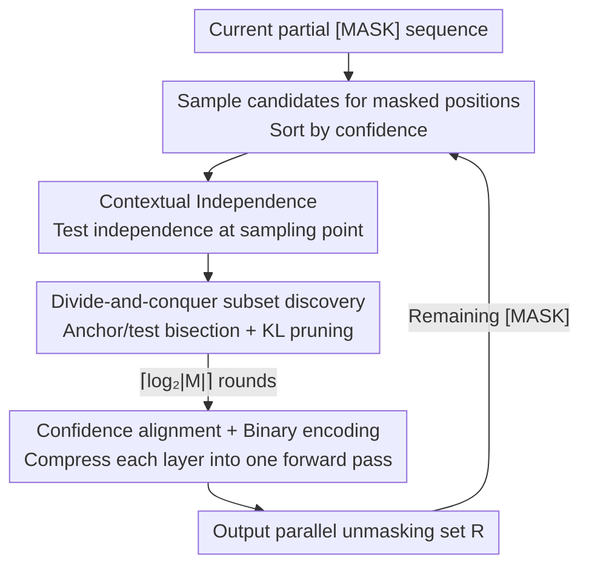

# Parallel Sampling from Masked Diffusion Models via Conditional Independence Testing

**Conference**: ICLR 2026  
**OpenReview**: [https://openreview.net/forum?id=XjcHRIu0iF](https://openreview.net/forum?id=XjcHRIu0iF)  
**Code**: To be confirmed  
**Area**: LLM Efficiency / Discrete Diffusion / Parallel Decoding  
**Keywords**: Masked Diffusion Models, Parallel Sampling, Conditional Independence, Training-free Sampler, Inference Acceleration

## TL;DR
PUNT is a training-free and model-agnostic sampler for Masked Diffusion Models (MDMs). In each step, it utilizes "contextual independence" testing combined with divide-and-conquer pruning to select a batch of non-interfering, high-confidence tokens for simultaneous decoding in only $O(\log |M|)$ forward passes. It achieves higher generation quality with fewer forward passes on long-text alignment benchmarks (up to 16% higher on IFEval compared to baselines).

## Background & Motivation
**Background**: Autoregressive Models (ARMs) generate tokens from left to right, where inference speed is bottlenecked by sequentiality. Masked Diffusion Models (MDMs, e.g., LLaDA, Dream) provide a non-autoregressive alternative—starting from a full [MASK] sequence, they predict multiple masked positions in parallel and unmask a subset in each step, theoretically offering significant acceleration.

**Limitations of Prior Work**: The decision of "which tokens to unmask in one step" determines the trade-off between quality and speed. Existing training-free strategies have distinct flaws: confidence/entropy-based methods (e.g., EB-Sampler) select only high-confidence tokens while completely ignoring inter-token dependencies; structured/gap schedulers (Dilated, Halton) force separation of parallel positions based on fixed geometry, regardless of the actual dependencies in a specific sequence; remasking or distillation methods either introduce extra forward overhead or require expensive retraining. Their common blind spot is the **lack of explicit testing for whether parallelly decoded tokens truly do not interfere with each other**.

**Key Challenge**: High-quality parallel decoding must satisfy two conflicting conditions: (i) tokens updated in the same step must be conditionally independent (otherwise the joint distribution cannot be factorized, introducing errors); (ii) high-confidence predictions should be prioritized for unmasking. However, high-confidence tokens tend to cluster and are strongly correlated, making them exactly the positions that should not be unmasked simultaneously.

**Goal**: To efficiently identify a subset of positions that are "both conditionally independent and high-confidence" for parallel unmasking in each step without retraining the model, while keeping the cost of finding this subset far lower than the $O(|M|)$ required for sequential testing.

**Key Insight**: The authors move away from strict conditional independence (which requires integrating over the entire exponential output space $V^R$ and is computationally infeasible). Instead, they propose "contextual independence," which judges independence only at the **current sampling point**. This is the necessary and sufficient property for determining whether parallel sampling in the current step is equivalent to sequential sampling, being more relaxed than full independence yet stricter than pure confidence-based heuristics.

**Core Idea**: Replace "conditional independence for all possible outputs" with "conditional independence testing at the sampling point," and reduce the testing cost from $O(|M|)$ to $O(\log|M|)$ via divide-and-conquer and binary encoding.

## Method

### Overall Architecture
PUNT (Parallel Unmasking with Non-influence Tests) acts as a "subset selector" embedded within the standard iterative decoding loop of an MDM. The input for each denoising step is the current partially masked sequence $x$. PUNT outputs a set $R$ of masked positions that are **contextually independent and high-confidence**. The model unmasks these positions simultaneously, and the process repeats until all tokens are revealed.

It performs three main tasks: first, it samples candidates for all masked positions and sorts them by confidence; second, it uses "contextual independence" as a criterion to prune interfering low-confidence tokens layer-by-layer via **divide-and-conquer anchor/test bisection + KL pruning**; finally, it leverages confidence sorting and binary encoding to compress each layer of the recursive tree into a **single forward pass**, resulting in only $\lceil\log_2|M|\rceil$ model calls per step.

### Key Designs

**1. Contextual Independence: Testing independence at the sampling point to bypass exponential summation**

True conditional independence requires the joint distribution to factorize for all outputs $p_R(\cdot\mid x_{-M})=\prod_{i\in R}p_i(\cdot\mid x_{-M})$. Verifying this would require traversing $V^R$, a space that grows exponentially with $|R|$, making it computationally impossible. The authors define **contextual independence** (Def 3.1/3.2): a random variable $X$ is contextually independent of $Y$ at point $y$ if and only if $p_{X\mid Y}(\cdot\mid Y=y)=p_X(\cdot)$. For sequences, the goal is to find an ordered set $R=\{r_1,\dots,r_{|R|}\}$ given candidate vectors $y_M$, such that the distribution at each position remains unchanged given its preceding sampled results:

$$p_{r_i}(\cdot\mid x_{-M},\,y_{R_{<i}})=p_{r_i}(\cdot\mid x_{-M}).$$

The key to this criterion is "only looking at the single result already sampled" rather than all possible results. This precisely characterizes the equivalence condition: "parallel sampling = sequential sampling." When satisfied, sequential sampling $(x_1,\dots,x_\ell)$ and parallel sampling yield the same distribution. Compared to pure confidence heuristics (which ignore dependency) and full statistical independence (which is too strict), it targets the exact portion of independence needed for the current step.

**2. Subset Discovery via Divide-and-Conquer Pruning: Replacing $O(|M|)$ sequential passes with $O(\log|M|)$**

A naive approach would be to test each masked position sequentially and add it to $R$ if (2) is satisfied, but this requires $O(|M|)$ sequential forward passes, negating the benefits of parallelism. PUNT uses recursive divide-and-conquer: for a candidate set $S$ sorted by confidence: (1) **Divide** $S$ into two balanced halves—anchor $S_0$ and test $S_1$; (2) **Prune** positions in $S_1$ by measuring the influence of anchor candidates $y_{S_0}$ using KL divergence:

$$\varepsilon_i := D_{KL}\!\big(p_i(\cdot\mid x_{-M})\,\big\|\,p_i(\cdot\mid x_{-M},\,y_{S_0})\big),$$

keeping only positions where $\varepsilon_i<\varepsilon$ to obtain $S_1'$; (3) **Recurse** on $S_0$ and $S_1'$ in parallel; (4) **Combine** the outputs. Choosing $p=\lfloor|S|/2\rfloor$ ensures a recursion depth of $O(\log|M|)$.

The correctness relies on the **Independence Stability Assumption** (Assumption 3.3): if position $i$ is independent given $y_U$, then it remains independent given any subset $W\subset U$. The authors note this is a direct corollary of the Transformer attention mechanism—influence between tokens is determined by attention weights. If the cumulative attention from $i$ to set $R$ is negligible, then the attention to any subset $U\subset R$ (which is non-negative and thus smaller) is also negligible. Consequently, independence decisions made at any layer of recursion remain valid in subsequent layers, justifying the divide-and-conquer approach.

**3. Confidence Alignment + Binary Encoding: Maintaining quality and compressing each layer into a single pass**

Independence alone is insufficient; "prioritizing high-confidence tokens" is also required. PUNT sorts the candidate set in descending order of confidence $\phi_{s_1}>\phi_{s_2}>\cdots$ before divide-and-conquer. Thus, the anchor $S_0$ always contains high-confidence tokens (at least median-level), and pruned tokens from $S_1$ are necessarily of lower confidence. Furthermore, the global highest-confidence token is never pruned and will always enter the final $R$, naturally embedding confidence sorting into the independence filtering.

To transform the recursion into parallelizable iterations, each position is assigned a $\lceil\log_2|M|\rceil$-bit binary code $\mathrm{bin}(i)$ based on its rank in confidence order. Each path in the recursion tree corresponds to a binary prefix. At layer $b$, the global partition $B_b$ is defined by the $b$-th bit, allowing all anchor subsets to be **unioned for a single batch test** of all test tokens (Conservative Batch Testing, Remark 3.4: passing a test against the union of all anchors surely implies passing tests against individual recursive subsets). Thus, round $b$ only requires: $S_0=R\cap B_b$, $S_1=R\setminus B_b$, a single forward pass to calculate all $d_j=D_{KL}(p_j(\cdot|x_{-M})\,\|\,p_j(\cdot|x_{-M},y_{S_0}))$, and removing positions with $d_j>\varepsilon$. After $\lceil\log_2|M|\rceil$ rounds, $R$ is the high-confidence, contextually independent parallel decoding set.

### A Complete Example
Consider the 4 masked tokens in Figure 1 ("The __ requires __ __ recipe __", with candidates mince/egg/the/garlic, etc.). In $\log_2 4=2$ rounds: tokens are numbered 1–4 by confidence. In Round 1, high-confidence {requires, the} are set as anchors to test {mince, egg}—"mince" is independent of {requires, the} (Blue, kept), while "egg" is dependent (Red, pruned). Round 2 continues with further subdivided testing. A token is accepted only if it passes **all** its independence tests. The final set {requires, the, mince} satisfies contextual independence: $p(\text{requires, the, mince}\mid x_{\text{unmasked}})=p(\text{requires})\,p(\text{the})\,p(\text{mince})$. These three are revealed in parallel, while "egg" is left for later. This demonstrates how candidates shrink to a safe parallel subset within two rounds.

### Loss & Training
PUNT is a **training-free**, pure inference-time sampler. It does not modify model weights, nor does it involve distillation or fine-tuning, and can be applied directly to pre-trained MDMs (e.g., Dream 7B, LLaDA 1.5). The only hyperparameter is the exploration rate/independence threshold $\varepsilon$, which experiments show is robust to different values.

## Key Experimental Results

### Main Results
Evaluated on Dream 7B and LLaDA 1.5 against three strong training-free baselines: top-k sampling, EB-Sampler, and Dilated-Sampler.

| Task Type | Benchmark | Model | Conclusion |
|-----------|-----------|-------|------------|
| Long-text Alignment | IFEval | Dream 7B | Up to +16% accuracy over baselines (including sequential), with fewer forward passes |
| Long-text Alignment | MTBench | Dream 7B | Outperforms baselines across both metrics (inst-level loose acc / mean score) |
| Protein Generation | de novo Membrane (MemDLM) | — | Superior to baselines in structured biological domain unconditional generation |
| Math/Code (Short) | GSM8K / HumanEval / MBPP | LLaDA | Close to EB-Sampler in NFE; outperforms in terms of denoising steps |

PUNT's advantages are concentrated in **long-text generation within the low-to-mid NFE range**: since each step requires $\lceil\log_2|M|\rceil$ forward passes (e.g., ~10 calls for 1024 tokens), gains are maximized when the NFE budget is sufficient for testing while still offering acceleration. At extremely high NFE (e.g., MT-Bench NFE $\ge$ 400), fixed geometry schedulers (Dilated) can afford many denoising steps, and performance curves may converge or cross.

### Ablation Study

| Configuration / Dimension | Key Indicator | Description |
|---------------------------|---------------|-------------|
| Various $\varepsilon\in\{0.01,\dots,0.32\}$ | IFEval/MTBench Score | Stable gains across hyperparameters; avoids fragile tuning |
| Parallel Error $\delta_{KL}$ vs. Revealed Tokens | Median $\delta_{KL}$ + (Q5, Q95) | Q5 is $<10^{-3}$ at all positions; error is robustly below $\varepsilon$ threshold |
| Short Case vs. Long Case | NFE / Denoising Steps | Short contexts require more relative overhead; PUNT is less dominant |

Parallel sampling error is defined for positions $r_i$ unmasked in the same step:

$$\delta^{r_i}_{KL}=D_{KL}\!\big(p^{r_i}_\theta(\cdot\mid x_{-M})\,\big\|\,p^{r_i}_\theta(\cdot\mid x_{-M},\,y_{R_{<i}})\big),$$

measuring the information lost by assuming $r_i$ is independent of other synchronous tokens. Results show it is robustly below $\varepsilon$ and independent of the number of tokens already revealed.

### Key Findings
- **Hyperparameter Robustness**: Gains are stable across values of $\varepsilon$, avoiding the fragile hyperparameter tuning required by similar methods—a major practical advantage over EB/Dilated.
- **Emergent Hierarchical Generation**: PUNT tends to establish high-level structures like paragraphs or headings first (Fig. 2, step 9 already generates main/sub-headings) before filling in details (step 18). The authors hypothesize this stems from the contextual independence between high-level structures and fine-grained details—details have minimal impact on structure, so structural tokens pass the independence test early, and once revealed, they act as "contextual anchors" to split the text into independent sections for parallel decoding, mimicking a "planning" process.
- **Clear Scenario Preference**: Gains are largest for long-text/alignment tasks; short-context tasks are less efficient due to the $\log |M|$ overhead (the authors suggest using PUNT as a potential fix only in the latter half of generation for these cases).

## Highlights & Insights
- **"Contextual Independence" is the Masterstroke**: Replacing global independence with independence at the sampling point turns an exponentially impossible test into a computable criterion, which happens to be the exact condition for "parallel = sequential."
- **Divide-and-Conquer + Binary Encoding reduces $O(|M|)$ to $O(\log|M|)$**: Pre-defining partitions via binary prefixes and batching all tests into one forward pass is a brilliant engineering trick to parallelize recursion, transferable to other "element-wise filtering" acceleration scenarios.
- **Grounding the Independence Stability Assumption in Attention**: Argumentation that "attention weights are non-negative + subset attention is smaller" provides an interpretable and empirically verifiable basis for the Transformer's behavior.
- **Hierarchical Planning as a Free Byproduct**: Without an explicit planning module, the "skeleton-first, details-later" generation order emerges purely from independence testing, offering insights into MDM generation mechanisms.

## Limitations & Future Work
- **Authors' Admission**: No advantage for short-answer/short-context tasks (by NFE count) as the $\log|M|$ overhead per step cannot be amortized; under extremely high NFE, the cost relative to fixed geometry schedulers becomes unfavorable.
- **Conservative Batch Testing**: Testing against the "union of all anchors" is stricter than testing against individual recursive subsets, potentially rejecting safe tokens in exchange for full parallelism; this is a quality-parallelism trade-off.
- **Approximate Assumptions**: The Independence Stability Assumption and "attention $\approx$ influence" are only approximations (EOS/padding tokens are exceptions), and hierarchical generation is given a hypothetical rather than formal proof.
- **Future Improvements**: Proposed ideas include adaptive/curriculum scheduling for $\varepsilon$ (more exploration early, precision later), distilling PUNT into a student model for single-pass subset prediction, and combining with orthogonal optimizations like KV-caching.

## Related Work & Insights
- **vs. EB-Sampler (Confidence/Entropy Gating)**: EB reveals variable-sized sets where entropy is below threshold $\gamma$, but it ignores dependencies and is conservative; PUNT explicitly tests dependencies, allowing for more aggressive parallelization of truly independent tokens.
- **vs. Dilated / Halton (Gap Schedulers)**: These use fixed geometry regardless of sequence content; PUNT is content-adaptive, modifying the parallel set as dependency structures change, resulting in a more stable Pareto frontier for long text.
- **vs. ReMDM / P2 / DDPD (Remasking and Planning-Denoising Separation)**: These use extra remasking/correction rounds to fix errors, increasing NFE; PUNT filters interfering tokens before unmasking, reducing error at the source.
- **vs. Autoregressive Acceleration (Speculative Decoding)**: Speculative decoding is still essentially sequential; PUNT utilizes the order-agnostic nature of MDMs to directly reduce NFE, and orthogonal optimizations like KV-caching apply to both.

## Rating
- Novelty: ⭐⭐⭐⭐⭐ "Contextual independence + binary $O(\log m)$ testing" is a fresh, theoretically grounded solution to the MDM parallelization trade-off.
- Experimental Thoroughness: ⭐⭐⭐⭐ Covers two models, multiple baselines, long-text/short-answer/protein domains, and provides error analysis, though short-answer scenarios are weaker.
- Writing Quality: ⭐⭐⭐⭐⭐ Logical progression from motivation to definition, algorithm, and implementation with clear diagrams.
- Value: ⭐⭐⭐⭐⭐ Training-free, model-agnostic, and hyperparameter robust; significant practical value for accelerating diffusion-based LLM inference.

<!-- RELATED:START -->

## Related Papers

- [\[ICLR 2026\] Learning to Parallel: Accelerating Diffusion Large Language Models via Learnable Parallel Decoding](learning_to_parallel_accelerating_diffusion_large_language_models_via_learnable_.md)
- [\[ICLR 2026\] NI Sampling: Accelerating Discrete Diffusion Sampling by Token Order Optimization](ni_sampling_accelerating_discrete_diffusion_sampling_by_token_order_optimization.md)
- [\[ICLR 2026\] Hierarchy Decoding: A Training-free Parallel Decoding Strategy for Diffusion Large Language Models](hierarchy_decoding_a_training-free_parallel_decoding_strategy_for_diffusion_larg.md)
- [\[ICLR 2026\] Accelerating Diffusion Large Language Models with SlowFast Sampling: The Three Golden Principles](accelerating_diffusion_large_language_models_with_slowfast_sampling_the_three_go.md)
- [\[ICLR 2026\] ReFusion: A Diffusion Large Language Model with Parallel Autoregressive Decoding](refusion_a_diffusion_large_language_model_with_parallel_autoregressive_decoding.md)

<!-- RELATED:END -->
