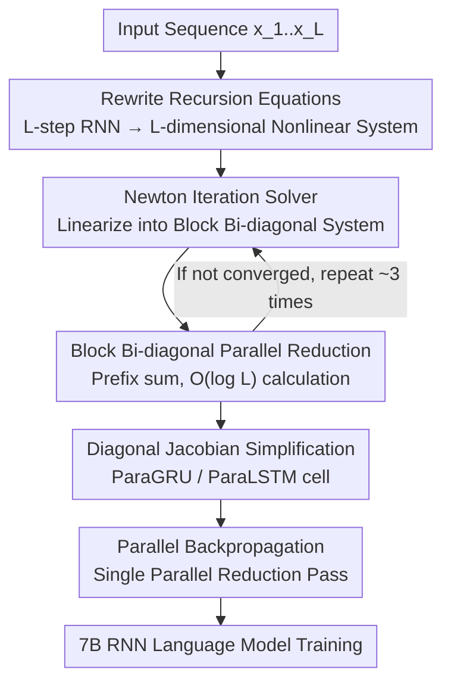

# ParaRNN: Unlocking Parallel Training of Nonlinear RNNs for Large Language Models

**Conference**: ICLR 2026  
**OpenReview**: [https://openreview.net/forum?id=mX8b64iUaa](https://openreview.net/forum?id=mX8b64iUaa)  
**Code**: https://github.com/apple/ml-pararnn/  
**Area**: LLM Efficiency / Sequence Modeling Architectures  
**Keywords**: Nonlinear RNN, Sequence Parallelism, Newton Iteration, Parallel Reduction, Language Modeling

## TL;DR
The authors recast the sequential recursion of nonlinear RNNs into a system of $L$ nonlinear equations, solved simultaneously using Newton iteration combined with block bi-diagonal parallel reduction. This enables classic nonlinear RNNs (GRU/LSTM) to be trained in parallel along the sequence length for the first time—achieving up to 665× speedup over naive sequential application and resulting in 7B-scale RNN language models with competitive perplexity against similarly sized Transformer and Mamba2 models.

## Background & Motivation
**Background**: Transformers replaced classic RNNs like GRU/LSTM because attention can be computed in parallel across the sequence length, ensuring high training efficiency. Recently, State Space Models (SSMs, e.g., Mamba/Mamba2) have gained popularity due to lower memory usage and faster inference. Their ability to parallelize training relies on **constraining the recursion to be linear with respect to the hidden state**, allowing for the use of associativity and parallel scans (prefix sums).

**Limitations of Prior Work**: Linearity is a compromise made for parallelism rather than a necessity for modeling. Theoretical works have pointed out that purely linear recursions face an expressivity hard cap, struggling to model complex, cross-step nonlinear dependencies (e.g., state-tracking tasks). Essentially, the field has abandoned "nonlinear recursion" to pursue training efficiency.

**Key Challenge**: The RNN recursion $h_l = f(h_{l-1}, x_l)$ is inherently sequential and must be unrolled along the sequence length, preventing parallelism. To achieve parallelism, $f$ is usually forced to be linear in $h$, which sacrifices expressivity. A direct conflict exists between expressive power and parallelizability.

**Goal**: Enable parallel training of any (Markovian) nonlinear RNN along the sequence length **without sacrificing nonlinear expressivity**, and scale this method to LLM (7B) sizes to verify its competitiveness.

**Key Insight**: The authors draw inspiration from "Parallel-in-Time" methods for solving Ordinary Differential Equations (ODEs). Since sequential solving stems from step-by-step dependency, one can instead treat all steps as a **single large coupled system of equations** and approximate the solution using iterative methods. Specifically, the $L$-step RNN recursion is viewed as a nonlinear system with $L$ unknown hidden states, solved via Newton's method.

**Core Idea**: Replace "step-by-step sequential unrolling" with "Newton iteration + parallel reduction for block bi-diagonal linear systems." This transforms the forward pass of a nonlinear RNN from $O(L)$ serial complexity to $O(\log L)$ parallel complexity.

## Method

### Overall Architecture
ParaRNN addresses the fundamental barrier preventing nonlinear RNNs from parallel training. Every sequence $[x_l]_{l=1}^L$ is no longer fed into the cell step-by-step. Instead, the $L$ recursive relations are **collected into a global system of nonlinear equations** and solved via Newton iteration. Because of the Markovian property of RNNs, the linearized system solved in each Newton step is **block bi-diagonal**, which can be solved efficiently in a single pass using parallel reduction (prefix sum). The forward pass consists of an outer Newton loop containing an inner parallel reduction; the backward pass is simpler as it is inherently linear and requires only a single parallel reduction pass. To make this practical, the authors simplify the Jacobian of GRU/LSTM to a diagonal structure and provide optimized PyTorch+CUDA implementations.

### Key Designs

**1. Rewriting sequential recursion as a system of equations solved via Newton iteration**

This directly targets the pain point of sequential unrolling. The $L$ recursive relations $h_l = f(h_{l-1}, x_l),\ l=1\dots L$ are combined into a nonlinear system $h_l - f(h_{l-1}, x_l) = 0$ where $[h_l]_{l=1}^L$ are the unknowns. Using Newton's method: given a $k$-th approximate solution, the linearized system is solved to find the increment $\delta h_l^k$, and $h_l^{k+1} = h_l^k + \delta h_l^k$ is updated until convergence. The coefficient matrix for the linearized system features an identity matrix on the main diagonal and the Jacobian $-J_f|_{h_l^k}$ on the sub-diagonal:

$$\delta h_l^k = J_f|_{h_l^k}\,\delta h_{l-1}^k + \big(f(h_{l-1}^k, x_l) - h_l^k\big)$$

Critically, while Newton's method theoretically requires $L$ steps for guaranteed convergence, the authors find that for the RNN cells used, **3 iterations are sufficient in all cases**. By making the iteration count a constant $O(1)$, parallelism becomes viable.

**2. Solving block bi-diagonal linear systems with parallel reduction**

Simply rewriting the problem as equations is insufficient if the linearized system is solved via sequential forward substitution, which would revert to $O(L)$ complexity. The increment recursion $\delta h_l = J_f|_{h_l}\delta h_{l-1} + r_l$ (where the residual $r_l = f(h_{l-1}^k, x_l) - h_l^k$) **is itself a linear RNN**, where the Jacobian $J_f$ acts as the transition matrix and the residual $r_l$ as the input. Linear recursions satisfy associativity, and when expanded:

$$\delta h_l^k = \sum_{s=1}^{l}\Big(\prod_{r=0}^{l-s-1} J_f|_{h_{l-r}^k}\Big) r_s$$

The redundancy in the product terms across different $l$ allows the entire sequence $[\delta h_l^k]_{l=1}^L$ to be computed in $O(\log_2 L)$ steps via parallel reduction (prefix sums). This is the core algorithm for parallelizing what appears to be a sequential system. Notably, this framework naturally subsumes linear SSMs: if $f$ is linear, the Jacobian is the transition matrix itself, Newton's method converges in one step, and the process reverts to a standard SSM scan.

**3. Diagonal Jacobian simplification and ParaGRU / ParaLSTM cells**

Parallel reduction is bottlenecked by repeated multiplications of the Jacobian $\prod J_f|_{h_l}$. Using dense Jacobians would require $O(L d_h^2)$ memory and $O(d_h^3)$ per multiplication, which is unscalable. Instead of **approximating** the Jacobian (which can degrade training dynamics), the authors **modify the cell definition to have an inherently simple Jacobian**. In ParaGRU/ParaLSTM, all state matrices $A_*$ and peephole matrices $C_\star$ are constrained to be diagonal. Consequently, the ParaGRU Jacobian becomes a diagonal matrix, and the ParaLSTM Jacobian (with state $[c_l, h_l]$) becomes a $2\times2$ block-diagonal structure. This reduces memory to $O(L d_h)$ and multiplication to $O(d_h)$, enabling dimension-wise parallelism. While this restricts some state interaction and slightly reduces expressivity, the framework can theoretically support any Jacobian structure that allows efficient parallel reduction.

**4. Single-pass parallel reduction for backpropagation**

While the forward pass requires multiple Newton iterations due to nonlinearity, backpropagation is a **linear** operation. It does not require Newton iteration and can be completed in a single parallel reduction pass. Given the loss gradients with respect to hidden states $[\partial_{h_l}\mathcal{L}]$, the gradient recursion is:

$$\nabla_{h_{l-1}}\mathcal{L} = J_f|_{h_{l-1}}^\top \nabla_{h_l}\mathcal{L} + \partial_{h_{l-1}}\mathcal{L},\quad l = L,\dots,1$$

This matches the structure of the forward linear increment equation (using the transposed Jacobian and backward expansion), allowing the reuse of the same parallel reduction algorithm. Thus, both forward and backward passes enjoy $O(\log L)$ parallelism.

### Loss & Training
Standard next-token prediction language modeling is used. The authors replace attention in the DCLM Transformer backbone with their RNN cells, retaining causal convolutions and gated residual layers from Mamba. Training is performed on the SlimPajama dataset (excluding Books3) at 400M, 1B, 2.9B, and 7B scales using Chinchilla-optimal settings for comparison with Transformer and Mamba2.

## Key Experimental Results

### Main Results (7B Language Models)

| Model | Parameters | PPL↓ | HSwag(0) | PiQA(10) | WinoG(0) | MMLU(0) |
|------|-----------|------|----------|----------|----------|---------|
| Mamba2 | 6.96B | **8.62** | 69.68 | 76.66 | 63.77 | **26.61** |
| ParaGRU | 6.76B | 9.19 | 65.75 | 76.66 | 59.83 | 25.29 |
| ParaLSTM | 6.76B | 9.16 | 62.85 | 75.19 | 59.12 | 25.31 |
| Transformer (DCLM) | 6.89B | 9.55 | 62.20 | 74.97 | 60.85 | 23.12 |

ParaGRU/ParaLSTM outperform the DCLM Transformer baseline while trailing slightly behind Mamba2. The results demonstrate that classic nonlinear RNNs, when scaled to 7B, are competitive with modern architectures.

### Speed and Parallelism

| Comparison | Result |
|------------|--------|
| RNN cell application vs naive sequential ($L=2^9$) | Up to **665×** acceleration (ParaLSTM); ParaGRU >447× |
| Fused CUDA forward vs Mamba ($L=2^9$) | ParaGRU **2.6×**, ParaLSTM **1.5×** acceleration |
| Inference Throughput | ParaGRU ~38 tkn/s, ParaLSTM ~37 tkn/s (vs Mamba2 ~28); independent of sequence length |
| Parallel Reduction Complexity | $O(\log L)$ (verified via logarithmic growth in PyTorch timings) |

### Ablation Study on Expressivity (Single-layer Synthetic Tasks, Tab. 1)

| Model | Cycle Nav | Mod Arithm | A5 |
|-------|-----------|-----------|-----|
| Original LSTM/GRU (Dense Jacobian) | 100% | 100% | 100% |
| ParaLSTM (Diagonal) | 95% | 94% | 38% |
| ParaGRU (Diagonal) | 90% | 63% | 40% |
| Mamba2 (Linear) | 57% | 44% | 36% |

### Key Findings
- **Nonlinearity is Essential**: ParaGRU/ParaLSTM consistently outperform the linear Mamba2 on synthetic tasks, proving that nonlinear recursions provide expressivity that linear SSMs lack.
- **Diagonal Constraint is a Bottleneck**: The performance drop in tasks like A5 is due to the "diagonalization" rather than the RNN architecture itself, as dense-Jacobian RNNs achieve 100% accuracy.
- **Block vs. Diagonal Overheads**: ParaLSTM's $2\times2$ block-diagonal reduction is more memory and compute-intensive than ParaGRU's purely diagonal reduction.

## Highlights & Insights
- **Sequence Parallelism as Equation Solving**: Translating the sequential dependency problem into a numerical linear algebra problem (Newton + Parallel Reduction) is a major conceptual leap that naturally yields Mamba-style scans for the linear case.
- **Designing the Cell for the Solver**: Instead of approximating the Jacobian (which can destabilize training), the authors designed the cell architecture to yield a sparse Jacobian that allows exact parallel reduction, ensuring stable training.
- **Empirical Convergence**: The finding that 3 Newton iterations suffice is a key engineering insight that keeps the parallelization beneficial.
- **Open-source Contribution**: The ParaRNN library allows users to define a cell's recursion let autograd assemble the Jacobian and solve it in parallel, lowering the barrier for exploring new nonlinear RNNs.

## Limitations & Future Work
- **Expressivity Trade-off**: Diagonal Jacobians inhibit interaction between hidden state dimensions, as seen in the A5 task. Using Householder or other structured matrices could be a solution.
- **Convergence Verification**: Newton convergence may vary for different cell types; new definitions require re-validation of the iteration count.
- **Block Compute Cost**: ParaLSTM is slower and uses more memory than ParaGRU due to the $2\times2$ block structure.
- **Performance Gap**: While competitive, there is still a gap to Mamba2's perplexity (9.1 vs 8.6), which remains a target for optimization.

## Related Work & Insights
- **vs. Mamba/SSM**: SSMs achieve parallelism by enforcing linearity. ParaRNN acts as a strict superset of SSMs, removing the linearity constraint while incurring a cost for Newton iterations.
- **vs. minGRU/minLSTM, xLSTM**: minGRU/minLSTM use linear state transitions; xLSTM's mLSTM is nonlinear but sequential or restricted by state size. ParaRNN is the first to truly parallelize nonlinear state recursion.
- **vs. Gonzalez et al. (2024)**: Previous work used quasi-Newton methods and approximated Jacobians for time-series forecasting. ParaRNN ensures exact gradients and extends the methodology to 7B-scale LLMs.

## Rating
- Novelty: ⭐⭐⭐⭐⭐ Elegant translation of sequence parallelism to nonlinear system solving.
- Experimental Thoroughness: ⭐⭐⭐⭐ Extensive scaling and synthetic benchmarks, though a small gap to Mamba2 persists.
- Writing Quality: ⭐⭐⭐⭐⭐ Clear derivations, pseudo-code, and honest analysis of trade-offs.
- Value: ⭐⭐⭐⭐⭐ Re-opens the path for nonlinear RNNs in the LLM era with an open-source framework.

<!-- RELATED:START -->

## Related Papers

- [\[ICLR 2026\] Unlocking Full Efficiency of Token Filtering in Large Language Model Training](unlocking_full_efficiency_of_token_filtering_in_large_language_model_training.md)
- [\[ICLR 2026\] Hierarchy Decoding: A Training-free Parallel Decoding Strategy for Diffusion Large Language Models](hierarchy_decoding_a_training-free_parallel_decoding_strategy_for_diffusion_larg.md)
- [\[ICLR 2026\] Learning to Parallel: Accelerating Diffusion Large Language Models via Learnable Parallel Decoding](learning_to_parallel_accelerating_diffusion_large_language_models_via_learnable_.md)
- [\[ICLR 2026\] AutoSP: Unlocking Long-Context LLM Training Via Compiler-Based Sequence Parallelism](autosp_unlocking_long-context_llm_training_via_compiler-based_sequence_paralleli.md)
- [\[ICLR 2026\] ReFusion: A Diffusion Large Language Model with Parallel Autoregressive Decoding](refusion_a_diffusion_large_language_model_with_parallel_autoregressive_decoding.md)

<!-- RELATED:END -->
