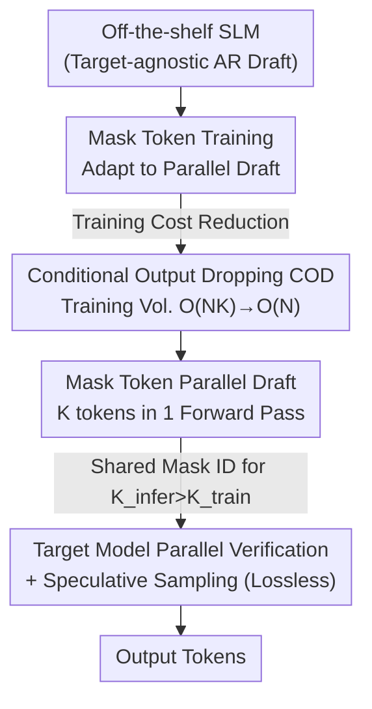

# PARD: Accelerating LLM Inference with Low-Cost Parallel Draft Model Adaptation

**Conference**: ICLR 2026  
**OpenReview**: [https://openreview.net/forum?id=XbOyv7iVGL](https://openreview.net/forum?id=XbOyv7iVGL)  
**Code**: https://github.com/AMD-AGI/PARD  
**Area**: LLM Efficiency / Speculative Decoding  
**Keywords**: Speculative Decoding, Parallel Drafting, Target-Agnostic, Mask Token, Training Acceleration  

## TL;DR
PARD transforms an off-the-shelf small language model into a target-agnostic draft model that outputs $K$ tokens in parallel in a single forward pass. By utilizing Conditional Output Dropping (COD), the training cost for this adaptation is reduced to $O(N)$. On vLLM, it enables LLaMA3.1-8B to reach 264.88 tokens/s, which is $3.67\times$ faster than autoregressive generation and $1.15\times$ faster than EAGLE-3.

## Background & Motivation
**Background**: Speculative Decoding (SD) is the mainstream approach to accelerating LLM inference. It uses a lightweight draft model to predict several candidate tokens, which are then verified in parallel by a larger target model in a single forward pass, bypassing the memory bandwidth bottleneck of "one token per forward pass" while ensuring lossless output distribution through speculative sampling. Within this field, the EAGLE series achieves a strong speedup ratio by feeding intermediate features of the target model into the draft head, making it the de facto SOTA.

**Limitations of Prior Work**: High-precision methods like EAGLE, Medusa, LayerSkip, and Kangaroo are **target-dependent**—the draft models either take output features from the target model or reuse several target layers, tying the draft and target models together. Every time the target model changes (even within the same family, e.g., 8B→70B→405B), a dedicated draft head must be retrained, incurring massive adaptation and deployment costs. Specifically, the compute overhead for training EAGLE-3 is particularly high.

**Key Challenge**: High precision relies on "training closely with the target model," but the tighter the integration, the higher the migration cost. Alternatively, vanilla SD uses an independent small model (e.g., LLaMA3.2-1B) as a draft. This is **target-agnostic** with near-zero migration costs, and empirical tests show its first-token acceptance rate is even higher than EAGLE's. However, its drafting phase requires $K$ autoregressive forward passes, causing the draft itself to slow down the overall process, often resulting in speeds lower than EAGLE.

**Goal**: To break away from the "target-dependent" paradigm by creating a draft solution that is **target-agnostic, fast, accurate, and has low adaptation costs**. This involves solving two sub-problems: (1) how to enable an independent small draft model to output $K$ tokens in parallel in a single forward pass to eliminate drafting latency; (2) how to "teach" a standard autoregressive small model to perform parallel prediction at a low cost.

**Key Insight**: Since the drafting precision of vanilla SD is already high enough, the missing piece is drafting speed. By converting it from autoregressive to parallel—similar to Mask-Predict—using mask tokens as placeholders to cut dependencies between tokens, $K$ future tokens can be predicted simultaneously in one forward pass.

**Core Idea**: Transform an off-the-shelf small LLM into a target-agnostic draft model (PARD) that outputs $K$ tokens in parallel via mask tokens, and use Conditional Output Dropping (COD) to compress the training token volume for this adaptation from $O(N\cdot K)$ back to $O(N)$.

## Method

### Overall Architecture
PARD starts with an **off-the-shelf, target-agnostic** small language model (e.g., LLaMA3.2-1B, Qwen2.5-0.5B). Since it is a high-precision autoregressive (AR) model, it can serve as a draft for an entire target family. The issue is that AR drafting requires $K$ forward passes, with each round taking $T_{\text{ARdraft}} = K\cdot T_D + T_T$. PARD introduces two improvements: on the inference side, it uses mask tokens to enable the draft to **output $K$ tokens in parallel in one forward pass**, reducing drafting time to $T_{\text{PARD}} = T_D + T_T$ (reducing latency to $1/K$); on the training side, it uses mask token training to adapt the AR draft into a parallel draft, then applies COD to lower training costs. The modified draft is integrated into the standard SD workflow—drafting candidates, parallel verification by the target model, and ensuring losslessness through speculative sampling.

### Key Designs

**1. Target-Agnostic Draft: One Draft Model Accentuates an Entire Target Family**

To address the high adaptation costs of EAGLE, PARD uses an **independent off-the-shelf small LLM** as a draft without reading any features or intermediate layers from the target model. Thus, a single draft model can accelerate the entire LLaMA3 family (8B / 70B / 405B) indiscriminately (in experiments, one PARD draft serves three LLaMA3 and three Qwen targets), significantly lowering deployment barriers. This is feasible because the authors verified that independent small models do not lose drafting precision—LLaMA3.2-1B's first-token acceptance rate for LLaMA3.1-8B (0.944/0.895) is significantly higher than that of EAGLE heads; the only penalty was the multiple autoregressive passes, which the subsequent designs eliminate.

**2. Mask Token Parallel Draft: Continuous Prediction of $K$ Tokens in One Forward Pass**

The root cause of slow AR drafting is dependency between tokens. Following the Mask-Predict approach, PARD introduces a special placeholder $m_k$ to replace positions that would otherwise create dependencies, rewriting the joint distribution as:

$$P(x_n,\dots,x_{n+K-1}\mid x_0,\dots,x_{n-1};\theta_{\text{PARD}}) = P(x_n\mid x_{<n})\prod_{k=1}^{K-1}P(x_{n+k}\mid x_{<n}, m_0,\dots,m_{k-1}).$$

Because each step only depends on the real prefix and mask placeholders, all $K$ tokens can be calculated in the **same forward pass**, reducing the number of forward passes from $K$ to $1$. Combined with a carefully designed attention mask (ensuring queries see correct prefix KVs), training and inference consistency is maintained. This补 compensates for the "accurate but slow" drawback of independent drafts.

**3. Conditional Output Dropping (COD): Reducing Parallel Training Costs from $O(NK)$ to $O(N)$**

Mask token training splits a single sample into $K$ sub-tasks (predicting positions +1, +2, ..., +$K$), causing the training token volume to explode from $N$ to $K\times N$. COD's insight is that **earlier sub-tasks are more critical, and later sub-tasks can be selectively dropped**. It retains tokens for the $i$-th sub-task according to geometric decay, where the number of retained tokens is $N_i = N\cdot r^{i-1}$. Total training token volume becomes:

$$N_{\text{COD}}=\sum_{i=1}^{K}N\cdot r^{i-1}=N\frac{1-r^{K}}{1-r}<\frac{N}{1-r},$$

For example, when $r=0.5$, the total is compressed to approximately $2N$. The "conditional" aspect ensures that for every retained token, the **prefix KV remains complete** (prefix key-value integrity) during attention calculation, ensuring context representation is not lost despite dropping tokens. To prevent excessive dropping of late sub-tasks, a minimum retention rate $r_{\min}$ is added, resulting in $N_i'=N\cdot\max(r^{i-1}, r_{\min})$. This overall strategy reduces training complexity from $O(N\cdot K)$ to $O(N)$, making training $3\times$ faster than traditional mask prediction training, $7\times$ faster than EAGLE, and $10\times$ faster than EAGLE-3 with minimal accuracy loss.

**4. Shared Mask Token ID and Extrapolation: $K_{\text{infer}}$ can exceed $K_{\text{train}}$**

All prediction positions share the same mask token ID ($m_0=m_1=\dots=m_{K-1}$) instead of unique IDs per position. This design not only improves throughput (221.97 vs 218.05 tokens/s) but also grants "extrapolation ability." Since mask positions are no longer bound to specific indices, the draft length during inference can be larger than that used in training ($K_{\text{infer}}>K_{\text{train}}$). Experiments show performance stabilizes at $K_{\text{train}}\geq 8$, while $K_{\text{infer}}=12$ is optimal—one can train at $K_{\text{train}}=8$ and gain additional speed by expanding the length at inference.

### Loss & Training
Each sub-task is trained independently using cross-entropy. The loss for the $k$-th sub-task is:

$$L_k=\begin{cases}-\dfrac{1}{N}\sum_{i=1}^{N}\log P(x_i\mid x_0,\dots,x_{i-1};\theta_{\text{PARD}}), & k=1,\\[2mm]-\dfrac{1}{N-k+1}\sum_{i=k}^{N}\log P(x_i\mid x_0,\dots,x_{i-k}, m_0,\dots,m_{k-2};\theta_{\text{PARD}}), & k>1.\end{cases}$$

Training is conducted on 8×MI250X using the TRL framework for 4 epochs with hyperparameters $k=8$, $r=0.7$, and $r_{\min}=0.2$. The smallest variant of each model family is chosen as the draft and trained on matching instruction datasets (Magpie-Llama-3.1-Pro + Evol-CodeAlpaca for LLaMA3, corresponding Magpie for Qwen2.5, OpenR1-Math for DeepSeek-R1-Qwen, etc.).

## Key Experimental Results

### Main Results
Evaluations were performed on the industrial-grade vLLM framework using A100-40GB. Metrics include Tokens/s and speedup relative to AR.

| Target Model | Method | HumanEval TPS | HumanEval Gain | Avg Gain |
|--------|------|------|------|------|
| LLaMA3.1-8B | AR | 73.07 | 1.00× | 1.00× |
| LLaMA3.1-8B | VSD | 155.47 | 2.13× | 1.84× |
| LLaMA3.1-8B | EAGLE | 136.05 | 1.86× | 1.58× |
| LLaMA3.1-8B | EAGLE-3 | 233.43 | 3.19× | 2.65× |
| LLaMA3.1-8B | **PARD** | **264.88** | **3.63×** | **3.00×** |
| Qwen2.5-7B | PARD | 285.82 | 3.76× | 3.18× |
| Qwen2.5-14B | PARD | 181.19 | 4.44× | 3.71× |

On code tasks, PARD achieves $3.20\times\sim4.44\times$ speedup, with an average of $2.65\times\sim3.71\times$. On LLaMA3.1-8B, it is approximately $1.9\times$ faster than EAGLE and $1.15\times$ faster than EAGLE-3. An overall speedup of $3.67\times$ relative to AR is reported.

### Ablation Study

| Configuration | Key Metric | Description |
|------|---------|------|
| Acceptance (PARD vs EAGLE-3) | 1-α 0.93 / 4-α 0.90 vs 0.87 / 0.85 (HumanEval) | PARD has a higher acceptance rate |
| Draft Phase Bandwidth (k=8) | 2.48 GB vs EAGLE 11.88 GB | PARD bandwidth is constant with $k$ |
| COD Retention $r$/$r_{\min}$ | $r{=}0.7, r_{\min}{=}0.2$ Best speed-accuracy balance | 3× faster training with no accuracy loss |
| Shared vs Independent Mask ID | 221.97 vs 218.05 tokens/s | Shared ID is superior and enables extrapolation |
| $K_{\text{train}}$ / $K_{\text{infer}}$ | $K_{\text{train}}{\geq}8$ stable, $K_{\text{infer}}{=}12$ optimal | Inference length can exceed training length |

### Key Findings
- **PARD wins on both ends**: It achieves a higher acceptance rate than the EAGLE series while maintaining constant bandwidth during the drafting phase (2.48 GB, independent of $k$). This combination leads to higher actual speedups, validating that "high acceptance + low bandwidth = high speedup."
- **COD is the key to low-cost adaptation**: Random dropping breaks prefix KV integrity and collapses accuracy, whereas COD retains KV integrity while dropping tokens via geometric decay, achieving $3\times$ training acceleration without precision loss.
- **Extrapolation is a free lunch**: Shared mask IDs allow $K_{\text{infer}}$ to exceed $K_{\text{train}}$. Training with 8 and inferencing with 12 yields "bonus" speed.
- **Diminishing returns with batch size**: As batch size increases from 1 to 16, the bottleneck shifts from memory to compute. PARD's speedup drops to $1.33\times\sim3.63\times$, indicating its primary benefit lies in alleviating memory bandwidth constraints.

## Highlights & Insights
- **Paradigm shift from "fitting the target" to "using a draft base"**: While others focus on making drafts closer to the target, PARD decouples them by using off-the-shelf high-precision small models. This reduces adaptation costs from "retraining for every target" to "one draft for the whole family"—a high-value engineering decoupling.
- **COD elegantly solves "expensive parallel training"**: By using geometric series $N(1-r^K)/(1-r)<N/(1-r)$, it converges $O(NK)$ to $O(N)$. The "conditional" preservation of KV integrity is the true reason accuracy is maintained.
- **Shared mask id → Extrapolation**: A small decision to share the ID results in the ability to "train short, infer long," a trick applicable to other multi-token prediction methods.
- **Alignment with industrial frameworks**: All results are tested on vLLM (rather than Transformers), noting that Transformers' inefficiency can inflate relative speedups, making these figures more credible.

## Limitations & Future Work
- **Dependency on high-quality small models**: PARD assumes the existence of a high-precision small LLM in the target family; if none exists, the target-agnostic premise fails.
- **Shrinking gains under large batches**: Acceleration drops to around $1.33\times$ when inference becomes compute-bound, reducing its appeal for high-concurrency scenarios.
- **Draft precision capped by small models**: Although acceptance is higher than EAGLE, the total decoupling means target features are not utilized, which might hurt robustness in long-tail or out-of-distribution scenarios.
- **Potential improvements**: Making COD decay adaptive (tuning $r$ based on task difficulty) or exploring a middle ground of target-agnostic drafts with lightweight target feature injection.

## Related Work & Insights
- **vs EAGLE / EAGLE-3**: EAGLE uses target features for high precision but is target-dependent and compute-heavy; PARD is target-agnostic, $7\sim10\times$ more training-efficient, and has a higher acceptance rate (0.93 vs 0.87) at the cost of ignoring target features.
- **vs Vanilla SD (VSD)**: Both are target-agnostic with high precision, but VSD is slow due to $K$ AR passes; PARD compresses this to one pass, proving $1.72\times$ faster on LLaMA3.1-8B.
- **vs PaSS / BiTA / ParallelSpec**: These use mask tokens for parallel decoding but remain target-dependent; PARD applies this to independent small models.
- **vs Medusa**: Medusa adds decoding heads to the target model (target-dependent); PARD uses an external draft that is universal for the family.

## Rating
- Novelty: ⭐⭐⭐⭐ The combination of target-agnostic parallel drafting and COD is clear and practical.
- Experimental Thoroughness: ⭐⭐⭐⭐ Covers multiple families (LLaMA3/Qwen/DeepSeek), tasks, and batches on vLLM.
- Writing Quality: ⭐⭐⭐⭐ Clear motivation, good visualizations, and concise COD derivation.
- Value: ⭐⭐⭐⭐⭐ Significantly lowers the adaptation cost of speculative decoding, making it highly attractive for industrial deployment.

<!-- RELATED:START -->

## Related Papers

- [\[ICLR 2026\] SpareTrain: Fault-Tolerant LLM Training via Low-Cost Dual Modular Redundancy](sparetrain_fault-tolerant_llm_training_via_low-cost_dual_modular_redundancy.md)
- [\[ICLR 2026\] FlashDLM: Accelerating Diffusion Language Model Inference via Efficient KV Caching and Guided Diffusion](flashdlm_accelerating_diffusion_language_model_inference_via_efficient_kv_cachin.md)
- [\[ICLR 2026\] Inference-Cost-Aware Dynamic Tree Construction for Efficient Inference in Large Language Models](inference-cost-aware_dynamic_tree_construction_for_efficient_inference_in_large_.md)
- [\[ICLR 2026\] Universal Model Routing for Efficient LLM Inference](universal_model_routing_for_efficient_llm_inference.md)
- [\[ICLR 2026\] RepSpec: Structural Re-parameterized Draft Model Training for Speculative Decoding](repspec_structural_re-parameterized_draft_model_training_for_speculative_decodin.md)

<!-- RELATED:END -->
