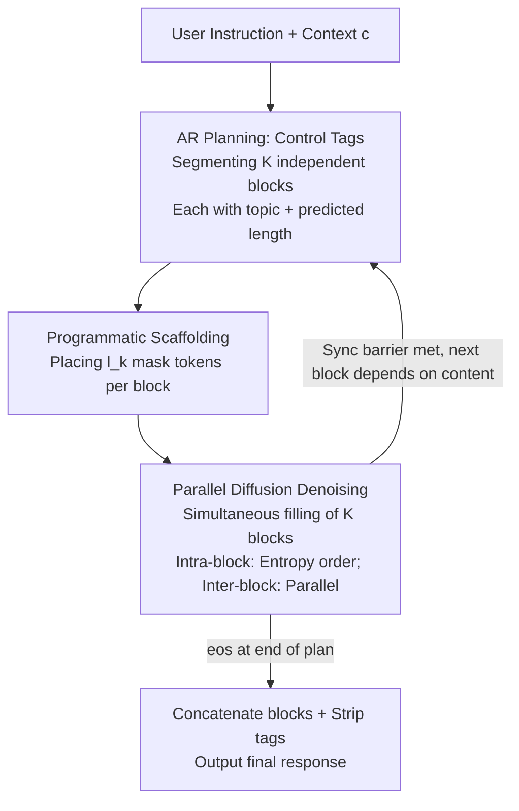

# Planned Diffusion

**Conference**: ICLR 2026  
**OpenReview**: [https://openreview.net/forum?id=wZN8debH4W](https://openreview.net/forum?id=wZN8debH4W)  
**Code**: To be confirmed  
**Area**: LLM Efficiency / Text Generation / Diffusion Models  
**Keywords**: Discrete Diffusion Language Models, Parallel Generation, Denoising Order, Semantic Parallelism, Quality-Latency Trade-off  

## TL;DR
The model first generates a "plan" autoregressively to partition the response into several semantically independent blocks, and then performs parallel diffusion denoising on all blocks. This allows the model to determine its own denoising order. On AlpacaEval, it achieves a $1.27\times$ to $1.81\times$ speedup relative to autoregressive models with only a $0.87\%$ to $5.4\%$ win rate drop, refreshing the quality-latency Pareto frontier for discrete diffusion parallel generation.

## Background & Motivation
**Background**: Current mainstream large language models are autoregressive (AR)—decoding one token at a time, where the $i$-th token must wait for all preceding tokens. This token-by-token serial dependency is the fundamental bottleneck for inference latency. Discrete Diffusion Language Models (dLLM) take a different path: multiple masked tokens can be decoded in parallel at each step, theoretically shortening serial steps significantly.

**Limitations of Prior Work**: Sampling from a diffusion model requires a "denoising order," deciding which positions to decode at each step. Identifying an optimal denoising order is difficult. Existing methods rely on heuristics—random ordering or greedy decoding based on confidence thresholds (e.g., Fast-dLLM). These heuristics create a steep trade-off: aggressive parallel decoding ruins quality, while quality preservation forces serial-like step-by-step decoding.

**Key Challenge**: The denoising order determines which tokens can truly be decoded in parallel without mutual interference. Heuristic orders are content-agnostic and cannot identify "semantically independent tokens." However, responses naturally contain semantically independent blocks—such as bullets in a list. Existing diffusion models only focus on token-level parallelism and fail to exploit this "block-level" semantic independence.

**Goal**: Enable the model to learn to determine its own denoising order. Specifically: (1) How to identify semantically independent blocks; (2) How to make the same model perform both planning and parallel denoising; (3) How to provide adjustable quality-latency knobs during inference.

**Key Insight**: The authors observe that since "deciding the denoising order" is a serial decision requiring global semantic understanding, AR should be used for this task (generating a structured plan), while the parallelizable task of "filling content" should be delegated to diffusion. Thus, a single model switches between two generation paradigms.

**Core Idea**: Replace heuristic denoising orders with "autoregressive planning followed by parallel diffusion filling"—letting the model segment the response into semantically independent blocks (the plan defines the denoising order) and then performing simultaneous diffusion denoising across all blocks.

## Method

### Overall Architecture
Planned Diffusion utilizes **a single model** alternating between AR and diffusion modes. Each iteration consists of a "planning phase + diffusion phase," where subsequent iterations can be conditioned on previous outputs. Given context $c$: In the first phase, the model **autoregressively** outputs a plan $z$ composed of structured control tags that segment the response into $K$ semantically independent blocks, each with a semantic description and predicted lengths $l_1,\dots,l_K$. In the second phase, the plan is translated into a "scaffolding"—placing the corresponding number of mask tokens for each block—after which the model performs **parallel diffusion denoising** across all blocks to generate content. Once all blocks are filled, they are concatenated, and control tags are stripped from the final output.

The rationale is that the plan is AR-generated, allowing the model to take a global view and **define the denoising order** using structural tags, while the content is filled via diffusion, enabling true parallelism between blocks. This "single-model hybrid" avoids the need for a separate draft model as required by speculative decoding.

### Key Designs

**1. Control Tags: Using a structured language for explicit denoising order**

To allow the model to define its own parallel structure, a language is needed that can be both generated by the model and parsed by the runtime. The authors design three types of control tags: `<topic>...</topic>` pairs in the planning phase contain short semantic descriptions (e.g., "definition") and predicted lengths (e.g., 30 tokens); `<async>...</async>` tags in the diffusion phase wrap the actual tokens of each block, marking them for parallel denoising; and `<sync/>` acts as a synchronization barrier, indicating that subsequent tokens depend on previous async block details. All control tags are added to the vocabulary for training and inference. The essence of these tags is to transform the denoising order from an external heuristic into discrete symbols generated by the model.

**2. Composite Denoising Order: Decoupling inter-block and intra-block orders**

Once plan $z$ is fixed, the indices $[L]$ are partitioned into $K$ segments $s_1,\dots,s_K$. Each block can have its own internal denoising order $\sigma^{(k)}=(\sigma^{(k)}_1,\dots,\sigma^{(k)}_{T_k})$. Planned Diffusion **decouples and then combines** the "inter-block outer order" and "intra-block inner order": at step $t$, it simultaneously reveals the $t$-th inner subset for all blocks where $T_k \ge t$,
$$\sigma^{\text{Plan}}_t(z)=\bigcup_{\{k:\,T_k\ge t\}}\sigma^{(k)}_t,\quad t=1,\dots,\max_k T_k$$
The overall joint distribution is factored into planning and diffusion:
$$p_{PD}(z,x\mid c;\sigma^{\text{Plan}}(z))=\underbrace{p_{AR}(z\mid c)}_{\text{Planning}}\cdot\underbrace{p_D\big(x\mid z,c;\sigma^{\text{Plan}}(z)\big)}_{\text{Diffusion}}$$
Since the diffusion objective decomposes over positions, this decoupling is "free." In experiments, intra-block decoding uses entropy order $\sigma^{\text{Ent}}$, while inter-block decoding is fully parallel. This reduces serial steps from total length $n$ to the maximum block length $l_{\max}$.

**3. Dual-Objective Training + Mode-Specific Attention Masking**

Training involves optimizing both the "autoregressive likelihood of planning tokens" and the "diffusion likelihood of content tokens" on the same tagged dataset. A clean sample $Y$ is split into planning tokens $Z$ and content tokens $X$, with content randomly masked as $X_t$. The total objective is the sum of two cross-entropy terms:
$$\mathcal{L}(\theta)=\mathbb{E}_{Y,t}\frac{1}{|Y|}\sum_{y_i\in Y}\Big[\underbrace{\mathbf{1}(y_i\in Z)\,\text{CE}(f_\theta(y_{<i},i),y_i)}_{\text{AR}}+\underbrace{\tfrac{1}{t}\mathbf{1}(y_i\in X)\,\text{CE}(f_\theta(M_i(X_t\cup Z),i),y_i)}_{\text{Diffusion}}\Big]$$
A crucial **attention mask** $M_i$ distinguishes the modes: planning tokens use **causal attention**, while diffusion tokens use **bidirectional attention**. A variant, PDSA (Planned Diffusion Sparse Attention), uses block-sparse attention to confine bidirectional attention within each block, forcing complete inter-block independence to improve computational efficiency at the cost of some expressivity.

**4. Variable Length Denoising + Step Ratio: A continuous knob for quality-latency**

Standard diffusion uses fixed denoising steps, but in Planned Diffusion, block lengths vary. The authors introduce a step ratio $r$ such that denoising steps $s = r \cdot \max_k l_k$. Higher $r$ increases quality but slows speed. Training also involves inserting 0–10 random padding tokens in `<async>` blocks to allow the model to generate variable lengths shorter than the mask input. During inference, $r$ and the confidence threshold $\tau$ provide a smooth curve for quality-latency trade-offs.

### Loss & Training
The model is a fine-tuned Dream-7B-Base. Training uses AdamW with a peak learning rate of $5\times10^{-5}$, linear decay, bf16, and a global batch size of 4 on 4×H200. Data is automatically labeled with control tags using Gemini on the SlimOrca instruction-tuning set. Epochs $\{2, 4, 8, 16\}$ were scanned due to differing optimal epochs for AR and diffusion.

## Key Experimental Results

### Main Results
Quality was measured by **Length-Controlled Win Rate (LCWR)** on AlpacaEval (805 prompts), with latency measured by wall-clock time. The LCWR baseline is fixed to the best 16-epoch AR model (50.0%).

| Method | LC Win Rate | Relative AR Speedup | Notes |
|------|---------|--------------|------|
| Autoregressive (AR) | 50.0% | 1× | Baseline |
| Diffusion | 52.6% | 0.04× (25× Latency) | High quality but extremely slow |
| Fast-dLLM | 40.2% | — (PD is 22.4× faster) | Heuristic confidence threshold |
| **Planned Diffusion (PD)** | **49.2%** | **1.27×** | Main proposed method |
| **PD-Sparse Attention (PDSA)** | **43.7%** | **1.81×** | Sparse attention variant |
| Skeleton-of-Thought | Lower | Slightly faster | Significant quality drop |

Ours achieves a $22.4\times$ speedup over Fast-dLLM with higher quality ($44.6\%$ vs $40.2\%$). PD and PDSA form a new Pareto frontier on the quality-latency plane.

### Ablation Study

| Config (4 epoch) | LC Win Rate | Latency | Notes |
|------|---------|------|------|
| Full PD | 46.65% | 3.23 s | Baseline |
| w/o `topic` attribute | 23.33% | 3.54 s | Quality collapses; topic is vital |
| w/o `<sync/>` tag | 42.96% | 5.81 s | Quality drop; latency actually increases |

Critical path analysis: AR average critical path is 367.3 steps, while PD is only 160.0 steps ($2.3\times$). Actual wall-clock speedup ($1.85\times$) is lower due to higher per-step computation (low KV-cache reuse).

### Key Findings
- **Topic description is the lifeline of quality**: Removing the topic attribute causes LCWR to crash from $46.65\%$ to $23.33\%$.
- **`<sync/>` is a trade-off point**: Removing it lowers quality and surprisingly increases latency, indicating it ensures dependency correctness in this setup.
- **Length prediction is accurate**: Scanning predicted lengths by multipliers $\{0.5, \dots, 2.5\}$ shows quality peaks at $1.0$.
- **Diffusion benefits more from compute**: AR quality plateaus across 2–16 epochs, whereas PD and pure Diffusion show consistent gains as training scale increases.

## Highlights & Insights
- **Delegating tasks to the most suitable paradigm**: AR handles global serial planning, while Diffusion handles parallel filling. This "paradigm distribution" is clean and transferable.
- **First work to train diffusion and AR objectives simultaneously** in a pure text model without requiring an external draft model to achieve speedups similar to speculative decoding.
- **Decoupling of denoising orders** allows any existing diffusion sampling strategy to be plugged into the blocks, creating additive acceleration effects.
- **Engineering-friendly knobs**: The combination of step ratio $r$ and threshold $\tau$ allows for precise resource allocation based on latency budgets.

## Limitations & Future Work
- **Dependency on annotation quality**: The upper bound of segmentation quality depends on the Gemini-based labeling. Low-quality topics severely degrade performance.
- **Speedup diluted by recomputation**: Wall-clock speedup ($1.85\times$) trails critical path reduction ($2.8\times$) because diffusion steps are computationally heavier and lack efficient KV-cache reuse.
- **Block independence assumption**: The method profits from semantically independent blocks. For tasks with high inter-block coupling (e.g., chain-of-thought math), the parallel space may be limited.
- **PDSA Trade-off**: The sparse attention variant is faster but lower in quality, suggesting a need for better ways to maintain independence without sacrificing expressivity.

## Related Work & Insights
- **vs Fast-dLLM / Base Diffusion**: These use **heuristics** for denoising orders. PD lets the model **generate its own plan**, providing better quality at lower latency.
- **vs Pasta-SFT / Skeleton-of-Thought**: These use semantic parallelism but rely on **AR** within blocks. PD is the first to use **diffusion** within blocks for further parallelism.
- **vs Speculative Decoding**: PD uses **one model** for both planning and generation, eliminating the need for a separate draft model.

## Rating
- Novelty: ⭐⭐⭐⭐⭐ First hybrid paradigm to use AR plans to define diffusion denoising orders in a single text model.
- Experimental Thoroughness: ⭐⭐⭐⭐ Strong comparison on AlpacaEval with extensive ablations, though limited to instruction following.
- Writing Quality: ⭐⭐⭐⭐⭐ Clear definitions and intuitive examples.
- Value: ⭐⭐⭐⭐ Establishes a new Pareto frontier for parallel generation with practical engineering knobs.

<!-- RELATED:START -->

## Related Papers

- [\[ICLR 2026\] FlashDLM: Accelerating Diffusion Language Model Inference via Efficient KV Caching and Guided Diffusion](flashdlm_accelerating_diffusion_language_model_inference_via_efficient_kv_cachin.md)
- [\[ICLR 2026\] Diffusion LLMs Can Do Faster-Than-AR Inference via Discrete Diffusion Forcing](diffusion_llms_can_do_faster-than-ar_inference_via_discrete_diffusion_forcing.md)
- [\[ICLR 2026\] Fast-dLLM v2: Efficient Block-Diffusion LLM](fast-dllm_v2_efficient_block-diffusion_llm.md)
- [\[ICLR 2026\] Diffusion Language Models Know the Answer Before Decoding](diffusion_language_model_knows_the_answer_before_it_decodes.md)
- [\[ICLR 2026\] Parallel Sampling from Masked Diffusion Models via Conditional Independence Testing](parallel_sampling_from_masked_diffusion_models_via_conditional_independence_test.md)

<!-- RELATED:END -->
