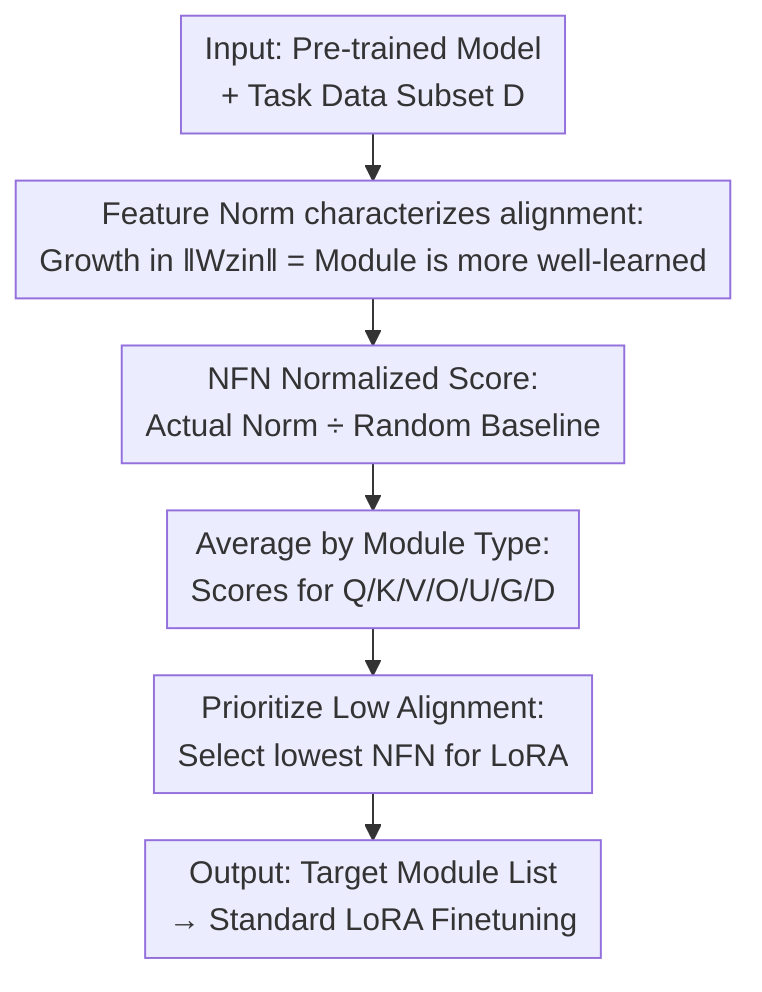

# PLoP: Precise LoRA Placement for Efficient Finetuning of Large Models

**Conference**: ICLR 2026  
**OpenReview**: [https://openreview.net/forum?id=3lGkVgNZ5a](https://openreview.net/forum?id=3lGkVgNZ5a)  
**Code**: TBD  
**Area**: LLM Efficiency / Parameter-Efficient Fine-Tuning  
**Keywords**: LoRA, adapter placement, parameter-efficient fine-tuning, module-data alignment, feature norm

## TL;DR
PLoP utilizes a gradient-free, near-zero-overhead "Normalized Feature Norm" (NFN) to automatically determine which module types should receive LoRA adapters. By placing adapters on modules with the lowest alignment to the task, PLoP consistently outperforms (or at least matches) common heuristics, such as "Attention-only" or "MLP-only," across both SFT and RL post-training scenarios.

## Background & Motivation

**Background**: LoRA is the most widely used parameter-efficient fine-tuning (PEFT) method for large models—freezing pre-trained weights and training only low-rank matrices $W + BA$ inserted into specific modules, significantly reducing memory and compute costs compared to full fine-tuning. Numerous improvements have targeted LoRA's learning rates, rank, initialization, and normalization. However, a frequently discussed but unresolved question remains: **which modules should the adapters be placed in?**

**Limitations of Prior Work**: In practice, selection is typically done by "module type" (e.g., `q_proj`, `v_proj`) rather than individual parameters. The original LoRA paper suggested insertion into Attention modules (Q/V), while He et al. (2021) found that some models perform better with adapters in the MLP. The original authors later admitted that "the optimal placement depends on the pre-trained model and the downstream task." Consequently, practitioners either follow heuristics or insert LoRA into all modules, which increases fine-tuning costs and defeats the primary purpose of LoRA.

**Key Challenge**: The ideal placement is task- and model-dependent. However, any importance selection method **relying on gradient scoring** (calculating full-model gradients to pick high-scoring modules) requires computing and storing gradients for all weights, which is exactly the overhead LoRA aims to avoid. This creates a tension between selection accuracy and cost: accurate methods are expensive, while cheap methods (heuristics) are inaccurate.

**Goal**: Given a model and a task, identify the module types for LoRA insertion with **minimal acceptable cost**. The authors quantify "practicality" through three constraints: (i) no gradients for full model parameters; (ii) no multiple forward passes with different configurations; (iii) no storage of large intermediate states or maintenance of cross-module states.

**Key Insight**: The authors start from a theoretical observation: during training, a module's **feature norm** $\|Wz_{in}\|$ grows, and the magnitude of this growth reflects the "alignment" between the module weights $W$ and its input features $z_{in}$. Higher alignment implies the module has already "mastered" the task through pre-training, leaving less room for adaptation. Conversely, weaker alignment indicates greater adaptation potential.

**Core Idea**: Use a normalized feature norm ratio (NFN) as a gradient-free probe for "module-task alignment," **inserting LoRA into module types with the lowest alignment and highest adaptation potential**.

## Method

### Overall Architecture

PLoP takes a pre-trained model and a small subset of task data as input and outputs a "list of target module types for LoRA." The pipeline involves only a few forward passes without gradient computation: it first calculates the actual feature norm $\|Wz_{in}\|$ for each module $W$ on the task data and divides it by a "same-norm random vector" baseline $\|W\tilde z_{in}\|$ to obtain NFN scores. It then averages scores by module type (Q, K, V, O, U, G, D) and **selects the types with the lowest scores** for adapter insertion. The computational cost of this selection process is approximately equal to a single batch prefill of 200 inputs, which can be integrated into the first step of fine-tuning with near-zero overhead.

### Key Designs

**1. Feature Norm for Alignment: Quantifying "Module Maturity" as an Observable Metric**

The theoretical foundation of PLoP is as follows: for a single trained module $z_{out}=Wz_{in}$, the gradient of the loss with respect to weights is $dW = dz_{out}\otimes z_{in}$. Under µP parameterization using a momentum-free Adam (SignSGD), a single update step is $W_{t+1}z_{in} = W_t z_{in} - \alpha\,\|z_{in}\|1\,S(dz_{out}^t)$, where $S(\cdot)$ is the sign function. Expanding the squared feature norm yields:

$$n^{-1}\|W_{t+1}z_{in}\|_2^2 = n^{-1}\|W_t z_{in}\|_2^2 + \eta^2 n^{-2}\|z_{in}\|_1^2 - 2\eta n^{-1}\|z_{in}\|_1\cdot n^{-1}\langle W_t z_{in}, S(dz_{out}^t)\rangle.$$

The critical term is the cross-product $n^{-1}\langle W_t z_{in}, S(dz_{out})\rangle$, which measures the correlation between features $W_t z_{in}$ and the "signed gradient." In the early stages of training when they are uncorrelated, this term is $O(n^{1/2})$ and negligible, leaving the positive term $\eta^2 n^{-2}\|z_{in}\|_1^2$ to dominate. Consequently, the **feature norm grows monotonically during training**. Experiments with a three-layer linear network confirm that the feature norm for real inputs increases, while it stays flat for random Gaussian inputs $\tilde z_{in}$ with the same norm. This confirms that "feature norm growth = enhanced alignment," and since alignment varies across layers and tasks, it can serve as a probe.

**2. NFN Normalized Score: Scale-Invariant Ratios via Random Baselines**

Comparing absolute $\|Wz_{in}\|$ values is meaningless because weight and input scales differ across modules. The observation that "random vectors do not grow in norm" provides a natural denominator. The authors define the **Normalized Feature Norm (NFN)**:

$$\mathrm{NFN}(W,x) = \frac{\|Wz_{in}(x)\|}{\|W\tilde z_{in}(x)\|},$$

where $\tilde z_{in}(x)$ is a random vector with the **same dimension and Euclidean norm** as $z_{in}(x)$, with i.i.d. Gaussian coordinates. The intuition is straightforward: NFN $>1$ when $W$ is significantly aligned with the input, and NFN $\approx 1$ otherwise. The authors prove that for sufficiently large widths, NFN approximates $\|Wz_{in}\|/(\|W\|_F\|z_{in}\|)$, making the random baseline equivalent to simultaneous normalization of $W$ and $z_{in}$. However, the definition using the random baseline is preferred for its intuitiveness. NFN reduces abstract "alignment" to a scale-invariant scalar that remains stable across model sizes.

**3. Low-Alignment Prioritization: Adapting Modules with the Most Potential**

With NFN, the selection rule follows two steps: Step 1 averages the NFN of the seven module types $T\in\{Q,K,V,O,G,U,D\}$ on task data; Step 2 **selects types with the lowest scores**. The assumption is that low-alignment modules are not yet "well-learned" for the task and thus have the highest plasticity. To validate this, the authors designed **PLoP$^{-1}$**, which selects modules with the highest NFN. In experiments, PLoP often selects combinations like V-O-D or V-O-U (favoring MLP/projections), while PLoP$^{-1}$ selects Q-K-G and consistently performs poorly, proving the discriminative power of the alignment score. This rule satisfies all three "practicality" constraints: gradient-free, single forward pass, and no intermediate storage. NFN is also robust to sampling size (Kendall $\tau \approx 1$ for $m \ge 64$).

## Key Experimental Results

The evaluation covers three post-training scenarios: SFT classification (ANLI), SFT text generation (MetaMathQA→GSM8K, AYA multilingual, CommonsenseQA), and GRPO reinforcement learning for mathematical reasoning. Models include various Llama, Qwen, and Gemma sizes. Baselines include Attn (Attention-only), MLP (MLP-only), ALL (all modules), Random, and PLoP$^{-1}$, with trainable parameters controlled for fairness.

### Main Results

| Scenario / Model | Metric | PLoP | MLP | Attn | PLoP$^{-1}$ |
|------|------|------|------|------|------|
| SFT Math Qwen3-0.6B (r=64) | GSM8K Acc | **62.0%** | 63.3% | 58.6% | 60.6% |
| SFT Math Qwen3-1.7B (r=64) | GSM8K Acc | **75.2%** | 75.0% | 69.5% | 74.6% |
| SFT Multilingual Llama-3.2-3B (Arabic) | Test NLL↓ | **0.843** | 0.955 | 2.05 | 2.13 |
| SFT CommonsenseQA Qwen2.5-7B | Test Acc | **88.6%** | 87.3% | 86.0% | 86.7% |
| GRPO Math Qwen3-1.7B (r=16) | GSM8K Pass@1 | **74.52%** | 73.61% | 71.49% | 71.41% |

Note: On Qwen3-0.6B, MLP is slightly higher than PLoP, but MLP used 22.0M parameters compared to PLoP's 18.4M. In 1.7B, multilingual, CommonsenseQA, and GRPO tests, PLoP leads with equivalent or fewer parameters. In GRPO, PLoP (V-O-D, r=16, 6.88M) even outperforms Attn (r=25, 7.17M) and MLP (r=16, 11.01M).

### Ablation Study

| Config | Meaning | Conclusion |
|------|------|------|
| PLoP (Lowest NFN) | Full method | Optimal in most scenarios; at worst matches MLP |
| PLoP$^{-1}$ (Highest NFN) | Inverse sanity check | Significantly worse; confirms NFN signal power |
| Attn (Q-K-V only) | Heuristic 1 | Significantly suboptimal on difficult tasks like Math |
| ALL (All modules) | Upper bound but expensive | Uses 1.5–1.8× parameters and often loses to PLoP/MLP |
| Subset size $m$ sensitivity | $m\in\{8,...,1024\}$ | Kendall $\tau \approx 1$ for $m \ge 64$; sample efficient |

### Key Findings
- **Low Alignment $\neq$ Attention**: In Llama-3.2, Q/K NFN is 2–3x higher than the baseline, while V/G/D/U scores stay closer to 1. PLoP thus shifts adaptation toward MLP/projection modules—consistent with He et al. (2021) and contradicting the original LoRA paper's "Attention" focus, effectively resolving this debate with an automated probe.
- **NFN Stability and Specialization**: Ranking remains stable across different model sizes (Llama-3.2 1B vs 3B). Specialty versions of Qwen2.5 (math/code) show higher overall NFN than general versions, supporting the idea that specialized training increases module-data alignment.
- **Near-Zero Cost**: The selection phase is equivalent to one prefill of 200 inputs, making it far cheaper than gradient-based scoring.

## Highlights & Insights
- Converting a theoretical byproduct (norm growth under µP) into an **engineering probe** that works with a single forward pass is an elegant bridge from theory to practical cost-saving.
- The use of a "same-norm random vector" as a normalization baseline is ingenious: it eliminates scale issues for both weights and inputs, providing a scale-invariant score comparable across models without extra calibration.
- The inclusion of the inverse PLoP$^{-1}$ as a control serves as both an ablation and a "falsification test" for the score—this self-contained sanity check is a model for rigorous experimental design.
- The intuition that "low alignment = high plasticity" could potentially extend to other PEFT selection problems (e.g., layer selection for prompt or prefix tuning).

## Limitations & Future Work
- The theoretical derivation relies on simplified assumptions: µP parameterization, momentum-free Adam (SignSGD), single-module training, and infinite width. Real training involves momentum and multi-module interactions, leaving a gap between theory and practice.
- For certain models (Qwen3, Gemma3), the Value module exhibits "negative alignment" (NFN $\approx 0.75$), which the authors currently leave unexplained.
- The selection granularity is limited to "module type" rather than individual modules, and the decision to pick the "lowest 3 types" lacks an adaptive threshold mechanism.
- Evaluations are primarily on small-to-medium models ($\le 32B$). Reliability on larger scales or multimodal models requires further verification.

## Related Work & Insights
- **vs. Original LoRA (Hu et al. 2022)**: Originally suggested Attention modules; PLoP uses NFN to show that these are often the most aligned and least needing of adaptation, providing a task-adaptive counterexample.
- **vs. He et al. (2021) MLP Placement**: He found MLP better empirically; PLoP explains *why* and *when* MLP is better using a unified probe, slightly outperforming it at equivalent parameter counts.
- **vs. Gradient Scoring (Zhang et al. 2024 / He et al. 2023)**: These rely on full gradients for importance ranking; PLoP is gradient-free and significantly more efficient.
- **vs. Alignment Measures (CTK alignment, Baratin et al. 2021)**: While also characterizing layer-task alignment, PLoP's feature-norm-based metric is lighter and more directly applicable to module selection.

## Rating
- Novelty: ⭐⭐⭐⭐ Transforms feature norm theory into a gradient-free probe, resolving long-standing placement debates.
- Experimental Thoroughness: ⭐⭐⭐⭐ Covers various SFT/RL scenarios and models, with rigorous parameter-controlled and inverse ablations.
- Writing Quality: ⭐⭐⭐⭐ Clear logic from intuition to method to results.
- Value: ⭐⭐⭐⭐ A near-zero-cost, plug-and-play tool for LoRA placement, highly practical for PEFT practitioners.

<!-- RELATED:START -->

## Related Papers

- [\[ICLR 2026\] Meta-UCF: Unified Task-Conditioned LoRA Generation for Continual Learning in Large Language Models](meta-ucf_unified_task-conditioned_lora_generation_for_continual_learning_in_larg.md)
- [\[ICLR 2026\] MiSS: Revisiting the Trade-off in LoRA with an Efficient Shard-Sharing Structure](miss_revisiting_the_trade-off_in_lora_with_an_efficient_shard-sharing_structure.md)
- [\[ICLR 2026\] BA-LoRA: Bias-Alleviating Low-Rank Adaptation to Mitigate Catastrophic Inheritance in Large Language Models](ba-lora_bias-alleviating_low-rank_adaptation_to_mitigate_catastrophic_inheritanc.md)
- [\[ICLR 2026\] LoRA-S: An Efficient Low Rank Adaptation scheme via Sylvester equation](lora-s_an_efficient_low_rank_adaptation_scheme_via_sylvester_equation.md)
- [\[ICLR 2026\] On-the-Fly Adaptation to Quantization: Configuration-Aware LoRA for Efficient Fine-Tuning of Quantized LLMs](on-the-fly_adaptation_to_quantization_configuration-aware_lora_for_efficient_fin.md)

<!-- RELATED:END -->
