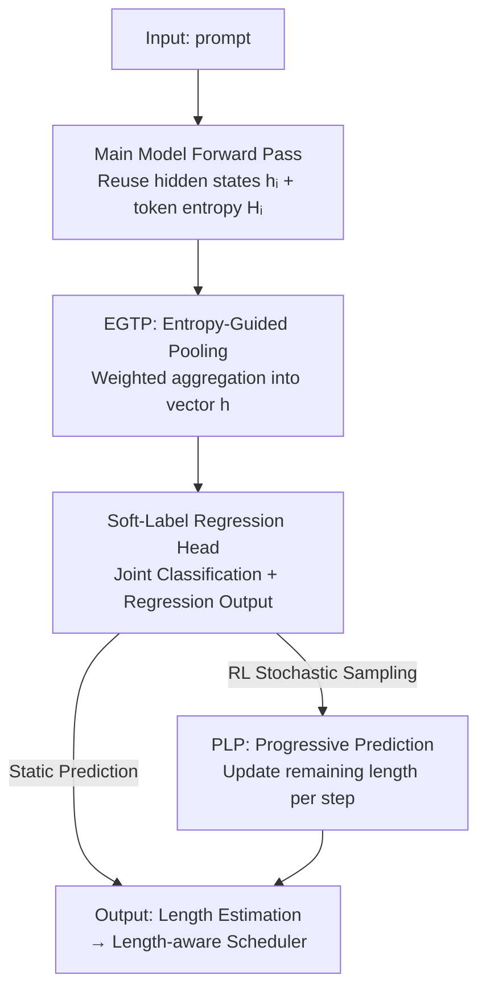

# Predicting LLM Output Length via Entropy-Guided Representations

**Conference**: ICLR 2026  
**OpenReview**: [https://openreview.net/forum?id=3loQDtveWI](https://openreview.net/forum?id=3loQDtveWI)  
**Code**: To be confirmed  
**Area**: LLM Efficiency  
**Keywords**: Output Length Prediction, Inference Scheduling, token entropy, soft-label regression, RL sampling

## TL;DR
Instead of training independent auxiliary models to predict LLM output length, this paper reuses the main model's own hidden states. It employs Entropy-Guided Token Pooling (EGTP) for static prediction and Progressive Length Prediction (PLP) to handle "one-to-many" stochastic generation in scenarios like RL sampling. The authors release ForeLen, the first length prediction benchmark containing long-sequence, CoT, and RL data, on which the Mean Absolute Error (MAE) of the strongest baseline is reduced by 29.16% on average, significantly improving end-to-end throughput.

## Background & Motivation
**Background**: In LLM serving and reinforcement learning (RL) sampling, throughput is primarily increased via batching—executing multiple requests in parallel to amortize scheduling and memory access overhead. However, output lengths within the same batch vary significantly. Since tensor shapes must align, short sequences are padded to the length of the longest one, causing a "straggler effect" where substantial compute is wasted on invalid padding. Predicting the output length of each request before or during early inference enables "length-aware scheduling," grouping requests of similar lengths to eliminate this waste.

**Limitations of Prior Work**: Existing length prediction methods generally attach a lightweight fine-tuned auxiliary model (e.g., DistilBERT, OPT) that predicts length based solely on the prompt. This design has three critical flaws: (i) **Failure in stochastic "one-to-many" scenarios**—in RL sampling such as GRPO, repeated sampling of the same prompt yields multiple candidates with vastly different lengths, making any prompt-only static estimation unreliable; (ii) **Poor precision and generalization**—these predictors are typically trained on datasets like LMSYS which lack long sequences or complex reasoning, causing them to fail in real-world long-text/reasoning scenarios; (iii) **Extra overhead**—every request requires a separate prediction model pass instead of reusing the rich hidden states already computed by the main model.

**Key Challenge**: Length signals are actually "hidden" within the main model—since the LLM determines when to output `<eos>`, signals related to the final length must be implicitly encoded in its internal activations. Existing methods bypass the main model to start from scratch, which is both expensive and inaccurate.

**Goal**: (1) High-precision static length prediction reusing main model activations without extra LLMs; (2) Reliable estimation under stochastic sampling via progressive updates; (3) Providing a truly challenging evaluation benchmark.

**Core Idea**: Use the main model's hidden states and token entropy for length prediction—employing EGTP for static pooling and PLP for step-wise refinement during decoding, rather than training an external predictor.

## Method

### Overall Architecture
The goal is to estimate how many more tokens the LLM will generate given a prompt (and previously generated tokens during stochastic sampling) to feed a length-aware scheduler. The pipeline is entirely parasitic on the main model's forward pass: during inference, each input token leaves a hidden state $h_i$, and the entropy $H_i$ is calculated from the next-token distribution. **EGTP** uses entropy as attention weights to aggregate the sequence of hidden states into a single vector $h$. This $h$ is fed into a **Soft-Label Distribution Regression Head**, which outputs both a categorical distribution and a regression value for the static length estimate. For stochastic RL sampling where lengths vary for the same prompt, **PLP** concatenates hidden states of generated tokens at each step to repeatedly refresh the "remaining length" prediction. These modules form a dual-path static/dynamic system.

### Key Designs

**1. EGTP (Entropy-Guided Token Pooling): Deciding length via "most hesitant" tokens**

To compress a sequence of hidden states $\{h_1,\dots,h_n\}$ into a length-predictive vector, traditional mean/max pooling dilutes or discards key information. The authors observe that **high-entropy tokens—where the model is most uncertain about "what to generate next"—are the most critical signals for predicting output length**. They validated this using gradient-based attribution, treating the L2 norm of the gradient of the hidden state relative to the MSE loss $I_t=\lVert\nabla_{h_t}\mathcal{L}_{\text{MSE}}\rVert_2$ as importance. They found token entropy is significantly correlated with importance (Pearson $r=0.451$).

Consequently, EGTP treats tokens unequally: it calculates the entropy $H_i=-\sum_{v\in V}P(v\mid x_{<i})\log P(v\mid x_{<i})$ for each input token, converts entropy into weights using softmax $w_i=\dfrac{\exp(H_i)}{\sum_{j=1}^n\exp(H_j)}$, and computes the weighted sum $h=\sum_{i=1}^n w_i h_i$. This aggregated representation adaptively focuses on the most "informative" parts of the prompt, providing higher quality length features than mean/max pooling with near-zero extra cost.

**2. Soft-Label Distribution Regression Head: Balancing outlier resistance and distance awareness**

Length prediction is essentially a regression task, but length distributions are heavy-tailed, making standard MSE sensitive to outliers. Conversely, treating it as "binned classification" loses the distance relationship between predicted and ground-truth values. The proposed head combines the benefits of both.

The continuous target length $y$ is converted into a **soft probability distribution** for supervision. The length space is discretized into $K$ bins. If the ground truth falls in bin $i$, instead of one-hot encoding, the probability for bin $j$ decays exponentially based on its distance to bin $i$: $p_j=\dfrac{\exp(-\lvert j-i\rvert)}{\sum_{k=1}^K\exp(-\lvert k-i\rvert)}$. The model produces two outputs from feature $h$: a $K$-dimensional classification distribution $\hat p$ (via softmax) and an expected regression value $\hat y=\sum_{i=1}^K\hat p_i\cdot c_i$ (where $c_i$ is the center of bin $i$). Training uses a joint loss $\mathcal{L}=\lambda\mathcal{L}_{\text{CE}}(p,\hat p)+(1-\lambda)\mathcal{L}_{\text{MSE}}(y,\hat y)$, with $K=20$ and $\lambda=0.95$. The CE term aligns the distribution with soft labels for stable supervision, while the MSE term minimizes continuous error for precision.

**3. PLP (Progressive Length Prediction): Enabling scheduling for stochastic sampling**

Static prediction naturally fails in RL sampling because multiple candidates from the same prompt have divergent lengths. PLP leverages the autoregressive nature of LLMs by converting "single prediction" into "per-step prediction." At decoding step $t$, the goal is to predict the **remaining tokens to be generated** $y^{(t)}_{\text{rem}}$.

Specifically, PLP concatenates the prompt feature $h$ with the hidden states $\{h'_1,\dots,h'_t\}$ of generated tokens to form a dynamic input $z_t=\text{Aggregate}(h,\{h'_1,\dots,h'_t\})$, which is passed through the same soft-label regression head to obtain $\hat y^{(t)}_{\text{rem}}$. During training, the average loss across all steps is optimized: $\mathcal{L}_{\text{PLP}}=\frac{1}{T}\sum_{t=1}^T\mathcal{L}(y^{(t)}_{\text{rem}},\hat y^{(t)}_{\text{rem}})$. As generation progresses and more information is gathered, the prediction becomes more accurate, allowing scheduling strategies to dynamically adjust resources.

**4. ForeLen Benchmark: The first evaluation for "challenging scenarios"**

Existing predictors appear effective partly because they are evaluated on LMSYS, which features short lengths and simple reasoning. The authors constructed ForeLen to cover three challenging scenarios: long sequences (from LongBench / ZeroSCROLLS / IFEval), complex CoT reasoning (from Qwen2.5 and DeepSeek-R1-Distill), and dynamic RL sampling (collected from GRPO pipelines on math/code datasets). ForeLen exhibits a wider, longer-tailed distribution than LMSYS, where standard static baselines struggle to generalize.

### Loss & Training
The joint loss $\mathcal{L}=\lambda\mathcal{L}_{\text{CE}}+(1-\lambda)\mathcal{L}_{\text{MSE}}$ is used ($\lambda=0.95$, $K=20$ bins). Training utilizes the AdamW optimizer, a learning rate of 2e-5, up to 10 epochs, a batch size of 16, and a random seed of 42. Experiments were conducted on a single V100 GPU.

## Key Experimental Results

### Main Results
The primary metric is Mean Absolute Error (MAE) (lower is better), compared against baselines like SSJF-Reg/MC, S3, PiA, TPV, TRAIL, and LTR-C on LMSYS and ForeLen.

| Benchmark / Scenario | Metric | EGTP (Ours) | Best Baseline | Gain |
|--------|------|------|----------|------|
| LMSYS · GPT-4 | MAE | 87.32 | 96.03 (S3) | 9.1% |
| LMSYS · Claude-2 | MAE | 68.33 | 77.03 (LTR-C) | 11.3% |
| ForeLen · Qwen2.5-3B Avg | MAE | 110.75 | 146.42 (TRAIL) | 24.4% |
| ForeLen · Qwen2.5-7B Avg | MAE | 103.47 | 137.96 (TRAIL) | 25.0% |
| ForeLen · Llama3.2-1B Avg | MAE | 105.08 | 151.80 (TRAIL) | 30.8% |
| ForeLen · Llama3.2-3B Avg | MAE | 101.53 | 157.88 (TRAIL) | 35.7% |

Averaged across models, EGTP reduces MAE by 29.16% compared to the strongest baseline and by 55.09% compared to the common SSJF-Reg.

### End-to-End System Performance
Predictors were integrated into the vLLM backend with a Shortest Job First scheduler:

| Scenario | Method | Throughput ↑ | Avg JCT ↓ | Padding Ratio ↓ |
|------|------|--------|-----------|-------------|
| Long Sequence | EGTP | 131.05 | 4.20 | 0.18 |
| Long Sequence | TRAIL (2nd) | 129.58 | 9.45 | 0.51 |
| Reasoning | EGTP | 194.21 | 8.21 | 0.09 |
| Reasoning | LTR-C (2nd) | 150.57 | 9.30 | 0.14 |

EGTP reduced the padding ratio in long-sequence scenarios from 0.51 to 0.18 (nearly 3x reduction) and more than halved JCT.

### Ablation Study

| Pooling Method | Reasoning | Long Seq | RL | Avg MAE |
|------|---------|------|------|------|
| EGTP (Ours) | 133.57 | 81.60 | 95.24 | 103.47 |
| Max Pooling | 137.88 | 122.74 | 98.46 | 119.69 |
| Last Token | 139.09 | 135.44 | 105.39 | 126.64 |
| Average Pooling | 142.40 | 173.85 | 149.92 | 155.39 |

### Key Findings
- **Entropy-Guided Pooling is the core source of gain**: EGTP (MAE 103.47) significantly outperforms the second-best Max Pooling (119.69), with the largest advantage in long-sequence tasks, confirming that high-entropy tokens carry crucial length signals.
- **PLP provides significant benefits in RL scenarios**: As observing steps increased from 0 to 32, RL task MAE dropped from 95.24 to 80.86. Generated tokens effectively refine the prediction.
- **Prediction precision translates directly to system gains**: More accurate estimates allow the scheduler to form more uniform batches, reducing padding waste and improving throughput.

## Highlights & Insights
- **"Length signals are already in hidden states" is a clean hypothesis**: Since the model knows when to stop, length information is intrinsic to activations. Reusing these byproducts makes prediction nearly costless.
- **The entropy-as-attention trick is transferable**: Using token entropy (uncertainty) as an aggregation weight could be applied to any task requiring the selection of key tokens from variable-length sequences.
- **Soft-label regression head balances outlier resistance and distance awareness**: The combination of distance-decay soft labels and a joint classification/regression loss is a practical recipe for heavy-tailed targets.
- **Shifting from "static prediction" to "step-wise remaining length prediction"** is key for handling stochastic sampling, addressing the previously unexamined gap in RL "one-to-many" scenarios.

## Limitations & Future Work
- Experiments primarily used V100 GPUs and small-to-medium models (≤ 7B); benefits at larger scales or multi-node parallelism remain to be verified.
- EGTP requires access to the next-token distribution to calculate entropy, which may be restricted in closed-source deployments that only provide hidden states.
- PLP invokes a prediction head at every step; while lightweight, the cumulative overhead and the trade-off of "when to stop updating" in ultra-long generation require evaluation.

## Related Work & Insights
- **vs. External Predictors (SSJF-Reg / S3 / TRAIL)**: These train auxiliary DistilBERT/OPT-level models. Ours reuses main model activations with zero extra large model overhead and achieves lower MAE, particularly in RL scenarios which remain a blind spot for prior work.
- **vs. Serving Optimizations (PagedAttention / Continuous Batching)**: Those reduce idle time and memory fragmentation but do not address padding waste within a running batch. Ours is orthogonal—predicting length allows for more uniform batches, directly cutting padding waste.
- **Soft-label Head vs. Pure Regression/Classification**: Pure MSE is sensitive to heavy tails; pure binning loses distance. Our head captures both outlier resistance and distance awareness.

## Rating
- **Novelty**: ⭐⭐⭐⭐ The combination of hidden state reuse, entropy pooling, and progressive prediction is novel, particularly for RL scenarios.
- **Experimental Thoroughness**: ⭐⭐⭐⭐ Covers multiple models, scenarios, end-to-end systems, and ablations, with the new ForeLen benchmark. However, model sizes are relatively small.
- **Writing Quality**: ⭐⭐⭐⭐ Clear chain of motivation, hypothesis, and method.
- **Value**: ⭐⭐⭐⭐ Directly applies to efficient LLM inference and RL sampling; high practical applicability.

<!-- RELATED:START -->

## Related Papers

- [\[ICLR 2026\] Cartridges: Lightweight and General-Purpose Long Context Representations via Self-Study](cartridges_lightweight_and_general-purpose_long_context_representations_via_self.md)
- [\[ICLR 2026\] LouisKV: Efficient KV Cache Retrieval for Long Input-Output Sequences](louiskv_efficient_kv_cache_retrieval_for_long_input-output_sequences.md)
- [\[ICLR 2026\] ProxyAttn: Guided Sparse Attention via Representative Heads](proxyattn_guided_sparse_attention_via_representative_heads.md)
- [\[ICLR 2026\] ReST-KV: Robust KV Cache Eviction with Layer-wise Output Reconstruction and Spatial-Temporal Smoothing](rest-kv_robust_kv_cache_eviction_with_layer-wise_output_reconstruction_and_spati.md)
- [\[ICLR 2026\] Guided Speculative Inference for Efficient Test-Time Alignment of LLMs](guided_speculative_inference_for_efficient_test-time_alignment_of_llms.md)

<!-- RELATED:END -->
