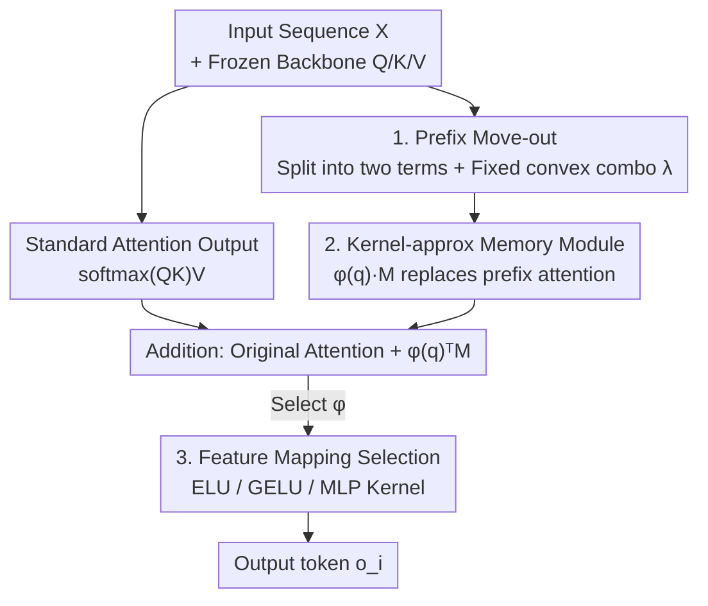

# PrefixMemory-Tuning: Modernizing Prefix-Tuning by Decoupling the Prefix from Attention

**Conference**: ICLR 2026  
**OpenReview**: [https://openreview.net/forum?id=LvUMpZE44r](https://openreview.net/forum?id=LvUMpZE44r)  
**Area**: LLM Efficiency / Parameter-Efficient Fine-Tuning  
**Keywords**: Prefix-Tuning, PEFT, Linear Attention, External Memory, LLM Adaptation

## TL;DR
This paper first empirically demonstrates that the true cause of Prefix-Tuning's failure in modern large models is the "weight trade-off between prefix and input within the attention softmax." It then proposes PrefixMemory-Tuning (PMT): moving the prefix module out of the attention head and approximating it with a trainable memory matrix $M$ plus a kernel feature map $\phi(\cdot)$. This decoupling ensures prefix contributions are no longer diluted by sequence length. PMT consistently outperforms Prefix-Tuning and matches or exceeds LoRA in few-shot classification, preference alignment, and mathematical reasoning.

## Background & Motivation
**Background**: In the LLM era, full-parameter fine-tuning is prohibitively expensive, making Parameter-Efficient Fine-Tuning (PEFT) the mainstream approach. Prefix-Tuning (PT) was one of the earliest "context-based" PEFT methods—prepending trainable continuous vectors (prefixes) to the KV of each attention layer, freezing the backbone weights, and only training these prefixes. It offers extremely low computational and memory overhead and approached the performance of full fine-tuning in early low-data/few-shot generation tasks.

**Limitations of Prior Work**: However, as LLMs became deeper and sequences grew longer, the effectiveness of PT significantly degraded, leading to its replacement by weight-based methods like LoRA and GaLore. The issue is that PT possesses advantages that weight-based methods lack—interpretability, a natural connection to the concept of "memory," and the potential for test-time retrieval-based adaptation—but these advantages cannot be exploited due to poor performance.

**Key Challenge**: Previous mainstream explanations (Petrov et al., 2023) attributed the failure of PT to "the prefix's inability to change the attention distribution within attention heads." Re-examining this, the authors found that this conclusion only holds for shallow Transformers. In modern deep LLMs, PT actually significantly alters attention patterns (see Appendix B.2). Thus, the inability to change attention is not the root cause. The true root cause is that the prefix $[s_1,\dots,s_p]$ is placed inside the softmax normalization denominator of the attention head, causing the prefix and input contributions to compete for weight. If the prefix is long relative to the input, the model is dominated by the prefix and loses specificity to the input; if the input is long (e.g., long CoT reasoning), the prefix influence is extremely diluted.

**Goal**: Eliminate this trade-off within the softmax without losing the superior properties of PT as "external context/memory."

**Key Insight**: Since the trade-off stems from the prefix being "locked" within the attention head's softmax operator, the prefix information should be moved **outside the attention head** for calculation so that it no longer participates in softmax normalization competition.

**Core Idea**: Rewrite the prefix as an external module $\phi(q_i)^\top M$ attached to the attention output using "fixed convex combination + linear attention kernel approximation + trainable memory matrix $M$," thereby decoupling memory capacity from sequence length and enhancing expressiveness.

## Method

### Overall Architecture
The derivation of PMT "peels" the prefix out of the attention head step-by-step. The starting point is the standard PT attention output (Eq. 2), where the prefix term $\sum_{j\le p}\mathrm{sim}(q_i,W_Ks_j)(W_Vs_j)^\top$ and the input term share the same softmax denominator. PMT performs three transformations: ① Split Eq. 2 into "input attention" and "prefix attention," each **normalized independently**, and use a fixed constant $\lambda$ for a convex combination (Eq. 4), replacing the dynamic softmax competition with a fixed-weight linear combination; ② Use a kernel feature map $\phi(\cdot)$ to approximate similarity $\mathrm{sim}(\cdot,\cdot)\approx\phi(\cdot)^\top\phi(\cdot)$, linearizing the prefix term (Eq. 5), where prefix information is condensed into a bias $b_1=\sum_{j\le p}\phi(W_Ks_j)(W_Vs_j)^\top$; ③ Replace this calculated bias $b_1$ directly with a **trainable matrix** $M$ (Eq. 6). Since $\lambda$ and the normalization term $\phi(q_i)^\top N$ can be absorbed by trainable weights and LayerNorm, the final minimal form (Eq. 7) is obtained:

$$o^{PMT\top}_i=\frac{\sum_{j\le i}\mathrm{sim}(q_i,k_j)v_j^\top}{\sum_{j\le i}\mathrm{sim}(q_i,k_j)}+\phi(q_i)^\top M.$$

Essentially: the original attention output remains untouched, with an "external memory read" $\phi(q_i)^\top M$ added in parallel.

### Key Designs

**1. Moving Prefix Out: Replacing softmax competition with fixed convex combination**

This step targets the core conflict: prefix and input competing for weight in the same softmax denominator. PMT splits Eq. 2 such that the input and prefix terms are **normalized independently**, then combines them linearly with a constant $\lambda\in[0,1]$ (Eq. 4): $o_i^\top=\lambda\cdot(\text{Input Attention})+(1-\lambda)\cdot(\text{Prefix Attention})$. In standard PT, the prefix weight $\alpha_i=\sum_{j\le p}\alpha_{ij}$ changes dynamically with both input and prefix length (Eq. 3), causing the prefix to be drowned out by long inputs. In PMT, $\lambda$ is fixed, and the prefix contribution is no longer diluted by sequence length. This is the foundation for eliminating the trade-off, aligning with the "fixed gating mixture" logic found in Infini-attention and memory-augmented Transformers.

**2. Kernel-approx Memory Module: Collapsing the prefix into a trainable matrix $M$**

A simple convex combination lacks sufficient expressiveness. PMT leverages the kernel trick from linear attention to write similarity as $\mathrm{sim}(\cdot,\cdot)\approx\phi(\cdot)^\top\phi(\cdot)$, allowing the prefix summation over keys/values to be pulled into a query-independent bias $b_1=\sum_{j\le p}\phi(W_Ks_j)(W_Vs_j)^\top$ (Chen et al., 2024 proved this bias captures context/prefix information). The crucial leap in this paper is to stop calculating $b_1$ from prefix vectors and instead replace it with a **freely trainable matrix** $M\in\mathbb{R}^{d_\phi\times d}$, yielding $\phi(q_i)^\top M$ (Eq. 7). This offers two benefits: first, stronger expressiveness—the authors view both PT and PMT as "adding a query-dependent $d$-dimensional bias" and analyze the eigenvalue decay of the bias covariance matrix (Fig. 3), finding PMT's top eigenvalues are larger and decay slower, indicating its bias spans a higher-dimensional, more dispersed subspace. Second, from a "memory" perspective (Remark 2), $M$ acts as explicit internal memory, where capacity is determined by the dimensions of $M$ and is **completely decoupled from prefix/sequence length**.

**3. Selection of Feature Mapping $\phi(\cdot)$: The trade-off knob for expressiveness and cost**

$\phi$ determines the quality of the kernel approximation and is the primary structural choice in PMT. For simplicity, the authors primarily tested $\phi(x)=\mathrm{elu}(x)$ and $\phi(x)=\mathrm{gelu}(x)$, noting that if $\phi_W(x)=\mathrm{ReLU}(Wx+b)$, then $\phi_W(q_i)M$ is equivalent to a single-layer MLP, theoretical gaining immense expressiveness (Remark 1). Experiments (Table 2) show that even switching between ELU and GELU results in observable performance differences—GELU provides small but stable gains on most tasks, proving that $\phi$ is indeed critical. However, heavier parameterization (like a full MLP kernel) might compromise the PEFT goal and require careful initialization, which is left for future work.

## Key Experimental Results

### Main Results
Few-shot adaptation (1 shot per class) was conducted on three generative classification benchmarks: BigBench, GoEmotions, and DBpedia, using LLaMA2-7B-Chat (MHA) and Qwen2.5-3B-Instruct (GQA). Average of five runs:

| Dataset | Model | PMT | Full | LoRA | Prefix-Tuning |
|--------|------|-----|------|------|---------------|
| BigBench | LLaMA2-7B-Chat | **71.2** | 38.8 | 67.4 | 21.3 |
| BigBench | Qwen2.5-3B | **76.6** | 67.4 | 61.4 | 52.0 |
| DBpedia | LLaMA2-7B-Chat | **92.7** | 92.6 | 90.1 | 61.3 |
| DBpedia | Qwen2.5-3B | **96.9** | 94.4 | 89.5 | 82.0 |
| GoEmotions | LLaMA2-7B-Chat | **45.2** | 32.7 | 36.2 | 5.6 |

PMT achieved an average absolute improvement of 8.1% over LoRA and 29.4% over Prefix-Tuning across six settings. In mathematical reasoning (CFT, Qwen2.5-Math-7B), the advantage expanded with data scale: with 50K training samples, PMT reached 62.5% on Minerva-Math vs. 23.9% for LoRA, and 60.0% on AMC23 vs. 47.5%. In preference alignment (AlpacaEval 2 win-rate delta, 10K samples), PMT also outperformed LoRA: SFT +0.76 vs +0.49, DPO +4.66 vs +3.52, SimPO +1.74 vs +1.24.

### Ablation Study

| Configuration | GoEmotions | DBpedia | BigBench | Description |
|------|-----------|---------|----------|------|
| PMT (ELU) | 45.2 / 37.3 | 92.7 / 96.9 | 71.2 / 76.6 | Default mapping (LLaMA2 / Qwen2.5) |
| PMT (GELU) | 47.0 / 38.7 | 93.2 / 96.4 | 72.0 / 76.2 | GELU slightly better in most tasks |
| PMT (MLP Kernel) | 43.6 / 35.7 | 95.0 / 95.0 | 64.5 / 77.1 | Stronger but unstable, more parameters |

### Key Findings
- **Mechanism Verification**: Eigenvalue decay analysis directly supports that $M$ is more expressive than prefix bias—PMT bias spans high-dimensional subspaces, while PT bias collapses into a few principal components.
- **$\phi$ Selection is Meaningful**: Switching ELU to GELU alone brings stable differences, proving the feature map is an effective tuning knob.
- **Highest Gains under GQA**: PMT shows particularly significant improvements on Qwen2.5-3B (GQA), indicating compatibility with modern mainstream attention architectures.
- **IID/OOD Win-win**: Pareto plots using BigBench as IID and Banking77 as OOD show PMT staying on the Pareto front, unlike other methods that sacrifice OOD robustness for IID gains.
- **Minimal Cost Increase**: Memory usage is comparable to LoRA (16.7 vs 16.5 GB). Training throughput is actually higher (LLaMA2-7B: 9.70 vs LoRA 8.22 vs PT 6.28 iter/s).

## Highlights & Insights
- **Re-diagnosing a "Discarded" Method**: Instead of following the old "PT can't change attention" explanation, the authors empirically refuted it and identified the length-dependent trade-off in softmax normalization.
- **Rewriting Prefix as External Memory is Elegant**: The derivation from Eq. 2 to Eq. 7 simplifies prefixing to a minimal form $o_i+\phi(q_i)^\top M$, unifying "Prefix-Tuning ↔ Linear Attention ↔ KV Memory ↔ Single-layer MLP" perspectives.
- **Decoupling Memory Capacity from Sequence Length**: This insight is transferable; any method relying on context tokens to carry task information (prompt-tuning, ICL) should consider a trainable matrix to liberate capacity.
- **Eigenvalue Decay as Evidence**: Using spectral decay of the bias covariance to quantify "expressiveness/subspace dimensionality" is a clean and reusable diagnostic tool.

## Limitations & Future Work
- The method is positioned as a proof-of-concept: replacing softmax normalization with a fixed convex combination is "quite naive," and only ELU/GELU were extensively tested. MLP kernel initialization and $\lambda$ handling were not deeply explored.
- Evaluation concentrated on generative classification, alignment, and math. Performance under extremely long context (long CoT) needs more evidence, which is the scenario where PT fails most severely.
- $M$ as "memory" lacks interpretability or visualization of its stored content; whether it truly carries interpretable token interaction patterns is only intuitively argued.

## Related Work & Insights
- **vs Prefix-Tuning (Li & Liang, 2021)**: PT keeps the prefix inside the softmax, restricted by the length trade-off; PMT moves it out as $\phi(q)^\top M$, a modernized generalization.
- **vs LoRA / LoRA+ (Hu et al., 2021; Hayou et al., 2024)**: LoRA is a weight-based PEFT applying low-rank updates to linear layers; PMT is context-based, explicitly modifying attention output while retaining memory properties.
- **vs DePT / ADePT (Shi & Lipani, 2023; Tang et al., 2025)**: These remain within the "soft prompt" framework; PMT collapses the prefix into a free matrix $M$, breaking the occupancy-length constraint.
- **vs FFN-as-memory (Geva et al., 2021/2022; Dai et al., 2022)**: PMT adopts the perspective of $M$ as a read-write external memory interface, but is more direct than MLP memory modules as it requires no deep structural changes.

## Rating
- Novelty: ⭐⭐⭐⭐⭐ Re-diagnosing PT and moving it to external memory is a unified and intuitive perspective.
- Experimental Thoroughness: ⭐⭐⭐⭐ Covers various tasks and architectures, but lacks extensive evidence for large-scale long-context scenarios.
- Writing Quality: ⭐⭐⭐⭐⭐ Derivations are clear, and the diagnosis-to-method flow is coherent.
- Value: ⭐⭐⭐⭐ Returns Prefix-Tuning to a competitive status and suggests a scalable path for context-based PEFT.

<!-- RELATED:START -->

## Related Papers

- [\[ICLR 2026\] Sequential Parallel Duality in Prefix Scannable Models](sequential_parallel_duality_in_prefix_scannable_models.md)
- [\[ICLR 2026\] TyphoonMLA: A Mixed Naive-Absorb MLA Kernel For Shared Prefix](typhoonmla_a_mixed_naive-absorb_mla_kernel_for_shared_prefix.md)
- [\[ICLR 2026\] CPQS-Tuning: A Model Self-Perception-Based Data Filtering Algorithm for Efficient Instruction Fine-Tuning](cpqs-tuning_a_model_self-perception-based_data_filtering_algorithm_for_efficient.md)
- [\[ICLR 2026\] Neuron-Aware Data Selection in Instruction Tuning for Large Language Models](neuron-aware_data_selection_in_instruction_tuning_for_large_language_models.md)
- [\[ICLR 2026\] Explainable Token-level Noise Filtering for LLM Fine-tuning Datasets](explainable_token-level_noise_filtering_for_llm_fine-tuning_datasets.md)

<!-- RELATED:END -->
