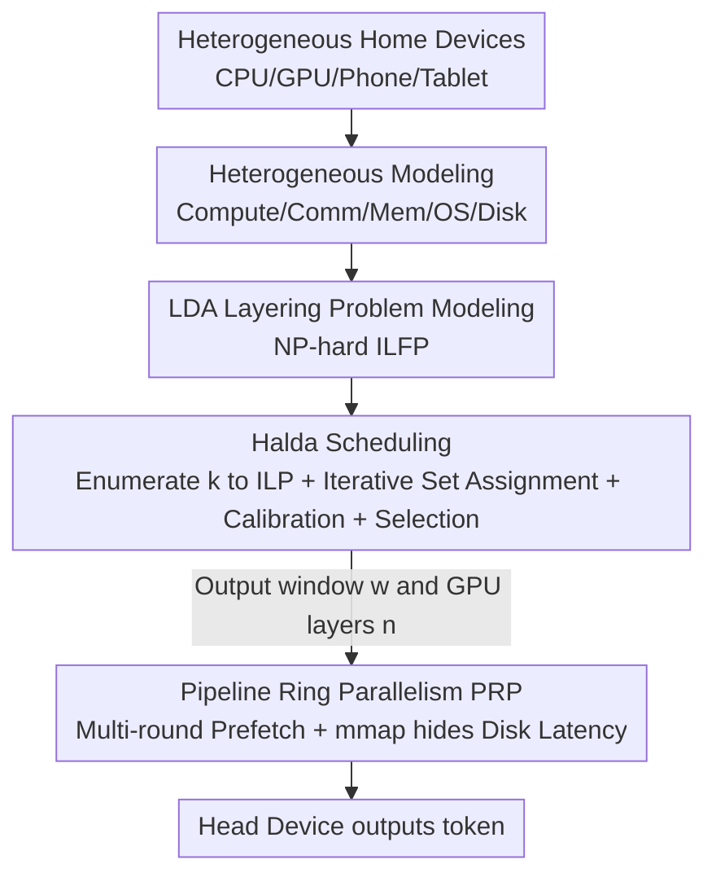

# Prima.cpp: Fast 30-70B LLM Inference on Heterogeneous and Low-Resource Home Clusters

**Conference**: ICLR 2026  
**OpenReview**: [https://openreview.net/forum?id=h0LjpOG1jq](https://openreview.net/forum?id=h0LjpOG1jq)  
**Code**: https://gitee.com/zonghang-li/prima.cpp  
**Area**: LLM Efficiency / Distributed Inference Systems  
**Keywords**: On-device Inference, Pipeline Ring Parallelism, Disk Offloading, Heterogeneous Scheduling, Integer Linear Programming

## TL;DR
prima.cpp assembles home laptops, desktops, phones, and tablets into a heterogeneous low-end cluster. By utilizing "Pipeline Ring Parallelism (PRP) + Prefetching," it hides disk loading latency within computation time. The Halda scheduler solves for the optimal layering scheme based on real-world device compute, memory, and disk capacity via Integer Linear Programming (ILP). This enables running 30-70B models on common home clusters even with severe memory shortages, achieving 674 ms/token for a 70B model with <6% memory pressure—a 5-17× reduction in TPOT compared to llama.cpp.

## Background & Motivation
**Background**: For embodied AI (home surveillance, resident voice assistants, companion robots), inference is migrating from the cloud to the edge due to privacy, offline availability, and long-term cost considerations. However, consumer chips and small memory can barely run models under 8B, while reliable long-range planning and tool calling require 32B or larger. To fit large models into small devices, disk offloading is required, but it comes at the cost of speed—for example, Qwen2.5-14B Q4K on an 8 GiB Mac M1 using llama.cpp takes 10 s/token, rendering it practically unusable.

**Limitations of Prior Work**: Distributed inference is almost the only way to increase model scale and speed without altering output. However, existing home distributed systems have four major flaws: (a) they assume **aggregate memory is sufficient to hold the entire model** (e.g., exo, Galaxy, dllama), which raises hardware costs and limits model scale; (b) once disk offloading is needed, inference speed drops to tens of seconds per token; (c) layering strategies are built on the strong assumption of sufficient memory, ignoring OS-level memory reclamation and the heterogeneity of disk access; (d) they default to involving all devices, even when removing slow devices would result in higher speed.

**Key Challenge**: In home scenarios, five constraints—heterogeneous devices, insufficient memory, slow disks, high Wi-Fi latency, and cross-OS environments—exist simultaneously. Tensor Parallelism (TP) requires frequent all-reduce, leading to communication latency explosions over Wi-Fi. Pure Pipeline Parallelism (PP) reduces communication but suffers from large pipeline bubbles in single-request scenarios, and it still requires disk offloading when memory is insufficient. Furthermore, disk latency is extremely difficult to quantify due to OS memory reclamation strategies and disk throughput variance, making heuristic-based layering (how many layers on which device, GPU vs. CPU) ineffective.

**Goal**: Decomposition into two sub-problems. (Q1) How to relax memory constraints to run larger models? If disk offloading is mandatory, how to hide disk latency? (Q2) Based on Q1, how to perform heterogeneity-aware layering and identify bottleneck devices to prune?

**Key Insight**: The authors observed that in low-frequency single-request scenarios, the bubbles in PP can be filled by multiple devices prefetching different layer segments. As long as only a small "layer window" is loaded per round, the prefetched layers will not be evicted from the page cache by subsequent loads. This transforms disk I/O into a background operation that overlaps with computation and communication.

**Core Idea**: Utilize "Pipeline Ring Parallelism (PRP) + Prefetching" to hide disk latency and scale model size, and employ the heterogeneity-aware scheduler Halda to model the layering problem as an Integer Linear Programming (ILP) problem for automated optimization.

## Method

### Overall Architecture
prima.cpp is implemented with 20K lines of code based on llama.cpp, aiming to run 30-70B models at practical speeds on home clusters consisting of mixed CPU/GPUs, insufficient memory, slow disks, Wi-Fi, and cross-OS setups. The pipeline consists of three steps: First, perform heterogeneous modeling of each device's compute power, communication, memory, and OS-related memory reclamation/disk optimization to formalize the "Layer-to-Device Assignment (LDA)" problem. Then, the Halda scheduler calculates the layer window size $w_m$ and GPU layer count $n_m$ for each device, pruning bottleneck devices. During runtime, devices are connected in a ring to predict one token via multiple rounds of PRP. In each round, devices prefetch different layer segments using mmap for on-demand loading, overlapping disk latency with computation and communication. Input and output are handled by the head device to further protect interaction privacy.

### Key Designs

**1. Pipeline Ring Parallelism (PRP) + Prefetching: Embedding Disk Loading into Computation/Communication Gaps**

To relax memory constraints, the simplest approach is to extend mmap in llama.cpp: load layers from external storage as needed for computation and allow the OS to swap them out under memory pressure. However, this naive design hits the **prefetch-release conflict**: if disk reads are fast, newly loaded layers will evict previously prefetched layers from the page cache. When computation actually requires those layers, they are no longer in cache, triggering page faults and reloads, rendering prefetching useless and bubbles persistent.

The PRP solution connects all devices in a ring and predicts one token over **multiple rounds**. In each round, each device prefetches only a small layer segment (its size is the layer window $w$), and this loading overlaps with the computation, communication, and disk loading occurring on other devices. Since only a small segment is loaded per round, memory overflow is avoided, and prefetched layers are less likely to be evicted from the page cache, resolving the conflict at its root. For example, with 6 devices and a 36-layer model with a window size of 2, the model is split into 18 segments assigned in ring order; each device takes 3 rounds to predict one token. Tests show that for large models, PRP reduces the TPOT of PP by approximately 50% (PP is equivalent to PRP with $k=1$). On heterogeneous devices, a uniform window size still leaves bubbles; thus, more capable devices should be assigned larger windows—but determining "who is stronger" and "how large the window should be" is precisely the challenge Halda addresses.

**2. Layer-to-Device Assignment (LDA) Modeling: Optimizing for Heterogeneity**

Within a layer window, some layers reside in VRAM to run on the GPU, while others are offloaded to RAM for the CPU. If the CPU portion exceeds available RAM, the overflow is offloaded to external storage via mmap. Given $M$ devices, $w_m$ as the window size, and $n_m$ as the number of GPU layers, the goal is to minimize TPOT:

$$\min_{w,n}\ \frac{L\cdot a^\top w + b^\top n + e^\top c}{e^\top w} + \kappa$$

Where $L$ is the number of model layers, $a,b,c$ are coefficient vectors determined by computation, memory access, disk loading, and communication latencies, and $\kappa$ is a constant delay bias. The denominator $e^\top w$ relates to the number of rounds $k$ required for one token (satisfying $L = k\,e^\top w$). Constraints restrict the layer count and ensure RAM/VRAM usage does not exceed limits. The difficulty lies in disk loading being heavily affected by OS memory reclamation and disk throughput. Some PCs have independent VRAM, while M-series Macs use Unified Memory Architecture (UMA) with more aggressive reclamation; some are NUMAs without GPUs. These behaviors affect computation, memory access, and disk constraints differently. The authors divide devices into four sets M1-M4 based on these characteristics and construct coefficients accordingly. This is an **NP-hard Integer Linear Fractional Programming (ILFP)** problem, further complicated by the fact that a device's set membership depends on the solution $(w, n)$, but the solution cannot be found without knowing the sets—creating a circular dependency.

**3. Halda: Enumerate k to standard ILP + Iterative Set Pursuit + Calibration + Device Selection**

Halda breaks the deadlock with two core ideas. First, **enumerate k**: The number of layers $L$ is typically <100, with at most 11 divisors. By treating $k$ and $W=e^\top w$ as constants for each valid $k$, the fractional objective becomes linear, and the problem turns into a standard ILP solvable by engines like HiGHS. Second, **iterative optimization for set assignment** solves the circular dependency: $w$ is initialized proportionally to available memory with $n=0$ to get initial M1-M4 partitions. The ILP is solved to update $w,n$, and sets are re-evaluated until they converge (Algorithm 1). To prevent a device with sufficient VRAM from being underutilized due to initial set constraints, a **calibration** step is added: if a GPU is not full while another device is overloaded, the device with the slowest disk in {M1, M2, M3} is forced into $M_4^{force}$ for a re-solve. The complexity is $O(M)$ iterations of solving $O(\log L)$ small, sparse ILPs, with scheduling latency of only 10-12 ms for 4-32 devices. Finally, **Device Selection**: Weak devices assigned only one layer are pruned (Halda shows excluding them is faster). For small models, Halda piles all layers onto the strongest single device, and prima.cpp automatically reverts to llama.cpp behavior.

### An Example: Why an 8B Model Uses Only One Device
Using Llama3-8B (Q4K, requiring 5.3 GiB VRAM) on testbed D1-D4: D3's 2080TI has 11 GiB VRAM, which can fit the entire model. Halda finds that assigning all layers to D3 is the fastest, thus pruning D1/D2/D4. Both TPOT and TTFT match the standalone llama.cpp (15 ms/18 ms). In contrast, exo layers the model proportionally to memory, assigning 9, 10, and 13 layers to D1 (8 GiB RAM, Apple Silicon), D2 (8 GiB VRAM), and D3 (11 GiB VRAM) respectively. As a result, D1's efficiency is far lower than the 2080TI, becoming a bottleneck and pushing TPOT to 263 ms.

## Key Experimental Results

Implemented with 20K lines of code, tested on 6 low-end home devices (Mac M1, Intel laptops/desktops, Mate40Pro phone, Honor tablet, Mac Air) connected via a local Wi-Fi router (320-610 Mbps bandwidth, 3-7 ms latency). Default configuration D1-D4 has only 37 GiB of aggregate memory, insufficient for a 70B Q4K model. Benchmarks: llama.cpp, exo, dllama.

### Main Results
Comparison of TPOT (ms/token) and memory pressure for Llama 8-70B (Q4K):

| Model Size | llama.cpp TPOT | exo TPOT | dllama TPOT | prima.cpp TPOT | prima.cpp Mem Pressure (D4) |
|--------|------|------|------|------|------|
| 8B | 15 | 263 | 1150 | 15 | ≤1.0% |
| 30B | 202 | - | - | 72 | ≤1.0% |
| 45B | 328 | - | 6235 | 233 | ≤1.0% |
| 60B | 7965 | - | - | 468 | ≤1.0% |
| 70B | 10120 | OOM | OOM | 674 | ≤1.0% |

On the 70B model, prima.cpp reduces llama.cpp's TPOT from 10120 to 674 ms/token (approx. 15×) and TTFT by up to 8×. Compared to exo/dllama, it achieved at least 18× lower TPOT and 42× lower TTFT without OOM. With speculative decoding, speeds reached 26 tokens/s for 32B and 442 ms/token for 70B. Memory pressure remains extremely low across all sizes (mostly ≤6%, with slow-disk D4 always ≤1%), whereas exo hit 61%-74% on a 45B model and dllama triggered OOM.

### Ablation Study

| Configuration | 70B TPOT | Description |
|------|---------|------|
| prima.cpp (full) | 674 | Full model |
| w/o prefetch | ~ +9~17% | Without prefetching, large models suffer frequent page faults, TPOT increases 9-17% |
| w/o halda | 20848 | Switched to exo-style proportional layering, up to 31× slower |

### Key Findings
- **Halda is the primary contributor**: Removing Halda (reverting to exo-style heuristic layering) caused TPOT for the 70B model to jump from 674 to 20848 ms/token—heterogeneity-aware layering is the deciding factor for practical usability.
- **Prefetching benefits large models**: When an entire model fits in RAM/VRAM, prefetching has little impact. It only reduces TPOT by 9-17% when large models are frequently swapped, allowing loading to overlap with delays.
- **llama.cpp breakdown point is 60B**: At 45B, mmap only reloads a few pages with minor losses. By 60B, high memory pressure causes active pages to be evicted early, causing TPOT to jump from 328 to 7965, proving standalone disk offloading is unsuitable for 60B+ models on consumer devices.
- Experiments on Qwen2.5, QwQ, DeepSeek-R1, and larger clusters (4-32 devices) verified generalization.

## Highlights & Insights
- **Transforming "Disk Latency" into an Overlappable Background Task**: PRP uses "rings + small windows + multiple rounds" to hide prefetching behind computation and communication of other devices, resolving the mmap prefetch-release conflict.
- **Upgrading Heuristic Layering to Provably Optimal ILP**: Identifying that $L<100$ and factors are limited to at most 11 allowed the NP-hard ILFP to be converted into a manageable set of ILPs, solved efficiently in 10-12 ms.
- **"Subtraction" in Device Selection**: Pruning weak devices assigned only one layer and keeping others as pure relays is a counter-intuitive design that ensures robustness against varying hardware quality.
- **Privacy Friendly**: Inputs and outputs are processed locally on the head device, ensuring raw interactions do not leave the local network, fitting embodied AI privacy requirements.

## Limitations & Future Work
- Designed for **single-request** low-frequency scenarios; mini-batching is not yet implemented (though dynamic batching is mentioned in Appendix A.11).
- Heterogeneous modeling depends on manually categorizing devices into M1-M4 with corresponding coefficients; adding new OS/hardware types requires extending definitions.
- Performance relies on the accuracy of Halda’s latency coefficients ($a,b,c$). Environmental drift (e.g., background apps, disk aging) might necessitate recalibration.
- Evaluation focuses on dense models (Llama/Qwen) and excludes sparse (MoE) or NPU-accelerated inference systems.

## Related Work & Insights
- **vs. llama.cpp (Single-device mmap)**: Both use mmap for on-demand loading, but llama.cpp suffers from page faults under memory pressure (8 s/token for 60B); prima.cpp uses PRP to distribute loading across devices, maintaining sub-second TPOT for 70B.
- **vs. exo (PP with Memory-proportional Layering)**: exo assumes aggregate RAM fits the model and uses heuristic layering, leading to GPU bottlenecks. prima.cpp uses Halda for optimal layering and supports disk offloading.
- **vs. dllama (Tensor Parallelism)**: dllama relies on TP, but an 8B model requires 64 all-reduces. Communication latency on Wi-Fi dominates (estimated +24s per token for 70B). PRP's low communication is a better fit.
- **vs. TPI-LLM**: Also uses on-demand loading + prefetch for 70B on 4 GiB devices, but stays at 30 s/token. prima.cpp’s ring and scheduling approach bring this to sub-second levels.

## Rating
- Novelty: ⭐⭐⭐⭐⭐ PRP resolves prefetch-release conflict; rigorous ILP for heterogeneous layering is innovative and solid.
- Experimental Thoroughness: ⭐⭐⭐⭐⭐ Real 6-device testbed, 3 strong baselines, 8-70B scale, comprehensive ablation, and multi-model verification.
- Writing Quality: ⭐⭐⭐⭐ Clear problem decomposition (Q1/Q2), though many core proofs and details are relegated to the appendix.
- Value: ⭐⭐⭐⭐⭐ Enables running 30-70B models for free on existing home hardware, directly impacting the local privacy-focused LLM deployment.

<!-- RELATED:START -->

## Related Papers

- [\[ICLR 2026\] PARD: Accelerating LLM Inference with Low-Cost Parallel Draft Model Adaptation](pard_accelerating_llm_inference_with_lowcost_parallel_draft_model_adaptation.md)
- [\[ICLR 2026\] Fast-dLLM v2: Efficient Block-Diffusion LLM](fast-dllm_v2_efficient_block-diffusion_llm.md)
- [\[ICML 2026\] Fast-dLLM++: Fréchet Profile Decoding for Faster Diffusion LLM Inference](../../ICML2026/llm_efficiency/fast-dllm_fréchet_profile_decoding_for_faster_diffusion_llm_inference.md)
- [\[ICLR 2026\] SpareTrain: Fault-Tolerant LLM Training via Low-Cost Dual Modular Redundancy](sparetrain_fault-tolerant_llm_training_via_low-cost_dual_modular_redundancy.md)
- [\[ICLR 2026\] Universal Model Routing for Efficient LLM Inference](universal_model_routing_for_efficient_llm_inference.md)

<!-- RELATED:END -->
