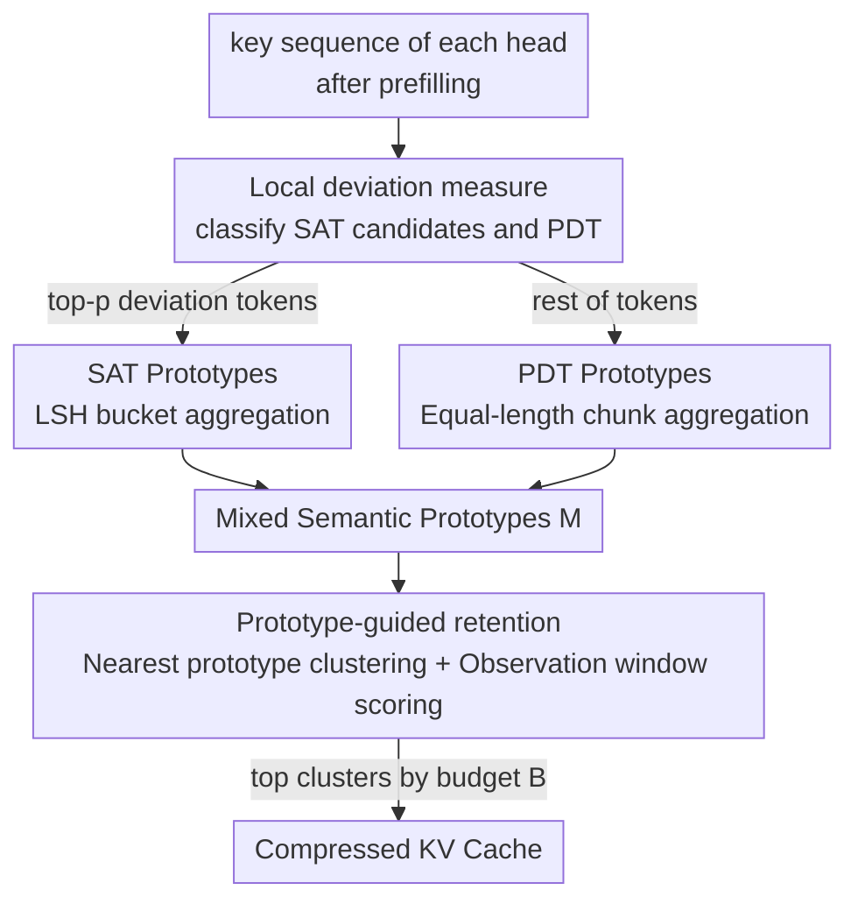

# ProtoKV: Knowledge in Long Context is Already Organized Before You Query

**Conference**: ICLR 2026  
**OpenReview**: [https://openreview.net/forum?id=kXhPkDaFbJ](https://openreview.net/forum?id=kXhPkDaFbJ)  
**Code**: https://github.com/yyy0959/ProtoKV  
**Area**: LLM Efficiency / KV Cache Compression  
**Keywords**: KV Cache Compression, Semantic Anchors, Local Deviation, Semantic Prototypes, Long Context Inference

## TL;DR
ProtoKV discovers that LLMs spontaneously categorize tokens into "Position-Determined Tokens" (PDT) and "Semantic-Anchored Tokens" (SAT) during the prefilling stage. Based on this, it constructs semantic prototypes, clusters tokens into groups based on these prototypes, and retains/evicts entire clusters. This approach improves average LongBench accuracy by 2.11% over SOTA under the same memory budget, with computational overhead comparable to SnapKV.

## Background & Motivation

**Background**: LLMs processing long text are limited by the quadratic complexity of attention, while the KV Cache causes memory to expand linearly with sequence length ($O(b\cdot n)$). The primary mitigation is KV Cache retention/eviction strategies: only "important" KV pairs are retained for each attention head during the prefilling stage, and the rest are discarded. Importance is typically measured by priors (like attention sinks) or cumulative attention scores.

**Limitations of Prior Work**: Early methods (e.g., H2O) score and retain individual tokens in isolation, breaking the semantic integrity of compressed representations. Consequently, methods like SnapKV and ChunkKV turned to "semantic-level compression," cutting continuous tokens into chunks and retaining or discarding them as whole blocks to maintain context coherence. However, they implicitly assume that "spatial proximity implies semantic similarity," which is not always true in natural language—certain punctuation or label words in ICL act as "anchors" by absorbing the semantics of a sequence. These anchors are functionally equivalent but scattered across the sequence; chunk-based methods cannot process them as a single semantic unit. Clustering methods based on K-means can capture semantically similar tokens across positions, but they require multiple iterations, are inefficient, and are sensitive to initialization (Squeeze Attention takes 20+ iterations to surpass the baseline in Figure 7).

**Key Challenge**: Long-context compression needs to address two types of information simultaneously: the high-order semantics aggregated by anchor tokens and the local fine-grained knowledge carried by ordinary tokens. Existing methods either focus solely on local continuity (chunking) or pay a high iterative clustering cost for global semantics (clustering). Semantic integrity and computational efficiency are difficult to achieve simultaneously.

**Key Insight**: The authors observed the key embedding distribution after prefilling and found a universal phenomenon: the vast majority of tokens are highly similar to their contextual neighbors in key space (**Position-Determined Tokens, PDT**), while a small minority significantly violate this local similarity, exhibiting "local deviation" (**Semantic-Anchored Tokens, SAT**). Crucially: although these SATs are few, they spontaneously aggregate into one or two compact clusters in the key space and continuously absorb attention during generation. In other words, **LLMs have already identified and organized these anchor tokens during the prefilling stage before they are even queried**—this is the meaning behind the title.

**Core Idea**: Instead of scoring tokens in isolation or using rigid chunks, it is better to follow the structure that the model has "already organized." SATs and PDTs are handled separately to construct semantic prototypes, which then guide the clustering of all tokens as the basic units for compression. This allows for semantic integrity and efficiency to be achieved at once.

## Method

### Overall Architecture

ProtoKV processes the key sequences of each attention head during the prefilling stage, aiming to select the most important KV clusters under budget $B$. The process consists of three steps: first, classify tokens into SAT candidates and PDT using "local deviation"; second, construct "semantic prototypes" for both categories (LSH bucketing for SAT, equal-length chunking for PDT); finally, assign each token to its nearest prototype to form clusters, score each cluster's importance using an observation window, and retain the top clusters according to the budget.

A key design trade-off: the authors first tested a naive version (SATKV) that "retains tokens in descending order of local deviation" but found it underperformed compared to SnapKV (Table 1). The reasons are twofold: first, it ignores PDTs, which still account for about 40% of attention; when the budget exceeds SAT capacity, PDTs must also be retained. Second, like H2O, it evaluates single tokens in isolation, losing semantic coherence. These points led to the full framework of "dual-category divide-and-conquer + prototype clustering."

### Key Designs

**1. Local Deviation Property: Quantifying tokens into SAT and PDT using outlier degree**

This step solves the pain point of "anchor tokens being diverse and difficult to identify systematically." The authors first define the $\kappa$-neighborhood similarity of token $i$—the average cosine similarity with its $2\kappa$ neighbors (default $\kappa=5$):

$$S^{(h)}_\kappa(i)=\frac{1}{2\kappa+1}\sum_{j=i-\kappa}^{i+\kappa}\cos\!\big(k^{(h)}_i,k^{(h)}_j\big)$$

Standardization then yields the **outlier degree**: $\Theta^{(h)}(i)=\big(S^{(h)}_\kappa(i)-\mathbb{E}[S^{(h)}_\kappa]\big)/\sqrt{\mathbb{V}[S^{(h)}_\kappa]}$, where mean and variance are calculated across all input tokens. Tokens with high deviation are SATs, while those with low deviation are PDTs. The authors validated this distinction with two properties: first, **SATs aggregate**—extracting tokens with $\Theta(i)>\beta$ and looking at the intra/inter-cluster similarity ratio $\Gamma(C)=S_\text{intra}/S_\text{inter}$, clusters become tighter as $\beta$ increases, with a sharp spike in aggregation beyond a threshold. Second, **SATs are crucial for generation**—statistical analysis of "cumulative attention during inference" across ten groups shows that the top 10% deviation tokens in deep layers consume over 60% of cumulative attention. Deleting SATs by deviation causes a sharp drop in long-context inference performance (equivalent to deleting by cumulative attention), while random deletion has little impact. Notably, the authors view SAT as a broader concept than attention sinks; even when sink tokens are excluded, the remaining SATs are still indispensable.

**2. Mixed Semantic Prototype Construction: Combining LSH for SAT and chunking for PDT**

Since hard-labeling individual tokens as SAT/PDT has fuzzy boundaries, ProtoKV extracts a set of **semantic prototypes** for both patterns. For SAT: identify top-$p$ deviation candidate tokens $O=\{k_j\}$, project keys to low dimensions using Random Fourier Features with Gaussian kernel approximation $\phi(k_j)=\sqrt{2/r}\cos(Wk_j+b)$, then binarize into $r$-bit codes and interpret as integers for LSH bucketing $H(k_j)=\big(\sum_i 2^{r-i}h^{(i)}_j\big)\bmod u$ (where $u=2^r$). This binary-to-decimal conversion preserves Hamming distance and elegantly handles "loosely aggregated" or "multi-cluster" SAT scenarios. For PDT: partition $T\setminus O$ into $v$ equal-length continuous chunks. Finally, normalized sums are taken for both categories to get prototypes: $c^{(\text{SATs})}_s=\frac{\sum_{k_j\in B_s}k_j}{\|\cdot\|_2}$, $c^{(\text{PDTs})}_m=\frac{\sum_{k_t\in C_m}k_t}{\|\cdot\|_2}$, which are merged into a mixed prototype set $M=\{c^{(\text{PDTs})}_m\}\cup\{c^{(\text{SATs})}_s\}$. Thus, SAT prototypes encapsulate high-order anchor semantics across positions, while PDT prototypes preserve local fine-grained information.

**3. Prototype-Guided KV Retention: Cluster by nearest prototype + Score via observation window**

With prototypes established, ProtoKV uses them as high-quality cluster centers. Each token $k_t$ is assigned to the prototype with the highest cosine similarity $c(k_t)=\arg\max_{c\in M}\frac{k_t^\top c}{\|k_t\|\|c\|}$, partitioning all tokens into $u+v$ clusters. Cluster importance is scored using a SnapKV-style **observation window mechanism**: queries from an observation window of length $L_\text{obs}$ at the end of the sequence are used to calculate inner products with keys in the cluster: $\psi^{(h)}(C_j)=\sum_{i\in C_j}\sum_{m=L_\text{prefix}+1}^{L_\text{prompt}}q_m^\top k_i$. Finally, clusters are ranked by $\psi$, and the top clusters are retained within the budget $B$. Since cluster centers are derived directly from the natural structure of SAT/PDT, the complexity drops from $O(e\,n\,t)$ of iterative clustering to $O(n\,t)$ (where $e$ is iterations and $t$ is the number of clusters), matching the efficiency of chunking while preserving cross-position semantics.

### Mechanism

Using a long text about "Super Bowl 50" from SQuAD as an example: after prefilling, most narrative tokens (team names, time, location) are highly similar to neighbors and classified as PDT, forming local prototypes through chunking. Anchor tokens like quotation marks, specific punctuation, and topic transitions have high deviation and are selected as SAT candidates, aggregating into SAT prototypes via LSH. When the query "Which NFL team represented the AFC at Super Bowl 50?" arrives, the observation window scoring ensures that semantic clusters relevant to the question (containing both anchors and details) are retained as a whole, while irrelevant haystack clusters are discarded. In an 8K context Needle In A Haystack test, ProtoKV retrieves the needle with 97.3% accuracy even when only retaining 1.6% of KV, because the needle text itself has high deviation and naturally falls into the retained semantic clusters.

## Key Experimental Results

### Main Results

| Benchmark / Setting | Metric | ProtoKV | Comparison | Description |
|--------|------|------|----------|------|
| LongBench (Avg 16 tasks, 64–512 budget) | Avg Score | SOTA | 0.35%–4.27% higher than SOTA | **2.11%** average Gain |
| RULER (Llama3-8B, budget 128/512, NIAH) | Acc | 98.2 / 99.6 | SnapKV 97.2 / 99.6 | Consistently best or second best |
| RULER (QA subset, 128/512) | Acc | 42.8 / 43.6 | SnapKV 42.0 / 43.8 | Comparable to strongest |
| Needle In A Haystack (128 budget, ≈1.6% retention) | Retrieval Acc | **97.3%** | SnapKV 94.2 / H2O 54.8 / SLM 31.1 | Far exceeds eviction methods |
| LongBench (Llama3-8B, 512 budget, prefilling config) | Score | 40.76 | ClusterKV 40.45 / SqueezeAtt 40.42 | Better than cluster-based methods |

The naive SATKV (retaining by deviation only) consistently underperforms compared to SnapKV (e.g., 21.12 vs 23.32 on NrtvQA with Llama3-8B, 256 budget), confirming that "only retaining SAT, discarding PDT, and isolated scoring" is unfeasible—the motivation for the dual-category approach.

### Ablation Study

| Configuration | Key Metric | Description |
|------|---------|------|
| ProtoKV (Full) | Best | SAT via LSH + PDT via chunking |
| Chunk-Clustering | Degradation | Chunk-only prototypes, loses cross-position SAT |
| LSH-Clustering | Larger Degradation | All tokens via LSH, loses local fine-grained info |
| ProtoKV + LA./HA. | Further Gain | Layer/Head-level budget allocation yields 1%–4% more |

### Key Findings
- **Both prototypes are indispensable**: Removing SAT processing (Chunk-Clustering) or PDT processing (LSH-Clustering) lead to performance drops, with LSH-Clustering dropping more—indicating that the fine-grained local info of PDTs is essential.
- **Hyperparameter efficiency**: Optimal total prototypes are around 500, with only 2–4 SAT prototypes required; 20–40 SAT candidates are sufficient, any more introduces PDT noise. The neighborhood window $\kappa$ has almost no effect.
- **Efficiency advantage**: Cluster importance scoring $\psi$ takes time similar to SnapKV, while iterative cluster-based methods can cost up to 3.9× the time; ProtoKV total time remains stable across different prototype counts.
- **Orthogonality**: Compatible with layer/head-level KV budget allocation methods, showing stable performance gains when combined.

## Highlights & Insights
- **The "Model already organized it" perspective is clever**: Instead of inventing a new clustering method, it discovers that LLMs spontaneously aggregate anchor tokens into several clusters in the key space. The method simply leverages these natural cluster centers, avoiding K-means iterations and initialization issues.
- **Outlier degree is a clean, transferable probe**: Measuring "local deviation" via standardized neighborhood similarity can locate known anchors like sinks and ICL labels, as well as broader SATs. This can be transferred to attention mechanism analysis or retrieval head identification.
- **Divide-and-conquer logic**: Using LSH for SAT and chunking for PDT is driven by structural motives. SATs are cross-positional and multi-cluster, necessitating LSH; PDTs are spatially local, justifying chunking.

## Limitations & Future Work
- The method relies on the empirical observation that "SATs form compact clusters in key space." The authors acknowledge that SATs may not appear in initial layers and that incoherent text (multi-document) may produce multiple clusters; robustness to extremely incoherent text remains to be quantified.
- Experiments focus on $\le$32K contexts and Llama/Mistral 7–8B models. Generative performance for much longer contexts or larger models is an open question.
- The outlier degree depends on the key distribution after the entire prefilling stage, making it a one-time compression post-prefilling. Integration with streaming/online incremental scenarios (dynamic prototype updates) is worth exploring.
- Hyperparameters like the number of prototypes and SAT candidates, while not highly sensitive, still require task-specific tuning. An adaptive mechanism is missing.

## Related Work & Insights
- **vs SnapKV / ChunkKV (chunk-based)**: These assume "spatial proximity implies semantic similarity" and retain continuous chunks, missing functionally equivalent anchors dispersed across positions. ProtoKV captures these via SAT prototypes.
- **vs H2O / SATKV (isolated scoring)**: H2O scores by cumulative attention and SATKV by deviation in isolation. Both lose semantic coherence and ignore one categories of tokens. ProtoKV uses "clusters" as atomic units.
- **vs ClusterKV / Squeeze Attention (K-means cluster-based)**: These capture cross-positional similarity but require multiple iterations, are sensitive to initialization, and can lead to unbalanced clusters. ProtoKV leverages the natural structure of SAT/PDTs for a lower $O(nt)$ complexity.

## Rating
- Novelty: ⭐⭐⭐⭐⭐ The observation of "SAT/PDT dichotomy + natural cluster centers" and the corresponding method are novel and self-consistent.
- Experimental Thoroughness: ⭐⭐⭐⭐ Complete analysis across LongBench/RULER/NIAH with multiple models and ablations, though context length and model scale are relatively small.
- Writing Quality: ⭐⭐⭐⭐ Clear narrative (phenomenon-analysis-method) with strong support from formulas and diagrams.
- Value: ⭐⭐⭐⭐⭐ High practical utility for long-context deployment, providing accuracy gains over Prev. SOTA with overhead similar to SnapKV.

<!-- RELATED:START -->

## Related Papers

- [\[ICLR 2026\] Reconstructing KV Caches with Cross-Layer Fusion for Enhanced Transformers](reconstructing_kv_caches_with_cross-layer_fusion_for_enhanced_transformers.md)
- [\[ICLR 2026\] Equilibrium Language Models](equilibrium_language_models.md)
- [\[ICLR 2026\] QuoKA: Query-Oriented KV Selection for Efficient LLM Prefill](quoka_query-oriented_kv_selection_for_efficient_llm_prefill.md)
- [\[ICLR 2026\] LycheeDecode: Accelerating Long-Context LLM Inference via Hybrid-Head Sparse Decoding](lycheedecode_accelerating_long-context_llm_inference_via_hybrid-head_sparse_deco.md)
- [\[ICLR 2026\] Retrospective Sparse Attention for Efficient Long-Context Generation](retrospective_sparse_attention_for_efficient_long-context_generation.md)

<!-- RELATED:END -->
