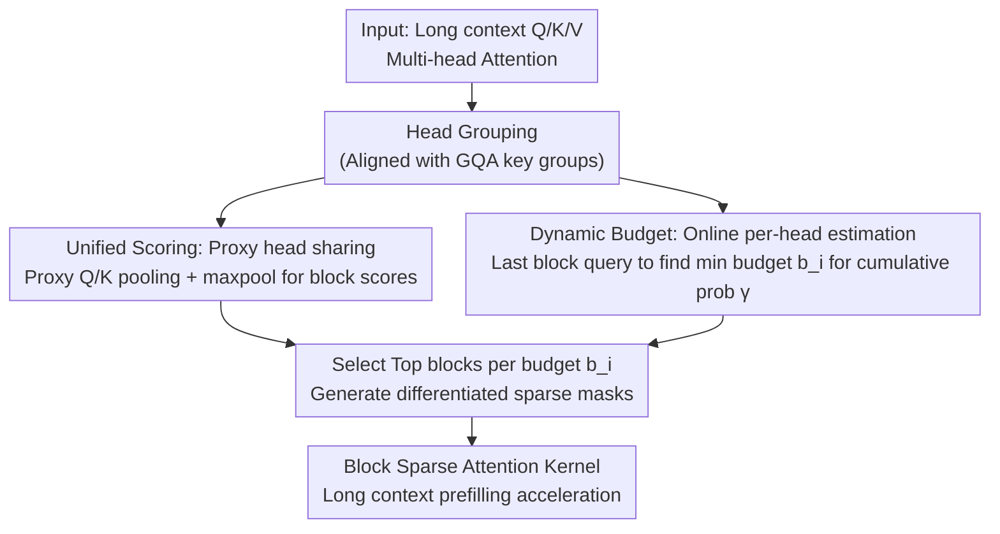

# ProxyAttn: Guided Sparse Attention via Representative Heads

**Conference**: ICLR 2026  
**OpenReview**: [https://openreview.net/forum?id=m3HXHQYmZu](https://openreview.net/forum?id=m3HXHQYmZu)  
**Code**: https://github.com/wyxstriker/ProxyAttn  
**Area**: LLM Efficiency  
**Keywords**: Sparse Attention, Long Context Prefilling, Attention Head Similarity, Block-level Importance Estimation, Training-free

## TL;DR
ProxyAttn observes that multiple attention heads in long contexts "focus on highly consistent tokens but differ in sparsity levels." It utilizes token-level scores from a few "proxy heads" to approximate block importance for all heads, while assigning independent budgets to each head for differentiated sparse masks. Without training, it preserves performance while achieving up to 10.3× attention speedup and 2.4× end-to-end prefilling acceleration.

## Background & Motivation
**Background**: As LLMs process long contexts with millions of tokens, the quadratic complexity of attention becomes the primary bottleneck. Block sparse attention is a mainstream acceleration technique—partitioning sequences into blocks, estimating block importance, and computing attention only for top-ranked blocks. MInference uses predefined templates and online indexing, while FlexPrefill introduces input-adaptive patterns and sparsity rates to significantly accelerate long-context prefilling.

**Limitations of Prior Work**: Existing methods for estimating block importance almost exclusively rely on **compression along the sequence dimension** (pooling) to approximate attention scores. This coarse-grained compression fails at high sparsity rates: attention distributions are inherently sparse, and high-scoring tokens can be "diluted" by pooling, leading to performance degradation. While token-level dot products solve this, their complexity equals full attention, negating efficiency gains.

**Key Challenge**: Accuracy and efficiency are in conflict regarding the "compression dimension." Compressing along the sequence dimension saves computation but loses accuracy; avoiding compression yields no efficiency gains. The root cause is the assumption that approximation must occur in the sequence dimension.

**Goal**: Achieve both fine-grained estimation (no missed high-scoring tokens) and high efficiency (overhead significantly lower than full attention) for block importance.

**Key Insight**: The authors shift the focus to a neglected dimension—**compressing along the head dimension**, allowing a few representative heads to act as proxies for all heads. This is justified by "inter-head scoring consistency." Preliminary experiments reveal: (1) Head-focused tokens overlap significantly (especially in deeper layers); (2) The main difference between heads is not *which* tokens they focus on, but their **sparsity levels**—some heads are extremely sparse (focusing only on the beginning), while others are denser.

**Core Idea**: Use full token-level scores from a few "proxy heads" to approximate block importance for all heads (for accuracy), combined with online per-head budget estimation to accommodate sparsity differences (for diversity).

## Method

### Overall Architecture
ProxyAttn is a **training-free** sparse attention algorithm applied only to the prefilling phase (decoding still uses full attention). It addresses the cost-effective calculation of block importance via two collaborative paths: **Unified Scoring**, where heads are grouped and a proxy head provides real token-level scores shared within the group (for accuracy); and **Dynamic Budget**, where the query of the last block for each head estimates required budget online (for sparsity variation). These are fed into an efficient block-sparse kernel.

### Key Designs

**1. Unified Scoring: Approximating all heads via proxy heads by shifting compression to the head dimension**

To avoid the "dilution of high-scoring tokens" in sequence pooling, ProxyAttn retains real token-level dot products but compresses the head dimension. Heads are divided into groups $G_g$. A representative head's query/key computes real attention, shared by all heads in the group. $Q_g=\frac{1}{|G|}\sum_{i\in G}Q_i$, $K_g=\frac{1}{|G|}\sum_{i\in G}K_i$. Block scores are derived via $A_i=\text{maxpool}\big(\text{softmax}(Q_gK_g^\top/\sqrt{d_k})\big)$. Crucially, **max pooling** is used instead of average pooling to aggregate scores, which preserves peak responses and prevents "top tokens" from being averaged out. This ensures fine-grained importance at the cost of only $|G|$ proxy heads. For GQA, grouping aligns with the key groups. To further save computation, part of the $QK$ pairs are discarded via striding (e.g., keeping only the first token in a window of 4), reducing overhead to ~1% of full attention.

**2. Dynamic Budget Allocation: Online per-head budgeting for diverse masks**

Shared scoring alone would force all heads in a group to use the same mask, ignoring inter-head sparsity differences. To address this, each head is assigned an independent budget. Inspired by MInference, the **last block's** query approximates a head's sparsity: first calculate approximate attention $\hat A_i=\text{softmax}(Q_i^{\text{last}}K_i^\top/\sqrt{d_k})$, aggregate to block-level via average pooling, and sort/normalize. The budget $b_i$ is the minimum ratio of blocks needed to reach cumulative probability $\gamma$: $b_i=\min\{k\mid \sum_{j=0}^{k}a_i[j]\ge\gamma\}/|a_i|$. Each head then selects the top $b_iN$ blocks based on the shared unified scores $A_i$: $S^i_{mn}=1$ iff $n\in\text{TopK}(A_i[m], K=b_iN)$. This separates "shared accuracy" (token ranking) and "individual sparsity" (budget). This online estimation requires no offline parameter search and adapts automatically to different models (e.g., Llama to Qwen).

### Loss & Training
The method is completely training-free. It uses two hyper-parameters: cumulative probability threshold $\gamma$ (0.95 or 0.90) and stride (fixed at 4). The minimum budget is fixed at 2048 tokens. The number of proxy heads is chosen based on model head similarity (e.g., 1 for Llama, 4 for Qwen).

## Key Experimental Results

### Main Results
Evaluated on RULER synthetic long context (4K–128K), Weighted Average (wAvg) based on token length:

| Model / Method | Sparsity↑ | Avg. | wAvg. |
|--------|------|------|------|
| Llama3.1-8B FullAttention | 0.00 | 89.46 | 86.49 |
| Llama3.1-8B FlexPrefill | 0.72 | 89.47 | 86.28 |
| Llama3.1-8B XAttention | 0.69 | 88.88 | 85.35 |
| Llama3.1-8B SeerAttention* | 0.77 | 88.96 | 85.60 |
| **Llama3.1-8B ProxyAttn (γ=0.95)** | 0.69 | **90.18** | **87.43** |
| Llama3.1-8B ProxyAttn (γ=0.90) | 0.80 | 89.42 | 86.31 |
| Qwen2.5-7B-1M FullAttention | 0.00 | 87.92 | 85.53 |
| Qwen2.5-7B-1M FlexPrefill | 0.69 | 86.67 | 83.85 |
| **Qwen2.5-7B-1M ProxyAttn (γ=0.95)** | 0.61 | **87.30** | **84.53** |

`*` SeerAttention requires extra training. ProxyAttn (γ=0.95) achieves the best average score on both GQA models, even **outperforming full attention** on Llama. On real tasks (InfiniteBench + LongBench-v2), ProxyAttn also scores highest overall.

### Ablation Study

| Analysis | Key Result | Description |
|------|---------|------|
| Kernel Attention Speedup | **10.3×** at 256K | Higher than XAttention (3.6×) and FlexPrefill (6.5×). |
| End-to-end Prefill | Up to **2.4×** TTFT | MLP modules dilute attention gains, but still reaches Pareto front. |
| Block Estimation Latency | 13.53ms at g=1 | Significantly lower than full attention (413.97ms); <10% total cost. |
| Proxy Head Num (Fig 5a) | Llama needs 1, Qwen needs ~4 | Qwen's higher GQA ratio (7 q/k) requires more proxy heads. |
| Budgeting Method (Fig 5c) | Dynamic > Static | Performance of static budgets drops faster at high sparsity. |

### Key Findings
- **Head similarity is the foundation**: A single proxy head represents all 32 heads in Llama effectively, indicating high homogeneity in deep layer focus.
- **Dynamic budgeting is crucial for high sparsity**: Without it, performance drops sharply as sparsity increases, validating that "inter-head variation lies in sparsity."
- **Max pooling + Head-dim compression**: Inherently prevents missing important tokens compared to average pooling in the sequence dimension.

## Highlights & Insights
- **Shifting the Compression Dimension**: While others approximate in the sequence dimension, this work moves compression to the head dimension—a novel and natural shift supported by robust observation.
- **Duality of Mechanism**: Consistency (shared scoring for accuracy) and variation (dynamic budget for diversity) are decoupled into two distinct, clean designs.
- **Training-free & Transferable**: The online budget estimation allows plug-and-play across models, avoiding the engineering overhead of offline searches (like in XAttention).
- **Max vs. Average**: The simple switch to max pooling directly addresses the pain point of "diluted top tokens."

## Limitations & Future Work
- **Prefill Only**: Acceleration gains do not cover long-output scenarios using full attention during decoding.
- **End-to-end Bottlenecks**: The 10.3× kernel speedup translates to only 2.4× end-to-end speedup due to non-attention modules (MLP), suggesting diminishing returns for optimizing attention in isolation.
- **Proxy Head Selection**: The number of proxy heads depends on architecture; automated selection remains an open question.
- **Generalization**: Experiments focus on Llama3.1 and Qwen2.5; scalability to larger models or different attention variants needs further validation.

## Related Work & Insights
- **vs MInference**: MInference uses predefined templates; ProxyAttn uses real token scores for higher granularity, inheriting the "last block query" idea for budgeting.
- **vs FlexPrefill**: Both use adaptive sparsity, but ProxyAttn's head-dimension compression and max pooling are more robust at high sparsity.
- **vs XAttention**: XAttention requires offline budget searches and loses performance when transferred; ProxyAttn provides smoother cross-model migration.
- **vs SeerAttention**: SeerAttention requires training an MLP; ProxyAttn is training-free and achieves higher average performance.

## Rating
- Novelty: ⭐⭐⭐⭐ Shifting compression to the head dimension is a novel, well-supported insight.
- Experimental Thoroughness: ⭐⭐⭐⭐ Dual benchmarks, multiple GQA models, and multi-dimensional ablations (kernel/E2E/latency).
- Writing Quality: ⭐⭐⭐⭐ Clear logic from observation to design.
- Value: ⭐⭐⭐⭐ Training-free, transferable, and 10.3× acceleration makes it highly practical for long-context prefilling.

<!-- RELATED:START -->

## Related Papers

- [\[ICLR 2026\] vAttention: Verified Sparse Attention via Sampling](vattention_verified_sparse_attention_via_sampling.md)
- [\[ICLR 2026\] Sparse Attention Adaptation for Long Reasoning](sparse_attention_adaptation_for_long_reasoning.md)
- [\[ICLR 2026\] SparseD: Sparse Attention for Diffusion Language Models](sparsed_sparse_attention_for_diffusion_language_models.md)
- [\[ICLR 2026\] Retrospective Sparse Attention for Efficient Long-Context Generation](retrospective_sparse_attention_for_efficient_long-context_generation.md)
- [\[ICLR 2026\] Understanding and Improving Length Generalization in Hierarchical Sparse Attention Models](understanding_and_improving_length_generalization_in_hierarchical_sparse_attenti.md)

<!-- RELATED:END -->
