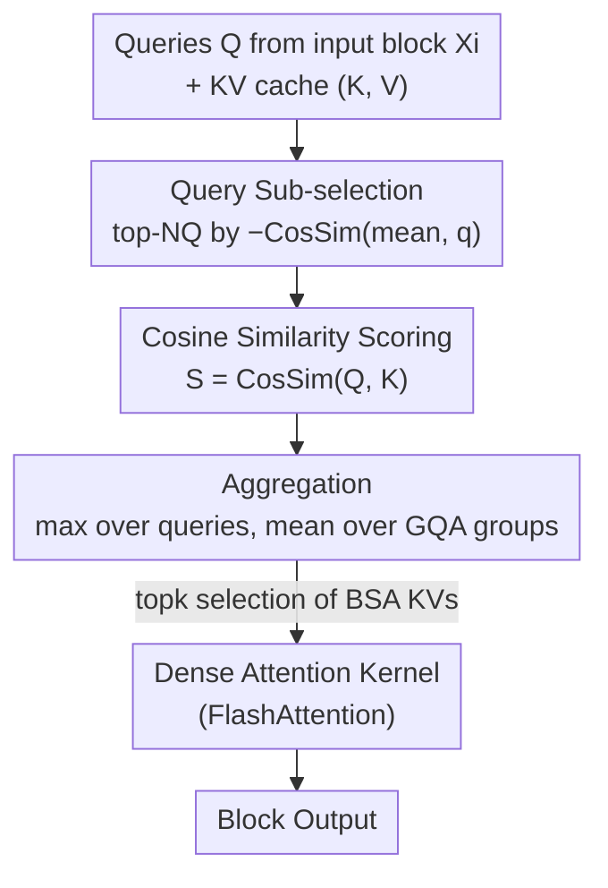

# QuoKA: Query-Oriented KV Selection for Efficient LLM Prefill

**Conference**: ICLR 2026  
**OpenReview**: [https://openreview.net/forum?id=YS4N1YxXSM](https://openreview.net/forum?id=YS4N1YxXSM)  
**Code**: TBD  
**Area**: LLM Efficiency  
**Keywords**: Sparse Attention, Chunked Prefill, KV Selection, Query Selection, Long Context Inference

## TL;DR
QuoKA proposes a training-free sparse attention method that does not depend on custom kernels. During the chunked prefill phase, it utilizes the geometric observation that "queries farther from the mean are more important" to select a few representative queries. Key KVs are then chosen for these queries using cosine similarity. This reduces attention computation to sub-quadratic complexity, achieving a 3× reduction in TTFT latency and up to ~7× attention speedup while maintaining near-lossless performance on long-context tasks.

## Background & Motivation
**Background**: The prefill stage of LLM inference processes the entire input prompt at once to initialize the KV cache. Its attention complexity is $O(T^2)$. For long prompts, prefill can account for over 70% of the total runtime, which is particularly critical on CPUs, consumer GPUs, and edge accelerators. To alleviate scheduling and memory pressure, mainstream deployments increasingly adopt chunked prefill: splitting the input into fixed-size blocks of $B_{CP}$ and processing them sequentially. To truly break the quadratic complexity, sparse attention is required, where only a subset of the most relevant KVs is selected for each query.

**Limitations of Prior Work**: Sparse attention is divided into two categories. Pattern-based methods (fixed patterns like block/strided/banded) rely on kernel-level optimizations. However, under chunked prefill, they are limited by dynamic computation graphs and KV cache bandwidth bottlenecks, requiring custom CUDA kernels and lacking cross-hardware portability. Query-dependent methods (adaptive selection on KV cache) are more portable and save both computation and memory access. Yet, almost all are designed for the **generation phase**. In generation, there is only a single query, making KV relevance straightforward to judge. In prefill, one must select KVs for an **entire block of queries** simultaneously. Simply averaging scores across multiple queries leads to significant performance drops, exacerbated in chunked prefill where the same important KVs are repeatedly sub-selected.

**Key Challenge**: While identifying "important KVs" for a single query is intuitive, parallel multi-query scenarios present vast geometric differences between queries and keys. Flattening these differences with an aggregated score (especially the mean) loses "minority but critical" query-key interactions.

**Key Insight**: Instead of modifying the kernel, the authors observe the geometric structure of queries. They find that **queries with lower cosine similarity (farther angular distance) to the mean query tend to interact strongly with a wide range of keys and contribute most to the final attention logits**. Queries near the mean are concentrated on a few shared keys, representing information redundancy. Empirical evidence in Figure 2 shows that queries far from the mean are closer to key clusters in PCA projections, with a correlation coefficient as high as 0.737 with $\max_k(A)$.

**Core Idea**: First select a small number of informative representative queries based on their "angular distance from the mean query," then select key KVs for these specific queries using cosine similarity. This "query geometry" metric correctly and efficiently addresses the KV selection problem in multi-query prefill.

## Method

### Overall Architecture
QuoKA aims to select a small subset of truly important KVs for each input block in chunked prefill, ensuring that "sparse attention using only these KVs" closely approximates "dense attention using all KVs." The process is: input sequences are split into blocks $\{X_0, X_1, \dots\}$; for each new block $X_i$, QuoKA performs three sub-selection steps between its queries and the KV cache (current block + all previous blocks): Query Sub-selection → Cosine Similarity Scoring → Aggregation across queries/GQA groups. This yields a shrunk KV subset $(K^\star, V^\star)$, which is fed into a standard dense attention kernel (e.g., FlashAttention). Since each block only computes attention over $B_{SA}$ KVs, overall complexity drops from $O(T^2)$ to sub-quadratic. The workflow uses only standard linear algebra operators (normalization, matmul, topk, gather), making it hardware-agnostic and plug-and-play.

### Key Designs

**1. Query Sub-selection: Eliminating redundant queries using the "farther from mean is more important" geometric prior**

This step addresses the redundancy and cost of using all queries to select KVs in multi-query prefill. QuoKA treats queries unequally: it calculates the mean query $M_Q = \text{mean}(Q)$, then scores each query by its **negative cosine similarity** to the mean, $S_q = -\text{CosSim}(M_Q, q)$, keeping the top-$N_Q$ (often 16 in experiments). The intuition is: if query $q$ interacts strongly with a key $k$, its cosine similarity with $k$ is high, while $k$'s similarity with the mean query is low, implying $q$ is far from the mean ($S_q$ is high). Theorem 1 formalizes this: given fixed $q_0$ and $k$, if $\text{CosSim}(k, q_0)=\beta_q>0$ and $\text{CosSim}(M_Q, k)=\alpha_q<0$, then $\text{CosSim}(M_Q, q^*) \le 1 + \alpha_q\beta_q - 0.5\alpha_q^2 - 0.5\beta_q^2$. Thus, picking queries with high $S_q$ picks those that contribute most to the attention distribution, approximating the post-softmax attention matrix $A$ with minimal queries. This is the counter-intuitive key point of QuoKA: preferring outliers over the mean.

**2. Cosine Similarity Scoring: Replacing unstable dot products with bounded, geometry-aware proxies**

After selecting representative queries, their interaction with keys must be evaluated. Existing methods often use raw dot products $QK^\top$, which are scale-dependent and prone to being dominated by large magnitudes in certain dimensions during aggregation. QuoKA uses cosine similarity $S = \text{CosSim}(Q, K)$, normalizing both queries and keys to unit length. This yields a **bounded** proxy (within $[-1,1]$) for softmax weights. Normalized attention itself has been shown in recent work to approximate softmax behavior. This is not purely an optimization: ablation on RULER (Table 9) shows that cosine similarity improves sub-selection quality by over 10% compared to dot products.

**3. Aggregation across queries/groups: Max over queries to preserve long tails, mean over GQA groups with pre-aggregation for efficiency**

Scores are aggregated along two axes: across queries and across GQA head groups. **The query axis uses max instead of mean**: averaging flattens "rare but important" query-key interactions. Figure 3 shows that the distribution of attention scores deviating from the mean is heavy-tailed; thus, taking the maximum $\hat S = \max_q S$ preserves these outlier strong interactions, a strategy confirmed by RULER results (Table 10). **The GQA group axis uses mean**: head importance is correlated, making the mean both accurate and stable. Crucially, due to normalization and linearity, "scoring then averaging by group" can be rewritten as "averaging normalized queries by KV group then scoring"—a **pre-aggregation** form (Algorithm 1, line 8: $\bar Q = \text{mean}(\cdot)$). Pre-aggregation reduces computation and memory overhead by a factor of the "number of KV groups," which is significant in modern models, ensuring native GQA compatibility and further speedup.

> These steps correspond to Algorithm 1: Query Selection (topk $N_Q$) → Post-normalization pre-aggregation scoring $S = \bar Q K^\top$ → Max across queries to get $\hat S$, followed by topk selection of $B_{SA}$ KVs and gather $(K^\star, V^\star)$.

## Key Experimental Results

### Main Results
Models tested include Llama3.2-3B, Qwen2.5-3B, Qwen3-4B, Qwen3-30B-A3B (MoE), Smollm3, and GPT-OSS-20B, covering various architectures (RoPE/NoPE, MoE). All use chunked prefill ($B_{CP}=128$) on A100 GPUs. Baselines include SampleAttention, LessIsMore, SparQ, Loki, SnapKV, and KeyDiff.

RULER ($B_{SA}=1024$, higher is better, 32k length excerpt):

| Model (32k) | SampleAttn | SparQ | Loki | LessIsMore | QuoKA |
|--------|------|------|------|------|------|
| Llama3.2-3B | 31.73 | 31.14 | 8.05 | 19.16 | **57.01** |
| Qwen2.5-3B | 36.17 | 36.74 | 34.12 | 10.12 | **59.37** |
| Qwen3-4B | 40.72 | 35.20 | 39.31 | 14.87 | **74.83** |
| Smollm3 | 45.98 | 18.69 | 22.66 | 24.21 | **61.37** |
| GPT-OSS-20B | 30.42 | 15.20 | 39.92 | 20.11 | **57.79** |

QuoKA consistently leads across all models and lengths, outperforming the strongest baselines by 10–20 points. On LongBench (normalized to dense baseline=1.0), with a small budget of $B_{SA}=512$, QuoKA stays within the 0.87–1.0 range, while baselines drop to 0.4–0.75.

### Ablation Study

| Configuration / Setting | Key Finding | Description |
|------|---------|------|
| CosSim vs Dot Product (RULER, Table 9) | Selection Quality +10%↑ | Validates Design 2: Bounded proxy superior to dot product |
| Query Axis max vs mean (RULER, Table 10) | max is superior | Validates Design 3: Preserving heavy-tail interactions |
| $B_{SA}$ Scan (LongBench/RULER) | <12% tokens, <3% drop | Accuracy degrades **gradually** with sparsity |
| $N_Q = \tfrac{1}{16}B_{CP}$ (Table 12) | ~3% drop only | Minimal queries approximate full attention |
| Varying $B_{CP}$ (Table 11) | Performance stable | Robust to chunk size |

### Key Findings
- **Benefits stems from "Query Geometry"**: Dropping the representative query count to $N_Q = \frac{1}{16}B_{CP}$ causes only a ~3% drop, proving that a few queries far from the mean carry the vast majority of attention contribution—the empirical foundation of the method.
- **Gradual accuracy degradation**: Using less than 12% of tokens results in less than 3% drop. Stability across $B_{CP}$ and model families allows flexible deployment based on hardware constraints.
- **Applicability to Generation**: Although focused on prefill, QuoKA outperforms generation-specific sparse methods on Math500 (where there is a single query and no selection required), sometimes even exceeding dense attention.
- **Speed**: Achieves 5× speedup for the attention module at 30k tokens and 3× TTFT improvement at 50k tokens. On Intel Xeon CPUs and RTX 2080 consumer GPUs, it provides 5–6× speedup for long context, saving 88% of KV pairs.

## Highlights & Insights
- **Counter-intuitive "Farther is More Important"**: While sparsification usually preserves "similar/central" items, QuoKA preserves queries **least similar** to the mean. Theorem 1 provides geometric proof. This observation is the most valuable contribution, potentially transferable to other sparsification scenarios requiring representative selection from vector sets.
- **Pre-aggregation as a Free Lunch for GQA**: Leveraging normalization and mean linearity to rewrite the scoring process avoids the cost associated with the number of KV groups, providing a clean algebraic trick.
- **Kernel Independence**: Using only standard linear algebra operators allows direct reuse of hardware-tuned kernels like FlashAttention. This portability is rare among sparse methods that typically rely on custom CUDA kernels.

## Limitations & Future Work
- The methodology assumes the geometric observation "low cosine similarity queries dominate attention" holds. This was validated on several layers/heads of decoder-only LLMs (e.g., Llama3.2-3B layer 0 head 11), but its universality across all layers, architectures (e.g., non-RoPE), and extremely long contexts/RAG scenarios is not guaranteed.
- Hyperparameters ($N_Q$, $B_{SA}$, $B_{CP}$) need tuning based on hardware; while proven robust, optimal configurations still require search per deployment.
- Primary gains occur during long-prompt prefill. In short-prompt or generation-dominated scenarios where the KV cache is not the bottleneck, acceleration room is limited.
- Evaluation focuses on synthetic/long-context retrieval and math reasoning; performance in complex real-world multi-turn dialogues or agent scenarios remains to be verified.

## Related Work & Insights
- **vs SampleAttention**: Both target prefill, but SampleAttention treats queries within a block **homogeneously** (uniform sampling), ignoring geometric differences. QuoKA selects representatives by angular distance, achieving higher sparsity at the same accuracy.
- **vs SparQ / Loki**: These approximate along the **channel dimension** (SparQ sub-selects channels, Loki projects K/Q to low dimensions) for single queries. QuoKA performs geometric selection along the **query dimension**, specifically targeting the multi-query prefill setup.
- **vs LessIsMore**: LessIsMore computes sparse scores only at specific layers. QuoKA is block-wise and query-geometry driven, showing significant leads on RULER (e.g., Llama3.2-3B 32k: 57.01 vs 19.16).
- **vs Pattern-based Sparse Attention**: Fixed-pattern methods rely on custom kernels and lack portability, suffering from bandwidth bottlenecks in chunked prefill. QuoKA achieves cross-hardware deployment using standard operators.

## Rating
- Novelty: ⭐⭐⭐⭐⭐ The "farther from mean query is more important" observation is counter-intuitive, novel, and theoretically supported.
- Experimental Thoroughness: ⭐⭐⭐⭐⭐ Tested on 6 model families, 4 benchmarks, multiple hardware (CPU/GPU), with targeted ablations on aggregation strategies.
- Writing Quality: ⭐⭐⭐⭐ Clear chain from observation to theory to algorithm. Figures are informative, though some symbols (e.g., pre-aggregation dimensions) require careful reading.
- Value: ⭐⭐⭐⭐⭐ Training-free, hardware-agnostic, and plug-and-play; highly valuable for deploying long-context inference on edge/consumer hardware.

<!-- RELATED:START -->

## Related Papers

- [\[ICLR 2026\] FreeKV: Boosting KV Cache Retrieval for Efficient LLM Inference](freekv_boosting_kv_cache_retrieval_for_efficient_llm_inference.md)
- [\[ICLR 2026\] Randomization Boosts KV Caching, Learning Balances Query Load: A Joint Perspective](randomization_boosts_kv_caching_learning_balances_query_load_a_joint_perspective.md)
- [\[ICLR 2026\] ProtoKV: Knowledge in Long Context is Already Organized Before You Query](protokv_long-context_knowledges_are_already_well-organized_before_your_query.md)
- [\[ICLR 2026\] Influence-Preserving Proxies for Gradient-Based Data Selection in LLM Fine-Tuning](influence-preserving_proxies_for_gradient-based_data_selection_in_llm_finetuning.md)
- [\[ICLR 2026\] ThinKV: Thought-Adaptive KV Cache Compression for Efficient Reasoning Models](thinkv_thought-adaptive_kv_cache_compression_for_efficient_reasoning_models.md)

<!-- RELATED:END -->
