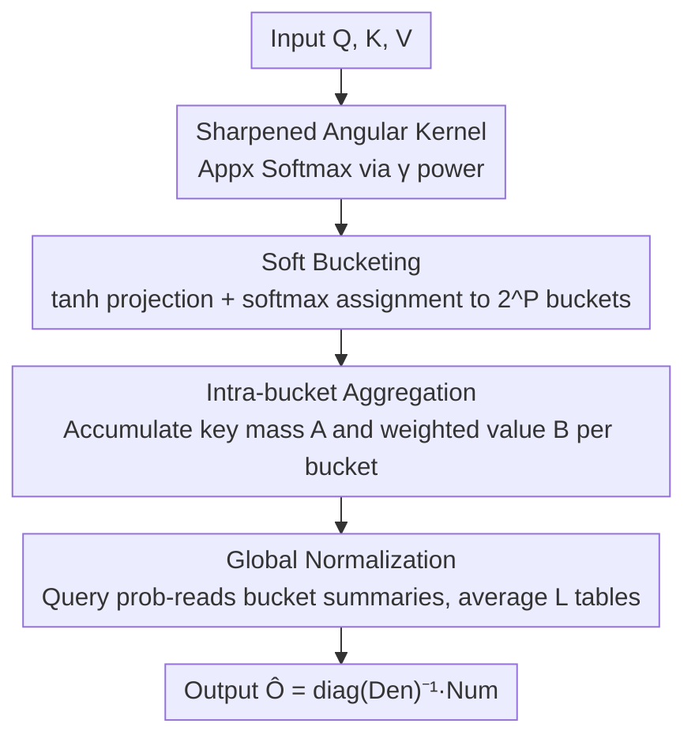

# RACE Attention: A Strictly Linear-Time Attention Layer for Training on Outrageously Large Contexts

**Conference**: ICLR 2026  
**OpenReview**: [https://openreview.net/forum?id=RR8Lh8RHgA](https://openreview.net/forum?id=RR8Lh8RHgA)  
**Code**: https://github.com/sahiljoshi515/RACE_Attention  
**Area**: LLM Efficiency  
**Keywords**: Linear Attention, Locality Sensitive Hashing, RACE sketch, Long Context, Angular Kernel

## TL;DR
This paper replaces Softmax attention with a "sharpened angular kernel + differentiable LSH sketch (RACE)," turning attention into an operator that is **strictly linear** in both sequence length and embedding dimension. This pushes the manageable context for a single-layer attention from FlashAttention's ~4 million tokens to 12 million on GPU and 75 million on CPU, while maintaining parity or better accuracy on real-world tasks within 64K.

## Background & Motivation
**Background**: Transformers are the backbone of modern sequence modeling, but their core primitive—Softmax attention—has a quadratic complexity of $O(N^2 d)$ regarding sequence length $N$. Even highly optimized exact implementations like FlashAttention-2/3, which reduce memory usage through tiling, still compute all query-key interactions, remaining quadratic in time.

**Limitations of Prior Work**: The authors identify a concrete "ceiling": on a 96GB NVIDIA GH200, FlashAttention-2/3 cannot complete a single forward+backward pass for one attention layer (batch 1, 4 heads, $d=128$) once the context exceeds ~4 million tokens. Reaching "outrageously large contexts" (target: hundreds of millions) can be partially mitigated by massive distributed hardware, but this is unaffordable for most researchers, necessitating a redesign from the attention mechanism itself.

**Key Challenge**: Existing linear/low-rank approximations (Linear Attention, Performer, Linformer, Nyströmformer, etc.) reduce complexity but generally suffer from three issues: significant accuracy loss (e.g., Linear Attention using $\phi(x)=\text{elu}(x)+1$ results in poor precision), quadratic overhead in embedding dimension $d$ (e.g., Performer requires high-dimensional random Fourier features to be accurate), or lack of support for autoregressive (causal) tasks (e.g., projection/landmarks in Linformer/Nyströmformer cannot be causally masked). Most also lack a rigorous theoretical framework linking efficiency to accuracy, leading to unstable hyperparameter selection. Consequently, Softmax attention remains the most trusted choice despite many approximations.

**Key Insight**: Softmax is effective because the exponentiation provides **strong non-linear amplification** of similarity, ensuring non-negative and normalized weights. If a similarity kernel can be found that is similarly "highly non-linear, normalized, and exactly estimable in linear time," it can replace Softmax. They selected the classic **angular kernel** (dependent only on the angle between $Q_i$ and $K_j$, invariant to norm), which is naturally LSH-able and allows for linear-time kernel density estimation using RACE sketches.

**Core Idea**: Approximate Softmax with a "sharpened angular kernel" and use **differentiable soft LSH buckets** (soft RACE sketch) to directly estimate the sufficient statistics for attention output without constructing the $N \times N$ matrix. This results in an attention layer that is linear in $N$ and $d$ and supports end-to-end training and causal modeling.

## Method

### Overall Architecture
RACE Attention is a **drop-in replacement** for Softmax attention. Its core shift is: instead of explicitly computing similarities for every query against all $N$ keys, it soft-assigns all queries/keys into a fixed number of LSH buckets. Each query interacts only with a **fixed-size bucket summary library** ($S = LR$ bucket statistics), avoiding any $N^2$ intermediate quantities.

First, the Softmax exponential kernel is replaced by a **sharpened angular kernel**: the original angular similarity $\text{sim}(Q_i,K_j)=1-\cos^{-1}\!\big(\tfrac{Q_i^\top K_j}{\|Q_i\|\|K_j\|}\big)/\pi$ is relatively "flat" in high-similarity regions. It is sharpened by taking it to the power of $\gamma$:

$$\text{sim}(Q_i,K_j)=\Big(1-\cos^{-1}\big(\tfrac{Q_i^\top K_j}{\|Q_i\|\|K_j\|}\big)/\pi\Big)^{\gamma}$$

The authors prove that with a moderate $\gamma$ (e.g., $\gamma=8$), this high-degree monomial is nearly indistinguishable from the Softmax kernel. Crucially, **any integer power of the angular kernel belongs to a kernel family that can be efficiently estimated by RACE sketches.**

Second, **soft RACE sketches** estimate this kernel in linear time. The operator (Algorithm 1) consists of three stages: soft bucketing → intra-bucket aggregation → global normalization, averaged across $L$ independent hash tables. The data flow is as follows:

By avoiding the $N \times N$ matrix, the working set remains small, significantly reducing activation memory, which is the fundamental reason it can scale to millions of tokens.

### Key Designs

**1. Sharpened Angular Kernel: A Linear-time Estimable Softmax-like Similarity**
Existing linear kernels (e.g., elu+1) lose accuracy because they omit the "strong non-linear amplification" of Softmax. Instead of approximating the exponent itself, the authors switch to the angular kernel. An original angular kernel is too flat, so sharpening via the $\gamma$-th power makes it approach Softmax. Crucially, **the $P$-th power of the angular kernel equals the collision probability when using $P$ random hyperplanes for SimHash**, i.e., $\Pr[h(Q_i)=h(K_j)]=\text{sim}(Q_i,K_j)$. This transforms kernel calculation into "counting collisions," enabling sketch estimation.

**2. Soft RACE Sketch: Replacing the Matrix with Bucket Statistics**
Classic RACE (Coleman & Shrivastava) hashes data into LSH buckets (ACE arrays). A query only reads its hit bucket to provide an **unbiased estimate** of kernel density sums $\sum_x k(x,q)^p$. RACE Attention maintains a mass vector $A^{(\ell)}$ (accumulated key mass per bucket) and a value-sum matrix $B^{(\ell)}$ (accumulated weighted values per bucket) for each of the $L$ tables. Through query bucket probabilities, it estimates $\text{Num}=\frac1L\sum_\ell \Phi_Q^{(\ell)}B^{(\ell)}$ and $\text{Den}=\frac1L\sum_\ell \Phi_Q^{(\ell)}A^{(\ell)}$, with final $\hat O=\text{diag}(\text{Den})^{-1}\text{Num}$. Complexity is $O(LNRd)$ time and $O(L(NR+Rd))$ space, where $R,L \ll N, d$.

**3. Differentiable Soft Bucketing: Discrete Hashing to Continuous Gradients**
Classic RACE uses hard hashing $h(x)=\text{sign}(W^{(\ell)}x)$, which is non-differentiable. The authors use a **soft sign** instead: computing $\tanh(W^{(\ell)}x)$ and using softmax with temperature $\beta$ to measure alignment with $R=2^P$ hypercube corners $v_r\in\{\pm1\}^P$:

$$[\phi^{(\ell)}(x)]_r=\frac{\exp\{\beta\,(\tanh(W^{(\ell)}x))^\top v_r\}}{\sum_{r'}\exp\{\beta\,(\tanh(W^{(\ell)}x))^\top v_{r'}\}}$$

This transforms discrete collisions into differentiable soft assignments while preserving angular dependence, allowing end-to-end training while remaining linear in $d$.

**4. Single-flow Prefix Causal Kernel: Enabling Autoregressive Training**
RACE's bucket aggregation is naturally suited for **prefix sums**. The authors implemented custom OpenMP/CUDA kernels (Algorithm 2) to perform the aggregation of keys $j \le i$ in a single streaming pass, enabling efficient causal training for large-scale language modeling.

### Loss & Training
The method is a drop-in replacement; it does not change the objective. The differentiable sketch allows standard cross-entropy loss to propagate to projection matrices $W^{(\ell)}$. Temperature $\beta$ is a **learnable parameter**. Theoretical analysis (Theorem 2) suggests the estimation error decomposes into a bias $O(P/\beta)$ and a variance $O(\sqrt{\log(N/\delta)/L})$. Proper choice of $L=\Theta(\log N)$ and adaptive $\beta$ prevents variance/bias explosion.

## Key Experimental Results

### Main Results
On Arxiv long-document classification (64K length) using an A100:

| Method (64K) | Train Time↓ | Test Time↓ | Accuracy↑ |
|:---|:---:|:---:|:---:|
| RACE (P=3,L=3) | 584s | 22.5s | **97.92%** |
| RACE (P=2,L=2) | 561s | 22s | 97.14% |
| Linear | 591s | 22.8s | 96.35% |
| Performer-256 | 952s | 35s | 96.61% |
| FlashAttention2 | 1645s | 47s | 97.0% |

RACE is ~3x faster than FlashAttention2 during training with higher accuracy. On standard tasks (WikiText-103), RACE (P=4, L=4) achieves a PPL of 20.9, matching FlashAttention2.

### Extreme Length Scaling

| Hardware | RACE Limit | FlashAttn Limit | Speedup |
|:---|:---:|:---:|:---:|
| GH200 (96GB) | **12M tokens** | ~4M tokens | ~5500× @ 4M |
| Xeon 5220R CPU | **75M tokens** | ~2M (Extremely slow) | >10000× @ 33M |

On GH200 at 4M tokens, RACE takes ~0.1s while FlashAttention2 takes ~550s. Notably, CPU-RACE at 4M tokens is ~40x faster than GPU-FlashAttention2, demonstrating that "the right algorithm beats specialized hardware acceleration."

### Key Findings
- **Bucket parameters (P, L) control the efficiency-accuracy trade-off**: $P$ determines kernel sharpness; $L$ reduces variance. Most tasks require $P,L \in \{2,3,4\}$.
- **Differentiable design outperforms YOSO**: YOSO's hard LSH is quadratic in $d$ and OOMs after 32K tokens, whereas RACE scales to millions.
- **Linear baselines are often slower and less accurate**: Linear/Performer are ~10x slower than RACE due to large hidden constants and OOM at ~33M tokens.

## Highlights & Insights
- **Kernel Switch vs. Approximation**: Instead of approximating the index, switching to a "hashable" kernel (angular) with sharpening allows for exact linear-time estimation with quantifiable error bounds.
- **Attention as Kernel Density Estimation**: Rewriting attention as bucket summary reads is fundamental to achieving linearity in both $N$ and $d$.
- **Soft Bucketing is a reusable trick**: The $\tanh$ + corner-aligned softmax leisure can be applied to any differentiable LSH-based routing.
- **Algorithm > Hardware**: The fact that CPU-RACE beats GPU-FlashAttention proves that long-context bottlenecks are algorithmic ($N^2$) rather than hardware-bound.

## Limitations & Future Work
- **Theory Gap**: Theorem 2 only covers the non-causal setting; the strict error analysis for the causal version remains an open problem.
- **Single-layer Scaling**: Extreme scaling was demonstrated on a single attention layer; performance in deep multi-layer networks at billion-token scales requires further validation.
- **Hyperparameter Sensitivity**: The balance between $P, L, \beta$ introduces complexity in hyperparameter tuning across diverse tasks.

## Related Work & Insights
- **vs. YOSO**: Both use the angular kernel, but YOSO's hard LSH and auxiliary sampling make it quadratic in $d$ and difficult to train end-to-end. RACE is strictly linear and supports causal masks.
- **vs. Linear Attention**: Linear attention uses weak kernels like $elu+1$, losing the sharpening effect. RACE maintains high precision via the power-sharpened angular kernel.
- **vs. Performer**: Performer requires high-dimensional features (quadratic in $d$) to be accurate. RACE remains linear in $d$.
- **vs. FlashAttention-2/3**: FlashAttention reduces memory but stays $O(N^2)$ in time. RACE reduces time to $O(N)$ and activation memory to $O(L(NR+Rd))$.

## Rating
- Novelty: ⭐⭐⭐⭐⭐ 
- Experimental Thoroughness: ⭐⭐⭐⭐ 
- Writing Quality: ⭐⭐⭐⭐⭐ 
- Value: ⭐⭐⭐⭐⭐ 

<!-- RELATED:START -->

## Related Papers

- [\[ICLR 2026\] Log-Linear Attention](log-linear_attention.md)
- [\[ICLR 2026\] Local Linear Attention: An Optimal Interpolation of Linear and Softmax Attention for Test-Time Regression](local_linear_attention_an_optimal_interpolation_of_linear_and_softmax_attention_.md)
- [\[ICML 2026\] Dynamic Linear Attention](../../ICML2026/llm_efficiency/dynamic_linear_attention.md)
- [\[ICLR 2026\] In-Place Test-Time Training](in-place_test-time_training.md)
- [\[ICLR 2026\] MHLA: Restoring Expressivity of Linear Attention via Token-Level Multi-Head](mhla_restoring_expressivity_of_linear_attention_via_token-level_multi-head.md)

<!-- RELATED:END -->
