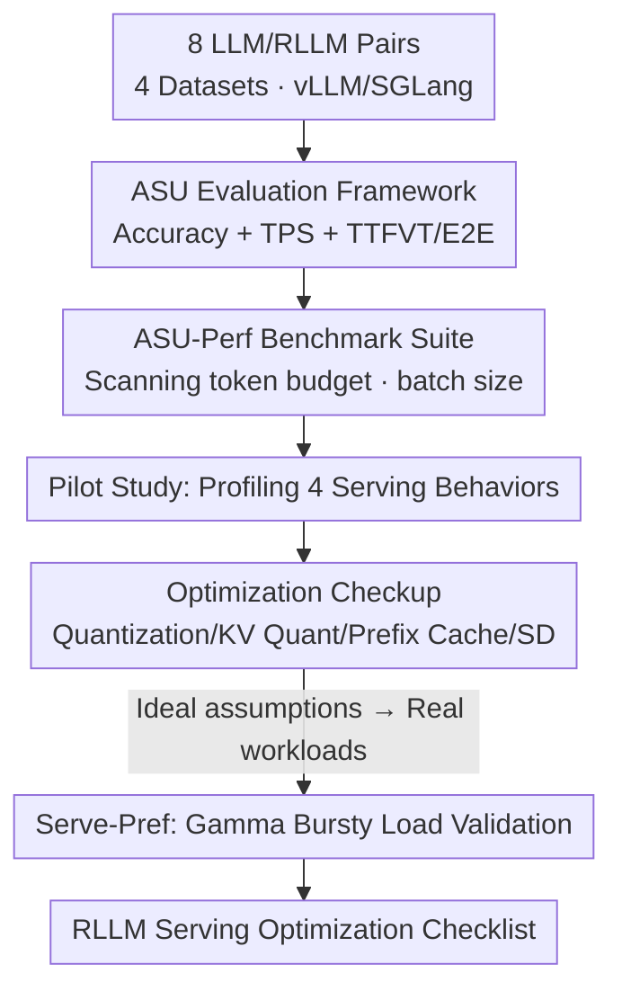

# Reasoning Language Model Inference Serving Unveiled: An Empirical Study

**Conference**: ICLR 2026  
**OpenReview**: [https://openreview.net/forum?id=6CGjZYp6ft](https://openreview.net/forum?id=6CGjZYp6ft)  
**Code**: https://github.com/lqinfdim/RLMServing  
**Area**: LLM Efficiency / Inference Serving / Systems  
**Keywords**: Reasoning LLMs, Inference Serving, KV Cache, Quantization, Speculative Decoding  

## TL;DR
This is the first empirical study systematically characterizing the serving behavior of "Reasoning Large Language Models (RLLMs)" in online inference. The authors propose the ASU evaluation framework and ASU-Perf benchmark suite, identifying four significant differences between RLLMs and standard LLMs (intense VRAM fluctuations, straggler requests, difficulty-adaptive runtime, and domain preferences). The study further evaluates whether optimization techniques designed for traditional LLMs—such as weight quantization, KV Cache quantization, prefix caching, and speculative decoding—remain effective for RLLMs.

## Background & Motivation
**Background**: Reasoning Large Language Models (RLLMs), represented by OpenAI o1, DeepSeek-R1, and Qwen-3, have significantly outperformed standard LLMs on System-2 tasks (e.g., mathematics and coding) through "long Chain-of-Thought (CoT) + test-time scaling." This makes it feasible for small organizations to deploy medium-to-small RLLMs as assistants using limited GPU resources.

**Limitations of Prior Work**: Existing inference engines—such as vLLM, LMDeploy, and TensorRT-LLM—were designed for traditional LLMs. RLLMs generate a massive number of "thinking tokens" before producing an answer. Whether their serving-side behavior differs from traditional LLMs, and whether existing optimization techniques remain effective, has not been systematically studied. Directly applying traditional methods may lead to suboptimal or even detrimental serving performance.

**Key Challenge**: The "long CoT" is the source of RLLM's strength but also a burden for serving systems. It transforms inference characteristics from the "heavy prefill, light decode, short output" profile of traditional LLMs into a "heavy decode, long output, and high variability" profile. The batching, KV Cache management, and scheduling assumptions of current engines are built on the old characteristics.

**Goal**: The study addresses three sub-problems: (1) Are there fundamental differences in serving behavior between RLLMs and LLMs? (2) Are traditional LLM optimization techniques (weight quantization, KV Cache quantization, prefix caching, speculative decoding) still effective for RLLMs? (3) Do these findings hold under real-world, bursty online workloads?

**Key Insight**: Instead of inventing a new engine, the authors first establish an evaluation framework that simultaneously measures "accuracy + service-side metrics + user-side metrics." They then conduct extensive comparative experiments using a unified benchmark with 8 paired LLM/RLLM configurations (e.g., Qwen-2.5-Math-7B ↔ DeepSeek-R1-Distill-Qwen-7B) on vLLM/SGLang, using execution traces to deduce the causes of observed phenomena.

**Core Idea**: By using a tri-fold "Accuracy-Service-User (ASU)" evaluation framework and paired control experiments, the study profiles RLLM serving behavior for the first time and provides an empirical checklist of which LLM optimization techniques can be directly migrated and which may fail.

## Method
This is an empirical study rather than an algorithmic proposal. The "Method" refers to the evaluation methodology: the ASU framework, the ASU-Perf/Serve-Pref benchmark suites, the paired experimental design, and the analysis method of deriving causes from execution traces.

### Overall Architecture
The pipeline progresses through three stages. The first stage is the **Pilot Study**: under the ASU-Perf benchmark, LLMs and RLLMs of the same scale (7B/14B/32B/70B) are paired as control groups. Different token budgets and batch sizes are tested on vLLM/SGLang to record execution traces, distilling four distinct RLLM serving behaviors. The second stage is the **Optimization Checkup**: under the prerequisite of maintaining accuracy, four classical LLM optimization categories (weight quantization, KV Cache quantization, prefix caching, speculative decoding) are tested on RLLMs. The third stage is **Real-world Workload Validation**: the ideal assumption of "synchronous batch arrivals" is replaced by bursty streaming workloads modeled by a Gamma distribution to verify the pilot study's findings. All stages share the ASU metric suite to ensure comparability.

### Key Designs

**1. ASU Tri-fold Evaluation Framework: Metrics for Accuracy, Service-side, and User-side**

The value of RLLMs lies in whether the output quality justifies the high inference cost. Merely looking at throughput or accuracy can be misleading. The authors propose the ASU (Accuracy, Service-end, User-end) framework, requiring improvements across all three categories. Accuracy uses dataset-specific metrics. The service-end focuses on throughput via TPS (Tokens Per Second). The user-end focuses on response speed, specifically using **TTFVT (Time To First Visible Token)** instead of the traditional TTFT. Since "thinking tokens" in RLLMs like o1 are invisible to users, the user actually waits for the first answer token after the thinking phase. This is combined with E2E (End-to-End) runtime. This framework reveals trade-offs; for example, speculative decoding might improve one metric while degrading another.

**2. ASU-Perf / Serve-Pref Benchmark Suites + Paired Control Design: Isolating RLLM vs. LLM Differences**

To answer whether differences are fundamental, confounding variables like "model architecture" must be excluded. The authors use **paired (tuned counterpart) control**: each RLLM is matched with its corresponding LLM version (e.g., DeepSeek-R1-Distill-Qwen-7B vs. Qwen-2.5-Math-7B). Comparisons at the same scale, engine, batch size, and token budget ensure that differences are attributable solely to the "reasoning paradigm." The ASU-Perf suite sweeps token budgets ($0.25$K to $20$K) and batch sizes across datasets spanning a difficulty gradient: GSM8K (Easy), MATH-500 (Medium), and AIME-2024 (Hard), plus GPQA for "Knowledge vs. Reasoning." The **Serve-Pref** suite mimics BurstGPT-Perf, using a Gamma distribution to generate streaming, random, and bursty requests.

**3. Trace-based Causal Analysis: Linking Phenomena to Engine Mechanisms**

The authors analyze execution logs and traces to link behaviors back to engine mechanisms. **VRAM Fluctuation**: RLLMs output significantly more tokens, causing KV Cache usage to surge, sometimes swinging between $3\%$ and $70\%$ (LLMs typically stay below $3\%$). The abrupt drop occurs because engines discard KV Caches immediately upon request completion—the root cause is the "long CoT + release-on-completion" strategy. **Stragglers**: In a batch, easy problems finish early while a few hard ones persist. If the engine waits for the full batch to finish before the next, hardware utilization and throughput tank. **Adaptive Runtime**: RLLM CoT length correlates with problem difficulty, whereas LLM runtime is primarily linear to sample count. **Domain Preference**: RLLMs significantly outperform LLMs in math but only break even on knowledge-intensive tasks (GPQA). These findings suggest optimization directions: fine-grained KV lifecycle management, difficulty-aware scheduling, and asymmetric resource allocation for prefill vs. decode.

## Key Experimental Results

### Pilot Study: Four Differences between RLLM and LLM

| Dimension | LLM Behavior | RLLM Behavior |
|-----------|--------------|---------------|
| KV Cache Occupancy | Typically $< 3\%$, stable | $3\% \sim 70\%$ intense fluctuation; near $100\%$ under real loads |
| Request Runtime Dist. | Low variance in batches | Long-tailed; a few hard problems become stragglers |
| Runtime vs. Difficulty | Linear with sample count | Strongly correlated with problem difficulty (longer CoT) |
| Domain Performance | Weak math, stable knowledge | Significantly stronger math, equal knowledge (GPQA) |

The token budget experiments found that $4096 \sim 8192$ tokens suffice for most datasets. However, exceeding this budget caused accuracy drops in GPQA and AIME24, suggesting "overthinking." Increasing batch size did not affect accuracy and improved TPS but increased average TTFVT.

### Optimization Checkup (Under Accuracy Maintenance)

| Technique | Net Effect on RLLM Serving | Key Caveat |
|-----------|----------------------------|------------|
| Weight Quant. (MWQ) | GPTQ-Int4 / FP8 generally maintain performance (approx. $\pm 3\%$) and save VRAM | GPTQ drops $15 \sim 25\%$ on hard tasks like AIME24; AWQ/Linear-4bit maintained performance but doubled E2E |
| KV Cache Quant. (FP8) | Improves speed on 14B/32B while maintaining performance | Performance nearly collapsed on 7B models, likely due to architecture/engine incompatibility |
| Prefix Caching (PC) | Significant speedup for RLLMs $\ge 14$B without performance loss | Increased latency for $< 8$B models; hash computation becomes a net overhead in single-turn settings |
| Speculative Dec. (SD) | Reduces E2E runtime across all scales with no accuracy loss | Significantly reduces TPS and worsens TTFVT |

### Key Findings
- Many LLM optimizations migrate seamlessly to RLLMs, but the same techniques often produce opposite effects on small models (especially 7B). Small models are "high-risk zones" for RLLM serving optimization.
- Nearly every optimization involves a trade-off: Speculative Decoding gains runtime at the cost of throughput and first-token latency, highlighting the value of the ASU framework.

## Highlights & Insights
- **TTFVT is a clever metric adaptation**: By incorporating the "invisible thinking token" reality of commercial RLLMs, the framework avoids overestimating user experience via traditional TTFT.
- **Paired control is critical for attribution**: Matching RLLMs with their base LLM counterparts separates "paradigm differences" from "model differences," a design applicable to any "System A vs. System B" study.
- **Mechanism-to-Optimization Loop**: Tracing VRAM spikes to "release-on-completion" and stragglers to "synchronous batching" provides a roadmap for RLLM-specific engines (e.g., difficulty-aware scheduling).

## Limitations & Future Work
- The root cause of optimization failure on small models (e.g., 7B KV quantization) remains a hypothesis (architecture-engine incompatibility) and requires deeper investigation.
- The optimization checkup was mostly performed under ideal batch assumptions; performance boundaries under real-world bursty loads need further completion.
- Evaluations are limited to math-heavy tasks and GPQA. Coding and long-horizon planning are not yet covered. Only the DeepSeek-R1-Distill family was tested; generalization to other RLLM families needs verification.
- The paper diagnoses but does not "cure"—it identifies optimization directions but does not implement an RLLM-specific engine.

## Related Work & Insights
- **vs. vLLM / DistServe**: While these optimize KV management (PagedAttention) and prefill-decode separation for LLMs, this study shows these mechanisms mismatch RLLM CoT workloads.
- **vs. LLM Benchmarks (Etalon / BurstGPT-Perf)**: Unlike general LLM benchmarks, ASU-Perf/Serve-Pref introduces TTFVT for "invisible CoT" and uses difficulty gradients to expose straggler phenomena.
- **vs. Overthinking / Test-time Scaling**: Those works investigate "should the model think more" from an algorithmic side; this study complements them with the system-side cost of "thinking more."

## Rating
- Novelty: ⭐⭐⭐⭐ First systematic characterization of RLLM serving; high relevance despite no new algorithm.
- Experimental Thoroughness: ⭐⭐⭐⭐⭐ Extensive coverage (4 scales, 8 models, 4 datasets, 2 engines, 2 load types).
- Writing Quality: ⭐⭐⭐⭐ Clear structure with well-aligned findings and causes.
- Value: ⭐⭐⭐⭐⭐ A practical roadmap for anyone building RLLM inference engines or private deployments.

<!-- RELATED:START -->

## Related Papers

- [\[ICLR 2026\] FlashDLM: Accelerating Diffusion Language Model Inference via Efficient KV Caching and Guided Diffusion](flashdlm_accelerating_diffusion_language_model_inference_via_efficient_kv_cachin.md)
- [\[ICLR 2026\] Inference-Cost-Aware Dynamic Tree Construction for Efficient Inference in Large Language Models](inference-cost-aware_dynamic_tree_construction_for_efficient_inference_in_large_.md)
- [\[ICLR 2026\] DiffAdapt: Difficulty-Adaptive Reasoning for Token-Efficient LLM Inference](diffadapt_difficulty-adaptive_reasoning_for_token-efficient_llm_inference.md)
- [\[ICLR 2026\] Universal Model Routing for Efficient LLM Inference](universal_model_routing_for_efficient_llm_inference.md)
- [\[ICLR 2026\] Cartridges: Lightweight and General-Purpose Long Context Representations via Self-Study](cartridges_lightweight_and_general-purpose_long_context_representations_via_self.md)

<!-- RELATED:END -->
