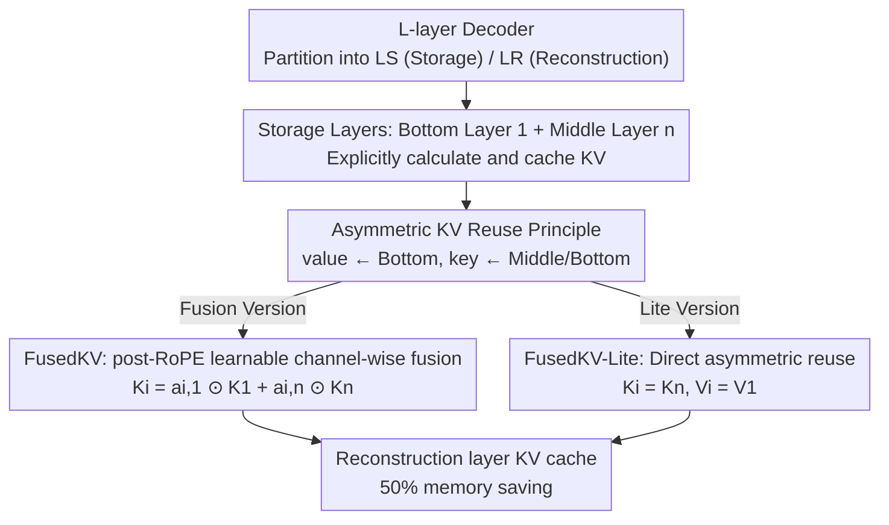

# Reconstructing KV Caches with Cross-Layer Fusion for Enhanced Transformers

**Conference**: ICLR 2026  
**OpenReview**: [https://openreview.net/forum?id=4pivvEJiCl](https://openreview.net/forum?id=4pivvEJiCl)  
**Code**: https://github.com/LivingFutureLab/FusedKV  
**Area**: LLM Efficiency  
**Keywords**: KV Cache, Cross-layer Sharing, Key-Value Asymmetry, RoPE Compatibility, Long-Context Inference

## TL;DR
Aiming at the issue that cross-layer KV cache sharing (e.g., YOCO, CLA) consistently performs worse than intra-layer methods (GQA), this paper discovers the "key-value asymmetry" phenomenon—top-layer values primarily originate from the bottom layers, while keys come from both bottom and middle layers. Based on this, the authors propose FusedKV (learnable channel-wise fusion on post-RoPE keys) and its lightweight version FusedKV-Lite (direct asymmetric reuse). On 332M–4B models, these methods reduce KV cache memory by 50% while achieving lower perplexity than standard full-cache Transformers.

## Background & Motivation

**Background**: In autoregressive generation, KV cache memory grows linearly with sequence length, serving as the main bottleneck for long-context inference. Compression strategies fall into two categories: within-layer (e.g., GQA/MQA sharing KV heads among query heads, or MLA using low-rank compression) and cross-layer (e.g., CLA sharing KV between adjacent layers, or YOCO reusing middle-layer caches for upper layers).

**Limitations of Prior Work**: While cross-layer sharing is memory-attractive (halving KV layers), its actual performance has **consistently trailed behind intra-layer methods**. Directly repurposing lower-layer KV for upper layers leads to performance degradation, making the cross-layer direction appear unfavorable in terms of the memory-performance trade-off.

**Key Challenge**: Existing cross-layer methods (YOCO, CLA) essentially employ **direct block-level reuse** of a single source layer—reconstructing layer $i$ as $(K_i, V_i) = (K_{\phi(i)}, V_{\phi(i)})$. This coarse reuse fails to distinguish the information needs of keys versus values and easily leads to "representation collapse" in sharing layers, losing layer-specific contributions.

**Key Insight**: The authors conducted a "dense fusion" probe experiment on a 16-layer, 1B model, allowing the top 8 layers to fuse **all** bottom layer caches using learnable scalars. The training loss was lower than the vanilla model, confirming that top-layer KV can be effectively reconstructed from early layers. More importantly, the fusion weights revealed a clear **asymmetry**: value reconstruction weights are concentrated at the very bottom (layers 0–1), while key weights are more dispersed and concentrated in the middle layers (layers 6–7).

**Core Idea**: Since keys and values prefer different source layers, instead of symmetric block-level reuse, the model should **reconstruct top-layer KV from bottom and middle layers according to asymmetric principles through channel-wise weighting**—values favoring the bottom and keys favoring the middle.

## Method

### Overall Architecture
FusedKV partitions $L$ decoder layers into two disjoint sets: **Storage Layers** ($\mathcal{L}_S$, where KV is actually computed and cached) and **Reconstruction Layers** ($\mathcal{L}_R$, where KV is not stored but reconstructed on-demand during inference). For any reconstruction layer $i \in \mathcal{L}_R$, its $K_i, V_i \in \mathbb{R}^{s \times d}$ is generated from several source storage layers via a parameterized reconstruction function $\mathcal{F}_i$:

$$(K_i, V_i) = \mathcal{F}_i\big(\{(K_j, V_j) \mid j \in \Phi(i)\}; \theta_i\big)$$

Where $\Phi(i)$ is the **source layer mapping function**. YOCO/CLA are special cases where $\mathcal{F}$ is a "direct selector" ($|\Phi(i)|=1$). This paper uses "channel-wise weighted fusion" for $\mathcal{F}$ and configures $\Phi(i)$ based on the asymmetry principle—storage layers are fixed at the bottom (layer 1) and middle (layer n), while reconstruction layers occupy the upper half ($i > n$). The pipeline only performs lightweight reconstruction for $\mathcal{L}_R$ during the forward pass, eliminating KV memory for these layers.

### Key Designs

**1. Asymmetric Key-Value Reuse Principle: Value favors bottom, Key favors middle**

This is the foundational observation addressing why cross-layer sharing struggled. In the fusion probe, weights for top layers (10–15) showed distinct preferences: **value weights clustered heavily at layers 0–1**, while **key weights were more diffused but centered at layers 6–7**. Intuitively, values carry foundational word-level content (encoded early), while keys define attention "matching patterns," requiring more abstract, contextualized middle-layer representations. 

Accordingly, reconstruction no longer reuses $(K, V)$ as a single block; value reuses layer 1, and key reuses layer $n$. The "FusedKV-Lite-Rev" ($K_i = K_1, V_i = V_8$) in the ablation study confirms that reversing this direction significantly degrades performance.

**2. FusedKV: Learnable Channel-wise Fusion on Post-RoPE Keys**

Direct block reuse (YOCO/CLA) causes representation collapse. FusedKV utilizes more expressive **channel-wise weighted fusion**: for reconstruction layer $i > n$, Hadamard product weighting is applied to two high-information sources:

$$K_i = a_{i,1} \odot K_1 + a_{i,n} \odot K_n, \qquad V_i = b_{i,1} \odot V_1 + b_{i,n} \odot V_n$$

The weights $a_{ij}, b_{ij}$ are learnable vectors that "gate" features per channel. This allows each reconstruction layer to adaptively mix foundational and contextual features rather than copying a fixed layer.

The challenge is **RoPE compatibility**: weighted fusion on keys with Rotary Positional Embeddings might break relative position properties. The authors decomposed the attention score with weight vectors $w_j = [w_{2j}, w_{2j+1}]^T$ and found that if $w_{2j} \neq w_{2j+1}$, the score becomes a mix of relative (dependent on $m-n$) and absolute (dependent on $m+n$) positions. The solution is **enforcing identical weights within each 2D channel pair** ($w_{2j} = w_{2j+1}$, i.e., 2D diagonal constraint). Under this constraint, the fusion $\tilde{q}_m^T \tilde{k}_s = \sum_i \tilde{q}_m^T (w_n^i \odot \tilde{k}_n^i)$ remains dependent only on relative positions, allowing storage layers to **retain original post-RoPE KV** without recomputing RoPE during inference.

**3. FusedKV-Lite: Direct Asymmetric Reuse with Minimal I/O**

FusedKV's fusion requires reading two caches (bottom and middle), increasing Memory Access (I/O) costs. FusedKV-Lite degenerates fusion into **single-source direct reuse** based on the asymmetry principle:

$$K_i = K_n, \qquad V_i = V_1, \qquad i > n$$

Since each reconstruction layer reads only one key and one value without weighted aggregation, the cache I/O matches the vanilla Transformer, making it ideal for memory-bandwidth-bound decoding. "FusedKV-Lite-Learnable" (adding learnable scalar scaling $K_i = a_{i8} \odot K_8, V_i = b_{i1} \odot V_1$) further shows that even lightweight learnable weights consistently outperform fixed weights on WikiText/LAMBADA.

### Loss & Training
The method introduces no additional loss terms and uses standard language modeling objectives for end-to-end pre-training. Experiments used Qwen3-architected dense models (332M/650M/1.5B/4B) on FineWeb-Edu with a 128k vocabulary and 8192 context length. Training used AdamW ($\beta_1=0.9, \beta_2=0.95$) with a cosine scheduler. A Triton kernel was implemented for the FusedKV operator to achieve practical acceleration.

## Key Experimental Results

### Main Results
Comparison of KV compression methods on a 1.5B model (all compressed versions use 1/2 KV memory; downstream tasks are 5-shot averages):

| Method | Cache Mem ↓ | Valid Loss ↓ | WikiText PPL ↓ | Avg Acc ↑ |
|------|------|------|------|------|
| Vanilla (Full Cache) | 1 | 2.241 | 13.67 | 54.55 |
| CLA | 1/2 | 2.258 | 14.19 | 53.91 |
| YOCO | 1/2 | 2.244 | 13.65 | 54.19 |
| GQA | 1/2 | 2.245 | 13.74 | 54.58 |
| **FusedKV-Lite** | 1/2 | 2.225 | 13.45 | 55.30 |
| **FusedKV** | 1/2 | **2.221** | **13.33** | **55.82** |

Key points: FusedKV, using only half the cache, outperforms **full-cache** vanilla and same-compression YOCO/GQA/CLA across validation loss, WikiText perplexity, and downstream accuracy. This holds at 4B scale: validation loss 1.978 (FusedKV) vs 2.002 (vanilla). FusedKV also converges ~1.26× faster.

Efficiency (Normalized relative to MHA):

| Metric | FusedKV | FusedKV-Lite |
|------|---------|--------------|
| Attention Throughput | ~28.4% lower than MHA (extra I/O) | Comparable to MHA |
| TTFT (8k+ Prefill) | ~50% reduction | ~50% reduction |
| TPOT (I/O Bound) | ~1.5× vanilla | Comparable to baseline |
| TPOT (Compute Bound GQA) | Comparable to baseline | Comparable to baseline |

Complexity-wise, FusedKV-Lite matches YOCO ($L S H_{kv} D$ memory, $2 L S H_{kv} D$ I/O). FusedKV shares the same memory but has increased I/O ($3 L S H_{kv} D$) due to dual-cache reading.

### Ablation Study

| Configuration | Key Conclusion | Description |
|------|---------|------|
| FusedKV-Lite | Baseline | $K_i=K_8, V_i=V_1$ (Key from middle, Value from bottom) |
| FusedKV-Lite-Rev | Significantly higher loss/lower accuracy | Reverse mapping ($K_i=K_1, V_i=V_8$) proves the asymmetry principle |
| FusedKV-Lite-Learnable | Outperforms fixed weights | Adding learnable channel-wise scaling improves performance |

### Key Findings
- **Directionality is Critical**: Reversing the asymmetry (Key bottom / Value middle) leads to significant degradation, confirming that early-layer labels (Value) and middle-layer structures (Key) are the most useful info for top-layer reconstruction.
- **Learnable Weights Add Value**: Moving from fixed reuse to learnable scaling, then to dual-source fusion, increases expressivity and downstream accuracy.
- **Gradient Perspective**: FusedKV/Lite shows significantly larger L2 gradient norms in shallow layers (e.g., layers 1, 5) compared to baseline. Cross-layer fusion provides stronger gradient signals to early layers, accelerating the learning of fundamental representations.
- **Orthogonal Combinability**: FusedKV/Lite is orthogonal to MLA, GQA, MoE, and SWA. For example, FusedKV+GQA can achieve 4× cache compression with significant speedups.

## Highlights & Insights
- **Clean "Probe-to-Design" Paradigm**: Rather than arbitrary fusion structures, the authors first visualized "which layer's information is useful" via dense fusion, discovered the overlooked asymmetry, and then precisely configured source layers.
- **Clever post-RoPE Fusion Constraint**: Enforcing $w_{2j}=w_{2j+1}$ preserves relative position properties in rotated keys, successfully avoiding RoPE recomputation during inference.
- **Dual-Tier Implementation**: Providing FusedKV (Accuracy-first) and FusedKV-Lite (I/O-first) offers developers flexibility based on whether the system is compute- or memory-bound.
- **Transferable Insight**: When performing cross-layer/module reuse, **distinguishing source preferences of different tensors (K vs V, or even Q/Gate)** rather than symmetric block sharing is a promising direction for memory efficiency.

## Limitations & Future Work
- FusedKV's attention throughput is ~28.4% lower than MHA, and TPOT is ~1.5× in I/O-bound scenarios; the extra fusion I/O is a real cost that can only be fully avoided by switching to the Lite version.
- The "bottom value / middle key" conclusion is based on specific scales and Qwen3-style architectures. How source layer positions (which layer is "middle n") should adaptively scale with depth remains for future work.
- On small 332M/650M models, absolute accuracy on difficult tasks like MMLU remains near random; the method's relative advantages are more pronounced on larger models (1.5B/4B).
- Evaluation primarily focused on dense pre-training and 5-shot tasks. While appendix results cover long-context (128k), rigorous stress testing on retrieval-intensive long-range tasks is needed.

## Related Work & Insights
- **vs YOCO / CLA (Direct Reuse)**: Both use block-level single-source reuse without distinguishing K/V. This paper identified this as the cause of performance drops and used asymmetry + channel-wise fusion to exceed vanilla performance at 50% memory.
- **vs GQA / MQA / MLA (Intra-layer Compression)**: These compress KV within a layer. This paper's cross-layer approach is orthogonal and can be stacked (e.g., FusedKV+GQA).
- **vs Dense Fusion Probes**: Probes prove top-layer KV can be reconstructed but are expensive; FusedKV is a practical "sparse + asymmetric" version using only the two most informative sources.

## Rating
- Novelty: ⭐⭐⭐⭐ Reveals and exploits a neglected K/V asymmetry; clever RoPE-compatible fusion constraint.
- Experimental Thoroughness: ⭐⭐⭐⭐⭐ Four scales (332M–4B), multiple baselines, and comprehensive coverage of complexity/throughput/TTFT/TPOT/gradients.
- Writing Quality: ⭐⭐⭐⭐ Logical flow from observation to design to verification.
- Value: ⭐⭐⭐⭐ Saves 50% KV memory without performance loss (or with gains), practically implementable, and orthogonal to existing compression.

<!-- RELATED:START -->

## Related Papers

- [\[ICLR 2026\] ReST-KV: Robust KV Cache Eviction with Layer-wise Output Reconstruction and Spatial-Temporal Smoothing](rest-kv_robust_kv_cache_eviction_with_layer-wise_output_reconstruction_and_spati.md)
- [\[ICLR 2026\] CR-Net: Scaling Parameter-Efficient Training with Cross-Layer Low-Rank Structure](cr-net_scaling_parameter-efficient_training_with_cross-layer_low-rank_structure.md)
- [\[ICLR 2026\] FreeKV: Boosting KV Cache Retrieval for Efficient LLM Inference](freekv_boosting_kv_cache_retrieval_for_efficient_llm_inference.md)
- [\[ICLR 2026\] STEM: Scaling Transformers with Embedding Modules](stem_scaling_transformers_with_embedding_modules.md)
- [\[ICLR 2026\] Attention Is All You Need for KV Cache in Diffusion LLMs](attention_is_all_you_need_for_kv_cache_in_diffusion_llms.md)

<!-- RELATED:END -->
