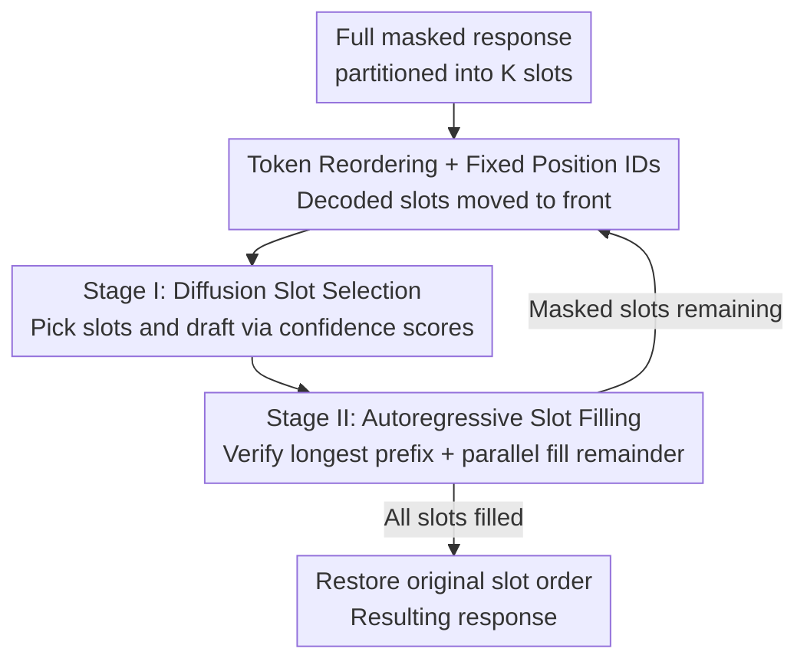

# ReFusion: A Diffusion Large Language Model with Parallel Autoregressive Decoding

**Conference**: ICLR 2026  
**OpenReview**: [https://openreview.net/forum?id=LBtWaUc7FE](https://openreview.net/forum?id=LBtWaUc7FE)  
**Code**: https://github.com/ML-GSAI/ReFusion  
**Model**: https://huggingface.co/GSAI-ML/ReFusion  
**Area**: LLM Efficiency / Diffusion Language Models  
**Keywords**: Masked Diffusion Models, Parallel Decoding, KV Cache Reuse, Sequence Reordering, Autoregressive Infilling

## TL;DR
ReFusion elevates parallel decoding in masked diffusion language models from the token level to the slot level (multi-token segments). Slots are selected in parallel via diffusion and filled serially via autoregression. By reordering generated slots ahead of masked ones at each step, it achieves full KV cache reuse and manageable learning complexity. Compared to previous diffusion models, it yields a 34% average performance improvement and 18× acceleration, while outperforming or matching strong autoregressive models with a 2.33× speed advantage.

## Background & Motivation
**Background**: Autoregressive models (ARMs, such as Llama-3, Qwen3) have achieved widespread success through strict left-to-right token-by-token decoding. However, inference throughput is constrained by this serial process, where latency increases with generation length. Masked Diffusion Models (MDMs, such as LLaDA, Dream) use an iterative "mask-denoise" approach without a fixed generation order. Theoretically, they enable parallel decoding and may discover generation trajectories superior to left-to-right, making them a promising alternative.

**Limitations of Prior Work**: The theoretical advantages of MDMs are offset by architectural and training issues in practice. First, the **architectural bottleneck negates parallel gains**: flexible generation order requires bidirectional attention, which is inherently incompatible with the KV cache crucial for ARM acceleration. Consequently, each decoding step requires recomputing KV states for the entire context, leading to high single-step overhead and making MDMs slower than ARMs. Second, **high learning complexity leads to incoherent parallel generation**: MDMs typically decode multiple tokens with high marginal probabilities simultaneously, assuming conditional independence. This assumption often fails for adjacent tokens—e.g., if "at once" and "right now" are both valid, independent sampling might produce "right once," which has high marginal probability but low joint probability.

**Key Challenge**: Modeling a data distribution over an exponential space of token combinations is significantly more difficult than the fixed sequence dependence in ARMs. Existing MDMs suffer from under-training and struggle to identify which tokens are truly conditionally independent. Conversely, switching to causal attention for KV cache reuse often forces the model into difficult token-level permutation objectives (e.g., Eso-LMs), leading to substantial performance degradation.

**Goal**: Achieve both (1) full KV cache reuse and (2) reduction of the learning objective to a manageable complexity, without sacrificing global generation flexibility.

**Key Insight**: The authors observe that the conditional independence assumption fails most severely at adjacent tokens, and dependence strength decays rapidly with relative distance. Since nearby tokens exhibit strong dependence while distant ones are approximately independent, parallelization should not occur at the token level but by packaging adjacent tokens into slots for serial processing, with parallelization occurring only across slots.

**Core Idea**: Replace "tokens" with "slots" (fixed-length continuous sub-sequences) as the parallel granularity. Selection between slots is performed in parallel via diffusion, while filling within slots is performed serially via autoregression. Coupled with sequence reordering that moves generated slots to the front, this approach reuses the KV cache and transforms the exponential token combination space into a manageable slot permutation space.

## Method

### Overall Architecture
ReFusion uses a standard causal attention Transformer (initialized from Qwen3-8B) but performs globally flexible decoding during inference. It partitions the response into $K$ slots of length $k$. Starting from a fully masked sequence, it iteratively executes a slot-level "Select-Fill" loop: **Stage I selects and drafts slots via diffusion**, and **Stage II validates and completes these slots via autoregression**. After each round, newly generated slots are reordered before the remaining masked slots so that decoded tokens are always continuous at the start of the sequence, enabling full KV cache reuse at each step. Training mirrors this inference dynamic: randomly masking slots, shuffling clean slots, and reordering input to "clean slots first, masked slots second," optimized with a hybrid objective supervising selection (AR loss) and infilling (denoising loss).

### Key Designs

**1. Token Reordering + Position-Invariant Attention: Achieving full KV cache with causal attention**

This design addresses the incompatibility between bidirectional attention and KV caching. ReFusion uses standard causal attention like ARMs. After each decoding step, newly decoded tokens are moved before remaining masked tokens while maintaining their internal relative order. Consequently, decoded tokens are always continuous at the start of the sequence, followed by masked positions—a layout that naturally allows causal attention to reuse the full KV cache. To prevent reordering from misaligning token semantics, **attention calculations always use the original position IDs**. For instance, in RoPE, the relative distance $R_{n-m}$ between query $q_m$ and key $k_n$ depends only on the original position difference, staying invariant to input reordering. This allows ReFusion to maintain global decoding flexibility with ARM-level cache efficiency.

**2. Slot Partitioning + Mixed Decoding: Reducing exponential combinations to manageable permutations**

This design targets the failure of token-level conditional independence and the difficulty of token-level permutation objectives. The sequence is divided into continuous, non-overlapping slots. Based on the observation that dependence strength decays with distance and is strongest among adjacent tokens, **parallel generation is applied across slots via diffusion, while serial decoding is used within slots to capture strong local dependencies**. This is the opposite of "block" methods (which use serial AR between blocks and parallel diffusion within). By serializing adjacent strongly dependent tokens, the conditional independence violations typical of MDMs are mitigated. The model no longer needs to model an exponential token combination space, but rather a manageable slot permutation space. This naturally supports full KV cache reuse as reordering occurs at the slot granularity.

**3. Two-stage "Select-Fill" Inference: Diffusion-based selection and AR-based filling**

At timestep $t$ (ratio of remaining masked slots), the sequence consists of decoded slots $\tilde S_t^{clean}$ (by generation order) and masked slots $\tilde S_t^{masked}$ (by original position). **Stage I (Slot Selection)**: The model calculates a confidence score for each masked slot; slots exceeding a threshold $\tau_{slot}$ are selected. Inspired by speculative decoding, a draft $\tilde S_t^{draft}$ is sampled for these slots. **Stage II (Slot Filling)**: Draft slots are concatenated by original position for a single forward pass to compute token probabilities and identify the longest continuous prefix where all tokens exceed $\tau_{token}$. If the prefix covers entire slots, they are accepted, and unverified drafts are re-masked for the next round. If no full slot passes, it falls back to parallel iterative completion: (i) validation—finding the longest prefix per slot, and (ii) prediction—re-masking suffixes and using MDM capabilities to predict masked tokens in parallel until the selected slots are full.

**4. Mirror Inference Training + Hybrid Objective: Supervising every token**

This aligns training dynamics with two-stage decoding and enhances data efficiency. **Data construction** involves three steps: (1) randomly masking $\lfloor tK\rfloor$ slots, (2) shuffling clean slots into $S_t^{clean}$ while keeping masked slots in original relative order as $S_t^{masked}$, and (3) concatenating "clean first, masked second" to simulate any partial decoding state. The **hybrid objective** supervises all tokens: clean slots are trained with a standard AR next-token prediction loss $L_{ARM}$ to learn serial generation, and masked slots use an MDM denoising loss $L_{MDM}$ for context-aware parallel reconstruction. The total objective is $L=L_{ARM}+\lambda L_{MDM}$. Unlike traditional MDMs that only learn from masked positions, ReFusion uses clean tokens as supervision signals, significantly improving data efficiency.

### Loss & Training
The AR loss for clean slots calculates the negative log-likelihood for tokens starting from the second position: $L_{ARM}=-\mathbb{E}\big[\frac{1}{(k-1)|S_t^{clean}|}\sum_{i}\sum_{j=2}^{k}\log P_\theta(v_t^{i,j}\mid p_0,S_{t,<(i,j)}^{clean})\big]$. The denoising loss for masked slots is $L_{MDM}=-\mathbb{E}\big[\frac{1}{k|S_t^{masked}|}\sum_{i}\sum_{j=1}^{k}\log P_\theta(v_0^{i,j}\mid p_0,S_t^{clean},S_{t,\leqslant(i,j)}^{masked})\big]$. The model is initialized from Qwen3-8B and fine-tuned on ~3.7 million samples (~1.22 billion tokens) for 4 epochs.

## Key Experimental Results

### Main Results
Zero-shot evaluation on 7 benchmarks (MMLU-Pro, ARC-C, GSM8K, MATH, GPQA, HumanEval, MBPP) comparing accuracy/pass@1 and throughput (TPS, single A100, batch=1). ReFusion leads the MDM category in both performance and throughput.

| Model | Category | Avg. Performance | Avg. TPS |
|------|------|----------|----------|
| Qwen3-8B | ARM | 73.36 | 32.42 |
| Llama-3-8B-Instruct | ARM | 49.63 | 37.81 |
| LLaDA-8B-Instruct | MDM | 48.51 | 12.41 |
| Dream-7B-Instruct | MDM | 48.25 | 8.84 |
| LLaDA w/ D2F | MDM Accel | 52.13 | 55.55 |
| Dream w/ D2F | MDM Accel | 66.22 | 44.72 |
| **ReFusion** | MDM | **72.62** | **72.62** |

Compared to LLaDA/Dream, ReFusion improves average performance by ~34% and throughput by over 18×. Compared to Qwen3-8B, it leads by 3.68 absolute points on GSM8K and MBPP while being 2.33× faster on average.

### Ablation Study
**Controlled comparisons (Initialized from Qwen3-8B, trained on 120K subset)** to isolate gains from architecture/training:

| Model | Avg. Performance | Avg. TPS |
|------|----------|----------|
| Qwen3-8B (Retrained) | 65.71 | 30.36 |
| LLaDA (Retrained) | 47.41 | 4.24 |

Under identical initialization and data, traditional MDMs (LLaDA Retrained) significantly underperform Qwen3, whereas ReFusion's slot design and hybrid objective drive its performance and speed.

## Highlights & Insights
- **Slot level is a clean lever for parallel granularity**: Changing the granularity solves two conflicting problems—KV cache reuse (via causal attention + reordering) and learning complexity (via intra-slot serialization)—without a trade-off.
- **Decoupling Position IDs from input order** is the key trick for reordering. The relative distance invariance of RoPE ensures reordering is mathematically harmless to attention.
- **Hybrid supervision of every token** improves data efficiency compared to MDMs that only learn from masked positions, allowing ReFusion to surpass Qwen3-8B with only ~1.2B tokens of fine-tuning.
- **Slots and blocks are orthogonal and nestable**: Slot design is the dual of "parallel within block $\rightarrow$ serial across blocks." They can be combined hierarchically.

## Limitations & Future Work
- **Slot length $k$ is a critical hyperparameter**: Too short and it reverts to token-level issues; too long and intra-slot AR reduces parallel gains. Adaptive slot lengths are not fully explored.
- **Lack of inter-slot dependency during parallel fill**: Stage II treats selected slots as approximately independent, which might introduce errors in tasks with strong long-range dependencies across slots.
- **Threshold sensitivity**: $\tau_{slot}$ and $\tau_{token}$ control the aggressiveness of selection and acceptance; performance-speed trade-offs are sensitive to these per-task settings.

## Related Work & Insights
ReFusion occupies the intersection of efficient MDM architectures and MDM decoding strategies. It belongs to the class of models using causal attention for precise caching (like Eso-LMs) but avoids the learning difficulties of token-level permutation by using slot levels. It unifies MDM parallel efficiency and AR quality within a single architecture without requiring external models for verification. Unlike block diffusion, ReFusion maintains global flexibility, providing a new path for unifying Autoregression and Diffusion.

<!-- RELATED:START -->

## Related Papers

- [\[ICLR 2026\] Learning to Parallel: Accelerating Diffusion Large Language Models via Learnable Parallel Decoding](learning_to_parallel_accelerating_diffusion_large_language_models_via_learnable_.md)
- [\[ICLR 2026\] Hierarchy Decoding: A Training-free Parallel Decoding Strategy for Diffusion Large Language Models](hierarchy_decoding_a_training-free_parallel_decoding_strategy_for_diffusion_larg.md)
- [\[ICML 2026\] Diffusion Language Model Parallel Decoding via Product-of-Experts Bridge](../../ICML2026/llm_efficiency/diffusion_language_model_parallel_decoding_via_product-of-experts_bridge.md)
- [\[ACL 2026\] CreditDecoding: Accelerating Parallel Decoding in Diffusion Large Language Models with Trace Credit](../../ACL2026/llm_efficiency/creditdecoding_accelerating_parallel_decoding_in_diffusion_large_language_models.md)
- [\[ICLR 2026\] Fast-dLLM: Training-free Acceleration of Diffusion LLM by Enabling KV Cache and Parallel Decoding](fast-dllm_training-free_acceleration_of_diffusion_llm_by_enabling_kv_cache_and_p.md)

<!-- RELATED:END -->
## Related Papers

- [\[ICLR 2026\] Learning to Parallel: Accelerating Diffusion Large Language Models via Learnable Parallel Decoding](learning_to_parallel_accelerating_diffusion_large_language_models_via_learnable_.md)
- [\[ICLR 2026\] Hierarchy Decoding: A Training-free Parallel Decoding Strategy for Diffusion Large Language Models](hierarchy_decoding_a_training-free_parallel_decoding_strategy_for_diffusion_larg.md)
- [\[ICML 2026\] Diffusion Language Model Parallel Decoding via Product-of-Experts Bridge](../../ICML2026/llm_efficiency/diffusion_language_model_parallel_decoding_via_product-of-experts_bridge.md)
- [\[ACL 2026\] CreditDecoding: Accelerating Parallel Decoding in Diffusion Large Language Models with Trace Credit](../../ACL2026/llm_efficiency/creditdecoding_accelerating_parallel_decoding_in_diffusion_large_language_models.md)
- [\[ICLR 2026\] Parallel Sampling from Masked Diffusion Models via Conditional Independence Testing](parallel_sampling_from_masked_diffusion_models_via_conditional_independence_test.md)

<!-- RELATED:END -->
