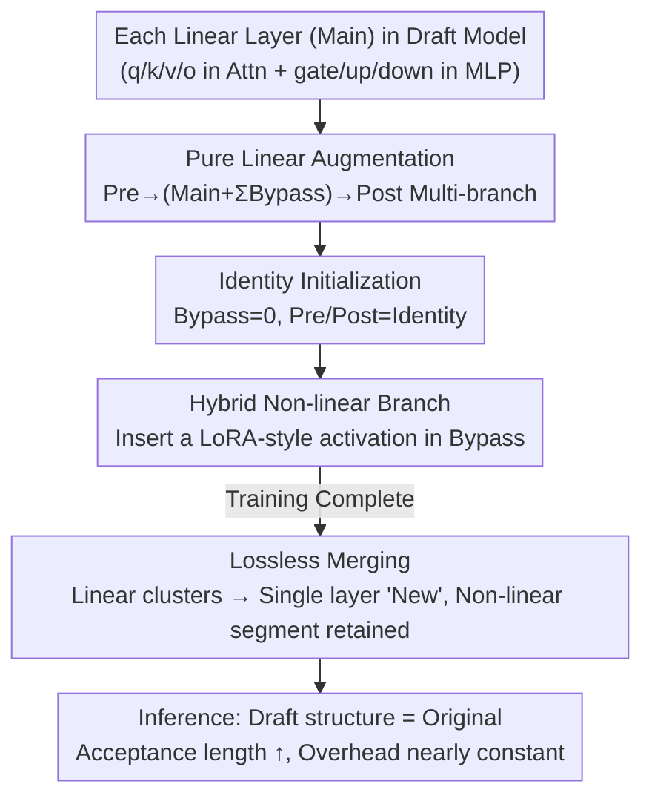

# RepSpec: Structural Re-parameterized Draft Model Training for Speculative Decoding

**Conference**: ICLR 2026  
**OpenReview**: [https://openreview.net/forum?id=bqEi97qzzz](https://openreview.net/forum?id=bqEi97qzzz)  
**Code**: TBD  
**Area**: LLM Efficiency / Speculative Decoding  
**Keywords**: Speculative Decoding, Draft Model, Structural Re-parameterization, EAGLE, Training-Inference Decoupling

## TL;DR
RepSpec adopts the structural re-parameterization idea from RepVGG, splitting each linear layer of the speculative decoding draft model into a multi-branch redundant structure during **training** and merging them back losslessly into a single layer during **inference**. This enhances the draft model's capability without increasing inference overhead. By adding a "LoRA-style non-linear hybrid branch" to further extend the accepted sequence length, it accelerates the SOTA EAGLE-3 by 4%–10%.

## Background & Motivation

**Background**: Speculative Decoding (SD) uses a small draft model $M_d$ to generate multiple candidate tokens in parallel, which are then verified by a large target model $M_t$ in a single forward pass. This transforms "memory-bandwidth-limited" autoregressive decoding into "compute-limited" parallel verification, serving as a mainstream acceleration technique. Dual-model SD (e.g., EAGLE series, Medusa, Hydra) typically achieves longer accepted sequences than training-free self-speculative decoding, representing the current performance ceiling.

**Limitations of Prior Work**: The performance of dual-model SD is **fundamentally bottlenecked by the draft model's capacity**. Taking EAGLE as an example, the draft model uses only a single decoder layer from the target model as a starting point, resulting in extremely small parameter counts. While intuitively scaling up the draft model could increase acceptance length, the draft model is called for every token generated. **Directly adding layers synchronously increases inference costs**, which is often not cost-effective—the gains in acceptance length are offset by the slowdown of the draft model itself.

**Key Challenge**: The **training capacity** and **inference overhead** of draft models are tightly coupled—enhancing the model during training necessitates a penalty during inference.

**Goal**: Is it possible to **temporarily expand** the parameter scale of the draft model during the training phase to achieve better optimization effects while **introducing zero additional overhead** during the inference phase?

**Key Insight**: The authors noted that convolutional structural re-parameterization techniques like RepVGG/ACNet specifically solve "training-inference structural decoupling." During training, multiple mergable bypass branches are added to the backbone (similar to ResNet topology). Leveraging the **additivity** of linear operations, all branches can be merged back into a single layer for inference at zero extra cost. Although a single-layer decoder draft model does not suffer from the vanishing gradient issues seen in VGG, the principle of "decoupling during training, re-coupling during inference" remains applicable.

**Core Idea**: Bring structural re-parameterization into draft model training—replacing each linear layer with multiple redundant linear branches during training and merging them losslessly for inference. Furthermore, considering that "drafting time only accounts for a small fraction of total decoding" in SD, the authors introduce an unmergable but high-gain non-linear branch.

## Method

### Overall Architecture

RepSpec does not change the dual-model framework of SD but transforms the **training form of the draft model's linear layers**. The core idea in one sentence: wrap each original `Main` linear layer in a multi-branch structure consisting of "Pre-layers + Bypass layers + Post-layers" during training to allow the optimizer to learn in a wider parameter space. After training, the entire cluster of branches is **losslessly merged** into an equivalent single `New` linear layer, ensuring the draft model's structure and overhead during inference are identical to the original version. Beyond the pure linear scheme, the authors add a hybrid scheme: inserting a LoRA-style non-linear bottleneck in the Bypass branch. Although it cannot be merged and introduces a minor inference cost, it further extends the accepted sequence—a trade-off that proves beneficial in SD.

### Key Designs

**1. Pure Linear Structural Re-parameterization: Widened Training, Zero-cost Inference**

Addressing the pain point that adding layers slows down inference, RepSpec lets each linear layer become "fat" during training and "slim" during inference. For an original linear layer `Main`, it inserts (i) $n$ serial `Pre` layers, (ii) $m$ serial `Post` layers, and (iii) $k$ parallel `Bypass` branches. The augmented mapping is:

$$\text{Aug} = \text{Post}_{m:1} \circ \Big(\text{Main} + \sum_{l=1}^{k}\text{Bypass}_l\Big) \circ \text{Pre}_{1:n}.$$

Since there are no non-linearities, the entire multi-branch structure is mathematically equivalent to a single linear transformation. Let $W_{\text{pre}}=\prod_{i=n}^{1}W_{\text{pre}_i}$ (similarly for Post). After training, the weights can be merged losslessly as:

$$W_{\text{new}} = W_{\text{post}}\Big(W_{\text{main}} + \sum_l W_{\text{bypass}_l}\Big)W_{\text{pre}},$$

with bias terms merged via the chain rule. The authors found that re-parameterizing **all** projections (q/k/v/o in attention and gate/up/down in MLP) is "necessary and sufficient"—re-parameterizing only partial modules yields incomplete gains, while re-parameterizing embedding layers improved validation metrics but harmed OOD performance. The key insight is: pure linear multi-branching does not increase model expressivity (equivalent to one layer after merging), but it **modifies the optimization landscape during training**, allowing gradient descent to find better solutions. The benefits are realized during training, while costs are eliminated during inference.

**2. Identity Initialization: Aligning the Augmentation Model with the Original**

If new branches are initialized randomly, they disrupt the original initial state of the draft model and slow down or bias training. RepSpec initializes `Bypass` as zero and `Pre/Post` as identity mappings. Consequently, at the initial moment, the augmented model is **functionally identical to the original single-layer model**. This ensures training starts from a "known good" point and evolves using the superior optimization landscape, rather than relearning from scratch, ensuring that the multi-branch structure provides net gains rather than perturbation.

**3. Hybrid Linear-Nonlinear Strategy: Trading a LoRA-style Non-linearity for Longer Sequences**

Pure linear schemes have a clear ceiling—no matter how many branches are merged, they remain a single layer, and expressivity is not fundamentally enhanced (ablation shows that infinite stacking leads to performance drops). Thus, the authors introduce a **minimal amount** of non-linearity to capture maximum extra gain. While standard structural re-parameterization avoids non-linearities because they cannot be merged, in the SD scenario, draft inference time is small relative to total decoding. **Tolerating a slightly slower draft for a significantly longer acceptance length results in an overall faster system.** Specifically, they insert **one** activation function (ablation shows one is optimal; more yields diminishing returns) implemented as a LoRA-style bottleneck with an activation between two decomposed linear layers (using `mid_feature` to control the dimension and compress unmergable parameters). Inserting it in Pre/Post would split the system into two unmergable layers. Inserting it in the Bypass branch allows the two segments to be merged with Pre/Post respectively, though the first layer must be **concatenated** (concat) rather than added to Main, which is slightly less efficient. Weighing these factors, the optimal structure **places the LoRA-style non-linearity in the Bypass branch**.

### Loss & Training

RepSpec is a plug-and-play training framework that does not modify the original training objectives of SD draft models (inheriting the losses from EAGLE/Medusa/Hydra). It only replaces the structural form of the linear layers. The optimal pure linear configuration is: inserting **one Pre + one Bypass** on each projection of q/k/v/o and gate/up/down (ablation proves more is useless or even harmful). The hybrid scheme builds on this by inserting a single ReLU into the Bypass via a LoRA-style bottleneck. Training uses 8×A100 (80GB), and inference uses 2×A100.

## Key Experimental Results

### Main Results (Acceptance Length τ / Speed v, higher is better)

| Target Model | Draft | Mode | Baseline τ | Linear τ | Hybrid τ |
|----------|------|------|-----------|----------|----------|
| LLaMA-3.1 8B | EAGLE-1 | Chain | 2.54 | 2.70 | 2.82 |
| LLaMA-3.1 8B | EAGLE-3 | Chain | 3.35 | 3.60 | 3.66 |
| LLaMA-3.1 8B | EAGLE-3 | Tree | 5.86 | 5.95 | 6.03 |
| LLaMA-2 13B | EAGLE-1 | Tree | 4.31 | 4.47 | 4.67 |
| Vicuna 7B | Hydra | Tree | 3.59 | 3.60 | 3.70 |

(Values in the table are averages across 6 benchmarks: MT/GSM8K/Alpaca/HumanEval/QA/Sum.) End-to-end acceleration: On LLaMA-3.1 8B, Linear accelerates EAGLE-1 by 7%–10% and EAGLE-3 by 4%–6%. On LLaMA-2 13B, Hybrid accelerates EAGLE-1 by 5%–9%. On Vicuna 7B, Linear brings 5%/8% acceleration to Medusa/Hydra respectively.

### Ablation Study (EAGLE-1 @ LLaMA-3.1 8B, MT-bench, chain, draft=5)

| Configuration | Conclusion |
|------|------|
| Module Position (Fig 2a) | Attn+MLP is the optimal target; embedding helps validation but hurts OOD and is discarded. |
| Block Combination (Fig 2b) | Pre+Post+Bypass trains best, but **Pre+Bypass** has lower training cost and is superior on benchmarks. |
| Scale (Fig 2c) | A single Pre + single Bypass is the optimal pure linear setup; more redundancy causes drops. |
| Activation Function (Fig 3a/Tab 3) | GeLU has best training metrics, but **ReLU** is best for speed and simplicity. |
| Placement (Fig 3b) | LoRA-style non-linearity in **Bypass** is optimal. |
| vs Double Layer (Fig 3c) | Hybrid outperforms simply doubling decoder layers, which doubles inference cost. |

### Key Findings
- **Optimization Landscape > Expressive Capacity**: Pure linear multi-branches do not change expressivity after merging, yet they improve acceptance length solely by improving the optimization landscape during training. This indicates that draft model training suffers from optimization bottlenecks rather than capacity bottlenecks.
- **Larger Models Benefit More from Hybrid**: On 8B models, Linear is generally optimal (Hybrid is slightly slowed by non-linear overhead). On 13B models, Hybrid takes over—as the target model gets larger, the relative overhead of the draft model decreases, making the non-linear cost easier to justify for sequence length gains.
- **More Redundancy Isn't Always Better**: Excessive pure linear stacking increases training costs and can actually degrade performance; a single Pre + single Bypass is sufficient.

## Highlights & Insights
- **Elegant Cross-Domain Transfer**: Successfully adapts the "train multi-branch, infer single-layer" principle from CV's RepVGG to LLM draft model training, precisely targeting the core SD conflict between draft capacity and inference overhead at zero extra inference cost.
- **Unconventional Use of Non-linearity**: While traditional structural re-parameterization strictly avoids non-linearities (as they cannot be merged), the authors leverage the unique property of SD (drafting time is a small fraction of total time) to argue that "tolerating small costs for large gains in acceptance length" is a net win in this specific scenario.
- **Plug-and-Play**: Serves as a training framework that can be layered onto various baselines like EAGLE-1/3, Medusa, and Hydra without modifying their respective losses, ensuring a low barrier for engineering adoption.

## Limitations & Future Work
- **Moderate Absolute Acceleration**: End-to-end acceleration is mostly in the 4%–10% range, representing incremental optimization of the SOTA rather than order-of-magnitude improvements.
- **Increased Training Cost**: The draft model is significantly widened during training (multi-branch + 8×A100) to achieve zero (Linear) or small (Hybrid) inference overhead, which may be unfriendly for resource-constrained training environments.
- **Unmergable Segment in Hybrid**: The Hybrid scheme can be slower on small target models (like 8B) due to non-linear overhead. There is a lack of an automated mechanism to choose between Linear and Hybrid based on target model scale.
- **Focus on Greedy/Temp=0**: Main experiments are conducted at temperature=0. Gains in more complex scenarios like random sampling or long contexts still need validation.

## Related Work & Insights
- **vs EAGLE**: EAGLE modifies draft architecture and feature alignment. RepSpec does not change the inference structure but changes the training morphology. The two are orthogonal and stackable; RepSpec's improvement over EAGLE-3 shows it addresses a "training optimization" weakness.
- **vs RepVGG / ACNet (Original Structural Re-para)**: The originals are used in CNNs to mitigate vanishing gradients in deep VGG models and utilize strictly mergable linear branches. RepSpec is used for shallow draft models without vanishing gradient issues and **breakthroughly** introduces unmergable non-linear branches, shifting the motivation from "mitigating vanishing gradients" to "buying acceptance length with a loose inference budget."
- **vs Simple Layering (Double Layer)**: Directly doubling decoder layers in EAGLE doubles inference cost. RepSpec "smuggles" the benefits of training capacity into zero inference cost via merging, clearly outperforming Double Layer in ablations.

## Rating
- Novelty: ⭐⭐⭐⭐ Successfully transfers structural re-parameterization to SD and unconventionally introduces non-linearities; a clever combination of existing techniques.
- Experimental Thoroughness: ⭐⭐⭐⭐ Multiple target models × multiple baselines × multiple benchmarks + comprehensive ablations, though absolute gains are moderate and lacks random sampling.
- Writing Quality: ⭐⭐⭐⭐ Clear derivation of motivation; consistent merging formulas and ablations.
- Value: ⭐⭐⭐⭐ Plug-and-play, achieves gains at zero/low inference cost; directly useful for inference acceleration engineering.

<!-- RELATED:START -->

## Related Papers

- [\[ICLR 2026\] Flatter Tokens are More Valuable for Speculative Draft Model Training](flatter_tokens_are_more_valuable_for_speculative_draft_model_training.md)
- [\[ICLR 2026\] PARD: Accelerating LLM Inference with Low-Cost Parallel Draft Model Adaptation](pard_accelerating_llm_inference_with_lowcost_parallel_draft_model_adaptation.md)
- [\[ICLR 2026\] Overcoming Joint Intractability with Lossless Hierarchical Speculative Decoding](overcoming_joint_intractability_with_lossless_hierarchical_speculative_decoding.md)
- [\[NeurIPS 2025\] 3-Model Speculative Decoding (PyramidSD)](../../NeurIPS2025/llm_efficiency/3model_speculative_decoding.md)
- [\[ICLR 2026\] Global Resolution: Optimal Multi-Draft Speculative Sampling via Convex Optimization](global_resolution_optimal_multi-draft_speculative_sampling_via_convex_optimizati.md)

<!-- RELATED:END -->
