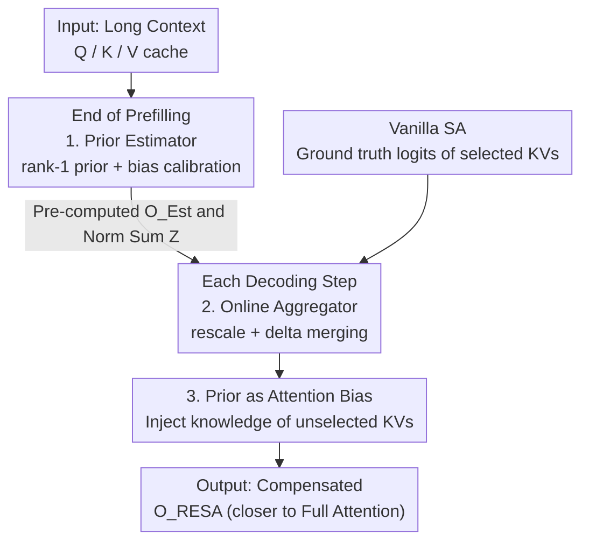

# RESA: Bringing Back What Sparse Attention Ignores with Residual Estimation

**Conference**: ICLR 2026  
**OpenReview**: [https://openreview.net/forum?id=ktcq26hMCH](https://openreview.net/forum?id=ktcq26hMCH)  
**Area**: LLM Efficiency  
**Keywords**: Sparse Attention, KV cache, Low-rank, Residual Estimation, Long-context Inference

## TL;DR
Addressing the blind spot of Sparse Attention (SA)—which "only computes selected KV pairs and treats others as zero contribution"—RESA leverages the inherent low-rank property of attention logit matrices. It utilizes a rank-1 prior to estimate the contributions of ignored KVs and merges them online with an overhead of the same order as SA. This improves model quality by up to 26% under the same KV budget, or compresses the KV budget by 33.2% and increases attention throughput by 1.23× at equivalent quality.

## Background & Motivation
**Background**: Long-context LLMs make the KV cache a new bottleneck for memory and bandwidth. Sparse Attention (SA) mitigates this by selecting only a subset of high-scoring KVs for computation. Existing SA research generally revolves around two questions: "how to accurately identify key KVs" (using ANN approximations) and "how many KVs to select" (dynamically allocating budgets based on head sparsity).

**Limitations of Prior Work**: When the attention distribution is less sparse (flatter scores), the only recourse for the aforementioned approaches is to "select more KVs" to maintain accuracy. This gradually erodes the efficiency advantages of SA, especially on compute-constrained devices.

**Key Challenge**: The author points out that these approaches share a questionable default assumption—that only selected KVs contribute to the final attention output, while unselected KVs contribute zero. This "all-or-nothing" binary assumption is the fundamental source of quality loss.

**Goal**: Instead of selecting more KVs, this work asks a third, orthogonal question: can the contributions of unselected KVs be efficiently and accurately **estimated** to compensate for the loss? The authors refer to this process as Residual Estimation.

**Key Insight**: The motivation stems from the fact that attention computation contains significant redundancy; thus, unselected KV contributions "can be roughly estimated without precise calculation." Specific evidence is the inherent low-rank nature of the logit matrix $M=QK^\top/\sqrt{d}$: its effective rank is upper-bounded by the head dimension $d$ (e.g., 128) and is independent of sequence length. Taking Llama-3.1-8B with an 8k sequence as an example, the effective rank of $M\in\mathbb{R}^{8k\times 8k}$ is only 128. Further SVD analysis reveals the first singular value accounts for 40%–50% of the total energy and grows linearly with sequence length—implying that as the sequence grows, logits appear more like "replicated" amplifications with increasing redundancy.

**Core Idea**: Use a rank-1 logit prior to estimate the contribution of KVs ignored by SA, and merge it into the SA output during decoding in a lightweight manner—combining the complementary perspectives of "sparsity" (capturing fine-grained importance) and "low-rank" (preserving global structure).

## Method

### Overall Architecture
RESA (Residual Estimated for Sparse Attention) is a **training-free** framework that adds a new computation branch alongside the original SA pipeline to compensate for discarded global contributions. It operates in two phases: at the **end of prefilling**, it uses a "representative query" to calculate the prior distribution of unselected KVs and their output $O_{Est}$; during **each decoding step**, it merges this prior with the current SA results using lightweight scaling, yielding a more accurate output $O_{RESA}$. The critical constraint is that the complexity of the entire branch must match vanilla SA ($O(|I|)$, where $I$ is the set of selected KV indices) without introducing additional orders of overhead.

RESA consists of two sub-modules: the **Prior Estimator** determines the prior logit distribution of unselected KVs and pre-calculates the corresponding output; the **Online Aggregator** merges the prior with SA results via delta updates during decoding. RESA is not tied to any specific SA algorithm and acts as a universal enhancer (applicable to Quest, ArkVale, Ada-KV, PSA, etc.).

### Key Designs

**1. Prior Estimator: Cheaply calculating the rank-1 prior with a "representative query"**

The challenge is that obtaining the primary singular component $\sigma_1 u_{1,i} v_1^\top$ theoretically requires SVD at every decoding step, which is prohibitively expensive. The key observation is that one can **bypass SVD** by approximating this component with the mean of historical logits. Specifically, for the current query $q_i$ and the key cache $K$, the estimate is:

$$q_i K^\top \approx \mu_Q K^\top + (q_i-\mu_Q)\mu_K^\top,\qquad \delta_i=(q_i-\mu_Q)(K-\mu_K)^\top$$

where $\mu_Q, \mu_K$ are the means of historical queries/keys, and $\delta_i$ is the error. The key term $\mu_Q K^\top$ equals the mean of all rows in the logit matrix $\bar M=\frac{1}{L}\sum_i M_{i,:}$. This serves as a prior because historical logits for each token fluctuate slightly around their mean (i.e., $M_{i,:}=\bar M+e_i$). This "row-mean concentration" causes the rank-1 peak, making the cosine similarity between $\mu_Q K^\top$ and the primary singular component $\sigma_1 u_1 v_1^\top$ close to 1. The bias term $(q_i-\mu_Q)\mu_K^\top$ aligns the mean of the estimate with true logits—since softmax is extremely sensitive to relative magnitudes, this bias eliminates global shifts to avoid systematic distortion.

Crucially, $\mu_Q K^\top$ is independent of the query index $i$ and can be **computed once**: at the end of prefilling, compute its softmax and weighted sum of $V$ to get $O_{Est}$, equivalent to appending one query to the prefilling phase. Given the large $L$, this overhead is negligible.

**2. Online Aggregator: Compressing fusion to SA complexity via rescale + delta merging**

Directly replacing prior logits with actual SA logits for selected positions requires re-computing the softmax over length $L$, which is $O(L)$ and negates SA's advantages. RESA splits this into two steps to maintain $O(|I|)$.

Step 1: **rescale**: Let the prior exponential sum be $Z=\sum_j \exp(P_j)$ (pre-calculated). The new sum $Z'$ during decoding differs only by replacing selected indices $\sum_{j\in I}\exp(P_j)$ with $\sum_{j\in I}\exp(P^{SA}_{I_j})$, requiring only $O(|I|)$. Two scalar factors align scores into a unified distribution $S'$:

$$\alpha=\frac{Z}{Z'},\qquad \beta=\frac{\sum_{j\in I}\exp(P^{SA}_{I_j})}{Z'}$$

Unselected positions use $\alpha\cdot S_j$, while selected positions use $\beta\cdot S^{SA}_{I_j}$. Step 2: **delta merging**: Rewrite the output as an incremental update relative to $O_{Est}$:

$$O_{RESA}=\alpha\cdot O_{Est}+\big(\beta\cdot S^{SA}_I-\alpha\cdot S_I\big)V_I$$

This reuses $O_{Est}$ and computes only on selected positions, keeping complexity identical to SA. It utilizes log-sum-exp and shifted-logit tricks for numerical stability. A hyperparameter $\lambda\in[0,1]$ controls the prior weight ($\alpha'=\lambda\alpha$); setting $\lambda=0$ reverts to vanilla SA.

**3. Prior as Attention Bias: Reinterpreting compensation as knowledge injection**

The authors interpret RESA's effectiveness as an **attention bias**. It works on two levels: first, it enters the softmax denominator, altering the distribution; second, its weighted sum of $V$ is aggregated into the output, injecting "knowledge" from unselected KVs. This aligns with training-time phenomena: learned biases in GPT-oss or K/V suppression in Sun et al. can be viewed as implicit priors labeling positions as irrelevant or smoothing outlier impacts. Visualization shows that after sequence averaging, the prior is primarily composed of low-frequency RoPE components—the known "semantic carriers"—making the RESA prior a global semantic bias.

### Loss & Training
RESA is entirely **training-free**. It does not modify weights or training objectives, functioning as a plug-and-play inference-time enhancement. The only tunable parameter is $\lambda$: in retrieval tasks, accuracy typically increases monotonically with $\lambda$ (prior helps exclude false candidates), whereas in summarization/understanding tasks, performance may peak then drop (prior might interfere with context understanding).

## Key Experimental Results

### Main Results
Evaluated on RULER and LongBench with SA baselines (Quest, ArkVale, Ideal-TopK) using Llama-3.1-8B/3.2-3B, Mistral-7B, and LWM-7B (2.5% budget, 8k context). Significant gains on RULER (results in parentheses are +RESA):

| Model / Method | Task | SA | +RESA | Gain |
|------|------|------|------|------|
| Llama-3.1-8B / Quest | MK3 | 24 | 40 | +16 |
| Llama-3.2-3B / Quest | MQ | 83.25 | 93 | +9.75 |
| Mistral-7B / ArkVale | MK3 | 28 | 44 | +16 |
| LWM-7B / ArkVale | MQ | 74.75 | 89.25 | +14.5 |

Max improvements per model reached 16%/26%/22%/20% (RULER) and 5.65%/1.95%/8.22%/6.01% (LongBench). As expected, Ideal-TopK showed the smallest gain since it is already close to full attention.

### Efficiency
| Configuration | Benefit |
|------|------|
| KV Budget Compression (PSA / Ada-KV) | Up to 33.2% / 28.7% |
| Attention Throughput Gain (vs PSA / Ada-KV) | 1.23× / 1.16× |
| Attention Throughput Gain (vs Full Attention) | 2.64× / 2.49× |
| Prefilling Overhead (Total, 128k) | Only 0.06% |
| Decoding Step Overhead (8k→32k) | 3.13%→2.34% |
| Score Error Reduction (SA vs Full) | 55%–70% (up to 77%) |

### Key Findings
- **Superiority at Scale**: The longer the context, the greater the RESA gain, as long sequences contain more redundancy for the low-rank prior to capture.
- **Diluted Overhead**: Prefilling overhead only applies to the last chunk; as context length increases, the relative overhead approaches zero (0.06% at 128k). Online Aggregator involves only element-wise ops, with per-step overhead <3.13%, decreasing relative to length.
- **Patterned Error**: The estimation error shows mean reversion and temporal correlation (via ACF analysis), suggesting potential for future improvements using time-series modeling.

## Highlights & Insights
- **Breaking the binary assumption**: RESA is the first to directly estimate the residual of unselected KVs, offering a perspective orthogonal to "which/how many to select."
- **Row-mean vs. SVD**: The clever engineering finding that logit row-means approximate the primary singular component allows for rank-1 priors without expensive online SVD.
- **Complexity Conservation**: Through rescale + delta merging, the $O(L)$ task of global compensation is compressed into $O(|I|)$, making it practically free.
- **Unified interpretation**: Linking training-free compensation to learned biases (GPT-oss, outlier suppression) provides a transferable design framework.

## Limitations & Future Work
- **Task-dependent Weights**: $\lambda$ behaves differently across tasks (retrieval vs. understanding) and requires manual tuning.
- **Rank-1 Limitation**: To avoid SVD, the prior only approximates the primary component; higher-order structures and error temporal structures are not yet modeled.
- **Hypothesis Dependency**: Success relies on the "row-mean concentration" and the primary singular value carrying 40%–50% energy. Robustness across different positional encodings requires further verification.
- **Training Integration**: The interpretation of priors as attention bias during training remains at the case-analysis stage without large-scale training experiments.

## Related Work & Insights
- **vs. Quest / ArkVale (Block-level SA)**: These focus on selecting KV pages; RESA stacks on top to estimate discarded contributions, providing stable gains for both.
- **vs. Ada-KV / PSA (Dynamic Budget)**: RESA is orthogonal and can further compress their budgets by 28.7%–33.2%.
- **vs. StreamingLLM / H2O / TOVA (Token Eviction)**: These permanently drop tokens; RESA avoids degradation by estimating global contributions rather than discarding them.

## Rating
- Novelty: ⭐⭐⭐⭐⭐ Proposes a "residual estimation" perspective orthogonal to SA trends and elegantly bypasses online SVD.
- Experimental Thoroughness: ⭐⭐⭐⭐ Extensive coverage of models/baselines, though primarily focused on RULER synthetic tasks over massive real-world benchmarks.
- Writing Quality: ⭐⭐⭐⭐ Clear motivation-observation-method chain. Derivations are lucid.
- Value: ⭐⭐⭐⭐⭐ Training-free, plug-and-play, and nearly zero overhead; highly practical for long-context inference deployment.

<!-- RELATED:START -->

## Related Papers

- [\[ICLR 2026\] vAttention: Verified Sparse Attention via Sampling](vattention_verified_sparse_attention_via_sampling.md)
- [\[ICLR 2026\] Sparse Attention Adaptation for Long Reasoning](sparse_attention_adaptation_for_long_reasoning.md)
- [\[ICLR 2026\] Tactic: Adaptive Sparse Attention with Clustering and Distribution Fitting for Long-Context LLMs](tactic_adaptive_sparse_attention_with_clustering_and_distribution_fitting_for_lo.md)
- [\[ICLR 2026\] One-Prompt Strikes Back: Sparse Mixture of Experts for Prompt-based Continual Learning](one-prompt_strikes_back_sparse_mixture_of_experts_for_prompt-based_continual_lea.md)
- [\[ICLR 2026\] Understanding and Improving Length Generalization in Hierarchical Sparse Attention Models](understanding_and_improving_length_generalization_in_hierarchical_sparse_attenti.md)

<!-- RELATED:END -->
