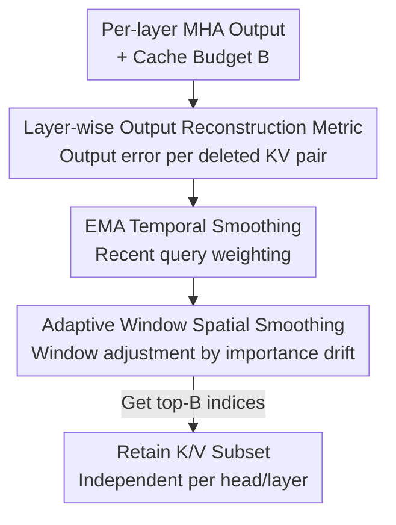

# ReST-KV: Robust KV Cache Eviction with Layer-wise Output Reconstruction and Spatial-Temporal Smoothing

**Conference**: ICLR 2026  
**OpenReview**: [https://openreview.net/forum?id=PhEHuo7oMm](https://openreview.net/forum?id=PhEHuo7oMm)  
**Code**: Included in supplementary materials (claimed to be easy to reproduce)  
**Area**: LLM Efficiency  
**Keywords**: KV Cache, Cache Eviction, Long Context, Attention Redistribution, Inference Acceleration

## TL;DR
ReST-KV redefines KV cache eviction as a "layer-wise output reconstruction" problem. It treats the error increment in the attention output of the current layer after deleting a specific KV pair as the importance metric, explicitly capturing the redistribution effect ignored by prior work. Combined with exponential moving average (EMA) temporal smoothing and adaptive window spatial (AWS) smoothing, it achieves a robust eviction strategy. It outperforms SOTA by 2.58% on LongBench and 15.2% on RULER, while reducing decoding latency by 10.61× for 128k sequences.

## Background & Motivation
**Background**: LLM contexts are becoming increasingly long (GPT-4, Claude 3.5, and Llama-3.1 support 128k+), but KV cache expands linearly with sequence length, reaching hundreds of GBs for long sequences. Compressing KV cache without retraining is key to improving inference efficiency and scalability. KV cache eviction (identifying and discarding unimportant KV pairs) is the most mainstream training-free method.

**Limitations of Prior Work**: Methods like H2O, SnapKV, and PyramidKV almost exclusively use "attention weights" to estimate the importance of KV pairs—retaining pairs with high query-key similarity and discarding those with low similarity. However, this logic has a gap: when KV pairs are actually deleted, the softmax operation **redistributes** the attention mass originally held by the deleted tokens to the remaining ones, altering the entire distribution. Static attention weights before deletion cannot predict the actual consequences post-eviction, leading to sub-optimal decisions and performance drops under tight budgets.

**Key Challenge**: Importance = attention weight before deletion $\neq$ actual impact on model output after deletion. The former ignores two things: first, the attention redistribution effect (whether other tokens can compensate for a deleted contribution); second, the dynamic drifting of KV importance across **time steps and spatial positions**.

**Goal**: Design a robust eviction metric that is both aware of attention redistribution and capable of tracking spatio-temporal drift, without requiring retraining and maintaining compatibility with existing budget allocation strategies.

**Key Insight**: Instead of "retaining high-attention KV pairs," the goal is changed to "retaining the layer-wise attention output distribution." By measuring importance via output reconstruction error, redistribution effects are automatically absorbed into the metric. Two smoothing mechanisms are added based on observations of importance fluctuations over time and spatial displacement.

**Core Idea**: Replace "original attention weights" with the "layer-wise output reconstruction error caused by deleting the KV pair" as the eviction metric, and apply spatio-temporal smoothing to this metric.

## Method

### Overall Architecture
ReST-KV scores and selects top-$B$ KV pairs for each attention head and layer independently during the prefill phase. It consists of two parts: (a) Layer-wise Output Reconstruction (LOR) metric, providing baseline importance; (b) Spatio-temporal smoothing, which applies EMA in the temporal dimension and Adaptive Window Smoothing (AWS) in the spatial dimension. The process is: calculate original MHA output → estimate the error increment for each KV pair as importance → perform EMA over the recent query window → adjust window size based on spatial drift for spatial smoothing → select top-$B$ indices.

### Key Designs

**1. Layer-wise Output Reconstruction: Using Post-deletion Error Instead of Static Weights**

To address the gap of ignoring redistribution, the authors formalize single-layer eviction as a budget-constrained optimization problem (Definition 3.1): minimize the $\ell_2$ distance between MHA outputs before and after compression, i.e., $\arg\min \lVert \text{MHA}(x_t,\langle K_T,V_T\rangle) - \text{MHA}(x_t,\langle \hat{K}_T,\hat{V}_T\rangle)\rVert_2$, where the size of $\langle \hat{K}_T, \hat{V}_T\rangle$ is at most $B$. To avoid expensive combinatorial optimization, a greedy approach is used: for the $n$-th KV pair, importance $I_t[n]$ is defined as the error increment $\lVert \text{MHA}(x_t,\langle K_T,V_T\rangle)-\text{MHA}(x_t,\langle K_{T,\backslash n},V_{T,\backslash n}\rangle)\rVert_2$.

Using a local linear assumption, this simplifies to a closed-form expression (Eq. 7):

$$I_t[n] = \frac{A_t[n]}{1-A_t[n]} \, \lVert \text{MHA}(x_t,\langle K_T,V_T\rangle) - v_n W_O \rVert_2$$

This decomposes importance into two mechanisms: the first term $\frac{A_t[n]}{1-A_t[n]}$ is a monotonic non-linear amplifier on $(0,1)$, retaining the intuition that higher weights are generally more important but increasing discriminative power; the second term $\lVert \text{MHA}(\cdot)-v_n W_O\rVert_2$ is the "redistribution sensitivity"—it measures whether other KV pairs can fill the contribution of $v_n$ to reconstruct the output. Explicitly incorporating values $v_n$ and redistribution distinguishes this from weight-only metrics.

**2. EMA Temporal Smoothing: Suppressing Volatility and Tracking Long-term Trends**

Visualization (Figure 3 left) shows that the importance $I_t[n]$ of the same KV pair fluctuates significantly across time steps. ReST-KV applies an Exponential Moving Average over a recent query window $S_w$: $\hat{I}_t[n]=\text{EMA}(I_{t-S_w:t}[n])$ (with a large constant $\Omega$ for the most recent $S_w$ tokens). The recursion is $\text{EMA}(I_{t_1:t_2}[n])=\alpha I_{t_2}[n]+(1-\alpha)\text{EMA}(I_{t_1:t_2-1}[n])$, where $\alpha$ balances current scores and history.

**3. Adaptive Window Spatial Smoothing (AWS): Adjusting Windows Follow Spatial Displacement**

Figure 3 right reveals that similar importance distributions reappear at **displaced positions** ($I_{t-k}[n-kN]$ patterns), meaning important regions shift spatially over time. Fixed window pooling fails to track this. AWS splits the observation window into $S_w^{front}$ and $S_w^{rear}$ parts, calculates average indices of top-$B$ pairs $D^{front}$ and $D^{rear}$, and estimates spatial shift $\Delta D=D^{rear}-D^{front}$. It then adaptively sets window size $W_s=2\lfloor|D^{rear}-D^{front}|/\beta\rfloor+1$ and sliding offset $\gamma_{shift}$. The final metric $I_t[n]$ is the average of $\hat{I}_t$ within this adaptive window.

The final retained sets are $\hat{K}_T=K_T[D_t,:]$ and $\hat{V}_T=V_T[D_t,:]$ where $D_t=\arg\max_B(I_t)$.

## Key Experimental Results

### Main Results
Evaluated on five LLMs (Llama2-Chat, Gemma-Instruct with MHA; Llama3-Instruct, Mistral-v0.3, Qwen2.5 with GQA), comparing against StreamingLLM, H2O, TOVA, SnapKV, and LaCache. LongBench (16 datasets) average gain is 2.58%:

| Setting | Metric | ReST-KV | SnapKV | Full (No Compression) |
|------|------|---------|--------|------|
| Llama-3.1-8B, B=64L | LongBench Avg. | **33.54** | 31.48 | — |
| Llama-3.1-8B, B=512L | LongBench Avg. | **38.33** | 37.47 | 39.96 |
| Mistral-7B-v0.3, B=64L | LongBench Avg. | **40.05** | 37.53 | — |
| Mistral-7B-v0.3, B=512L | LongBench Avg. | **46.47** | 45.66 | 48.11 |

On RULER (Llama3.1-8B, B=1024L, 4k→128k), the average is 15.2% higher than SOTA:

| Method | 4K | 32K | 64K | 128K | Avg. |
|------|----|----|----|----|------|
| Full | 99.34 | 94.89 | 89.85 | 79.32 | 93.46 |
| SnapKV | 83.60 | 66.95 | 57.47 | 47.99 | 67.11 |
| **ReST-KV** | **94.01** | **81.87** | **78.65** | **68.28** | **82.27** |

At 128k, withholding <1% of cache, ReST-KV maintains effective retrieval (68.28 vs 47.99 for SnapKV).

### Ablation Study
On LongBench (Llama3.1-8B, B=128L):

| Configuration | Avg. Acc | Note |
|------|---------|------|
| Attention weight Top-k | 32.98 | Baseline (weight only) |
| ReST-KV (Full) | 35.86 | Complete model |
| w/o LOR | 33.95 (−1.91) | Remove reconstruction metric |
| w/o EMA | 34.02 (−1.84) | Remove temporal smoothing |
| w/o AWS | 33.50 (−2.36) | Remove spatial smoothing |

### Key Findings
- All three components contribute positively. Removing AWS (spatial smoothing) results in the largest drop (−2.36), indicating that tracking spatial drift is critical for long-context robustness.
- Efficiency: Integrated with FlashAttention-2, decoding latency for 128k is reduced by ~10.61×. TTFT acceleration is up to 3.42×. ReST-KV introduces only ~2% extra prefill latency compared to SnapKV.
- Orthogonal to budget allocation strategies like PyramidKV (layer-wise) or AdaKV (head-wise).

## Highlights & Insights
- The derivation of the deletion error into the closed-form Eq. 7 is a highlight, decomposing it into a "nonlinear attention term" and a "redistribution term." This explains why previous methods (using only $A_t[n]$) were degraded cases.
- Shifting the perspective from "retaining tokens" to "retaining output distribution" makes importance a dynamic marginal effect rather than an intrinsic token property.
- The use of the index difference $\Delta D$ between window halves to estimate spatial drift is a lightweight and interpretable trick that outperforms fixed window pooling.

## Limitations & Future Work
- The metric relies on a "local linear assumption" for Eq. 7; accuracy may degrade in highly non-linear attention scenarios.
- EMA factor $\alpha$ and AWS factor $\beta$ are hyperparameters that may require tuning across different models/tasks.
- Focused on prefill KV selection; combination with quantization or low-rank compression remains unexplored.
- Evaluation is primarily on text; multi-modal or ultra-long generation performance is unknown.

## Related Work & Insights
- **vs H2O / SnapKV**: These use cumulative or window average weight. ReST-KV shows these are degraded forms of Eq. 7 that ignore redistribution. ReST-KV adds value vectors and spatio-temporal dynamics for better robustness.
- **vs PyramidKV / AdaKV**: These focus on budget allocation. ReST-KV provides a better metric and is compatible with their allocation strategies.
- **vs Keyformer / MInference**: While they observe patterns or use normalization, ReST-KV explicitly models redistribution and drift within the importance metric itself.

## Rating
- Novelty: ⭐⭐⭐⭐⭐ Redefining eviction as reconstruction with a closed-form solution is a significant perspective shift.
- Experimental Thoroughness: ⭐⭐⭐⭐⭐ Broad model coverage, extensive benchmarks, and robust ablation.
- Writing Quality: ⭐⭐⭐⭐ Clear motivation and derivation; minor inconsistency in TTFT numbers across sections.
- Value: ⭐⭐⭐⭐⭐ Training-free, 10x speedup, and robust for 128k context.

<!-- RELATED:START -->

## Related Papers

- [\[ICML 2026\] CriticalKV: Optimizing KV Cache Eviction from an Output Perturbation Perspective](../../ICML2026/llm_efficiency/criticalkv_optimizing_kv_cache_eviction_from_an_output_perturbation_perspective.md)
- [\[ICLR 2026\] LouisKV: Efficient KV Cache Retrieval for Long Input-Output Sequences](louiskv_efficient_kv_cache_retrieval_for_long_input-output_sequences.md)
- [\[ICLR 2026\] Reconstructing KV Caches with Cross-Layer Fusion for Enhanced Transformers](reconstructing_kv_caches_with_cross-layer_fusion_for_enhanced_transformers.md)
- [\[ICLR 2026\] DefensiveKV: Taming the Fragility of KV Cache Eviction in LLM Inference](defensivekv_taming_the_fragility_of_kv_cache_eviction_in_llm_inference.md)
- [\[ICLR 2026\] FlashDLM: Accelerating Diffusion Language Model Inference via Efficient KV Caching and Guided Diffusion](flashdlm_accelerating_diffusion_language_model_inference_via_efficient_kv_cachin.md)

<!-- RELATED:END -->
