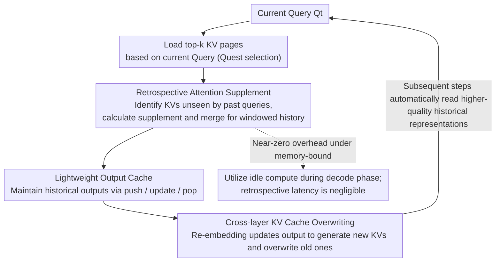

# Retrospective Sparse Attention for Efficient Long-Context Generation

**Conference**: ICLR 2026  
**OpenReview**: [https://openreview.net/forum?id=Ql0G1Zsobn](https://openreview.net/forum?id=Ql0G1Zsobn)  
**Code**: https://github.com/csh3695/RetroAttention  
**Area**: LLM Efficiency  
**Keywords**: KV Cache Compression, Sparse Attention, Long-Context Generation, Attention Error Accumulation, Memory-Constrained Inference

## TL;DR
This paper proposes RetroAttention, a "retrospective" sparse attention mechanism. When new KV pairs are loaded during subsequent decoding steps, it retroactively corrects the already computed attention outputs of past queries. This allows historical queries to access more KV pairs without increasing the KV budget, mitigating error accumulation during long generation. Compared to the SOTA method Quest, it improves accuracy by up to 21.9% and expands effective KV exposure by up to 1.6×.

## Background & Motivation

**Background**: LLMs are required to handle increasingly long sequences in tasks such as long-reasoning, code generation, and multi-turn dialogues. However, every decoding step requires reading the KV cache, which grows linearly with sequence length and often occupies several GBs of VRAM, becoming the primary bottleneck for inference latency. Mainstream mitigation strategies involve KV cache compression—identifying and retaining/loading only a small number of important tokens (e.g., H2O, SnapKV, Quest). Among these, "non-eviction" methods (where discarded KVs can be re-retrieved in the future) like Quest are currently SOTA.

**Limitations of Prior Work**: Almost all existing methods focus exclusively on "long-input" scenarios, assuming that selecting the most relevant tokens for the current step is sufficient, while **never revisiting or modifying tokens that have already been decoded**. However, long generation is different: errors generated at each step due to approximate attention (omitting certain evicted KVs) **accumulate recursively** within the hidden states. Experimental results on PG-19 show that the gap between compressed KV and full KV is negligible at the start of generation but widens significantly as the generation grows longer.

**Key Challenge**: To correct this accumulated error, the most direct way is to provide a larger KV budget (loading more KVs), but this increases VRAM and latency, contradicting the original goal of compression—there is a trade-off between accuracy and KV budget. The authors quantify that long-output tasks are far more sensitive to KV budget than long-input tasks: on LONGBENCH (long input, short output), Quest with a 5% budget approaches full-cache performance (46.3% vs 47.3%), whereas on LONGGENBENCH (long output), a 5% budget causes GSM8K performance to plummet from 60.8% to 17.6%, as the impact of a missing KV is amplified over hundreds of decoding steps.

**Key Insight**: The authors' key observations stem from two statistical facts. First, adjacent tokens are highly semantically correlated—about 70–80% of KVs retrieved by the current Query were also in the top-k for past Queries, and another 15–20% fall in the next-k range, indicating these KVs were actually important for past Queries but just missed the cut. Second, aggregating "previously unseen" KVs loaded in future steps into an "effective KV budget" results in a 1.17× increase when $n=1$ and 1.60× when $n=7$—all gained without additional KV budget costs.

**Core Idea**: Since KVs loaded in the current step are also useful for past Queries, they should be used to **retroactively calculate and correct the attention outputs of past Queries**. This breaks the paradigm where "attention output is fixed once computed," allowing historical outputs to be continuously refined during subsequent decoding.

## Method

### Overall Architecture

RetroAttention follows the KV cache page selection strategy of Quest (abstracting each KV page into element-wise $K_{\min}/K_{\max}$ and estimating page importance via $\text{score}_j(Q)=\sum_i \max(Q_iK^j_{\min,i}, Q_iK^j_{\max,i})$). However, it shifts the focus from "which KVs to select" to "how to reuse loaded KVs for past queries." Overall, it performs four actions at each decoding step: first, it loads KVs based on the current Query; second, it identifies the "parts of these KVs that past Queries have not seen" using a mask; third, it supplementally calculates attention for several historical Queries within a window and merges them linearly using a FlashAttention-style method to correct historical outputs; finally, it writes the corrected outputs back to a lightweight "Output Cache" and further re-embeds them to overwrite deeper KV caches, allowing errors to decay across layers. The entire process occurs within a **retrospective window** of size $w$ (the main experiment uses $w=2$).

### Key Designs

**1. Retrospective Attention Supplement: Using Future KVs to Compensate Past Attention**

This is the core of the method, addressing the pain point where historical attention outputs are fixed and errors simply accumulate. At step $t+s$, the system does not just calculate attention for the current Query; it also **looks back** to supplement the attention output $O_{\text{org},t}$ for a past Query $Q_t$ within the window. Specifically, while the current Query uses Quest sparse attention, for the past Query, a **supplemental output** $O^{t+s}_{\text{sup},t}$ is calculated only on KV pages that are "currently loaded but were previously unseen by $Q_t$":

$$O^{t+s}_{\text{sup},t}=\frac{\sum_{j\in S_{t+s}\setminus\cup_{m=t}^{t+s-1}S_m}\sum_{l\in \text{Page}_j} e^{Q_tK_l^\top/\sqrt{d}}V_l}{\sum_{i\in S_{t+s}\setminus\cup_{m=t}^{t+s-1}S_m}\sum_{l\in \text{Page}_i} e^{Q_tK_l^\top/\sqrt{d}}}$$

Where $S_t$ is the set of top-k pages loaded by $Q_t$, and the set difference $S_{t+s}\setminus\cup S_m$ identifies the "new" KVs. Drawing from FlashAttention's partial attention aggregation, the softmax attention can be rewritten as a **linear combination** of the original and supplemental outputs, incrementally updating $O_{\text{org},t}$ into $O_{\text{up},t}$. This is equivalent to recalculating attention over the union $\cup_{0\le s<w}S_{t+s}$. Effectively, each historical Query is "fed" more KVs than its original top-k budget without additional KV memory access.

**2. Lightweight Output Cache: Avoiding KV Reloading for Retrospective Updates**

To correct historical outputs, they must be accessible, but attention outputs are typically discarded after computation. Reloading the top-k pages of historical Queries would multiply the KV budget by the window size $w$, which is counterproductive. This paper uses an **Attention Output Cache** to store outputs of the current and several historical steps, bypassing reloads. Its size is $(w-1, B, L, D)$ (retrospective window, batch, layers, hidden dimension), which is **independent of generation length**, thus incurring minimal VRAM overhead. The cache operates through three actions: Push (storing the output at each step), Update (performing weighted merging of $O_{\text{org}}$ or $O_{\text{up}}$ with supplemental outputs), and Pop (evicting the oldest entry when the window is exceeded).

**3. Cross-layer KV Cache Overwriting: Allowing Corrected Outputs to Impact Generation**

The first two designs only solve how attention is updated within a single layer. However, corrected outputs must propagate to deeper layers to change the final logits. The output cache of layer $l$ sends updated embeddings to layer $l+1$. For the latest step $t_3$, layer $l+1$ generates $Q/K/V$ the first time and appends them to the cache. For historical steps $t_{1\text{-}2}$, it uses the updated $O_{\text{up}}$ to **re-embed** new $\hat Q,\hat K,\hat V$, which then **overwrite** the now-obsolete KV entries previously generated by $O_{\text{org}}$. Once historical KVs are overwritten, all subsequent decoding steps ($t>t_3$) automatically utilize higher-quality historical representations when reading the KV cache. This mechanism allows attention errors to **decay across layers**.

**4. Near-Zero Overhead under Memory-Bound: Slotting Retrospective Computation into Idle Decode Capacity**

Does retrospective updating slow down inference? The authors use Arithmetic Intensity (AI, the ratio of FLOPs to memory bytes) to argue that it remains in the memory-bound regime. During the decode phase, attention consists mainly of GEMV operations where Processing Element (PE) utilization is extremely low, leaving significant idle parallelism available for retrospective computation. The AI of the attention layer simplifies to approximately $w h_q/h_k$, which, for moderate windows (e.g., $w<100$), is far below the threshold of 200–400 where modern GPUs become compute-bound. Regarding memory access, the ratio of memory traffic between this method and Quest is dominated by the KV loading term $k_{\text{page}}h_k Pd$ in both numerator and denominator, making the ratio close to 1. Thus, the latency overhead is negligible. Linear layers follow the same logic as long as $wb$ is within a few hundreds.

### A Complete Example

Consider a retrospective window $w=3$ and consecutive decoding steps $t_0,t_1,t_2,t_3$: at step $t_1$, after loading KV, the system finds pages $t_0$ hasn't seen, calculates $O_{\text{sup}}$ for $Q_{t_0}$, and updates $O_{\text{org},t_0}$ in the cache to $O_{\text{up},t_0}$. When step $t_2$ arrives, the newly loaded KV is reused for both $t_0$ and $t_1$. Thus, $t_0$ receives its **second update** ($O_{\text{up}}\to O_{\text{up}}$) while $t_1$ receives its first. At $t_3$, the oldest entry in the cache is popped. Each historical Query is repeatedly supplemented within its "lifetime" in the window, causing the effective KV budget to expand (reaching 1.60× at $n=7$) while KV memory traffic remains nearly constant.

## Key Experimental Results

### Main Results

The primary benchmark is LONGGENBENCH (multiple reasoning problems concatenated into one prompt, where $n$ is the number of problems). The model used is LLaMA-3.1-8B-Instruct with a relative KV budget $b=0.15$ and window $w=2$.

| Dataset (mean acc.) | Full | StreamingLLM | TOVA | Quest | RetroAttention | Δ vs Quest |
|--------|------|------|------|------|------|------|
| GSM8K | 61.8 | 0.0 | 0.2 | 52.6 | **56.5** | +3.9 |
| MMLU | 59.4 | 1.9 | 9.3 | 54.8 | **55.3** | +0.5 |
| CSQA | 73.2 | 2.0 | 8.1 | 56.8 | **60.3** | +3.5 |

Eviction-based methods (StreamingLLM/TOVA) fail almost entirely in sequential Q&A scenarios—once KVs needed for later problems are evicted early, they can never be recovered. As $n$ increases (longer input/output), the gain of RetroAttention over Quest becomes more pronounced (e.g., +6.8%p on GSM8K and +6.9%p on CSQA at $n=45$). Larger models also benefit: on Qwen2.5-14B, CSQA increases by +7.4%; on Qwen2.5-32B, CSQA +4.3% and GSM8K +4.0%.

Reasoning-intensive tasks (DeepSeek-R1-Distill-Llama-8B, $b=0.15, w=2$):

| Dataset (Pass@1) | Full | Quest | RetroAttention | Δ vs Quest |
|--------|------|------|------|------|
| AIME24 | 47.1 | 33.8 | **39.2** | +5.4 |
| GPQA-D | 38.9 | 33.6 | 33.6 | 0.0 |
| LiveCodeBench-v5 | 37.6 | 32.7 | **34.1** | +1.4 |

### Ablation Study

| Configuration | Key Result | Description |
|------|---------|------|
| Window $w=2\to4\to8$ | Accuracy monotonically approaches full cache | Larger $w$ increases effective KV budget, but gains saturate after $w>8$. |
| Memory Traffic Overhead | CSQA +3.0% / MMLU +1.6% / GSM8K +2.0% | Memory traffic barely increases for equivalent accuracy. |
| E2E Latency ($w=2$) | <1ms per token vs Quest; ~2ms for $w=8$ | Overhead is independent of context length, consistent with memory-bound analysis. |
| Effective KV Budget | $n=1$: 1.17× → $n=7$: 1.60× | "Free" exposure expansion without increasing actual budget. |

### Key Findings

- **Error accumulation is a real issue for long generation**: The gap between Quest and full-cache widening as $n$ increases (at $n=15/30/45$ on CSQA, gaps are -2.6/-20.6/-25.8%p), whereas RetroAttention performance remains stable—proving retrospective correction successfully inhibits error accumulation.
- **Retrospective updates expand effective budget rather than actual budget**: A 1.60× effective budget vs ~1–3% memory traffic increase represents a redesigned trade-off.
- **Gains eventually saturate**: Improvement plateaus after $w>8$ because KVs with high attention weights are included first; supplemental KVs added later have diminishing marginal importance. This is a property of the data, not just the method.
- **Not suitable for long-input short-output**: Performs similarly to Quest on LONGBENCH because sample generation lengths are <100 tokens, giving the retrospective updates insufficient opportunity to accumulate benefits.

## Highlights & Insights

- **A clever paradigm shift from "fixed output"**: While previous compression research focused on "whom to select in the current step," this work adds a new dimension—historical outputs can be refined by future KVs. It transforms single-step approximation into multi-step convergence at near-zero marginal cost by reusing KVs that were already going to be loaded.
- **Leveraging hardware characteristics of Decode**: Recognizing that GEMV leaves PEs idle, the authors use AI analysis to demonstrate that "slotting retrospective compute into idle FLOPs + using an output cache to avoid reloads" is a near-zero cost operation in memory-bound regimes.
- **Clean cross-layer overwriting design**: By overwriting historical KVs only at the moment of generation, subsequent layers can "read the cache as usual" while benefiting from higher-quality representations. This requires no special logic in deeper layers and could be extended to other "intermediate representation correction" scenarios.

## Limitations & Future Work

- Gains saturate after $w>8$, indicating an upper bound. The method is **not designed for long-input** tasks, where benefits are minimal.
- The method is tightly coupled with Quest’s paginated non-eviction strategy; its effectiveness with other eviction or selection strategies is not fully verified. The complexity of implementation (mask management, output cache, cross-layer scheduling) is non-trivial.
- Evaluations focused on 8B–32B models around $b=0.15$. Performance under aggressive low budgets (e.g., 5%) or ultra-long contexts (>256k) remains to be observed.

## Related Work & Insights

- **vs Quest**: Quest emphasizes query-dependent relevance and step-wise re-selection while maintaining fixed historical outputs. This work applies the "non-eviction reusability" in reverse—reusing current KVs to fix past outputs to specifically counter error accumulation in long generation.
- **vs StreamingLLM / TOVA (Eviction-based)**: These methods permanently discard KVs. If tokens needed later are evicted, they are irrecoverable, leading to total failure in sequential Q&A. This work's non-eviction + retrospective approach fills this gap.
- **vs Top-k Selection Reuse (Yang et al., Wu et al.)**: These works reuse selection results because adjacent Query top-k sets are similar. However, the authors found that applying "selection reuse" to Quest actually dropped GSM8K from 52.6% to 25.2%—simple reuse cannot inhibit error accumulation; explicit correction of historical outputs is required.

## Rating
- Novelty: ⭐⭐⭐⭐⭐ The "retrospective correction of historical attention" is a paradigm-shifting perspective with almost zero additional KV cost.
- Experimental Thoroughness: ⭐⭐⭐⭐ Extensive coverage of models and tasks with analysis of latency/VRAM/effective budget, though ultra-low budget and ultra-long context scenarios are slightly lacking.
- Writing Quality: ⭐⭐⭐⭐ Solid statistical motivation and clear AI overhead analysis, though notation is somewhat dense.
- Value: ⭐⭐⭐⭐⭐ Directly addresses the bottleneck of KV compression in long generation and is plug-and-play with existing non-eviction methods.

<!-- RELATED:START -->

## Related Papers

- [\[ICLR 2026\] Sparse Attention Adaptation for Long Reasoning](sparse_attention_adaptation_for_long_reasoning.md)
- [\[ICLR 2026\] Tactic: Adaptive Sparse Attention with Clustering and Distribution Fitting for Long-Context LLMs](tactic_adaptive_sparse_attention_with_clustering_and_distribution_fitting_for_lo.md)
- [\[ICLR 2026\] vAttention: Verified Sparse Attention via Sampling](vattention_verified_sparse_attention_via_sampling.md)
- [\[ICLR 2026\] Long-Context Attention Benchmark: From Kernel Efficiency to Distributed Context Parallelism](long-context_attention_benchmark_from_kernel_efficiency_to_distributed_context_p.md)
- [\[ICLR 2026\] LycheeDecode: Accelerating Long-Context LLM Inference via Hybrid-Head Sparse Decoding](lycheedecode_accelerating_long-context_llm_inference_via_hybrid-head_sparse_deco.md)

<!-- RELATED:END -->
