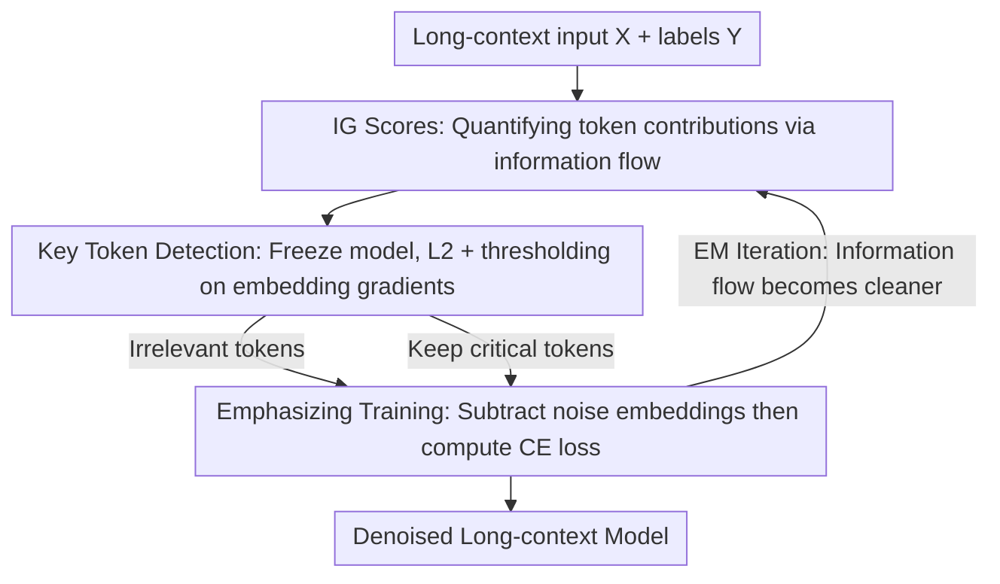

# Revisiting Long-context Modeling from Context Denoising Perspective

**Conference**: ICLR 2026  
**OpenReview**: [https://openreview.net/forum?id=xvGyyh6MG7](https://openreview.net/forum?id=xvGyyh6MG7)  
**Code**: https://github.com/LCM-Lab/context-denoising-training  
**Area**: LLM Efficiency  
**Keywords**: Long-context Modeling, Context Denoising, Integrated Gradients, Key Token Detection, Post-training  

## TL;DR
This paper treats long-context modeling as a "signal denoising" problem: it uses Integrated Gradient (IG) scores to precisely locate critical tokens that truly influence predictions and employs a lightweight denoising strategy, CDT, to suppress irrelevant tokens at the input. This allows an 8B open-source model to achieve a score of 50.92 on LongBench-E, nearing GPT-4o's 51.00.

## Background & Motivation
**Background**: Current Long-context Models (LCMs) can handle inputs of millions of tokens. The mainstream approach in the open-source community for extending long-context capabilities is post-training with massive amounts of high-quality synthetic long-text data—either via context window scaling or long-context alignment.

**Limitations of Prior Work**: Such "data-stacking" approaches are inefficient and not always effective under resource constraints. The authors found in controlled experiments that when training Llama3-8B on 2B tokens, Prolong only gains 1.8 points per additional 1B tokens, and efficiency decreases as the context length increases (e.g., to 128K). The root cause is the standard language modeling objective—uniform cross-entropy supervision per token—which fails to distinguish critical tokens from noise in long inputs.

**Key Challenge**: LCMs actually work in an implicit "retrieval-then-generation" manner: locating critical information in the context first, then generating based on that "retrieved context." However, critical tokens are easily overwhelmed by massive irrelevant tokens (context noise), and uniform CE loss cannot concentrate supervision signals on these critical tokens.

**Goal**: (1) Identify a reliable metric to distinguish critical tokens from noise tokens; (2) Design a training strategy that suppresses noise and strengthens "critical token → prediction" connections while maintaining training and memory efficiency.

**Key Insight**: The authors borrow the "signal denoising" perspective from digital signal processing—since noise is mixed in the input sequence, subtracting it at the input allows the model's attention to focus naturally on the critical parts. A key observation is that traditional attention-based detection mistakenly labels many irrelevant tokens as "attended," whereas "information-flow" metrics can cleanly separate critical tokens from noise.

**Core Idea**: Use Integrated Gradient (IG) scores to measure each token's true contribution for detection, then "subtract" the gradient components of irrelevant tokens at the input (Context Denoising Training). This uses an EM-style iteration to continuously purify the information flow.

## Method

### Overall Architecture
CDT (Context Denoising Training) decomposes long-context post-training into a two-step cycle: **Key Token Detection**—freezing the model and computing a single gradient pass on input token embeddings to identify critical vs. noise tokens; and **Emphasizing Training**—"subtracting" noise embedding components along their gradient direction (denoising), then unfreezing the model to compute standard CE loss and update parameters.

This process is performed online (re-detecting and re-denoising at each step), resembling an Expectation-Maximization (EM) loop: the model detects noise based on current information flow → improves training by suppressing noise → the information flow becomes cleaner after training → detection becomes more accurate in the next step. While the analysis phase uses computationally heavy IG scores (capped at 12K sequences), the training phase uses **token embedding gradients**, which are theoretically proportional to IG but much more memory-friendly, allowing scaling to 64K/128K.

### Key Designs

**1. IG Score: Locating critical tokens via information flow instead of attention**

Most existing works rely on attention distributions. However, using a synthetic multi-hop reasoning task, the authors found that attention-based FR scores (Fact Retrieval score) have a fatal flaw: they assign significant attention to many **irrelevant tokens** regardless of prediction correctness.

Instead, the authors use Integrated Gradients (IG) to characterize "information flow." For the $h$-th head in the $l$-th layer, the IG matrix is the element-wise product of the attention matrix and its gradient: $IG_{h,l}=A_{h,l}^T\odot\left|\frac{\partial L_\theta(Y|X)}{\partial A_{h,l}}\right|$. Summing the contributions of a token set $T_r$ to all outputs $Y$ and averaging across heads/layers yields the score $IG^{(r)}$. Experiments show IG scores for critical tokens are significantly higher than noise, enabling clean separation.

**2. Manual Context Denoising: Amplifying critical attention by "subtracting gradients"**

Instead of suppressing noise in the attention mechanism directly, the authors act on the input. By identifying noise tokens via IG and subtracting their gradient components from their input embeddings, the authors observed that attention scores on critical tokens **increased by ~10x**, while noise attention decreased slightly. This proves that "input denoising = DSP denoising" works and provides evidence for the training strategy.

**3. Approximating IG with Embedding Gradients: Scaling to long sequences**

Computing IG requires storing attention gradients for all layers, which is infeasible for long sequences. The authors theoretically derive that **token embedding gradients are proportional to IG scores** (Appendix C). Thus, they use the L2 norm of embedding gradients as a detector:
$$I(x_i)=\begin{cases}1,& \|\nabla_{E_\phi(x_i)}L_{CE}(x_i)\|_2 < t\\ 0,& \|\nabla_{E_\phi(x_i)}L_{CE}(x_i)\|_2 \ge t\end{cases},\quad t=\frac{1}{n}\sum_{i=1}^{n}\|\nabla_{E_\phi(x_i)}L_{CE}(x_i)\|_2$$
$I(x_i)=1$ indicates noise. This is efficient, token-specific, and uses much less memory than attention gradients.

**4. Emphasizing Training: Denoised input + Online EM**

CDT modifies only noise embeddings: $E_\phi(x_i)'=E_\phi(x_i)-I(x_i)\nabla_{E_\phi(x_i)}\times lr\times\beta$. Then, the model is unfrozen and trained with standard CE loss: $L_{CDT}(X,Y)=L_{CE}(f_\theta(E_\phi(X)'),Y)$. Since this occurs **online** during training, it forms an EM loop where detection and noise suppression reinforce each other. The wall-clock overhead is minimal compared to standard SFT.

### Loss & Training Strategy
The objective is $L_{CDT}=L_{CE}(f_\theta(E_\phi(X)'),Y)$. The product $lr\times\beta$ controls denoising strength ($lr=1\text{e-}5, \beta=5$ in main experiments). Data includes PG-19 for window scaling (64K) and LongMiT + LongAlpaca for alignment (16K–128K). CDT typically converges within 250 steps.

## Key Experimental Results

### Main Results
On LongBench-E, CDT achieved the best results across three settings, with the 8B model nearing GPT-4o:

| Model / Setting | Type | Avg. |
|------|------|------|
| GPT-4o (2024-11-20) | - | 51.00 |
| Llama-3-8B-Base (8K) | - | 25.50 |
| + LongCE | CWS | 34.62 |
| **+ CDT (ours)** | CWS | **39.31** |
| Llama-3.1-8B-Base + LongCE | LM | 36.90 |
| **+ CDT (ours)** | LM | **38.89** |
| Llama-3.1-8B-Instruct | - | 48.61 |
| + LOGO (DPO) | DPO | 49.01 |
| **+ CDT (ours)** | SFT | **50.92** |

CDT also led on RULER (32K–128K), LongPPL, and BABILong:

| Model | RULER 128K | LongPPL↓ | BABILong Avg. |
|------|------|------|------|
| Llama-3.1-8B-Instruct | 76.71 | 4.05 | 40.67 |
| + LOGO | 77.68 | 4.11 | 42.00 |
| **+ CDT (ours)** | **78.72** | **2.36** | **43.30** |

### Ablation Study

| Dimension | Key Findings |
|------|---------|
| Key Token Detection | CDT identifies the most supporting tokens and least noise tokens. Attention methods misidentify heavy noise. |
| Denoising Strength $lr\times\beta$ | Attention on critical tokens increases after denoising and further after training. Saturation occurs around 8e-5. |
| Training Budget | ~0.5h extra per 50 steps (8×A100) vs. SFT, but yields consistent gains while SFT might plateau. |

### Key Findings
- IG/embedding gradients distinguish critical tokens better than attention, which tends to "pseudofocus" on noise.
- Simply subtracting noise gradients at the **input** amplifies critical token attention by ~10x, suggesting failure in long context is largely due to signal drowning.
- CDT's gains stem from an EM-like cycle where information flow and attention improve synchronously.
- CDT is the only method that does not cause significant drops in few-shot subtasks during LM post-training.

## Highlights & Insights
- **Reframing long-context modeling as signal denoising**: The analogy is grounded in a trainable operation that yields measurable attention improvements.
- **Approximating IG with embedding gradients**: This engineering trade-off scales the method from 12K to 128K and is applicable to other saliency-based tasks.
- **Online EM Perspective**: Detection and training reinforce each other, naturally adapting to the evolving model during the training process.
- **Selective perturbation**: Modifying only noise embeddings while keeping critical ones provides a framework potentially useful for de-biasing or data cleaning.

## Limitations & Future Work
- IG is computationally heavy for long sequences; approximation accuracy in extreme distributions hasn't been stress-tested.
- Denoising strength saturation ($lr \times \beta$) requires empirical tuning and could vary across models/tasks.
- The use of a simple average gradient as a hard threshold is relatively primitive and might overlook some low-gradient but semantically critical tokens.
- Validation is primarily on Llama-3/3.1-8B; performance on larger scales (>128K) or non-English/code tasks needs confirmation.

## Related Work & Insights
- **vs. LongCE**: LongCE reweights tokens in the loss; CDT denoises at the **input embedding level** then uses standard CE, outperforming LongCE by 4.7 points on average.
- **vs. LOGO / SEALONG**: Alignment methods like DPO show limited gains under equal steps; CDT achieves +2 points with controllable overhead.
- **vs. FlexPrefill / X-Attention**: These are inference-time sparse attention methods; CDT is a training-time method that strengthens internal critical connections.
- **vs. RAG**: While RAG outsources retrieval, CDT strengthens the model's implicit internal retrieval-generation capability, avoiding system complexity.

## Rating
- Novelty: ⭐⭐⭐⭐⭐ Innovative reframing as signal denoising with IG grounding.
- Experimental Thoroughness: ⭐⭐⭐⭐ Broad task coverage, though focused on 8B models.
- Writing Quality: ⭐⭐⭐⭐ Clear logic and well-explained EM perspective.
- Value: ⭐⭐⭐⭐⭐ Practical and lightweight; enables 8B models to compete with GPT-4o.

<!-- RELATED:START -->

## Related Papers

- [\[ICLR 2026\] Frayed RoPE and Long Inputs: A Geometric Perspective](frayed_rope_and_long_inputs_a_geometric_perspective.md)
- [\[ICLR 2026\] Revisiting Parameter Server in LLM Post-Training](revisiting_parameter_server_in_llm_post-training.md)
- [\[ICML 2025\] Long-Short Alignment for Effective Long-Context Modeling in LLMs](../../ICML2025/llm_efficiency/long-short_alignment_for_effective_long-context_modeling_in_llms.md)
- [\[ICLR 2026\] Long-Context Attention Benchmark: From Kernel Efficiency to Distributed Context Parallelism](long-context_attention_benchmark_from_kernel_efficiency_to_distributed_context_p.md)
- [\[ACL 2026\] CoMeT: Collaborative Memory Transformer for Efficient Long Context Modeling](../../ACL2026/llm_efficiency/comet_collaborative_memory_transformer_for_efficient_long_context_modeling.md)

<!-- RELATED:END -->
