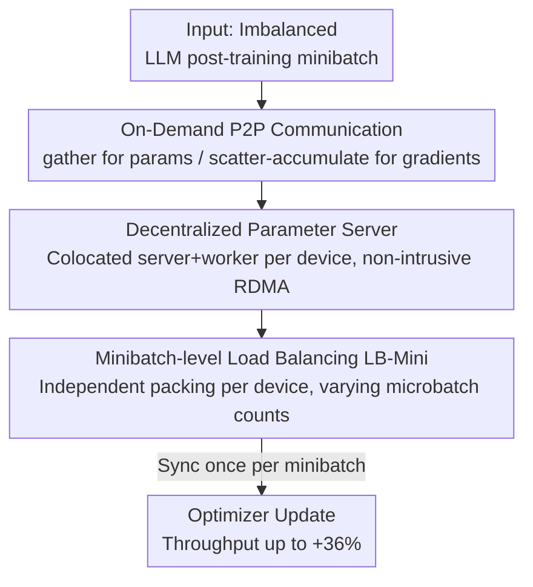

# Revisiting Parameter Server in LLM Post-Training

**Conference**: ICLR 2026  
**OpenReview**: [https://openreview.net/forum?id=iIEEgI6WsF](https://openreview.net/forum?id=iIEEgI6WsF)  
**Code**: https://github.com/sail-sg/odc  
**Area**: LLM Efficiency / Distributed Training / Post-training Systems  
**Keywords**: Parameter Server, FSDP, P2P Communication, Load Balancing, Post-training

## TL;DR
Addressing the Extreme sequence length variance and severe device load imbalance in LLM post-training, this paper reintroduces the classic Parameter Server (PS) concept into modern sharded data parallelism. It proposes On-Demand Communication (ODC), replacing layer-wise all-gather/reduce-scatter in FSDP with point-to-point gather/scatter-accumulate. By relaxing the synchronization granularity from "once per layer" to "once per minibatch," faster devices are no longer hindered by stragglers, achieving up to a 36% end-to-end speedup over standard FSDP.

## Background & Motivation

**Background**: Modern data parallel (DP) training overwhelmingly favors collective communication over Parameter Servers. Paradigms like Ring-AllReduce, Horovod, and NCCL provide elegant bandwidth utilization and scalability. FSDP/ZeRO further pushes this to the limit by sharding parameters, gradients, and optimizer states across devices to achieve memory-efficient scaling for trillion-parameter models, becoming the de facto standard for LLM post-training and RL pipelines.

**Limitations of Prior Work**: The efficiency of collective communication relies on a long-standing but rarely questioned assumption: **load balancing**. While this holds for vision, speech, and early NLP, LLM post-training breaks it. Real-world corpora exhibit massive sequence length variance (LongAlign average 16.5K, SWE-Smith average 34.7K). Since attention computation scales quadratically and activation memory scales linearly with length, persistent computational imbalance occurs between devices. FSDP is particularly vulnerable: it reconstructs parameters via all-gather before each forward layer and aggregates gradients via reduce-scatter after each backward layer. This **layer-wise, fine-grained synchronization** implicitly assumes all devices proceed in lockstep. Upon load imbalance, all devices must wait for the slowest one to complete collective communication before proceeding to the next layer. This study shows that even with SOTA packing strategies, device idle time in long-sequence SFT can reach 50%.

**Key Challenge**: Existing research focuses on finding optimal packing/batching schemes. However, packing only mitigates skew within a microbatch and cannot eliminate it—especially under memory constraints where minibatches must be split into smaller microbatches, narrowing the packing search space and increasing synchronization points. The root cause is not batching but the **communication model itself**: the layer-wise synchronization barrier is a byproduct of collective communication, not a requirement of the training algorithm, and is therefore "avoidable."

**Goal**: To remove the layer-wise synchronization barrier while retaining the memory efficiency, decentralization, scalability, and simplicity of FSDP, allowing device progress to decouple during load imbalance.

**Key Insight**: Returning to the first principles of data parallelism—**the computation on each device is essentially independent**. Classic PS architectures naturally tolerate stragglers because "the server stores parameters, workers compute independently, and push gradients when finished." The authors revisit PS but, instead of building a standalone PS, they "graft" the load tolerance of PS into FSDP.

**Core Idea**: Reinterpret FSDP as a **decentralized parameter server with colocated server and worker roles**, replacing layer-wise collective communication with point-to-point primitives to relax synchronization granularity from the layer level to the minibatch level.

## Method

### Overall Architecture

The goal of ODC can be summarized in one sentence: **Remove the layer-wise synchronization barrier of FSDP without changing the training semantics (synchronous optimization, consistent per-minibatch updates)**. It maintains the memory layout and computation graph of FSDP, swapping collective calls for asynchronous-friendly point-to-point primitives.

Specifically, ODC involves three transitions. First, it **decomposes** each all-gather into a series of targeted gather requests—a device fetches only the required shards from the peer holding them when needed for a specific layer. It decomposes each reduce-scatter into a series of scatter-accumulate operations—after computing gradients, a device pushes them directly to the owner for accumulation. Second, this point-to-point architecture is framed as a "decentralized PS": each device **simultaneously** acts as a server (holding/managing a shard of parameters/optimizer states) and a worker (running forward/backward passes on local data), mirroring FSDP’s sharded memory layout while avoiding centralized network bottlenecks. Third, because device progress is decoupled and no longer requires identical microbatch counts per device, load balancing is moved from the rigid microbatch level to the more flexible minibatch level (LB-Mini). This relaxes synchronization to "once at the end of each minibatch," preventing fast devices from idling.

### Key Designs

**1. On-Demand Communication (ODC): Decomposing Layer-wise Collective Barriers into P2P Transfers**

This is the core of the paper, addressing the bottleneck where layer-wise barriers cause idle time. In FSDP, minibatch execution time is determined by the slowest device for each layer: $T(P_M)=\sum_{m=1}^{M}\sum_{l=1}^{L}\max_{d} T_{m,d,l}(P_M)$. The per-layer, per-microbatch $\max_d$ is the source of idle time. ODC decomposes collective calls: all-gather becomes targeted gathers (fetching only specific shards), and reduce-scatter becomes scatter-accumulate (pushing gradients to the owner). Devices proceed as soon as they are ready, without aligning at every layer. A key property is that these transfers are **non-intrusive**: when device A initiates a gather/scatter-accumulate to device B, it does not interrupt B's ongoing computation. The synchronization barrier is reduced to once per minibatch, maintaining identical optimization semantics to FSDP while drastically mitigating straggler effects.

**2. Decentralized Parameter Server: Colocated Server/Worker, Reusing FSDP Sharding**

ODC achieves PS-like load tolerance without losing FSDP’s memory advantages by "decentralizing and colocating" the PS. Classic PS uses dedicated server nodes, which often become bottlenecks. ODC distributes parameters, gradients, and optimizer states **uniformly** across all devices. Each device is both a **server** (managing a shard, responding to gathers, accumulating gradients) and a **worker** (computing forward/backward passes). Since this layout is identical to FSDP, it requires no rewrite of memory management. Implementation-wise, ODC avoids MPI/NCCL (which require explicit ordered participation and are prone to deadlocks) and instead uses direct RDMA interfaces—CUDA IPC within nodes and NVSHMEM between nodes. This allows data transfers without active target involvement (gradient accumulation is handled by a light daemon). Communication kernels are implemented via Triton-Distributed, exposing RDMA directly in Python Triton kernels. Integrated into FSDP, ODC simply replaces collective calls and retrieves accumulated gradients at the minibatch end.

**3. Minibatch-level Load Balancing (LB-Mini): Liberating Packing from Microbatches to Minibatches**

Sequence length variance is the root of imbalance. While sequence packing is standard, it typically operates at the microbatch level, facing two constraints: 1) microbatch size is limited by single-card memory, leaving residual variance; 2) memory for a sequence of length $s$ is $O(s)$ while runtime is $O(s^2)$, creating a fundamental mismatch between memory and compute. ODC decouples microbatch execution and **removes the constraint that every device must have the same number of microbatches**. Load balancing can thus move upstream: global samples are partitioned to devices based solely on "total compute balance," and each device then independently packs its samples into microbatches based **only on its local memory constraints**. This simplifies the packing algorithm and achieves better balance by operating on a larger, less constrained set of samples. LB-Mini is only compatible with ODC, as collective communication requires a consistent number of microbatches across devices.

## Key Experimental Results

Experiments were conducted on DeepSeek-R1-Distill-Qwen series (1.5B–32B) using up to 32 A100 80G GPUs (NVSwitch intra-node, 800 Gbps RoCE RDMA inter-node), covering SFT (LongAlign, SWE-Smith) and RL (GRPO on verl, AIME prompts). Comparisons were made across "Communication Scheme × Load Balancing Algorithm": Schemes include Collective (baseline) and ODC; Balancing includes LocalSort (sort, no packing), LB-Micro (strong microbatch-level packing baseline), and LB-Mini (Ours, minibatch-level, ODC only).

### Main Results

| Task / Setting | Comparison | ODC Speedup vs Collective | Note |
|------|------|------|------|
| SFT (LongAlign / SWE-Smith), Packing | ODC vs Collective (both LB-Micro / LocalSort) | **Up to +36%** | Gain most significant with packing |
| RL (AIME, GRPO on verl) | ODC vs Collective | Up to +10% | Smaller gain due to verl's "equal samples per device" constraint |
| minibatch size = 1 | All methods | ≈ Parity | ODC syncs every sample, degrading to collective-like behavior |
| Long-seq SFT, FSDP Baseline | — | Device Idle up to **50%** (Table 6) | Persists even with SOTA packing |

### Key Findings
- **Gains come from "eliminating idle time," not "reducing communication volume"**: ODC does not reduce total data transferred; it changes the topology (P2P RDMA). Benefits stem entirely from removing layer-wise barriers to prevent fast devices from idling.
- **LB-Mini outperforms LB-Micro at small minibatch sizes** because it allows devices to process different numbers of microbatches. As minibatch size increases, LB-Micro gains more packing flexibility, narrowing the gap.
- **P2P Bandwidth**: Intra-node performance is comparable to collective calls, but **inter-node is significantly slower** (Fig. 11) because it foregoes hierarchical topology optimizations. However, this is mitigated by "computation-communication overlap" (communication per microbatch is constant relative to $s$, while computation is $O(s^2)$; long sequences hide communication) and "Hybrid Sharding" (similar to ZeRO++, sharding params/gradients within nodes and optimizer states across nodes).

## Highlights & Insights
- **"Old Architecture + New Scenario"**: Once sidelined by collective communication, the Parameter Server is shown to be more suitable for the "inherently imbalanced" LLM post-training—a compelling system insight that challenges a default assumption (load balance).
- **Grafting instead of rebuilding**: Rather than building a new PS, the authors integrate PS-style load tolerance into FSDP via a minimally invasive "communication primitive swap." This preserves all FSDP memory and scaling advantages with low engineering overhead.
- **Synchronization as a Tunable Knob**: Treating "layer-sync vs. minibatch-sync" as a design choice naturally leads to future explorations of bounded-staleness asynchronous SGD. The idea is transferable to any distributed training suffering from stragglers.
- **Liberated Load Balancing**: Decoupling communication allows packing to move from the microbatch to the minibatch level, demonstrating how communication models dictate the available optimization space for scheduling.

## Limitations & Future Work
- **Inter-node Communication Bottleneck**: P2P RDMA lacks the hierarchical optimizations of collective communication. While mitigated by overlap and hybrid sharding, it imposes a memory cost at the node level when the tokens-per-microbatch count is too small to hide communication.
- **RL Constraints**: The verl framework requires an identical number of samples per device, limiting LB-Mini's effectiveness and resulting in smaller speedups (≤10%) compared to SFT (≤36%).
- **Synchronous Semantics**: Currently, minibatch boundaries are strictly synchronized to maintain consistency with FSDP. The impact of asynchronous schemes (e.g., bounded-staleness) on LLM convergence remains to be analyzed.
- **Elasticity/Fault Tolerance**: While PS architectures naturally support elasticity, these features are not yet integrated into ODC and remain for future work.

## Related Work & Insights
- **vs FSDP / ZeRO (Collective)**: FSDP's layer-wise all-gather/reduce-scatter implicitly assumes load balance, causing severe idling when violated. ODC reuses the sharding layout but uses P2P communication to relax sync to the minibatch level, excelling in imbalanced scenarios at the cost of inter-node bandwidth.
- **vs Classic PS (Li et al. 2014)**: Classic PS uses dedicated servers that create bottlenecks. ODC is decentralized and colocated, grafting PS-style straggler tolerance into modern sharded DP and integrating directly with FSDP mechanisms.
- **vs Sequence Packing (Krell et al. 2021)**: Traditional packing mitigates skew at the microbatch level but is limited by memory and the requirement for consistent microbatch counts. ODC’s LB-Mini balances at the minibatch level, operating on a larger sample set with fewer constraints.
- **vs ZeRO++**: ODC's hybrid sharding mitigation leverages the ZeRO++ approach—sharding within nodes for params/gradients and across nodes for optimizer states—to eliminate inter-node gather/scatter overhead.

## Rating
- Novelty: ⭐⭐⭐⭐⭐ High. Successfully repurposes the PS model for LLM post-training and integrates it into FSDP with minimal invasiveness.
- Experimental Thoroughness: ⭐⭐⭐⭐ Comprehensive across models (1.5B–32B), tasks (SFT/RL), and benchmarks, though gains vary by scenario and inter-node bottlenecks remain.
- Writing Quality: ⭐⭐⭐⭐⭐ Excellent. Clear derivation from first principles with logical flow from motivation to method.
- Value: ⭐⭐⭐⭐⭐ High. Directly addresses real-world infrastructure bottlenecks in post-training/RLHF; open-source and easy to integrate.

<!-- RELATED:START -->

## Related Papers

- [\[ICLR 2026\] Revisiting Long-context Modeling from Context Denoising Perspective](revisiting_long-context_modeling_from_context_denoising_perspective.md)
- [\[ICLR 2026\] CR-Net: Scaling Parameter-Efficient Training with Cross-Layer Low-Rank Structure](cr-net_scaling_parameter-efficient_training_with_cross-layer_low-rank_structure.md)
- [\[ICLR 2026\] MiSS: Revisiting the Trade-off in LoRA with an Efficient Shard-Sharing Structure](miss_revisiting_the_trade-off_in_lora_with_an_efficient_shard-sharing_structure.md)
- [\[ACL 2026\] Small Data, Big Noise: Adversarial Training for Robust Parameter-Efficient Fine-Tuning](../../ACL2026/llm_efficiency/small_data_big_noise_adversarial_training_for_robust_parameter-efficient_fine-tu.md)
- [\[ICLR 2026\] AutoSP: Unlocking Long-Context LLM Training Via Compiler-Based Sequence Parallelism](autosp_unlocking_long-context_llm_training_via_compiler-based_sequence_paralleli.md)

<!-- RELATED:END -->
