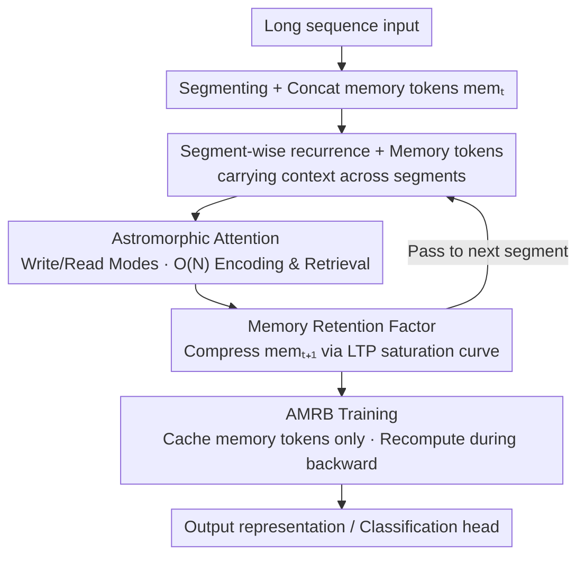

# RMAAT: Astrocyte-Inspired Memory Compression and Replay for Efficient Long-Context Transformers

**Conference**: ICLR 2026  
**OpenReview**: [https://openreview.net/forum?id=sTkJdbVxsI](https://openreview.net/forum?id=sTkJdbVxsI)  
**Code**: https://github.com/NeuroCompLab-psu/RMAAT.git  
**Area**: LLM Efficiency / Long Context / Neuromorphic Computing  
**Keywords**: Long Context, Linear Attention, Recurrent Memory, Astrocytes, Memory Compression

## TL;DR
RMAAT incorporates two types of biological astrocyte mechanisms for memory regulation into Transformers: it replaces $O(N^2)$ self-attention with a linear complexity attention inspired by short-term plasticity (STP), and uses a "memory retention factor" derived from long-term plasticity (LTP) saturation curves to adaptively compress cross-segment memory tokens. Complemented by the AMRB training algorithm, which caches only memory tokens and recomputes the forward pass during backpropagation, it improves average accuracy on the Long Range Arena from RMT's 63.6% to 68.0%, while peak memory usage is only about 1/4 of the recurrent baseline.

## Background & Motivation

**Background**: Transformer self-attention is the de facto standard for sequence modeling, but its computation and memory scale quadratically with sequence length ($O(N^2)$), posing a hard bottleneck for long sequences. Major efficiency strategies focus on architectural modifications: sparse attention (Longformer, BigBird), linear attention approximations (Linear Transformer, Performer), state space models (S4, Mamba), and various recurrent/memory structures (Transformer-XL, RMT, RetNet, RWKV).

**Limitations of Prior Work**: Most methods are purely mathematical or structural optimizations. Recurrent memory methods (e.g., RMT, Memformer) carry context between segments using "memory tokens," but memory updates rely on external, hand-crafted mechanisms lacking a unified compression principle. Furthermore, their training still follows standard BPTT, requiring all segment activations to be stored, resulting in massive memory costs. Conversely, neuromorphic computing focuses almost exclusively on "neuron" activity, ignoring other cell types involved in memory regulation.

**Key Challenge**: Modeling long-range dependencies requires "retaining information from far back," but retaining information implies memory must be bounded and compressed. Simultaneously, to save memory during recurrent training, fewer activations should be stored, but this disrupts gradient backpropagation. Finding a principled, rather than heuristic, trade-off between "memory duration vs. memory footprint" and "memory efficiency vs. trainability" remains an open problem.

**Key Insight**: The authors noted that astrocytes, a type of glial cell, play a critical role in regulating synaptic plasticity and memory consolidation. They naturally possess dynamics across two time scales: fast-scale short-term plasticity (STP) for rapid modulation and spatial context, and slow-scale long-term plasticity (LTP) for integrating activity over time and gradually consolidating it into long-term memory via saturation. This "fast-slow division + natural saturation compression" structure perfectly matches the "intra-segment attention + cross-segment memory compression" requirements in sequence models.

**Core Idea**: STP is distilled into an intra-segment linear complexity "Astromorphic Attention," while LTP saturation dynamics are distilled into a cross-segment "memory retention factor" compression schedule. This is paired with the AMRB training algorithm—which only caches compressed memory and replays (recomputes) the forward pass during backpropagation—unified by neuro-glial principles to address the three trade-offs mentioned above.

## Method

### Overall Architecture

RMAAT is a **segment-wise recurrent** Transformer: long sequences are partitioned into several non-overlapping continuous segments (with a controllable length $N_{seg}$), and the core layers process segments sequentially rather than consuming the entire sequence at once. Each segment includes a set of $M$ **memory tokens** $\text{mem}_t$ concatenated with the actual input tokens. These act as a "memory belt" spanning the entire process: after segment $t$ is processed, the output of the memory tokens becomes the input memory for segment $t+1$, passing context forward recursively.

The process consists of three integrated components: ① Intra-segment **Astromorphic Attention** (STP-inspired) for linear complexity context encoding and retrieval, replacing expensive $O(N^2)$ self-attention; ② A **memory retention factor** derived from LTP saturation curves to scale memory tokens during cross-segment transfer for adaptive compression; ③ The **AMRB** algorithm for training, which caches only inter-segment memory tokens and recomputes the forward pass segment-by-segment during backpropagation, avoiding the memory explosion of BPTT. These are not independent: compression reduces memory to a few tokens, which is the prerequisite for AMRB to cache only those tokens and forgo per-token backpropagation.

### Key Designs

**1. Segment-wise Recurrence and Memory Tokens: Segmenting long sequences and using a memory belt to pass context.**

This is the first step to bypass $O(N^2)$: rather than computing attention on the entire sequence, the sequence is split into segments of length $N_{seg}$ processed sequentially, restricting quadratic complexity to within segments. Since segmenting cuts long-range dependencies, RMAAT introduces $M$ persistent memory tokens per segment: the memory state at the start of segment $t$ is denoted as $\text{mem}_t$, which enters intra-segment attention alongside input tokens $x_t$. The resulting memory token output $\text{mem}_{t+1}$ is fed into segment $t+1$. Thus, context flows recursively across segments via "memory tokens."

The difference from RMT or Memformer lies in **how memory is updated**: those methods rely on external mechanisms independent of the main computation, whereas RMAAT's memory update is natively bound to dynamics derived from computational macro-models (retention factors), providing a more unified and computationally self-consistent approach.

**2. Astromorphic Attention: $O(N)$ attention using STP-inspired Write/Read modes.**

Standard softmax attention within segments would negate the benefits of partitioning. RMAAT replaces it with linear complexity Astromorphic Attention inspired by tripartite synapse STP dynamics, modeled as a two-layer neuron-astrocyte network with consecutive Write and Read modes. Input $X\in\mathbb{R}^{N\times d}$ ($N=N_{seq}+M$) is linearly projected to $K=XW_K$, $Q=XW_Q$, $V=XW_V$, and activated by a non-linearity $\phi$ (e.g., $\phi(x)=\text{elu}(x)+1$).

The Write mode "aggregates" the segment context into small matrices independent of $N$: neuron Hebbian weights $H_{neuron}=\frac{1}{m}\phi(K)^T V$ capture direct key-value correlations; astrocyte-modulated Hebbian weights $H_{astro}=\frac{1}{m}\phi(R)^T V$ inject spatial context via relative position encoding $\phi(R)$; and a presynaptic state $g=\big(\sum_{t=1}^{N}\phi(k_t)\big)^{\alpha}$ abstracts the astrocyte calcium response to cumulative key activity. The Read mode then uses queries for retrieval: first, interaction strength $C=\phi(Q)g^T$ is computed, followed by a feedback factor $P=1/C$ (presynaptic plasticity feedback), which modulates the combined weights $H=H_{neuron}+H_{astro}$ via Hadamard product. Finally:

$$L=\phi(Q)(H\odot P)+X$$

This yields the updated segment representation. The key is that intermediate aggregates like $H$ and $g$ are computed once per segment with dimensions independent of $N$, leaving only linear matrix-vector operations with $\phi(Q)$, thus achieving $O(N)$ complexity. $R$ uses distance-based exponential decay $r_{ij}=\exp(-\lVert pos_i-pos_j\rVert\times scale)$, which the authors map to the phenomenon where astrocyte processes respond more strongly near the activity center.

**3. Memory Retention Factor: Mapping LTP saturation curves to an adaptive cross-segment compression schedule.**

Memory tokens would expand unboundedly if simply accumulated. Standardizing a detailed neuro-astrocyte computational model, the authors found that LTP-related states $p^l_{ij}$ **integrate gradually, accumulate continuously, and eventually saturate** over STP cycles. They distilled this saturation curve into an architecture-independent macro-model and derived a "memory retention factor" to implement specific compression schedules. Normalizing the total memory capacity at saturation to 1, for a sequence with $T$ segments, the retention factor for segment $t$ is:

$$\text{RetentionFactor}(t,T)=\frac{\Delta p^l_t}{\sum_{i=1}^{T}\Delta p^l_i}$$

Where $\Delta p^l_t=p^l(t\cdot\tau_{cycle})-p^l((t-1)\cdot\tau_{cycle})$ is the LTP state increment within the segment. This factor decreases as the segment index increases and shifts downward as the total sequence length increases. Updating memory as $\text{mem}_{t+1}=\text{RetentionFactor}(t,T)\times \text{mem}'_{t+1}$ means later or longer contexts are compressed more heavily, keeping memory bounded. Unlike RMT’s fixed-size external slots updated by standard mechanisms, this compression rhythm is "calculated" from LTP dynamics, providing a biological basis that enables efficient training.

**4. AMRB Training Algorithm: Caching only memory tokens and replaying forward passes.**

Standard BPTT cannot handle the memory requirements of storing all activations for long sequences. AMRB exploits the fact that RMAAT memory is compressed into a few tokens: during the forward pass across $T_{seg}$ segments, only the sequence of inter-segment memory tokens $(\text{mem}_1,\dots,\text{mem}_{T_{seg}+1})$ is stored in a replay buffer. During the backward pass, to calculate gradients for segment $t$, $\text{mem}_t$ is retrieved from the buffer to rerun the forward pass for that segment only, generating temporary local activations. Gradients from segment $t+1$ are then propagated through the recomputed segment $t$. This "replay" saves significant memory by only caching $M$ tokens. The authors emphasize that this synergistic design is crucial: removing compression leads to significant performance drops, showing that "principled compression" is what makes memory-efficient AMRB effective.

## Key Experimental Results

### Main Results

Trained from scratch on five Long Range Arena (LRA) tasks, comparing standard Transformers, various efficient Transformers, and three iso-architecture baselines: AT (Astromorphic Attention without recurrent memory), RMT (Recurrent memory with standard attention), and RLT (Recurrent linear attention without retention factor/AMRB). Parentheses indicate segment counts; Mem is peak memory (GB).

| Model | ListOps(2K) | Text(4K) | Retrieval(8K) | Image(1K) | Pathfinder(1K) | Avg Acc | Peak Mem |
|------|------|------|------|------|------|------|------|
| Transformer | 36.4 | 64.3 | 57.5 | 42.4 | 71.4 | 54.4 | 4.7–7.8 |
| RMT | 37.4 | 65.0 | 79.3 | 54.6 | 81.5 | 63.6 | 12.7–24 |
| RLT | 18.4 | 64.8 | 78.4 | 55.0 | 74.9 | 58.3 | 12.1–22.6 |
| **RMAAT (Ours)** | **38.9** | **65.9** | **83.2** | **64.8** | **87.1** | **68.0** | **3.4–5.3** |

RMAAT achieves an average accuracy of 68.0%, 4.4 percentage points higher than the strongest baseline RMT. Gains are particularly notable in long-context Retrieval (83.2%) and Image (64.8%), while peak memory (3.4–5.3 GB) is roughly 1/4 to 1/5 of RMT.

Regarding throughput, RMAAT achieves a 1.73× speedup on Retrieval and 1.5× on ListOps/Text compared to RMT, due to the $O(N)$ attention and AMRB combination.

### Ablation Study

Conducted mainly on Byte-Level Document Retrieval (8K).

| Configuration | Key Metrics | Note |
|------|---------|------|
| Full RMAAT | Retrieval 83.2% / 3.4 GB | Complete model |
| w/o Retention Factor | Retrieval 83.2→80.5% (Mem stable) | Compression missing, -2.7 points; Text also 65.9→64.9% |
| AMRB → Standard BPTT | Similar accuracy, Mem 3.4→15.0 GB (~4.4×) | Text 5.1→22.0 GB (~4.3×) |
| RLT + AMRB | Retrieval 79.2% / 3.4 GB | Adding retention factor+AMRB to RLT still falls short of 83.2% |

### Key Findings
- **Compression and training algorithms are synergistic**: Removing the retention factor drops 2.7 points without saving memory, while switching AMRB to BPTT keeps accuracy stable but explodes memory usage by ~4.4×. Compression makes memory small enough for AMRB to cache only necessary components.
- **Astromorphic Attention components are effective**: RLT+AMRB (using compression+AMRB but lacking $H_{astro}$ and feedback $P$) reaches only 79.2%, trailing the full RMAAT, proving $H_{astro}$ and $P$ provide independent gains.
- **The model benefits from full long context**: Reducing the total segments from 16 (8K) to 8 (4K) or 4 (2K) causes Retrieval to drop from 83.2% to 71.5% and 65.3%, validating the effectiveness of the segment-wise strategy.

## Highlights & Insights
- **Mapping biological "dual-scale" to "intra-segment attention + cross-segment compression"**: The correspondence (STP → linear attention, LTP → memory compression) is not just a metaphor but leads to computable factors and algorithms, serving as a rare example of mapping neuroscience to trainable models.
- **Calculated non-learned compression**: The compression rhythm is derived from LTP saturation rather than backpropagation. It saves parameters and aligns with the intuition of "compressing harder for longer context," a schedule that could be transferred to other recurrent structures.
- **Co-design of compression and training**: Reducing memory to a few tokens first is what makes memory-efficient training possible—a logical chain of "minimizing what must be stored to enable efficient training."

## Limitations & Future Work
- **Evaluation limited to LRA**: The authors acknowledge validation is primarily on Long Range Arena, lacking evidence on broader vision/multimodal tasks or larger model scales.
- **Knowledge of total sequence length required**: The retention factor depends on the total segments $T$ for normalization, making it difficult to apply to true streaming/online scenarios where length is unknown.
- **Lack of direct SSM comparison**: There is no head-to-head comparison with models like Mamba under identical conditions, nor a deep formal theoretical bridge to other sequence models.
- **Heuristic biological mapping**: Some mappings (e.g., $P=1/C$, exponent $\alpha$) are qualitative abstractions. Implementation details in the appendix should be followed for reproduction.

## Related Work & Insights
- **vs. RMT**: Both use segment-wise recurrence and memory tokens, but RMT uses $O(N^2)$ attention and standard BPTT. RMAAT uses $O(N)$ Astromorphic Attention and LTP-derived compression + AMRB, gaining +4.4 accuracy with ~4× less memory.
- **vs. AT (Astromorphic Transformer)**: AT has Astromorphic Attention but lacks recurrence and memory, limiting it to short contexts. RMAAT extends it to a long-context recurrent framework.
- **vs. RLT / Linear Transformer**: RLT is a recurrent linear attention with memory tokens but lacks the retention factor, AMRB, and enhanced positional encoding. RMAAT improves Retrieval from 78.4% to 83.2%.

## Rating
- Novelty: ⭐⭐⭐⭐⭐ Systematically mapping astrocyte STP/LTP to linear attention + memory compression + replay training is a fresh and consistent approach.
- Experimental Thoroughness: ⭐⭐⭐⭐ Solid LRA performance and iso-architecture ablations, though lacks SSM comparisons and large-scale validation.
- Writing Quality: ⭐⭐⭐⭐ The biological-algorithm mapping is clear, though some implementation details are scattered in the appendix.
- Value: ⭐⭐⭐⭐ achieves simultaneous accuracy and memory advantages in long contexts; the compression-training synergy is highly transferable.

<!-- RELATED:START -->

## Related Papers

- [\[ICLR 2026\] MeSH: Memory-as-State-Highways for Recursive Transformers](mesh_memory-as-state-highways_for_recursive_transformers.md)
- [\[ACL 2026\] CoMeT: Collaborative Memory Transformer for Efficient Long Context Modeling](../../ACL2026/llm_efficiency/comet_collaborative_memory_transformer_for_efficient_long_context_modeling.md)
- [\[ICLR 2026\] MemAgent: Reshaping Long-Context LLM with Multi-Conv RL-based Memory Agent](memagent_reshaping_long-context_llm_with_multi-conv_rl-based_memory_agent.md)
- [\[ICLR 2026\] Developmental Federated Tuning: A Cognitive-Inspired Paradigm for Efficient LLM Adaptation](developmental_federated_tuning_a_cognitive-inspired_paradigm_for_efficient_llm_a.md)
- [\[ICLR 2026\] IceCache: Memory-Efficient KV-cache Management for Long-Sequence LLMs](icecache_memory-efficient_kv-cache_management_for_long-sequence_llms.md)

<!-- RELATED:END -->
