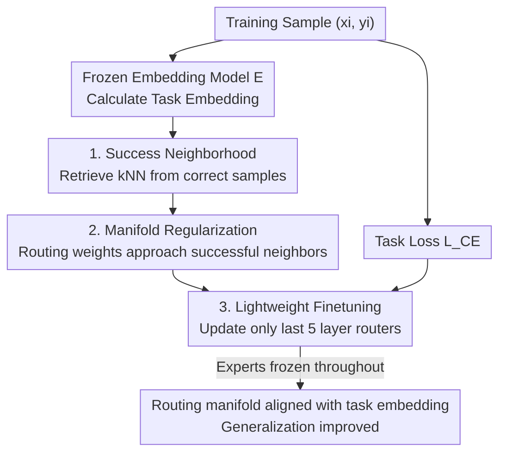

# Routing Manifold Alignment Improves Generalization of Mixture-of-Experts LLMs

**Conference**: ICLR 2026  
**OpenReview**: [https://openreview.net/forum?id=3lskwxB653](https://openreview.net/forum?id=3lskwxB653)  
**Code**: Available (link provided in paper)  
**Area**: LLM Efficiency / Mixture-of-Experts  
**Keywords**: MoE Routing, Manifold Alignment, Manifold Regularization, Routing Post-training, Generalization

## TL;DR
This paper proposes RoMA (Routing Manifold Alignment), which incorporates a "manifold regularization term" into the post-training objective. By performing lightweight fine-tuning only on the final few layer routers of MoE LLMs, it ensures that semantically similar samples share similar expert selections, improving accuracy by 7–15% across three MoE models without increasing inference overhead.

## Background & Motivation

**Background**: Sparse Mixture-of-Experts (MoE) has become a mainstream architecture for scaling LLM capacity, allowing for model size expansion without significantly increasing inference computation. The core of each layer is a **router**, which calculates routing weights based on the hidden representation of a token to dispatch it to a few experts. Although router parameters are minimal (only 0.03% in a 7B model), they are critical for effective expert specialization.

**Limitations of Prior Work**: Evaluation on various downstream tasks reveals that existing MoE LLMs suffer from systematically "sub-optimal routing." The authors constructed an oracle upper bound $r^*_i$—starting from pre-trained routing weights and performing gradient descent using ground-truth labels until convergence to find the optimal routing that allows the model to answer correctly. Results show a **10–20% accuracy gap** between pre-trained routers and the oracle, indicating significant untapped potential in existing routers.

**Key Challenge**: The authors identify the root of this gap as a geometric phenomenon: the **misalignment between the task embedding manifold and the routing weight manifold**. UMAP visualizations of ARC-C samples show that semantically similar samples form clear clusters in the task embedding space (Figure 3a), yet pre-trained routing weights scatter these same samples across the routing space (Figure 3b), lacking any corresponding cluster structure. This implies that the router fails to capture the task structure, making inconsistent expert choices for semantically related inputs, which contradicts the MoE principle of "reusing experts and sharing skills for related inputs." The oracle routing weights (Figure 3d), however, exhibit a cluster structure consistent with the task embeddings.

**Goal**: To align the routing weight manifold with the task embedding manifold, enabling semantically similar samples to share similar cross-layer expert selections, thereby narrowing the gap with the oracle and improving generalization.

**Key Insight**: Manifold Regularization is a mature technique in machine learning, originally used to preserve the local neighborhood structure of high-dimensional inputs in low-dimensional representations or outputs. The authors adapt it to act on "cross-layer routing weights" rather than the final output and define neighborhoods in the **task embedding space** instead of the raw input space, effectively binding expert selection to task understanding.

**Core Idea**: Using the task embedding manifold as a "teacher," the routing weights of each sample are pulled toward the routing weights of its "successful neighbors" (semantically close neighbors that were answered correctly). By fine-tuning only the routers, "task understanding" (the embedding model) and "answer generation" (the MoE) are unified.

## Method

### Overall Architecture
RoMA is a **router post-training** method: the expert parameters of the base MoE LLM are frozen, and only the routers undergo lightweight fine-tuning. For each sample $(x_i, y_i)$ in the training set, a frozen embedding model $E(\cdot)$ first maps its task description to the semantic space. Then, its $k$-nearest neighbors (successful neighborhood) are identified within the set of "successful samples" (those the model already correctly answers) based on task embedding similarity. The training objective adds a **manifold regularization term** to the conventional task loss, punishing the discrepancy between the routing weights of the current sample and its successful neighbors. Gradients only update the router parameters, and empirical results show that tuning only the **last five layer** routers is sufficient. Ultimately, the routing weight manifold is "pulled" into a cluster structure consistent with task embeddings, approaching the oracle and improving generalization.

### Key Designs

**1. Success Neighborhood: Imitating only "correct samples" to avoid error propagation**

Naively requiring "similar samples to have similar routing" has a pitfall: if a neighbor was routed incorrectly, alignment would spread the error. RoMA first filters a subset of training samples where the model **predicts correctly**, $S=\{j:\,f(x_j,r_j)=y_j\}$, and constructs neighborhoods for each sample $x_i$ only within $S$. The neighborhood is defined by similarity in the task embedding space using a Gaussian kernel: $\text{sim}(E(x_i),E(x_j))=\exp\!\big(-\|E(x_i)-E(x_j)\|_2^2/2\sigma^2\big)$. Each sample thus learns routing patterns only from neighbors that are semantically close and successfully handled, ensuring that only successful expert selections are imitated. Ablations show that random neighbor selection yields almost no improvement (67.8% vs. baseline 67.6%), while $k=3$ for $k$-NN is most robust (76.2%), confirming that both "success" and "semantic proximity" are indispensable constraints.

**2. Manifold Regularization: Aligning the routing manifold with the task embedding manifold**

This is the core of RoMA. First, normalized adjacency weights between samples are defined as:
$$W_{i,j}\triangleq\frac{\text{sim}(E(x_i),E(x_j))}{\sum_{j\in N(x_i)}\text{sim}(E(x_i),E(x_j))},\quad j\in N(x_i),$$
where higher weights correspond to higher semantic similarity. Then, manifold regularization is applied to the concatenated routing weights $r_i$ (across $L$ layers) for sample $x_i$:
$$L_{\text{manifold}}(i)\triangleq\sum_{j\in N(x_i)}W_{i,j}\,\|r_i-r_j\|_2^2.$$
This penalizes routing differences $\|r_i-r_j\|_2$ between semantically similar samples, forcing the routing manifold to replicate the local neighborhood structure of the task embedding manifold. This is equivalent to "shifting" the routing weights of each sample toward its successful neighbors. Unlike traditional manifold regularization applied to final outputs, this acts on cross-layer routing weights, binding "expert selection ↔ task embedding." To ensure the model remains correct after alignment, the final objective combines this with the cross-entropy task loss using a coefficient $\lambda$: $L_{\text{RoMA}}(i)=L_{\text{task}}(i)+\lambda\cdot L_{\text{manifold}}(i)$. In ablation studies, this increased accuracy from a baseline of 67.6% to 76.2%, significantly outperforming L1 (68.2%), L2 (71.5%), and entropy regularization (70.7%), proving that "geometric alignment in task embedding space" is a stronger inductive bias than general sparsity/entropy constraints.

**3. Lightweight Finetuning: Freezing experts, tuning only the last five layer routers**

Ours freezes all expert parameters and performs gradient descent only on router parameters $\theta_{\text{router}}$: $\theta^{(t+1)}_{\text{router}}=\theta^{(t)}_{\text{router}}-\eta\nabla_{\theta_{\text{router}}}L_{\text{RoMA}}$. Routers account for only **0.0095%** of the base model's parameters, and since the routing calculation method remains unchanged during inference, it **adds no inference overhead**—contrasting sharply with methods like C3PO that require test-time optimization and 6–7× computation. Furthermore, the authors found that fine-tuning all layers is unnecessary; layer ablation showed that tuning the last five layers (L5) achieved the highest accuracy (76.2%), even surpassing full-layer tuning (75.1%). This suggests that later layers are more critical for routing quality. Regarding token selection, "less is more"—using only the routing weights of the last 1 token (Last1, 76.2%) outperformed aggregating multiple tokens, as the final token contains richer task-relevant information.

## Key Experimental Results

### Main Results
Routers were fine-tuned on three MoEs: OLMoE-7B-A1B, DeepSeekMoE-16B-A3B, and Qwen3-30B-A3B across eight benchmarks (with GSM8K as OOD). RoMA consistently outperformed ICL, Router/Prefix/Prompt Tuning, and Dense BP, performing on par with or better than C3PO without additional inference costs.

| Model / Method | MMLU | HellaSwag | ARC-C | 8-Task Avg |
|------|------|------|------|------|
| OLMoE Base | 57.8 | 77.9 | 51.3 | 67.6 |
| OLMoE + C3PO | 65.5 | 85.3 | 66.3 | 75.7 |
| **OLMoE + RoMA** | **69.0** | **86.7** | **67.2** | **76.2** |
| OLMoE Oracle (Upper) | 72.2 | 91.5 | 74.8 | 81.1 |
| DeepSeekMoE Base | 46.2 | 78.0 | 50.3 | 66.6 |
| **DeepSeekMoE + RoMA** | **56.8** | **87.9** | 61.4 | **74.7** |
| Qwen3-30B Base | 74.2 | 68.5 | 56.8 | 74.0 |
| **Qwen3-30B + RoMA** | **78.8** | 74.8 | **65.5** | **79.5** |

On MMLU, RoMA improved DeepSeekMoE by +10.6% and OLMoE by +11.2%. More impressively, in cross-scale comparisons, OLMoE+RoMA with only 1B activated parameters (MMLU 69.0, HellaSwag 86.7) outperformed several 7–8B and even 13B dense models; Qwen3+RoMA with 3B activated parameters (MMLU 78.8) surpassed 27–34B dense models.

### Ablation Study (Performed on OLMoE, 8-task average accuracy)

| Dimension | Configuration | Avg Accuracy | Gain/Note |
|------|------|---------|------|
| Baseline | OLMoE Base | 67.6 | — |
| Reg Method | L1 / L2 / Entropy | 68.2 / 71.5 / 70.7 | Marginal gains from general constraints |
| Reg Method | **Manifold Reg (Ours)** | **76.2** | Geometric alignment is a stronger bias |
| Layer Selection | Single / Dual / Full | ~69 / >71 / 75.1 | — |
| Layer Selection | **Last 5 Layers (L5)** | **76.2** | Outperforms full-layer tuning |
| Neighborhood | Random / ε=0.5 / k=3 | 67.8 / 74.1 / 76.2 | Random is nearly ineffective |
| Token | First1 / Middle1 / **Last1** | 71.4 / 69.2 / **76.2** | Last token is most informative |
| Training Data | 10% / 30% / 100% | 68.5 / 70.8 / 76.2 | Significant gains at 30% |

### Key Findings
- **Manifold regularization is the true source of contribution**: Switching to L1/L2/entropy peaked at 71.5%, while manifold regularization reached 76.2%, proving gains stem from "task embedding geometric alignment" rather than simple constraints.
- **Efficiency through selection**: Last five layers > full layers, Last1 > multiple tokens, and k=3 > k=1/5—selective, low-cost configurations are actually optimal.
- **Data Efficiency**: Using only 30% of training data raised the baseline from 67.6% to 70.8%, reaching 76.2% with full data.
- **Robustness to Embedding Models**: Gains remained stable (+3.6% to +8.6%) across various models, from 22M all-MiniLM to 7.8B Qwen-embedding.

## Highlights & Insights
- **Re-framing "routing quality" as "manifold misalignment"**: The authors quantified a 10–20% routing gap using an oracle upper bound and localized the root cause via UMAP as a misalignment between clusters. This diagnosis led directly to an elegant solution.
- **Imitating only successful neighbors** is a simple but crucial step—it transforms "manifold alignment" from a potentially error-prone operation into a targeted learning of correct expert selections. The random neighbor control group highlights its necessity.
- **0.0095% parameters and zero inference overhead** yielded 7–15% improvements. This cost-benefit ratio is far superior to test-time optimization methods like C3PO, which require 6–7× inference computation.
- **Unifying task understanding and answer generation**: Using the geometric structure of an embedding model to supervise MoE expert selection establishes a paradigm of "understanding guided execution" transferable to other sparse architectures.

## Limitations & Future Work
- Manifold regularization depends on an external embedding model to define task similarity. While shown to be scale-insensitive, it introduces a dependency on pre-trained embedding quality and requires an initial pass to filter "successful samples."
- The oracle is an empirical upper bound obtained via per-sample gradient descent; RoMA's gains on OOD tasks like GSM8K are relatively limited (e.g., OLMoE 45.5→49.4), leaving room for improved cross-distribution generalization.
- Hyperparameters such as neighborhood construction (k, ε, kernel) and $\lambda$ are sensitive; the paper focuses on three MoEs and eight benchmarks, while performance on larger MoEs and generative long-form tasks remains to be seen.
- Future improvements could involve dynamically updating the success neighborhood during training or jointly optimizing manifold regularization with expert load balancing to further bridge the gap with the oracle.

## Related Work & Insights
- **vs Dense BP**: Dense BP designs better pre-training objectives for routers to allow gradients to flow through the entire model but does not address the "task ↔ routing weights" manifold misalignment. RoMA directly aligns these manifolds, consistently outperforming Dense BP (e.g., OLMoE 71.2 → 76.2).
- **vs C3PO**: C3PO is a SOTA for test-time dynamic re-weighting of expert paths. While it offers similar gains, its inference cost is 6–7× higher. RoMA shifts the cost to a lightweight training phase, maintaining zero inference overhead and showing better advantages on larger models.
- **vs Traditional Manifold Regularization (Belkin et al.)**: Classic manifold regularization assumes global smoothness and acts on final outputs using raw inputs for neighborhood definitions. RoMA applies it to cross-layer routing weights and uses task embeddings for neighborhoods, binding expert selection to task semantics.
- **vs PEFT (LoRA/DoRA/MoLE)**: Applying PEFT to routers introduces new parameters. RoMA adds no parameters yet averages 7.5%–8.6% higher gains, suggesting "geometric alignment" is more effective than "increasing parameter capacity" for routing optimization.

## Rating
- Novelty: ⭐⭐⭐⭐⭐ Diagnosis of sub-optimal routing as "manifold misalignment" and solving it with manifold regularization is novel and self-consistent.
- Experimental Thoroughness: ⭐⭐⭐⭐⭐ Covers three models, eight benchmarks, oracle upper bounds, and six ablation studies, forming a complete chain of evidence.
- Writing Quality: ⭐⭐⭐⭐ Motivation and visualization are clear; however, some auxiliary metrics (CKA/Trustworthiness) in the appendix are only briefly mentioned.
- Value: ⭐⭐⭐⭐⭐ Significant gains for minimal parameters and zero inference cost, enabling activated parameters to outperform larger dense models—high engineering value.

<!-- RELATED:START -->

## Related Papers

- [\[ICML 2026\] SoftMoE: Soft Differentiable Routing for Mixture-of-Experts in LLMs](../../ICML2026/llm_efficiency/softmoe_soft_differentiable_routing_for_mixture-of-experts_in_llms.md)
- [\[ICLR 2026\] Mixture-of-Experts Can Surpass Dense LLMs Under Strictly Equal Resource](mixture-of-experts_can_surpass_dense_llms_under_strictly_equal_resource.md)
- [\[ICML 2026\] ProbMoE: Differentiable Probabilistic Routing for Mixture-of-Experts](../../ICML2026/llm_efficiency/probmoe_differentiable_probabilistic_routing_for_mixture-of-experts.md)
- [\[ICLR 2026\] DirMoE: Dirichlet-Routed Mixture of Experts](dirmoe_dirichlet-routed_mixture_of_experts.md)
- [\[ICLR 2026\] Understanding the Mixture-of-Experts with Nadaraya-Watson Kernel](understanding_the_mixture-of-experts_with_nadaraya-watson_kernel.md)

<!-- RELATED:END -->
