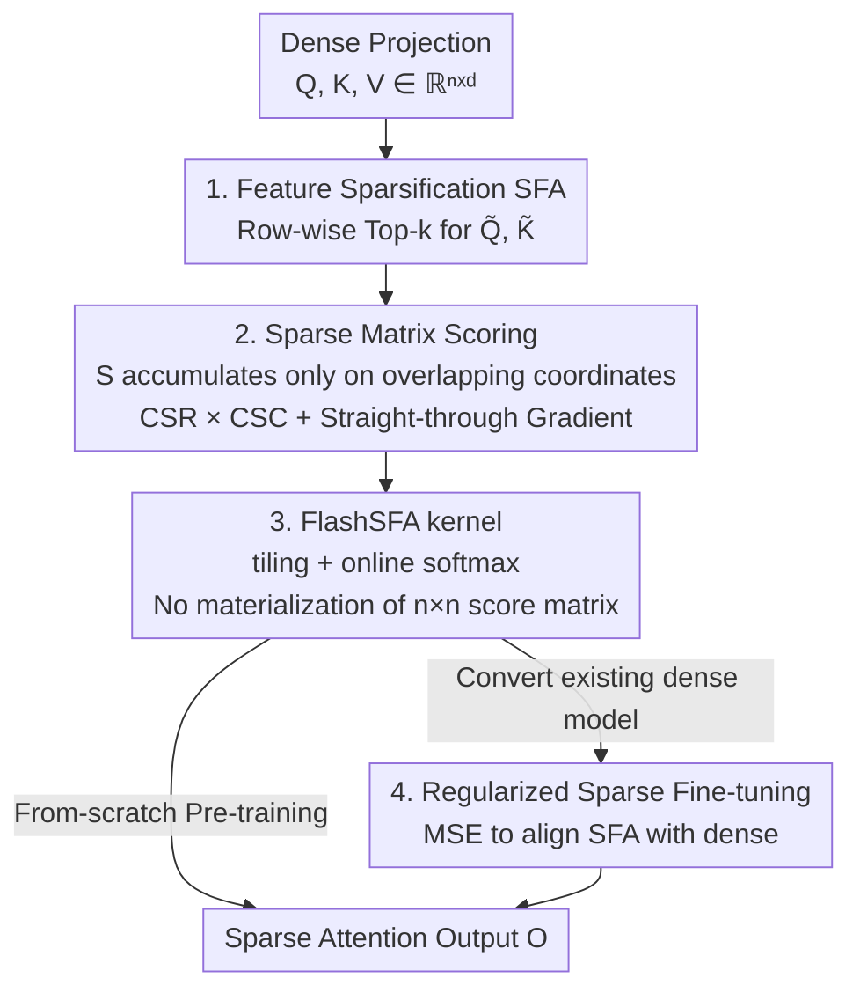

# Scaling Attention via Feature Sparsity

**Conference**: ICLR 2026  
**OpenReview**: [https://openreview.net/forum?id=UspMJlGusi](https://openreview.net/forum?id=UspMJlGusi)  
**Code**: https://github.com/YannX1e/Sparse-Feature-Attention  
**Area**: LLM Efficiency  
**Keywords**: Efficient Attention, Feature Sparsity, Long Context, FlashAttention, KV-cache

## TL;DR
This paper accelerates attention by exploring a neglected axis—instead of pruning tokens, it applies Top-$k$ feature sparsification to each $d$-dimensional query/key vector. This allows attention scores to be precisely calculated only on a few coordinates co-activated by queries and keys. Combined with an IO-aware FlashSFA kernel to avoid materializing the $n\times n$ score matrix, the computational complexity of $QK^\top$ is reduced from $\Theta(n^2d)$ to $\Theta(n^2k^2/d)$. It achieves up to 2.5× speedup and nearly 50% savings in both FLOPs and KV-cache while matching dense precision on GPT-2 / Qwen3.

## Background & Motivation
**Background**: Scaling Transformers to ultra-long contexts is bottlenecked by the $O(n^2d)$ overhead of self-attention ($n$ is sequence length, $d$ is feature dimension). Existing efficiency methods mostly focus on the **sequence axis**: local window or low-rank attention (Longformer, BigBird, Linformer) restricts interactions to linear complexity, while token-level sparsity (H2O, SnapKV, Quest) selects which tokens participate in interaction.

**Limitations of Prior Work**: Large-scale benchmarks repeatedly show that these approximations suffer from **precision drops**. Sacrifice in expressiveness for computational savings makes dense attention remains the most reliable choice for long contexts. Low-rank or kernel approximations (Performer, Nyströmformer) compress information into a dense space $r\ll d$, essentially trading expressiveness for speed.

**Key Challenge**: Most mainstream methods subtract from the "sequence axis" (either by reducing tokens or rank) while defaulting to the fact that **every pair of retained tokens still calculates scores across all $d$ feature dimensions**. This redundancy has never been addressed, making the trade-off between "saving computation" and "preserving expressiveness" inevitable.

**Goal**: To reduce the cost of a single query-key interaction without pruning tokens or using low-rank approximations (i.e., preserving high-dimensional expressiveness), simultaneously benefiting both computation and memory in long-context scenarios.

**Key Insight**: Research on sparse embeddings in representation learning (SPLADE, CSR, etc.) shows that high-dimensional spaces encode rich features, and "selectively activating" a few coordinates can yield massive efficiency gains while maintaining expressiveness. If attention is viewed as "retrieval over feature coordinates," then activating only the most significant dimensions of queries/keys can save computation without collapsing representation capacity.

**Core Idea**: Open up an orthogonal new axis—**feature sparsity**. By representing queries and keys as $k$-sparse encodings, attention scores are determined solely by the overlap of activated coordinates. This preserves high-dimensional expressiveness while reducing costs to $(k/d)^2$ of the dense counterpart.

## Method

### Overall Architecture
SFA (Sparse Feature Attention) is a drop-in modification to standard multi-head self-attention: it **does not modify the token set or $V$**; it only sparsifies each query/key vector along the feature axis via Top-$k$ before score calculation. Given dense projections $Q,K,V\in\mathbb{R}^{n\times d}$, it first extracts the $k$ coordinates with the largest magnitudes for $Q$ and $K$ to obtain $\tilde Q=\text{Topk}_k(Q)$ and $\tilde K=\text{Topk}_k(K)$. Attention scores $S=\tilde Q\tilde K^\top$ are accumulated only on coordinates co-activated by two tokens, which can be written as a sparse matrix multiplication (storing $\tilde Q$ as CSR and $\tilde K^\top$ as CSC). Iterating through active coordinates allows for calculating only non-zero attention edges. To avoid materializing the $n\times n$ score matrix (which would eliminate memory advantages), the authors adapt the tiling + online softmax mechanism of FlashAttention and replace dense tile multiplication with a sparse feature intersection kernel, resulting in **FlashSFA**. This process never writes out the full score matrix and is mathematically equivalent to exact softmax. Finally, for scenarios converting pre-trained dense models to sparse ones, a fine-tuning objective with MSE regularization is designed to mitigate distribution shift introduced by sparsification.

### Key Designs

**1. Sparse Feature Attention: Shifting Sparsity from Token Axis to Feature Axis**

This is the core contribution. Prerequisites are clear: sequence-axis sparsity (token pruning, low-rank) causes precision loss, while the redundancy of calculating scores across all $d$ dimensions for every token pair remains untouched. SFA applies a Top-$k$ operator row-wise to queries/keys: for $x\in\mathbb{R}^d$, $\text{Topk}_k(x)_u = x_u$ if $u\in\arg\text{topk}(|x|)$, otherwise $0$. Thus, each token activates only $k$ features, and the attention score

$$s_{ij}=\frac{1}{\sqrt d}\sum_{u\in S_i\cap S_j}\tilde q_{i,u}\tilde k_{j,u}$$

is accumulated only on the **overlap of supports** $S_i\cap S_j$ of query $i$ and key $j$. It preserves expressiveness because it **maintains the full high-dimensional space**—unlike low-rank or short embeddings that compress info into a narrow dense space, SFA still selects coordinates within $d$ dimensions, but each token only "lights up" a small subset. Regarding efficiency, assuming supports are balanced across dimensions, each coordinate is selected by approximately $\deg(u)\approx nk/d$ tokens. The overlap contributed by each coordinate is $\deg(u)^2$. Summing over all $d$ coordinates yields total edges $E\approx d\,(nk/d)^2 = n^2k^2/d$. Thus, $QK^\top$ computation drops from $\Theta(n^2d)$ to $\Theta(n^2k^2/d)$, which is only $k^2/d^2$ of dense. For $d=128, k=16$, the theoretical saving is ~64×; for larger $d$, the gain is even more significant.

**2. Sparse Matrix Scoring + Straight-through Gradient: Scalability Across Forward and Backward Passes**

Top-$k$ alone is insufficient; computation must leverage the sparse structure. During the forward pass, $\tilde Q$ is stored in CSR and $\tilde K^\top$ in CSC. Scoring is equivalent to a SpGEMM (Sparse General Matrix-Matrix Multiplication)—its cost is proportional to the number of structural intersections of non-zero patterns rather than $n\times d$. This produces only non-zero attention edges and reduces storage from $O(nd)$ to $O(nk)$. The backward pass also utilizes the sparse structure to skip gradients for full $Q,K$: using a **straight-through estimator (STE)**, gradients flow only through selected coordinates, i.e., $\partial L/\partial q_{i,u}=\partial L/\partial\tilde q_{i,u}$ if $u\in S_i$, otherwise $0$. This ensures both forward and backward passes scale with the sparse edge set $E$, benefiting both training and inference.

**3. FlashSFA: Realizing Sparse Gains Without Materializing the Score Matrix**

SFA reduces interactions to $n^2k^2/d$, but a naive implementation would still construct an $n\times n$ score matrix for softmax—which is the primary memory bottleneck in long sequences. FlashSFA solves this using the FlashAttention concept: keeping IO-aware tiling and online softmax, but replacing dense tile multiplication with a **sparse feature intersection kernel**. For a block of queries ($i\in[i_0,i_0+B_r)$) and keys ($j\in[j_0,j_0+B_c)$), the kernel iterates over active features of these tokens, finds support intersections, and uses scatter-add into a compact $B_r\times B_c$ score buffer. The buffer is consumed by online softmax immediately. The result is **mathematically identical** to $\text{softmax}(\tilde Q\tilde K^\top/\sqrt d)V$, yet achieves SFA's computational/memory scaling and FlashAttention's $O(n)$ IO complexity.

**4. Regularized Sparse Fine-tuning: Converting Pre-trained Dense Models to Sparse**

The previous points address "training sparse models from scratch," but converting existing dense LLMs to SFA is more practical. The challenge: applying Top-$k$ directly to pre-trained dense features introduces severe **distribution shift**, nearly resetting the original attention patterns. The strategy uses an MSE regularization term alongside the standard language modeling loss, forcing SFA attention outputs to approximate dense outputs (with stop-gradient):

$$L = L_{LM} + \lambda\,\frac{1}{H}\sum_{h=1}^{H}\big\|\tilde O_h - \text{stopgrad}(O_h)\big\|_F^2$$

Since neither FlashAttention nor FlashSFA materializes the full matrix, the regularization is applied to per-head outputs $\tilde O_h$ and $O_h$. Furthermore, because Top-$k$ significantly resets feature patterns, it is found necessary to first recover language capabilities on a similar reasoning dataset (MWP-200k) before training on the target task.

### Loss & Training
During the from-scratch pre-training phase, SFA (Eq. 3, 6) directly replaces dense $QK^\top$ scoring while keeping $V$ dense. Sparsity budgets are set at $k\in\{8,16\}$; $k=8$ is chosen as the default setting for its balance of accuracy and speed. During fine-tuning, the regularization objective (Eq. 8, $k=16$) is used, training for 3 epochs on Llama-Factory.

## Key Experimental Results

### Main Results
From-scratch pre-training of GPT-2 and Qwen3: SFA closely matches the dense (full) upper bound in perplexity (PPL) and zero-shot accuracy, while the "short embedding" baseline (Dense d=X, which halves hidden dimensions) shows significant degradation.

| Model | Method | 128k Latency↓ | PPL↓ | Avg Acc↑ |
|------|------|-----------|------|----------|
| GPT2-124M | Dense (full) | 16.86 | 17.29 | 28.28 |
| GPT2-124M | Dense (d=32) Short | 7.86| 20.88 | 24.63 |
| GPT2-124M | **SFA (k=8)** | 9.41 | **18.27** | **27.40** |
| Qwen3-0.6B | Dense (full) | 77.65 | 4.66 | 39.40 |
| Qwen3-0.6B | Dense (d=64) Short | 30.84 | 6.03 | 36.68 |
| Qwen3-0.6B | **SFA (k=16)** | 34.20 | **4.81** | **38.94** |

On Qwen3-0.6B, SFA(k=16) yields a PPL of 4.81 (vs. 4.66 for dense) and 38.94% accuracy (vs. 39.40%), costing only a marginal performance hit. Compared to short embeddings, SFA achieves 259% speedup and 21.4% better performance, while saving 41% KV-cache and 49% FLOPs.

### Ablation Study
Synthetic NIAH (Needle In A Haystack) stress tests show that SFA not only preserves retrieval accuracy but also demonstrates more stable length generalization than dense models. SFA(k=16) closely aligns with dense fine-tuning in downstream tasks.

| Config | Task | Dense Baseline | SFA | Note |
|------|------|-----------|-----|------|
| 32k Train NIAH | 32k Test Acc | 80% (d=64) | **83%** (k=16) | Dense drops to 80% with length; SFA is more stable |
| Qwen3-8B FT | NIAH 32768 | 95% (dense FT) | **97%** (k=16) | SFA slightly outperforms dense FT on retrieval |
| Qwen3-0.6B FT | GSM-8K | 63.42 (dense FT) | 61.46 (k=16) | SFA lags slightly on sensitive arithmetic tasks |

### Key Findings
- **Sparse axis is worthwhile**: While short embeddings offer the highest raw speedup, the precision loss makes them less practical. SFA provides a superior quality-efficiency trade-off, with $k=8$ being the "sweet spot."
- **Compounding gains**: End-to-end latency reduction exceeds 2× across the Transformer stack, showing that sparsity scales better when applied throughout the entire network.
- **Large dimensions and long context benefit most**: SFA's speedup is modest at 4k context but drops latency by over an order of magnitude at 65k context with 256 head dimensions. KV-cache scales proportionally with sparsity ($k=4$ saves ~40%).
- **Task sensitivity**: Arithmetic reasoning (GSM-8K) is most sensitive to pruning; however, document understanding and retrieval effectively持平 dense, suggesting sparse support is a valid inductive bias for locality.

## Highlights & Insights
- **Orthogonal New Axis**: While most efficient attention research competes on the "sequence axis," this paper identifies the "feature axis" as a potent, under-explored dimension that is orthogonal to token sparsity and paging.
- **Exact, Not Approximate**: Unlike Performer/Linformer which trade expressiveness for approximation, SFA + FlashSFA is mathematically equivalent to exact softmax.
- **Sparse Coding for Attention**: This combines the "attention as retrieval" perspective with sparse embedding concepts (like inverted indices in SPLADE/CSR), applicable to any high-dimensional similarity scenario.
- **Straight-Through Gradients**: By ensuring gradients only flow through non-zero edges, SFA benefits the entire training cycle rather than just the forward pass.

## Limitations & Future Work
- **Inefficient for Short Context**: The overhead of sparse kernel indexing makes SFA less efficient than dense for contexts $\le 4\text{k}$. Gains only materialize at $8\text{k}$–$16\text{k}+$.
- **Modification Cost**: Top-$k$ heavily resets dense patterns, requiring MSE regularization and specific data recovery to successfully fine-tune.
- **Arithmetic Reasoning Drop**: SFA lags on GSM-8K, implying that feature pruning may discard coordinates critical for high-precision reasoning.
- **Standard $V$**: Only $Q,K$ scoring is sparsified; $V$ aggregation remains dense. Whether the theoretical 1000× savings hold for 1G context requires further large-scale verification.

## Related Work & Insights
- **vs. Token-level Sparsity (Longformer, H2O, Quest)**: These methods prune "which tokens interact." SFA sparsifies "which features are used to score interactions." They are orthogonal and can be stacked.
- **vs. Low-rank/Kernel (Linformer, Performer)**: These compress information into dense low-rank spaces and are approximate. SFA retains the high-dimensional space and performs **exact** computation on overlapping supports.
- **vs. Short Embeddings**: Simply reducing hidden dimensions collapses feature diversity. SFA uses "high-dimensional coordinate selection" to achieve a better quality-efficiency trade-off.

## Rating
- Novelty: ⭐⭐⭐⭐⭐ Proposes "feature sparsity" as an orthogonal, neglected axis with a matching exact kernel.
- Experimental Thoroughness: ⭐⭐⭐⭐ Includes pre-training, NIAH, and system benchmarks, though lacks end-to-end validation on massive models.
- Writing Quality: ⭐⭐⭐⭐⭐ Clear motivation and comprehensive complexity derivation.
- Value: ⭐⭐⭐⭐⭐ Highly practical for long-context LLM training and inference due to exactness and stackability.

<!-- RELATED:START -->

## Related Papers

- [\[ICLR 2026\] Understanding and Improving Length Generalization in Hierarchical Sparse Attention Models](understanding_and_improving_length_generalization_in_hierarchical_sparse_attenti.md)
- [\[ICLR 2026\] Mitigating Non-IID Drift in Zeroth-Order Federated LLM Fine-Tuning with Transferable Sparsity](mitigating_non-iid_drift_in_zeroth-order_federated_llm_fine-tuning_with_transfer.md)
- [\[ICLR 2026\] Scaling Up, Speeding Up: A Benchmark of Speculative Decoding for Efficient LLM Test-Time Scaling](scaling_up_speeding_up_a_benchmark_of_speculative_decoding_for_efficient_llm_tes.md)
- [\[ICLR 2026\] FSA: An Alternative Efficient Implementation of Native Sparse Attention Kernel](fsa_an_alternative_efficient_implementation_of_native_sparse_attention_kernel.md)
- [\[ICLR 2026\] STEM: Scaling Transformers with Embedding Modules](stem_scaling_transformers_with_embedding_modules.md)

<!-- RELATED:END -->
