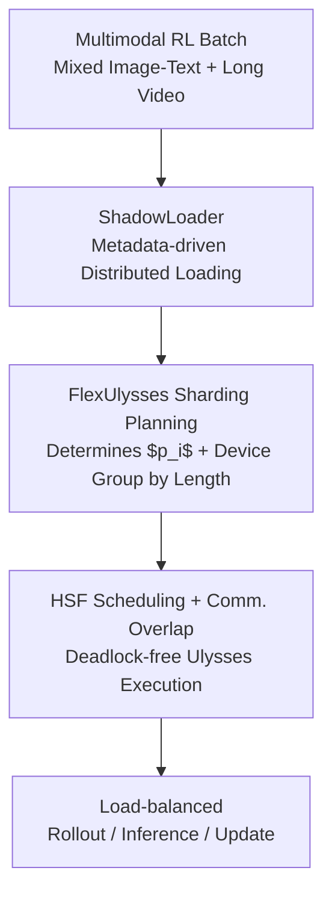

# Scaling Large Vision-Language Model RL Training via Efficient Load Balancing

**Conference**: ICLR 2026  
**OpenReview**: [https://openreview.net/forum?id=aa14rlfR6k](https://openreview.net/forum?id=aa14rlfR6k)  
**Code**: None  
**Area**: LLM Efficiency / Multimodal VLM / RL Training Systems  
**Keywords**: VLM Reinforcement Learning, Load Balancing, Sequence Sharding, Data Loading, Training Systems

## TL;DR
Addressing two major system bottlenecks in VLM Reinforcement Learning (RL) training—centralized multimodal data loading and extreme sequence load imbalance across GPUs—this paper proposes FlexRL, an end-to-end system. FlexRL utilizes ShadowLoader to offload visual data decoding/preprocessing to workers while passing only lightweight metadata on the controller, and employs FlexUlysses to adaptively shard sequences into fine-grained chunks for sub-sequence level load balancing. This achieved a maximum end-to-end throughput gain of 8.47× on a 128-GPU cluster.

## Background & Motivation
**Background**: Reinforcement Learning (RL, particularly algorithms like GRPO) has become a mainstream method for aligning VLMs and enhancing their instruction-following and reasoning capabilities. A typical VLM RL pipeline consists of three phases: loading multimodal data and prompts, rollout generation via policy model inference, and parameter updates using rewards.

**Limitations of Prior Work**: Directly porting RL frameworks designed for pure text models (such as veRL) to VLMs exposes two severe bottlenecks. The first is the **data loading bottleneck**: VLM training data mixes text, high-resolution images, and video clips. Frameworks like veRL centralize CPU/IO-intensive operations (video decoding, frame sampling) on a single master node and distribute materialized tensors to workers. As global batch sizes increase, the master's preprocessing time and host memory usage scale linearly with visual data volume, quickly becoming a straggler or triggering CPU OOM. Measurements show that data loading in veRL can account for 57.1% of a step's time, more than rollout (18.0%), inference (15.5%), and updates (9.3%) combined. The second is **model execution imbalance**: a single batch may contain short image-text queries, long-text reasoning tasks, and video inputs with tens of thousands of tokens. Huge differences in sequence lengths and modalities lead to highly skewed computation/memory loads across GPUs—some cards are overwhelmed while others sit idle, dragging the entire distributed system to the speed of the slowest card.

**Key Challenge**: Attention computation grows quadratically with length ($O(L^2)$), while activation memory grows linearly ($O(L)$). Balancing by memory leads to computational imbalance, and balancing by computation leads to memory imbalance. Furthermore, the cost of the vision tower is determined by images/frames and is nearly independent of text length, rendering "length-only bucketing" ineffective.

**Goal**: Classical bucketing/packing sorts sequences by length into per-card buckets at a fixed parallelism. However, a single 32K long outlier sequence makes that GPU a bottleneck regardless of bucketing, and may even cause OOM. While heterogeneous DP methods like FlexSP, HotSPa, and ByteScale allocate different parallelism to different buckets, they rely on large batches and gradient accumulation for scheduling flexibility, which conflicts with the "small batch, frequent rollout-update" nature of RL.

**Core Idea**: Instead of patching data loading and sequence scheduling as isolated problems, the authors propose an end-to-end system. On the data side, centralized bottlenecks are eliminated by using a controller that manages only metadata while workers perform distributed preprocessing and asynchronous materialization. On the execution side, Ulysses sequence parallelism is **repurposed as a load balancing primitive**, adaptively determining the sharding degree based on each sequence's length to smooth out extreme length skew at a sub-sequence granularity.

## Method

### Overall Architecture
FlexRL is built on top of veRL, providing two collaborative components for the two bottlenecks. When a multimodal batch (mixed image-text and long video) arrives: **ShadowLoader** first performs metadata-driven distributed data loading (offloading heavy IO/decoding to workers while the controller only schedules lightweight metadata). Next, the **FlexUlysses** sharding planner decides the sharding degree and device group for each sequence based on its length. Finally, the **HSF (Highest-Sharding-First) scheduler with communication overlap** executes Ulysses without deadlocks, achieving load balancing across both the rollout inference and model update phases.

### Key Designs

**1. ShadowLoader: Decoupling centralized visual data loading into "Metadata-only Controller + Distributed Worker Preprocessing"**

This design targets the master node's straggler and CPU OOM issues. ShadowLoader consists of four parts: A **Proxy Dataloader** on the controller replaces the standard dataloader, keeping only **lightweight metadata** (video length, frame count, image dimensions, resolution, file paths) and using **FakeTensors** as placeholders for visual data. These placeholders carry shape information but no real pixels and override shard operations to support Ulysses sharding decisions. On the worker side, the **Local Preprocessor** independently handles heavy tasks like video decoding and frame sampling, caching materialized tensors in local host memory. **MetaStore** acts as a registry mapping sample metadata to physical storage locations. Finally, the worker-side **Materializer** retrieves tensors from the target preprocessor using metadata only when pixels are required.

Workload-wise, the Proxy Dataloader assigns a unique ID to each sample and dispatches preprocessing tasks using a "route to least loaded node" algorithm. The controller manages the RL training loop entirely with FakeTensors, **never loading real pixels into controller memory**. Additional optimizations include **Prefetching + Asynchronous Materialization**, which fetches metadata for the next step and materializes tensors non-blockingly to hide CPU fetching and decoding behind GPU computation, and **FlexUlysses-aware loading**, where workers only fetch the specific frames or image shards they actually need.

**2. FlexUlysses: Repurposing Ulysses Sequence Parallelism as an "Adaptive Sub-sequence Sharding" Load Balancing Primitive**

The authors observe that Ulysses sequence parallelism is essentially an **equal-cost partition** of a sequence. In MLP modules, each GPU receives an equal-length shard (identical computation and memory). In attention, heads are split such that each head performs the same amount of computation. This naturallyBalances computation and memory across GPUs and holds true for arbitrary attention patterns. Thus, Ulysses chunks can be used as scheduling units to balance load even when raw sequence lengths are highly skewed.

FlexUlysses employs **Adaptive Sharding**: instead of sharding every sequence equally, each sequence $i$ is assigned a sharding degree $p_i \in \{1, 2, 4, \dots, p_{max}\}$ based on its length $h_i$. Sequences are then grouped into buckets by sharding degree. This ensures most sequences do not incur full batch communication costs, and different sharding degrees are handled by different device groups, allowing all-to-all communication to be pipelined. Furthermore, the **vision tower is balanced separately**. Since vision encoder costs scale linearly with the number of images/frames, visual data is distributed evenly across GPUs to balance both computation and memory.

**3. HSF Scheduling + Dynamic Packing and Overlap: Enabling Multiple Sharding Degrees without Deadlocks or GPU Waste**

Adaptive sharding introduces two engineering challenges: a massive search space for sharding assignments (NP-hard bin-packing) and the violation of the SPMD paradigm (different chunks on the same GPU may belong to different sequences requiring different all-to-all groups), which can cause **deadlocks**.

The authors resolve this with **Hierarchical Device Groups + Highest-Sharding-First (HSF) scheduling**. Device groups are pre-instantiated nested hierarchies where groups for each degree $p$ partition the GPUs, and higher-degree groups nest lower-degree ones (e.g., on 8 cards, $p=8$ is [0-7], $p=4$ is [0-3] and [4-7]). HSF enforces a consistent global order: every GPU always executes collective communications from the highest sharding degree to the lowest (e.g., $p=8 \to 4 \to 2$). **Dynamic Packing** greedily concatenates short sequences within the same device group into a "sequence group" (up to a token limit $H_{pack}$) to amortize kernel and collective overhead. Finally, **Computation-Communication Overlap** is achieved by initiating the all-to-all for the next sequence group while the current one is performing attention computation.

### Loss & Training
The system uses the GRPO algorithm with a maximum response length of 1024 tokens. For 7B models, rollout uses TP=4 and forward/update uses FSDP=16. For 32B models, rollout uses TP=16 and forward/update uses FSDP=64. The maximum sharding budget $p_{max}$ is set to 8.

## Key Experimental Results

### Main Results
Evaluated on two 128-GPU clusters (H800 / H200) using MiMo-VL-7B-RL and Qwen2.5-VL-32B models. Data mixes included Image-Heavy, Video-Heavy, and Only-Video sets.

| Setup | Model/Scale | Baseline | FlexRL Gain | Note |
|--------|------|------|----------|------|
| Only-Video, 64 GPU (GBS=128) | 7B | veRL Bucketing | **Up to 8.47×** | Most heterogeneous; highest gain |
| Image-Heavy, 128 GPU (GBS=256) | 7B | Ulysses(SP=4) | Up to 7.35× | Baseline suffered frequent OOM |
| Video-Heavy, 32 GPU (GBS=64) | 7B | veRL Bucketing | Up to 5.35× | — |
| 32B, 64 GPU (GBS=128) | 32B | veRL Bucketing | Up to 4.33× | Imbalance worse for larger models |

### Ablation Study
Evaluated on 128 H800 GPUs using MiMo-VL-7B-RL (Image-Heavy config, relative to veRL=1.0×):

| Configuration | Data Loading | Step Time Reduction | Throughput Gain | Explanation |
|------|---------|---------|---------|------|
| veRL | 1.00× | 1.00× | 1.00× | Data loading dominates bottleneck |
| + ShadowLoader | 96.15× | 5.35× | 4.68× | Resolves primary data bottleneck |
| + FlexUlysses (Only) | — | — | 1.17× | Limited gain while data is bottleneck |
| FlexRL (Both) | 117.42× | 7.68× | 7.67× | Complementary; Inference +11.83× |

### Key Findings
- **Components are strongly complementary**: ShadowLoader shifts the workload from "data-bound" to "compute-bound." FlexUlysses' gains are only fully realized after ShadowLoader eliminates centralized data bottlenecks.
- **FlexUlysses achieves a balance ratio of 1.0**: On 32 GPUs, the balance ratio (Max Attention FLOPs / Avg FLOPs) dropped from 6.70 (veRL) to 1.00, whereas fixed Ulysses-SP only reached 1.12 with significant communication overhead.
- **Higher heterogeneity leads to higher gains**: Under the "Only-Video" setting with extreme length variance, FlexRL achieved its peak 8.47× end-to-end speedup.

## Highlights & Insights
- **Rethinking Ulysses**: Repurposing a parallelism strategy into a load balancing primitive by utilizing its equal-cost partitioning nature is a clever system design choice.
- **Logical vs. Physical Data Separation**: Using FakeTensors to run the entire scheduling logic while delaying physical materialization until the point of use on workers is a pattern transferable to many distributed IO-heavy pipelines.
- **Clean Deadlock Resolution**: The proof that nested group hierarchies combined with localized consistent execution order (HSF) prevent circular waits offers a systematic solution for scheduling multiple overlapping collective communication groups.

## Limitations & Future Work
- **Ulysses Constraints**: FlexUlysses' sharding is capped by the number of attention heads, which may limit effectiveness for models with very few heads.
- **Power-of-2 Sharding**: The hierarchy ($p \in \{1, 2, 4, \dots\}$) simplifies deadlock avoidance but may not be the mathematically optimal allocation for all length distributions.
- **Generalization**: The evaluation is centered on GRPO; performance under other RL architectures (e.g., PPO with separate critic pipelines) or larger-scale clusters remains to be verified.

## Related Work & Insights
- **vs. veRL + Bucketing**: veRL centralizes loading and uses fixed parallelism per bucket. FlexRL decentralizes loading and shards sub-sequences to handle long outliers that bucketing cannot solve.
- **vs. Fixed Ulysses-SP**: Fixed SP degrees force communication overhead on all sequences. FlexUlysses applies sharding only where needed, improving both communication efficiency and balance ratio.
- **vs. Heterogeneous DP (FlexSP/ByteScale)**: These methods require large batches/gradient accumulation for scheduling. FlexRL's fine-grained sharding is better suited for the high-frequency iteration cycles of RL.

## Rating
- Novelty: ⭐⭐⭐⭐ Repurposing Ulysses and metadata-driven loading is a significant system-level innovation.
- Experimental Thoroughness: ⭐⭐⭐⭐ Extensive real-cluster testing across scales, though focused on GRPO.
- Writing Quality: ⭐⭐⭐⭐ Logical flow from bottleneck diagnosis (57.1% time) to specific solutions.
- Value: ⭐⭐⭐⭐⭐ Resolves real-world VLM RL training bottlenecks with substantial 8.47× gains.

<!-- RELATED:START -->

## Related Papers

- [\[ICLR 2026\] Libra: Effective yet Efficient Load Balancing for Large-scale MoE Inference](libra_effective_yet_efficient_load_balancing_for_large-scale_moe_inference.md)
- [\[AAAI 2026\] Scaling and Transferability of Annealing Strategies in Large Language Model Training](../../AAAI2026/llm_efficiency/scaling_and_transferability_of_annealing_strategies_in_large_language_model_trai.md)
- [\[ICLR 2026\] Unlocking Full Efficiency of Token Filtering in Large Language Model Training](unlocking_full_efficiency_of_token_filtering_in_large_language_model_training.md)
- [\[ICLR 2026\] DualMap: Enabling Both Cache Affinity and Load Balancing for Distributed LLM Serving](dualmap_enabling_both_cache_affinity_and_load_balancing_for_distributed_llm_serv.md)
- [\[ICLR 2026\] Scaling Laws Meet Model Architecture: Toward Inference-Efficient LLMs](scaling_laws_meet_model_architecture_toward_inference-efficient_llms.md)

<!-- RELATED:END -->
## Related Papers

- [\[ICLR 2026\] Libra: Effective yet Efficient Load Balancing for Large-scale MoE Inference](libra_effective_yet_efficient_load_balancing_for_large-scale_moe_inference.md)
- [\[AAAI 2026\] Scaling and Transferability of Annealing Strategies in Large Language Model Training](../../AAAI2026/llm_efficiency/scaling_and_transferability_of_annealing_strategies_in_large_language_model_trai.md)
- [\[ICLR 2026\] Unlocking Full Efficiency of Token Filtering in Large Language Model Training](unlocking_full_efficiency_of_token_filtering_in_large_language_model_training.md)
- [\[ICLR 2026\] DualMap: Enabling Both Cache Affinity and Load Balancing for Distributed LLM Serving](dualmap_enabling_both_cache_affinity_and_load_balancing_for_distributed_llm_serv.md)
- [\[ICLR 2026\] Scaling Laws Meet Model Architecture: Toward Inference-Efficient LLMs](scaling_laws_meet_model_architecture_toward_inference-efficient_llms.md)

<!-- RELATED:END -->
