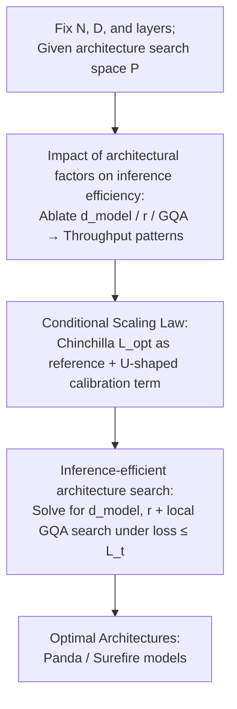

# Scaling Laws Meet Model Architecture: Toward Inference-Efficient LLMs

**Conference**: ICLR 2026  
**OpenReview**: [https://openreview.net/forum?id=0TmVqOpBbK](https://openreview.net/forum?id=0TmVqOpBbK)  
**Code**: None  
**Area**: LLM Efficiency  
**Keywords**: Scaling Laws, Inference Efficiency, Model Architecture, MLP-Attention Ratio, GQA

## TL;DR
This paper extends the Chinchilla Scaling Law into a "conditional" version, explicitly incorporating three architectural factors—hidden dimension $d_{model}$, MLP-to-attention parameter ratio $r_{mlp/attn}$, and GQA—into loss prediction. Combined with a search framework, it identifies architectures that are both accurate and fast under fixed parameter and training token budgets. Models trained using this approach, the Panda and Surefire series, achieve up to a 2.1% accuracy improvement and 42% higher inference throughput compared to LLaMA-3.2.

## Background & Motivation

**Background**: Scaling law research, represented by Kaplan and Chinchilla, indicates a power-law relationship between loss and parameter count $N$ and training tokens $D$, formulated as $L(N,D)=E+A/N^{\alpha}+B/D^{\beta}$. Consequently, research has focused on scaling model size and data volume.

**Limitations of Prior Work**: Traditional scaling laws focus solely on **training**, disregarding **inference costs**, which constitute the bulk of expenses in real-world deployment. Crucially, they treat models as black boxes determined only by $(N,D)$, ignoring the impact of the **architecture itself** on efficiency and precision. Figure 2 provides a counter-intuitive example: Qwen2.5-1.5B has more parameters but higher throughput than Qwen3-0.6B. With identical layer counts, a larger hidden dimension, GQA, and a higher MLP ratio allow it to run faster. This proves that "fewer parameters mean higher speed" is not always true; architecture is the key variable.

**Key Challenge**: A trade-off exists between precision and inference efficiency, yet existing scaling laws neither characterize this trade-off nor incorporate multiple architectural factors effectively. Previous attempts have flaws: Sardana et al. include total training and inference FLOPs but require estimating a model's lifetime token generation, which is unrealistic. Bian et al. only introduce a "width-to-depth ratio" (hidden size / layers), and reducing layers can harm post-fine-tuning generalization.

**Goal**: Given a **fixed number of layers $n_{layer}$**, **fixed non-embedding parameters $N_{non\text{-}embed}$**, and a training token budget, this work aims to clarify how $d_{model}$, $r_{mlp/attn}$, and GQA affect inference efficiency and loss to automatically select the optimal architecture.

**Key Insight**: Observations of open-source models like LLaMA, Qwen, Gemma, and Phi with similar parameter counts show diverse architectural choices, suggesting significant optimization potential in reallocating components. The authors fix the number of layers (since varying depth simultaneously disturbs inference costs and precision) and focus on the remaining three factors.

**Core Idea**: Architecture information is added as a "condition" to the Chinchilla law. Standard Chinchilla provides the optimal reference loss, while a U-shaped calibration function regarding $d_{model}/\sqrt{N}$ and $r$ predicts losses for architectural variants. Finally, an optimization problem is solved to maximize inference efficiency under a loss constraint.

## Method

### Overall Architecture

The methodology revolves around one goal: **finding a decoder architecture that is both fast and accurate under fixed $(N, D)$ budgets**. It follows three steps. First, **empirical characterization**: use controlled ablations to determine how $d_{model}$, $r_{mlp/attn}$, and GQA impact throughput (§3.2) and training loss (§3.3). Second, **solidify these patterns into a conditional scaling law**: use the optimal loss $L_{opt}(N,D)$ from standard Chinchilla as a baseline, then apply a calibration term for architectural deviation. Third, **search**: maximize inference efficiency under the constraint that "loss does not exceed threshold $L_t$". Continuous factors $(d_{model}, r)$ are solved via analytical derivatives, while discrete GQA is handled via local search. The process yields two model types: Panda (minimal loss configuration) and Surefire (Pareto-optimal for maximum throughput under loss constraints).

### Key Designs

**1. Impact of Architectural Factors on Inference Efficiency**: The authors performed three sets of controlled ablations to clarify which "knobs" increase speed. By varying $d_{model}$ (and $n_{head}$), $r$ (and intermediate dimensions), and GQA independently while fixing $N_{non\text{-}embed}$, the conclusions were clear: **Larger hidden dimensions $d_{model}$ (fewer attention heads), higher $r_{mlp/attn}$, and larger GQA groups all improve inference throughput**. This is because larger $d_{model}$ and $r$ reduce total inference FLOPs and shrink the KV cache, lowering I/O overhead. GQA significantly impacts throughput despite minimal parameter changes, which aligns with previous observations by Ainslie et al.

**2. Conditional Scaling Law**: To prevent speed gains from compromising precision, the authors modeled variant loss. They observed that loss follows a **U-shaped curve** relative to $d_{model}/\sqrt{N_{non\text{-}embed}}$ and $r_{mlp/attn}$, with optima remaining stable across model sizes (Figure 4, 5). This U-shape implies that the industry trend of allocating fewer parameters to attention is not universally optimal; an **internal optimum** exists.

The authors propose a **two-step "Reference + Calibration" framework**:
Step 1: Use Chinchilla to obtain $L_{opt}(N,D) = \min(E + A/N^\alpha + B/D^\beta)$.
Step 2: Use a function $c_0 + c_1 \log x + c_2/x$ to calibrate deviations in $d_{model}/\sqrt{N}$ and $r$.
Multiplicative and additive calibrations are provided:
$$L(d/\sqrt{N}, r \mid N, D) = \Big(a_0 + a_1\log\tfrac{d}{\sqrt{N}} + a_2\tfrac{\sqrt{N}}{d}\Big)\cdot\Big(b_0 + b_1\log r + b_2/r\Big)\cdot L_{opt}$$
$$L(d/\sqrt{N}, r \mid N, D) = \Big(a_0 + a_1\log\tfrac{d}{\sqrt{N}} + a_2\tfrac{\sqrt{N}}{d}\Big) + \big(b_1\log r + b_2/r\big) + L_{opt}$$
The parameters $a_i, b_i$ are learned across scales. This "anchor + calibration" approach is more robust than fitting a single large formula when extrapolating to larger models.

**3. Inference-Efficient Architecture Search**:
Architecture selection is framed as a constrained optimization:
$$\arg\max_{P} I_N(P)\quad \text{s.t.}\quad L(P\mid N,D)\le L_t$$
Where $I_N(P)$ is inference efficiency. For continuous factors $(d_{model}, r)$, the system solves $\partial L/\partial d_{model}=0$ and $\partial L/\partial r=0$. GQA is searched locally because its discrete nature makes it hard to model continuously. The search outputs the final architecture $\{P, \text{GQA}\}$. In practice, Surefire models represent the Pareto-optimal points on the A100+vLLM benchmark that satisfy the loss constraint.

### Loss & Training
All models are LLaMA-3.2-style decoder-only transformers with $N_{non\text{-}embed} \in \{80\text{M}, 145\text{M}, 297\text{M}, 1\text{B}, 3\text{B}\}$. Data is sampled from Dolma-v1.7. Each model is trained for $100\,N_{non\text{-}embed}$ tokens. The head dimension $d_{head}$ is 64 for $\le 1\text{B}$ and 128 for $\ge 3\text{B}$. Fitting is progressive across scale tasks (e.g., Task 1 uses 80M to predict 145M).

## Key Experimental Results

### Main Results
Validation at 1B and 3B scales showing Panda (minimal predicted loss) and Surefire (Pareto-optimal under loss constraint). "Avg." is the zero-shot accuracy across 9 downstream tasks.

| Model | $d_{model}$ | $r$ | GQA | Loss (↓) | Avg. (↑) | Note |
|------|------|------|------|----------|----------|------|
| LLaMA-3.2-1B | 2048 | 4.80 | 4 | 2.803 | 54.9 | Baseline |
| **Panda-1B** | 2560 | 1.07 | 4 | **2.782** | **57.0** | +2.1% Accuracy |
| Surefire-1B | 2560 | 3.60 | 9 | 2.804 | 55.4 | Pareto-optimal |
| LLaMA-3.2-3B | 3072 | 3.0 | 3 | 2.625 | 61.9 | Baseline |
| **Panda-3B** | 4096 | 1.0 | 3 | **2.619** | **62.5** | +0.6% Accuracy |
| Surefire-3B | 4096 | 1.0 | 7 | 2.620 | 62.6 | Pareto-optimal |

Surefire-1B/3B achieves higher throughput than LLaMA-3.2 across all batch sizes, with up to **42% improvement** on vLLM+A100.

### Ablation Study
| Configuration | Key Metrics | Description |
|------|---------|------|
| Law Prediction Accuracy | MSE 0.0001-0.0002 | Accurate extrapolation and ranking across scales. |
| Exclusion of $r$ outliers | Spearman drops significantly | Very extreme ratios (e.g., 0.1) should be excluded. |
| Additive vs. Multiplicative | Similar performance | Both simple calibration forms are effective. |
| Fitting Strategy | Loss 2.619 (80M) vs 2.606 (1B) | Scaling coefficients drift slightly; 1B predicts 3B better. |

### Key Findings
- **Robust Extrapolation**: Small model fitting successfully extrapolates to larger scales, validating the "Reference + Calibration" framework.
- **Separability of Factors**: Multiplicative and additive forms show similar results, indicating the effects of $d_{model}$ and $r$ can be simplified as independent.
- **Attention Ratio Reversal**: Contrary to recent trends of minimizing attention parameters, Panda models increase attention allocation ($r \approx 1.0$), resulting in higher precision.
- **Scale-Dependent Coefficients**: Law coefficients are not perfectly scale-invariant; using data closer to the target size improves prediction accuracy.

## Highlights & Insights
- **Decoupled Modeling Strategy**: Using Chinchilla as a fixed anchor $L_{opt}$ and adding architectural "conditions" simplifies the problem and enhances stability compared to fitting a unified multi-variable function.
- **Informed Function Choice**: The $c_0 + c_1 \log x + c_2/x$ form effectively encodes the U-shaped inductive bias found in empirical data.
- **Hardware-Aware Paradigm**: By avoiding analytical modeling of complex hardware efficiency and instead using empirical Pareto optimization under loss constraints, the method stays practical.
- **Contraintuitive Gains**: The finding that **decreasing MLP ratios and increasing hidden dimensions** improves both accuracy and throughput challenges current industry norms.

## Limitations & Future Work
- **Fixed Layer Count**: Depth ($n_{layer}$) is currently a prerequisite rather than a variable, meaning the full architectural landscape is not yet covered.
- **Separability Assumption**: The independence between factors might not hold under more extreme configurations or radically different attention mechanisms.
- **Scale Stability**: While successful at 3B, purely theoretical results for scales like 70B suggest recalibration may be necessary for ultra-large models.
- **GQA Discretization**: GQA remains a discrete search element rather than being fully integrated into the continuous scaling formula.

## Related Work & Insights
- **vs. Chinchilla (2022)**: Complements Chinchilla by answering how to structure a model's interior once the $(N,D)$ budget is set.
- **vs. Sardana et al. (2023)**: Avoids the need for estimating total lifetime generation tokens, making the optimization easier to deploy.
- **vs. Bian et al. (2025)**: Moves beyond "width-to-depth" ratios to include $r$ and GQA, while maintaining generalization by fixing layer counts.

## Rating
- Novelty: ⭐⭐⭐⭐ Elegantly integrates architectural conditions into classic scaling laws.
- Experimental Thoroughness: ⭐⭐⭐⭐⭐ Extensive training of 200+ models with multi-platform validation.
- Writing Quality: ⭐⭐⭐⭐ Clear logic and robust mathematical presentation.
- Value: ⭐⭐⭐⭐⭐ Provides a practical methodology for "double-win" LLM design (accuracy and efficiency).

<!-- RELATED:START -->

## Related Papers

- [\[ICLR 2026\] Towards Greater Leverage: Scaling Laws for Efficient Mixture-of-Experts Language Models](towards_greater_leverage_scaling_laws_for_efficient_mixture-of-experts_language_.md)
- [\[ICLR 2026\] xLSTM Scaling Laws: Competitive Performance with Linear Time-Complexity](xlstm_scaling_laws_competitive_performance_with_linear_time-complexity.md)
- [\[ICLR 2026\] Fast Catch-Up, Late Switching: Optimal Batch Size Scheduling via Functional Scaling Laws](fast_catch-up_late_switching_optimal_batch_size_scheduling_via_functional_scalin.md)
- [\[ICLR 2026\] Universal Model Routing for Efficient LLM Inference](universal_model_routing_for_efficient_llm_inference.md)
- [\[ICLR 2026\] Scaling Large Vision-Language Model RL Training via Efficient Load Balancing](scaling_large_vision-language_model_rl_training_via_efficient_load_balancing.md)

<!-- RELATED:END -->
