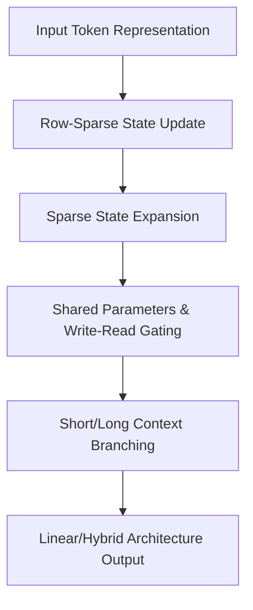

# Scaling Linear Attention Capacity with Sparse State Expansion

**Conference**: ICLR2026  
**OpenReview**: [https://openreview.net/forum?id=R6DrJ4tnGV](https://openreview.net/forum?id=R6DrJ4tnGV)  
**Code**: To be confirmed  
**Area**: LLM Efficiency / Linear Attention / Long Context Modeling  
**Keywords**: Linear Attention, Sparse State Expansion, Long Context Retrieval, Hybrid Architecture, Small Model Inference  

## TL;DR
This paper reinterprets state updates in linear attention as "information classification." Based on this, it proposes Sparse State Expansion (SSE): using row-sparse writes and partitioned expansion to significantly increase fixed state capacity, enhancing long-context retrieval and mathematical reasoning without substantially increasing the number of parameters.

## Background & Motivation
**Background**: Transformers rely on softmax attention to retain the full KV cache, providing strong retrieval and copying capabilities in long contexts. However, the KV cache memory grows linearly with context length during inference, and full-sequence attention incurs quadratic complexity during training. Linear attention, State Space Models (SSMs), and various RNN-like token mixers attempt to compress historical context into a fixed-size state matrix, enabling constant-size caching for decoding and nearly linear overhead for long-sequence training.

**Limitations of Prior Work**: Fixed states provide efficiency but also act as a performance bottleneck. Many linear attention models write historical token information into a state $S_t \in \mathbb{R}^{c \times d}$, where $c$ is often set to a fixed value like 128. When the context length far exceeds $c$, vast amounts of semantic, positional, and key-value relationships are forced to mix within limited rows. While average language modeling metrics might hold, tasks requiring precise retrieval of intermediate facts, such as in-context retrieval, needle retrieval, and mathematical reasoning, significantly lag behind softmax attention.

**Key Challenge**: Linear attention aims for "small state and fast inference," but long-context tasks require "large state capacity and no interference." Directly expanding the number of state rows increases capacity but may simultaneously scale parameters, computation, and implementation complexity. Not expanding the capacity leads to mutual interference between different types of information, resulting in state row homogenization and shortened effective receptive fields.

**Goal**: The authors aim not to simply replace an activation function, but to enable the compressed states of linear attention to perform "compartmentalized storage." Specifically, the model must determine which state rows new tokens should be written to and which historical rows should not be needlessly decayed, while maintaining controllable parameter counts and training throughput after expanding state capacity.

**Key Insight**: A key observation is that the key feature map in linear attention functions as an implicit classifier: different dimensions of $k_t = f(x_t, W_k)$ determine which state rows information is written to. Since state rows can be viewed as latent categories, a more natural approach is to select a few relevant categories first and update only those rows, rather than softly writing every token into all rows.

**Core Idea**: Use top-k row-sparse updates to reduce information interference between state rows, then expand the state into multiple partitions with shared parameters. Use write-read gating to select partitions, thereby decoupling "state capacity" from "parameter scale."

## Method

### Overall Architecture
The overall approach of SSE is divided into two layers. The first layer treats state rows of linear attention as latent categories, using a top-k followed by softmax approach to update only a few state rows. The second layer expands the state matrix into $N$ partitions, each containing $c$ rows, while QKV and other attention parameters are shared. Tokens first pass through a gate to select a few partitions, and then row selection is performed within those partitions. This allows the model to possess a state capacity of $Nc$ rows without replicating a full set of attention parameters for every partition.

In the hybrid architecture SSE-H, the authors retain a small number of softmax attention layers, allowing the model to use linear states for the majority of long-sequence computation while utilizing a few quadratic attention layers to supplement precise interaction capabilities. The experiments mainly compare pure SSE, SSE-GDN, and hybrid SSE-H across pre-training, long-context expansion, Transformer conversion, distillation, and mathematical reasoning after reinforcement learning.

### Key Designs
**1. Row-Sparse State Update: Treating State Rows as Latent Categories**

Traditional outer-product updates in linear attention are written as $S_t = \Lambda_t S_{t-1} + \phi(k_t)^\top v_t$. If $\phi(k_t)$ has non-zero weights in all dimensions, every token is written into all state rows with varying intensities. The paper argues that while $k_t$ performs information distribution, it fails to utilize the structure of "category attribution," resulting in mixed information across rows, increased cosine similarity between state rows, and difficulty in distinguishing during queries.

The preliminary design of SSE is top-k-then-softmax: select the $k$ largest row indices from $x_tW_k$, apply softmax only at these positions, and set others to zero. The update becomes $k_t = \mathrm{softmax}(\mathrm{top}\text{-}k(x_tW_k))$. For GLA-like models with gated decay, gates for non-selected rows are removed to prevent historical information from being needlessly decayed by irrelevant tokens. The intuition is clear: if state rows are categories, a token not assigned to a category should neither write to nor cause forgetting in that row.

The paper provides three theoretical explanations: First, inputs corresponding to the same row exhibit higher similarity under the classification function. Second, row-sparse writes lower the lower bound of similarity between state rows, making it easier for different queries to read different information. Third, in gated linear attention, sparse updates allow important rows to bypass continuous decay over long distances, expanding the effective receptive field. Top-k is not just for saving computation but for reducing "miswrites" and "mis-forgetting" in fixed states.

**2. Sparse State Expansion: Expanding State without Proportional Parameter Scaling**

Row-sparse updating alone is insufficient because the row count $c=128$ is inherently too small. SSE expands the state from $S_t \in \mathbb{R}^{c \times d}$ to $N$ partitions, each with $c$ rows, totaling $Nc \times d$. Crucially, partitions do not possess independent QKV parameters but share the same attention projections; token differences are reflected through partition gating and row selection.

This addresses a common misconception: the bottleneck of linear attention is not necessarily a lack of parameters, but a lack of writable state slots. Softmax attention manages an growing KV cache with fixed projection parameters; analogously, SSE allows state capacity to grow without multiplying the parameter count by $N$. Ablations show that in a 600M model, removing shared parameters increases non-embedding parameters from 300M to 580M but decreases Recall-Avg from 31.16 to 25.95, indicating that more parameters do not automatically yield better retrieval states.

**3. Shared Parameters and Write-Read Gating: One Gate for Both Writing and Reading**

SSE calculates a partition gate $e_t = \mathrm{softmax}(x_tW_e)$ for each token and takes the top-k partition set $T$. Selected partitions are updated as $S_t^i = \Lambda_t S_{t-1}^i + e_t^i \cdot k_t^\top v_t$, while unselected ones remain unchanged. During reading, information is aggregated from the same partitions: $o_t = \sum_{i \in T} e_t^i \cdot q_t S_t^i$. Thus, $e_t$ determines both where tokens are written and where the current query reads from.

This write-read gate is more stable than gating only one side. With only a write gate, the model might write into few partitions, but reading without constraints would mix in irrelevant states. With only a read gate, state organization during writing remains loose. 2B ablations show that the full write-read gate achieves a Recall-Avg of 56.63, compared to 51.87 (no gate), 50.92 (write-only), and 53.96 (read-only). This suggests the gate is not just a decorative router but a key to making "state partitions" learnable memory spaces.

An "always-selected partition" is included to stabilize local language modeling. Since local dependencies are strong priors, relying entirely on sparse partitions can be unstable early in training; maintaining one dense, stable short-range channel helps. A partition-level auxiliary balance loss is also used to prevent excessive collapse into a few partitions, similar to load balancing in MoE.

**4. Implementing Short/Long Context Branching: Maintaining Parallelism with Masking and Varlen**

SSE's algorithmic value depends on efficient kernels. The paper designs two implementations. For short sequences or variable-length training, masking is used: QKV is replicated along the partition dimension, unselected parts are masked based on top-k partitions, and the partition dimension is merged into the head dimension for linear attention operators. This involves redundant computation but maintains high GPU utilization for short sequences.

For long contexts, redundant replication becomes expensive. The paper uses `varlen` technology: QKV is reordered by top-k partition indices to group tokens of the same partition, followed by constructing new `cu_seqlens` so each sample-partition segment is processed as a variable-length sub-sequence in parallel. As long as the number of selected partitions $K$ is fixed, the runtime remains nearly constant even as the total number of partitions $N$ increases. This implementation explains why SSE maintains the linear efficiency of linear attention while expanding state capacity.

### Mechanism Example
Consider a 32k context containing narrative text and an entity-attribute pair to be queried later. Standard linear attention writes every token into all or most state rows with continuous weights; after many updates, the entity information might be diluted by subsequent irrelevant writes and decays.

In SSE, this token is routed by $e_t$ to topnd-1 or top-2 partitions (e.g., a "fact memory partition" and the "always-selected" local partition). Within the selected partition, $\mathrm{softmax}(\mathrm{top}\text{-}k(x_tW_k))$ activates only a few state rows. If subsequent tokens are gated to other partitions, they will not overwrite or decay these rows. When the query token appears, its read gate selects the partition containing the fact, and the query retrieves the content from the corresponding rows. This process is not identical to a full KV cache but is closer to "compartmentalized storage and demand-driven retrieval."

### Loss & Training
SSE is trained primarily for next-token prediction, with an additional auxiliary balance loss to prevent long-term over-utilization of specific state rows or partitions. In the row-sparse version, the auxiliary term encourages uniform selection frequency across state rows; in SSE, this is adapted to a partition-level balance loss with a coefficient of 0.01.

Training involves multiple stages: 600M models are pre-trained on 15B tokens, 2B models on 100B tokens. The stronger 2B SSE-H is pre-trained on 2T tokens and context-extended to 32k using 250B tokens. For reasoning, models undergo supervised distillation on 80k math samples (5 epochs), followed by GRPO reinforcement learning (230 steps, 8 samples per prompt, 32k token generation limit).

The architecture uses an MHA-SwiGLU backbone as a control, replacing only the attention mixer. In the hybrid model, 1 softmax attention layer is inserted after every 5 linear attention layers. For the 2B setup, out of 18 layers, 3 are softmax attention.

## Key Experimental Results

### Main Results
Experiments cover three levels: language modeling/retrieval at small scale, long-context/benchmarks at 2B scale, and mathematical reasoning after RL.

| Model | Scale / Training | CommonSense Avg. | Real-world Recall Avg. | Notes |
|------|-------------|------------------|-------------------------|------|
| Transformer | 600M / 15B tokens | 42.22 | 55.95 | Strongest retrieval, high cost |
| GLA | 600M / 15B tokens | 41.53 | 18.63 | Weak retrieval due to fixed state |
| GDN | 600M / 15B tokens | 43.05 | 24.84 | Better transition, still capacity-limited |
| SSE-n4k1 | 600M / 15B tokens | 42.91 | 31.16 | Significant retrieval gain among linear models |
| SSE-GDN-n4k1 | 600M / 15B tokens | 42.95 | 37.84 | Further gains with delta-rule |
| Transformer | 2B / 100B tokens | 53.55 | 73.00 | High softmax upper bound |
| GLA | 2B / 100B tokens | 49.13 | 49.29 | Significant gap with Transformer |
| SSE-n4k1 | 2B / 100B tokens | 54.57 | 61.46 | Pure linear version closes retrieval gap |
| SSE-H-n4k1 | 2B / 100B tokens | 54.48 | 70.87 | Hybrid approaches Transformer level |

On RULER Single-NIAH, the 2B SSE advantage is evident. In the 8K setting of S-NIAH-2, GLA scores 23.2 and GDN 8.2, while SSE-n4k1 reaches 85.2. In S-NIAH-3 (8K), GLA/GDN score 16.2/9.0, whereas SSE-n4k1 scores 62.2 and SSE-H-n4k1 reaches 97.4. These tasks rely on precise retrieval, exposing the capacity issues of fixed states.

After long-context extension, 2B SSE-H averages 45.6 across 10 benchmarks, slightly higher than Transformer's 45.1. On MMLU, MMLU-Pro, and C-Eval, it scores 54.5, 26.1, and 59.7 respectively, outperforming Transformer (52.6, 24.2, 55.9).

| Model | AIME24 | AIME25 | MATH500 | OlympiadBench | AMC23 | Notes |
|------|--------|--------|---------|---------------|-------|------|
| Qwen3-1.7B Thinking | 48.3 | 36.8 | 93.4 | - | - | Rep. open reasoning model |
| DeepSeek-R1-Distill-Qwen-1.5B | 28.9 | 23.5 | 83.9 | 43.3 | 62.9 | Distilled small model |
| DeepSeek-R1-Distill-Qwen-7B | 55.5 | 39.2 | 92.8 | - | - | Larger parameter reference |
| Transformer-2B (Ours) | 64.1 | 52.8 | 93.0 | 83.3 | 92.0 | Softmax baseline |
| SSE-H-n4k1-2B (Ours) | 64.5 | 50.2 | 92.1 | 85.7 | 91.4 | Hybrid model matches Transformer |

Reasoning results show SSE-H is not just for retrieval benchmarks. Under the same RL pipeline, 2B SSE-H matches or slightly exceeds Transformer-2B on AIME24. This supports the conclusion that linear/hybrid attention can handle test-time scaling.

### Ablation Study
| Configuration | Key Metrics | Notes |
|------|---------|------|
| SSE-n4k1-k.silu | Recall-Avg 24.23 | SiLU is weaker than softmax for row selection |
| SSE-n4k1-k.softmax | Recall-Avg 31.16 | Softmax brings +6.93 recall gain |
| SSE-n4k1 | Recall-Avg 31.16, 300M Params | Standard version with shared parameters |
| w/o shared-params | Recall-Avg 25.95, 580M Params | Double parameters but -5.21 recall |
| SSE-n4k1 write-read gate | Recall-Avg 56.63 (2B) | Best gating setup |
| no gate | Recall-Avg 51.87 | Lacks learnable selection mechanism |
| write gate only | Recall-Avg 50.92 | Writing constraints alone are insufficient |
| read gate only | Recall-Avg 53.96 | Reading constraints alone are weaker than consistent gates |

### Key Findings
- **State capacity expansion works**: When the sparsity ratio $k/n$ is fixed, recall increases nearly linearly with the number of partitions $n$. Increasing $k/n$ for a fixed $n$ improves recall initially but saturates; $k/n=1$ degrades toward standard linear attention.
- **Softmax row selection is core**: GLA exhibits almost no row sparsity, while SSE achieves sparse write ratios of 5% to 42% within selected partitions, indicating clearer differentiation of state rows.
- **SSE states are more diverse**: Analysis of cosine similarity and singular value entropy shows SSE state rows/partitions are less similar and have higher entropy than GLA, meaning information does not collapse into a few directions.
- **Efficiency trade-off**: SSE is faster than full attention beyond 32k but slower than GLA/GDN. At 128k, attention runtimes are 315ms (full), 36ms (GLA), and 97ms (SSE). SSE trades some overhead for significantly stronger capacity.

## Highlights & Insights
- Reinterpreting the key feature map as a "classification function" is insightful. While much work focuses on transition matrices or decay, this paper addresses exactly where new information is written, turning top-k row selection into a principled state organization method.
- The parameter-sharing design in SSE is disciplined. Rather than building an MoE-style large model, the paper demonstrates that linear attention lacks state slots, not projection parameters; this distinction is crucial for future long-context model design.
- Write-read gating ensures consistency, preventing the read-write mismatch common in sparse routing. This design is transferable to other recurrent memory or chunk-based models.
- The evaluation is comprehensive, spanning pre-training to RL-based reasoning, proving the architecture's viability for actual LLM applications rather than just synthetic tasks.

## Limitations & Future Work
- **Gap with Transformer**: Pure SSE (Recall 61.46) still lags behind Transformer (Recall 73.00); hybrid layers are currently needed to bridge this gap.
- **Efficiency Optimization**: SSE's training throughput is roughly 60% of GLA due to sorting and reordering. Actual deployment requires balancing latency and throughput.
- **Hyperparameter Tuning**: Determining $N$ and $K$ across different scales and tasks involves search costs that are not yet fully understood via scaling laws.
- **Gate Inputs**: Current gates rely on $x_t$. Incorporating positional, historical, or task-phase information ($g(t, x_t, S_{t-1})$) might further improve dynamic memory routing.
- **Delta-rule Integration**: While SSE-GDN shows promise, it requires more systematic large-scale and reasoning experiments.

## Related Work & Insights
- **vs Transformer**: Transformer keeps a full KV cache for superior retrieval but is expensive; SSE uses an expanded compressed state for lower complexity at the cost of some precise memory.
- **vs GLA / GDN**: GLA/GDN improve transitions; SSE improves information classification/writing. Combining SSE with GDN yields even higher recall.
- **vs Mamba / Mamba2**: SSE focuses on linear attention state matrices and row selection, making it more compatible with existing attention/hybrid pipelines.
- **vs Mixture-of-Memories (MoM)**: SSE emphasizes parameter sharing and write-read consistent gating. In 600M comparisons, SSE achieves higher recall with fewer parameters than MoM.

## Rating
- Novelty: ⭐⭐⭐⭐⭐ 
- Experimental Thoroughness: ⭐⭐⭐⭐⭐ 
- Writing Quality: ⭐⭐⭐⭐ 
- Value: ⭐⭐⭐⭐⭐ 

<!-- RELATED:START -->

## Related Papers

- [\[ICLR 2026\] Log-Linear Attention](log-linear_attention.md)
- [\[ICLR 2026\] xLSTM Scaling Laws: Competitive Performance with Linear Time-Complexity](xlstm_scaling_laws_competitive_performance_with_linear_time-complexity.md)
- [\[ICML 2026\] Dynamic Linear Attention](../../ICML2026/llm_efficiency/dynamic_linear_attention.md)
- [\[ICML 2026\] Kalman Linear Attention: Parallel Bayesian Filtering For Efficient Language Modelling and State Tracking](../../ICML2026/llm_efficiency/kalman_linear_attention_parallel_bayesian_filtering_for_efficient_language_model.md)
- [\[ICLR 2026\] Local Linear Attention: An Optimal Interpolation of Linear and Softmax Attention for Test-Time Regression](local_linear_attention_an_optimal_interpolation_of_linear_and_softmax_attention_.md)

<!-- RELATED:END -->
