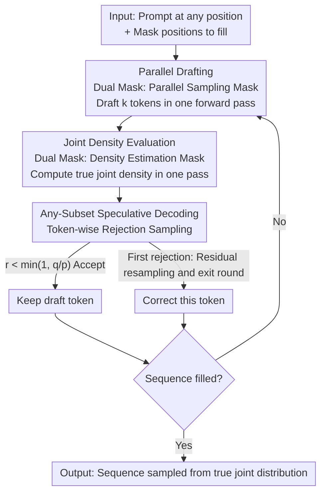

# Self-Speculative Decoding Accelerates Lossless Inference in Any-Order and Any-Subset Autoregressive Models

**Conference**: ICLR 2026  
**OpenReview**: [https://openreview.net/forum?id=hZnibTOke7](https://openreview.net/forum?id=hZnibTOke7)  
**Code**: https://github.com/gabeguo/any-order-speculative-decoding (Available)  
**Area**: LLM Efficiency / Speculative Decoding / Any-Order Autoregressions  
**Keywords**: Any-subset autoregressive models, speculative decoding, parallel sampling, lossless acceleration, infilling generation

## TL;DR
This paper proposes Any-Subset Speculative Decoding (ASSD), enabling Any-Subset Autoregressive Models (AS-ARM) to utilize the same network as both a fast drafter and a joint density oracle. Through rejection sampling, it achieves multiple token generation in parallel while **guaranteeing lossless sampling from the true joint distribution**, theoretically proving that the number of neural network calls never exceeds the number of generated tokens.

## Background & Motivation
**Background**: Current mainstream LLMs are almost exclusively left-to-right autoregressive models (GPT/LLaMA, etc.). They face two major drawbacks: they must generate tokens serially, making them slow; and they do not natively support infilling unless using heuristics like FIM, which does not guarantee structural correctness. Models capable of native infilling primarily include discrete diffusion models and Any-Order Autoregressive Models (AO-ARM).

**Limitations of Prior Work**: Discrete diffusion models can sample multiple tokens in parallel, but this parallelism relies on a "conditional independence assumption." This assumption only holds when time steps are infinitesimal (degrading to token-by-token). Once multiple tokens are decoded simultaneously, the predicted distribution deviates from the data distribution learned during training. Formally, $\sum_{i\in[m,N)}\log p(x_{\sigma(i)}|x_{\sigma(<m)}) \neq \log p(x_{\sigma(\geq m)}|x_{\sigma(<m)})$, where equality holds only under true independence. Conversely, while AO-ARMs can calculate joint density, few studies have explored fast parallel sampling for them.

**Key Challenge**: A fundamental trade-off exists between parallel sampling (fast but not lossless) and serial sampling (lossless but slow). Diffusion models choose the former, sacrificing quality, while autoregressive models choose the latter, sacrificing speed. Is it possible to recover samples that truly follow $\log p(x_{\sigma(\geq m)}|x_{\sigma(<m)})$ within $O(S)$ parallel time complexity?

**Key Insight**: The authors note that speculative decoding is exactly such a "fast and lossless" paradigm—using a cheap draft model to generate multiple tokens quickly and an expensive oracle model to accept/reject them via rejection sampling, where the output distribution is provably identical to sampling from the oracle alone. The two requirements for speculative decoding are: an oracle capable of density estimation and a fast draft model. An AO-ARM architecture is designed to estimate joint density, and because its training objective allows for arbitrary ordering and parallel generation, it **can serve as its own draft model**.

**Core Idea**: Port speculative decoding to AS-ARMs, allowing the same network to act as both drafter and oracle (self-speculative). Rejection sampling is used to correct parallel drafts back to the true joint distribution, achieving "free" lossless acceleration.

## Method

### Overall Architecture
The method consists of training and inference phases. In the training phase, an off-the-shelf AS-ARM (a 110M XLNet in this paper) is fine-tuned using a "teacher-forced joint loss" to evaluate joint conditional density under arbitrary prompt positions and infilling patterns. The inference phase is the ASSD main loop: given a prompt scattered at arbitrary positions and a set of mask positions to be filled, the model first uses a "parallel sampling mask" to draft $k$ tokens at once. Then, it uses a "density estimation mask" in a single forward pass to calculate the true joint density of these $k$ tokens. Finally, it performs token-wise rejection sampling—accepting tokens until the first rejection, at which point it resamples and exits the current round.

The inference process is a loop of "parallel drafting → one-time joint density evaluation → rejection sampling correction → update decoded count." Crucially, the drafter and oracle are **two different attention masks of the same network**, allowing draft computations to be cached and reused without extra VRAM.

### Key Designs

**1. Dual Attention Masks: One network as both parallel drafter and joint density oracle**

Speculative decoding requires a "fast" draft model and a "density-capable" oracle model. Traditionally, this requires two models, which increases VRAM usage and training costs, and draft computations cannot be reused for the oracle. The key observation is that an AS-ARM can satisfy both roles using the same weights by switching attention masks. The **parallel sampling mask** allows all masked tokens to attend only to prompt tokens, making them independent of each other. This enables parallel sampling of conditionally independent drafts $p(x_{\sigma(i)}|x_{\sigma(<m)})$—a "free draft model." The **density estimation mask** is a permuted causal mask where $A_{\sigma(i),\sigma(j)} = 1$ iff $i>j$. Each token attends only to tokens preceding it in the generation order, allowing the joint density of the sequence to be calculated in **one forward pass** ($O(S)$ time) according to the factorization $\log p(x_{\sigma(\geq m)}|x_{\sigma(<m)}) = \sum_{i\geq m}\log p(x_{\sigma(i)}|x_{\sigma(<i)})$.

This is exactly what discrete diffusion models cannot do: they use full attention and represent masks with absorber tokens, making it impossible to compute logits for visible tokens in one pass. Their density estimation requires $O(S\cdot N)$ rather than $O(S)$, making KV-caching difficult. AS-ARM's causal-like mask unifies drafting, density estimation, and KV-caching into a single model.

**2. Any-Subset Speculative Decoding (ASSD): Lossless rejection sampling with guaranteed NFE upper bound**

With parallel drafts $p_{\sigma(i)} = p(\tilde x_{\sigma(i)}|x_{\sigma(<n)})$ and true joint densities $q_{\sigma(i)} = p(\tilde x_{\sigma(i)}|x_{\sigma(<n)}, \tilde x_{\sigma[n:i)})$, ASSD performs token-wise rejection sampling: sample $r\sim U[0,1]$; if $r < \min(1, q_{\sigma(i)}/p_{\sigma(i)})$, the draft is accepted; otherwise, resample from the residual distribution $(p(\cdot|x_{\sigma(<n)}, \tilde x_{\sigma[n:i)}) - p(\cdot|x_{\sigma(<n)}))_+$ and exit the round.

It offers three fundamental advantages over vanilla speculative decoding. First, **Theorem 1: The total number of function evaluations (draft + oracle) never exceeds the number of generated tokens $N-m$**. This is not guaranteed in vanilla speculative decoding, which can increase NFE when the drafter is poor. ASSD's lower bound is secured by Lemma 1 (the first draft token is always accepted). Second, **Theorem 2: The output is provably from the true joint distribution** $p(x_{\sigma(\geq m)}|x_{\sigma(<m)})$. Third, it naturally handles $O(2^N)$ arbitrary subset infilling patterns, whereas vanilla speculative decoding only handles $O(N)$ left-to-right patterns.

**3. Teacher-Forced Joint Loss: Training AS-ARM for joint density evaluation**

For the oracle role to be valid, the model must accurately calculate joint conditional density. This requires a training objective different from diffusion or MAC. This paper maximizes the cross-entropy of the joint conditional probability $\max_\theta \mathbb{E}_{m\sim f(\cdot), \sigma\sim s(\cdot|m)}[\log p_\theta(x_{\sigma(\geq m)}|x_{\sigma(<m)})]$, which consists of three parts: the joint distribution, the expectation over token order $\sigma$, and the expectation over prompt length $m$. The authors model the generation process as an absorbing Markov chain $X_t = x_{\sigma(<N-t)}$, where summing the steps $\log p_\theta(x_{\sigma(N-t+1)}|x_{\sigma(<N-t)})$ yields the joint density.

Compared to the "conditional independence loss" used by MAC and discrete diffusion, the joint loss is feasible here specifically because of the causal-like attention mask. Training uses $m\sim U[0.01N, 0.10N]$ (generating from nearly blank) and samples $\sigma$ from all permutations, then sorts prompt and generation segments in ascending order to eliminate path ambiguity, reducing the learned permutations from $N!$ to $2^N$.

## Key Experimental Results

### Main Results
Correctness and Speed (WikiText, 640 sequences, 95% random mask, $k=5$):

| Sampler | Gen PPL | Entropy | Model NFE | Auxiliary NFE | Time (s) |
| :--- | :--- | :--- | :--- | :--- | :--- |
| Serial | 107.9 | 7.65 | 486.0 | 0.0 | 18.21 |
| ASSD (N-Gram Draft) | 111.7 | 7.64 | 422.0 | 422.0 | 16.80 |
| ASSD (Self-Draft) | 107.6 | 7.64 | 434.1 | 0.0 | 16.50 |

Infilling benchmark (HumanEval single-line code completion pass@1 and ROCStories ROUGE):

| Model | Params | Task | Metric | Notes |
| :--- | :--- | :--- | :--- | :--- |
| XLNet-Code (Ours) | 110M | HumanEval | pass@1 38.59 | Only 15B code tokens |
| DiffuLLaMA | 6738M | HumanEval | pass@1 40.68 | 50× params, 19B+46B tokens |
| AS-ARM-FT (Ours) | 110M | ROCStories Infill 3/5 | ROUGE-1 18.0 | Best in 4/6 metrics |
| DiffuGPT-S | 127M | ROCStories Infill 3/5 | ROUGE-1 16.4 | 262B+130B tokens |

### Ablation Study

| Configuration | Key Observation |
| :--- | :--- |
| Self-Draft vs Serial | Time 16.50 vs 18.21, PPL/Entropy identical |
| Self-Draft vs N-Gram | 2.24 vs 1.15 tokens per round |
| $2^N$ Factorization (vs $N!$) | Easier optimization (Figure 3) |
| AS-ARM-PT vs AS-ARM-FT | PT performs better on single-sentence (~20% mask) |

### Key Findings
- **Self-drafting is the fastest and lowest-NFE variant**: Parallel drafts are high quality, averaging 2.24 tokens per round.
- **Lossless property is empirically supported**: Gen PPL and Entropy for ASSD and serial decoding are statistically consistent, supporting Theorem 2.
- **Efficiency of small models**: The 110M AS-ARM achieves a 38.59 pass@1 on code infilling, approaching the 50× larger DiffuLLaMA (40.68) with significantly fewer training tokens.
- **Mask ratio mismatch causes performance drops**: Pre-trained weights outperform the fine-tuned version on sparse infilling (~20%), indicating a trade-off in capacity across mask distributions.

## Highlights & Insights
- **"Free Lunch" lossless acceleration**: Drafting and oracle functions share one network by switching attention masks. It requires no auxiliary models or extra VRAM and reuses KV-caches—key to simplifying speculative decoding into "self-drafting."
- **NFE upper bound guarantee**: Unlike vanilla speculative decoding, which can be slower than serial decoding if drafts are poor, ASSD's Lemma 1 (first token always accepted) mechanically prevents NFE from increasing.
- **Revitalizing AS-ARM**: The authors combine the "any-order autoregressive + causal-like mask" path (XLNet + MAC) with modern speculative decoding, demonstrating it is more principled for parallel lossless generation than discrete diffusion.

## Limitations & Future Work
- **Small model scale**: Experiments are limited to 110M (XLNet). Scaling to billions of parameters is listed as future work.
- **Architecture dependency**: ASSD requires an architecture capable of computing logits for both visible and masked tokens in one pass (causal-like mask), which excludes mainstream full-attention discrete diffusion architectures.
- **Training data uncertainty**: Public XLNet-Base weights do not disclose full pre-training recipes; token counts are extrapolated from XLNet-Large assumptions.
- **Moderate speedup**: Time on WikiText decreased from 18.21s to 16.50s (~9%), showing theoretical NFE benefits rather than order-of-magnitude wall-clock speedups.

## Related Work & Insights
- **vs. Discrete Diffusion (SEDD / MDLM / LLaDA)**: Diffusion uses conditional independence for parallel sampling, causing distribution shift. AS-ARM uses causal-like masks for parallel yet lossless joint density estimation.
- **vs. Vanilla Speculative Decoding**: Vanilla is restricted to left-to-right models, requires auxiliary models, and lacks NFE upper bounds. ASSD is self-drafting and handles $O(2^N)$ patterns.
- **vs. AO-ARM / MAC**: Inherits $O(1)$ density estimation from XLNet and the $2^N$ binary lattice decomposition from MAC, introducing speculative decoding to this family for the first time.

## Rating
- Novelty: ⭐⭐⭐⭐⭐ First combination of speculative decoding with AS-ARM; provides theoretical NFE upper bounds.
- Experimental Thoroughness: ⭐⭐⭐⭐ Covers correctness, speed, and infilling, but limited to <200M scale.
- Writing Quality: ⭐⭐⭐⭐⭐ Clear motivation; good integration of theory (Lemma/Theorem) and algorithm diagrams.
- Value: ⭐⭐⭐⭐ Restores a non-diffusion parallel infilling path with transferable theoretical guarantees.

<!-- RELATED:START -->

## Related Papers

- [\[ICLR 2026\] Overcoming Joint Intractability with Lossless Hierarchical Speculative Decoding](overcoming_joint_intractability_with_lossless_hierarchical_speculative_decoding.md)
- [\[CVPR 2026\] ParallelVLM: Lossless Video-LLM Acceleration with Visual Alignment Aware Parallel Speculative Decoding](../../CVPR2026/llm_efficiency/parallelvlm_lossless_video-llm_acceleration_with_visual_alignment_aware_parallel.md)
- [\[ICLR 2026\] ReFusion: A Diffusion Large Language Model with Parallel Autoregressive Decoding](refusion_a_diffusion_large_language_model_with_parallel_autoregressive_decoding.md)
- [\[ICLR 2026\] Inference-Cost-Aware Dynamic Tree Construction for Efficient Inference in Large Language Models](inference-cost-aware_dynamic_tree_construction_for_efficient_inference_in_large_.md)
- [\[ICLR 2026\] SpecBranch: Speculative Decoding via Hybrid Drafting and Rollback-Aware Branch Parallelism](specbranch_speculative_decoding_via_hybrid_drafting_and_rollback-aware_branch_pa.md)

<!-- RELATED:END -->
