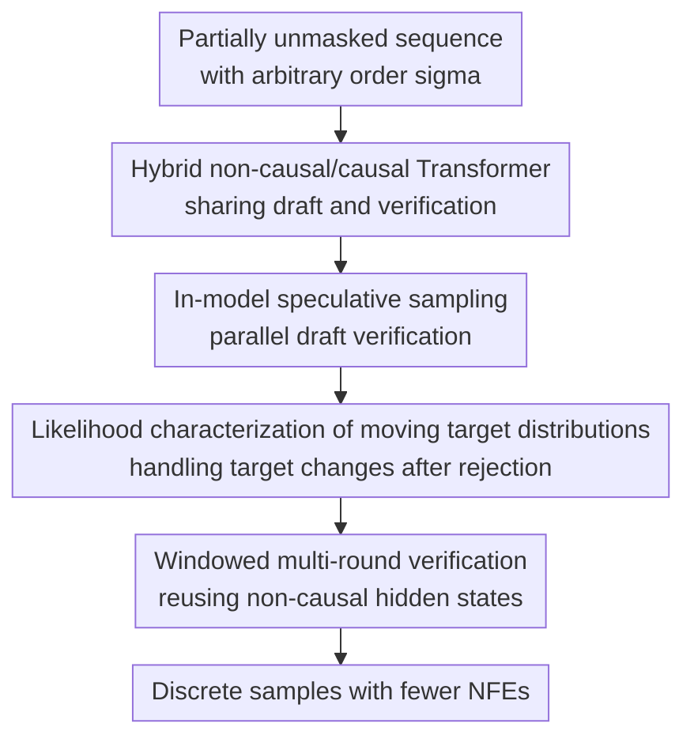

# Self-Speculative Masked Diffusions

**Conference**: ICLR2026  
**OpenReview**: [https://openreview.net/forum?id=ogMTEtHO6M](https://openreview.net/forum?id=ogMTEtHO6M)  
**Code**: No public code  
**Area**: LLM Efficiency  
**Keywords**: masked diffusion, speculative sampling, self-speculative decoding, discrete generation, protein sequence generation

## TL;DR
Self-Speculative Masked Diffusions integrates the non-causal parallel draft distribution of masked diffusion and an arbitrary-order causal target distribution into the same Transformer. By using in-model speculative sampling to verify multiple masked tokens in a single primary forward pass, it reduces the number of network forward passes by approximately $2\times$ for text modeling and protein sequence generation with nearly identical quality.

## Background & Motivation
**Background**: Two common paths exist for discrete data generation: autoregressive language models that generate tokens sequentially from left to right, and masked diffusion / any-order autoregressive models that allow tokens to be unmasked in any order. The latter is particularly attractive for sequences beyond text, such as protein sequences, which lack natural "left-to-right" generation semantics and allow the model to fill in remaining positions based on any already revealed residues.

**Limitations of Prior Work**: Standard masked diffusion models use a non-causal Transformer at each step to output a factorized predictive distribution for all remaining masked positions, approximating different masked locations as conditionally independent. While this assumption allows for sampling multiple positions in one forward pass, it imposes a hard ceiling: if too many tokens are unmasked at once, the model fails to capture the correlations between these new tokens, leading to a significant drop in sample quality. To maintain quality, the number of unmasked tokens per step must be kept small, resulting in many neural function evaluations (NFEs).

**Key Challenge**: The authors aim to resolve the conflict between "parallel unmasking" and "non-factorized dependencies." Ideally, the distribution should allow subsequent tokens to be conditionally dependent on previously generated tokens, similar to autoregressive models. However, naive autoregressive sampling of $k$ tokens requires $k$ forward passes, which cancels out the parallel advantage of masked diffusion.

**Goal**: Ours aims to preserve the arbitrary order and parallel updates of masked diffusion while ensuring that newly unmasked tokens in a single update are no longer independent of each other. Specifically, it seeks to construct a cheap draft distribution and a stronger target distribution within a single model, using speculative sampling to accept only those draft tokens approved by the target, thereby reducing the number of full network forward passes required for each sampling round.

**Key Insight**: The authors observe that speculative sampling, used for LLM inference acceleration, is perfectly suited for this contradiction: multiple tokens are drafted by a cheap distribution and then validated in parallel by a strong distribution. As long as the acceptance/rejection rules are correct, the output follows the target distribution. The challenge is that masked diffusion backbones are typically non-causal, whereas speculative verification requires a causal target distribution; furthermore, in masked diffusion, each acceptance/rejection changes the unmasked context seen by non-causal layers, causing the target distribution to shift along the trajectory.

**Core Idea**: Use the non-causal layers of a hybrid Transformer to generate drafts for masked tokens, and then convert a small final portion of the layers into an arbitrary-order causal verifier. Through in-model self-speculative sampling, the model approximates sampling from a non-factorized masked-token distribution.

## Method

### Overall Architecture
This paper transforms the "parallel unmasking of multiple masks" in standard masked diffusion into a cycle of "parallel drafting, causal verification, and accepting a segment of tokens." Given a generation order $\sigma$ and the current revealed prefix $x_{\sigma(1:i)}$, the model first uses non-causal layers to produce draft tokens for future positions. Subsequently, causal layers at the end of the same network assign target probabilities to these draft tokens following the order $\sigma$. Finally, tokens are verified sequentially according to speculative sampling acceptance rates until all tokens are unmasked.

From the reader's perspective, this method does not involve training a separate draft model or distilling the masked diffusion into a coarser time grid. Instead, it adds a small amount of causal computation to a masked diffusion backbone, allowing the preceding non-causal layers to continue handling global context modeling and draft generation, while the final causal layers focus purely on adding sequential dependencies between draft tokens.

### Key Designs
**1. Hybrid non-causal/causal Transformer: Shared Drafting and Verification**

Non-causal layers in standard masked diffusion can see the hidden states of all positions, but positions not yet unmasked in the input are mask tokens. Thus, they are suitable for outputting a factorized draft distribution $\overleftrightarrow{p}_\theta(x_{\sigma(i+1:D)} \mid x_{\sigma(1:i)})$. Ours retains this structure, allowing it to provide draft logits for all future positions simultaneously, as in a typical MDM, ensuring the drafting stage is cheap and parallel.

To avoid using an external model for verification, the authors modify the last few Transformer blocks into causal layers following the arbitrary order $\sigma$. These causal layers adopt a setup similar to $\sigma$-GPT: the sequence is rearranged by $\sigma$, and each track knows both the current position and the next position to be predicted, allowing the $j$-th track to predict $x_{\sigma(j+1)}$. Simultaneously, the causal layers receive hidden states for both the "current position" and the "next position" from the non-causal layers, adding the non-causal hidden state of the next position back as a residual at the output. This residual is crucial: it allows the target distribution $\overrightarrow{p}_{\theta,\phi}$ to learn "dependencies added on top of the draft" rather than learning a completely different model from scratch, resulting in better alignment between draft and target and higher speculative sampling acceptance rates.

**2. In-model Speculative Sampling: Compressing Non-factorized Dependencies into One Update**

In a single sampling update, the non-causal layers first sample draft tokens $\hat{x}_{\sigma(i+1:D)}$ for all unknown positions within a window. Subsequently, the causal layers compute the target probability for each draft token $\overrightarrow{p}_{\theta,\phi}(\hat{x}_{\sigma(d)} \mid \theta(x_{\sigma(1:i)}), \phi(\hat{x}_{\sigma(i+1:d-1)}))$ in parallel, conditioned on these draft tokens serving as future inputs. During verification, starting from the first unknown position, an acceptance probability $\min(1, q(\hat{x}) / p(\hat{x}))$ determines whether to accept a token, where $p$ is the non-causal draft probability and $q$ is the causal target probability. Upon the first rejection, the token is resampled from the residual distribution $\tilde{p}(x) \propto \max(0, q(x)-p(x))$, concluding that inner loop iteration.

The effect is that a single primary forward pass is no longer just a hard sample from a distribution where "all future tokens are conditionally independent"; instead, it attempts to sample a segment of tokens from a non-factorized target distribution expanded along $\sigma$. The accepted continuous draft segments preserve the correctness intuition of speculative sampling: if the draft and target nearly agree on a token, the autoregressive target recalculation is bypassed. Discrepancies lead to correction through rejection and residual resampling. Consequently, masked diffusion can unmask more tokens per step without quality degradation.

**3. Likelihood Characterization of Moving Target Distributions: Handling Trajectory Dependence**

Self-speculative decoding in standard LLMs usually involves a fixed left-to-right target distribution: once a prefix is determined, subsequent target probabilities do not change because the computation path of the model remains consistent regardless of where a rejection occurs in a round. Masked diffusion is different. If a verification round starts at the $i$-th revealed token, the non-causal layers see $x_{\sigma(1:i)}$. If a rejection occurs midway and tokens are unmasked up to $j>i$, the context for the next round's non-causal layers becomes $x_{\sigma(1:j)}$, which shifts the output hidden states and subsequent target distributions.

The authors do not gloss over this change as an implementation detail but provide a recursive decomposition: for a given order $\sigma$, the sample likelihood can be split into "all-accept paths" and events where "the first rejection occurs at a specific position followed by all-accepts." This can be computed using dynamic programming within $D$ neural network forward passes and $O(D^2)$ standard operations. This theoretical result demonstrates that Algorithm 2 defines an analyzable generative model rather than just an empirical acceleration trick. Although the authors optimize a cheaper cross-entropy objective instead of this ELBO during training, the decomposition explains why the rejection position becomes part of the model's probability.

**4. Windowed Multi-round Verification: Reusing the Most Expensive Non-causal Computation**

The naive version of Algorithm 2 involves one round of non-causal drafting plus one round of causal verification. The paper further proposes windowed multi-round verification: a single non-causal forward pass generates the draft distribution within a window $W(i)$, followed by multiple iterations of the causal verification inner loop on the same set of non-causal hidden states. After each rejection resampling, subsequent draft token values change, requiring causal probability recalculation; however, the non-causal hidden states can be reused as the outer unmasked context remains unchanged.

This design exploits the computational asymmetry in the architecture: most layers in the experiments are non-causal (e.g., in a 12-layer model, 11 are non-causal and 1 is causal). Running the final causal layers multiple times costs significantly less than multiple full network passes. The window function $W(i)$ typically grows as the number of revealed tokens increases, based on the intuition that early generation stages lack context and should not accept too many tokens at once, while later stages have sufficient context and lower uncertainty, allowing for a wider window. The authors found that a cosine-shaped window performs better than a linear one, using $\Delta\tau$ and the number of verification rounds per draft to balance quality and latency.

### Loss & Training
During training, the model simultaneously optimizes both the non-causal draft distribution and the causal target distribution. Given a ground-truth sequence $x$, a random order $\sigma$, and a revealed length $i$, the non-causal part predicts all masked tokens, while the causal part predicts subsequent tokens using causal attention after the full ground-truth sequence is arranged according to $\sigma$. The total objective is the sum of two cross-entropy terms:

$$
\mathcal{L}=\mathbb{E}\left[\frac{D}{D-i}\left(\log \overleftrightarrow{p}_\theta(x_{\sigma(i+1:D)}\mid \theta(x_{\sigma(1:i)})) + \log \overrightarrow{p}_{\theta,\phi}(x_{\sigma(i+1:D)}\mid \theta(x_{\sigma(1:i)}),\phi)\right)\right].
$$

Where $\frac{D}{D-i}$ is used to normalize by the number of masked tokens. The first term is equivalent to the standard training objective for masked diffusion, and the second term is equivalent to any-order autoregressive cross-entropy. Crucially, both terms are obtained through a single forward pass of the hybrid network. The paper demonstrates two training modes: training from scratch for OpenWebText/text8 using 11 non-causal layers plus 1 causal layer; and for UniRef50 protein experiments, freezing an existing 30-layer ESM2-based masked diffusion model and training only one additional causal block, showing the method can serve as a lightweight acceleration head for pretrained MDMs.

## Key Experimental Results

### Main Results
The authors validate the method at three levels: text8 for small-scale character generation, OpenWebText for GPT2-scale text modeling, and UniRef50 for non-textual protein sequence generation. A common conclusion is that self-speculative masked diffusion requires significantly fewer NFEs than standard masked diffusion for similar sample quality, with typical speed gains approaching $2\times$.

| Dataset | Metric | Ours | Comparison Method | Key Findings |
|---------|--------|------|-------------------|--------------|
| text8 | Spelling accuracy vs NFE | Higher accuracy with fewer NFEs in the low NFE range | Standard Masked Diffusion | Significant advantage in the 20-50 NFE range, achieving over $2\times$ NFE reduction |
| OpenWebText | GPT2 NLL / token entropy | GPT2 NLL: 5.28 @32 NFE, 5.12 @64 NFE, 5.05 @128 NFE | Masked Diffusion: 5.50 @32 NFE, 5.27 @64 NFE, 5.13 @128 NFE | Reaches equivalent NLL with roughly half the NFE while maintaining similar entropy |
| UniRef50 | ESMFold pLDDT vs NFE | ~ $2\times$ speed-up in the high pLDDT range | Non-causal MDM sampling (Wang et al. 2024) | Freezing a pretrained protein MDM and adding one causal block improves the quality-compute tradeoff |

The OpenWebText table demonstrates that the model is not simply gaining through low entropy. While SDTT has a lower GPT2 NLL, its unigram entropy is significantly lower, suggesting possible mode-seeking behavior. The entropy of the proposed method is close to the MDM baseline, indicating it maintains diversity while reducing NFE.

| Method | GPT2 NLL @32 NFE | GPT2 NLL @64 NFE | GPT2 NLL @128 NFE | Entropy @64 NFE | Remarks |
|--------|------------------|------------------|-------------------|-----------------|---------|
| Masked Diffusion | 5.50 | 5.27 | 5.13 | 5.70 | Standard factorized MDM sampling |
| Speculative (ours) | 5.28 | 5.12 | 5.05 | 5.70 | Better NLL with equivalent entropy |
| SDTT | 3.70 | 3.46 | 3.30 | 5.25 | Very low NLL but also low entropy; mode-seeking caveat |

### Ablation Study
| Configuration | Key Metrics | Description |
|---------------|-------------|-------------|
| Full model: 11 non-causal + 1 causal | OpenWebText GPT2 NLL: 5.28/5.12/5.05/5.02 for 32/64/128/256 NFE | Main model; draft is strong enough, 1 layer target adds dependencies |
| No output residual | GPT2 NLL: 5.36/5.16/5.10/5.05 | Removing residual degrades acceptance and target learning, especially affecting low NFE performance |
| 10 non-causal + 2 causal layers | GPT2 NLL: 5.34/5.16/5.06/5.03 | Strengthening target but weakening draft; overall quality-compute tradeoff is worse than 1 causal layer |
| Protein pretrained + 1 causal block | ~$2\times$ speed-up in high pLDDT range on UniRef50 | Effective even when freezing non-causal ESM2-based MDM and adding a causal head |

### Key Findings
- The most significant gains come from "non-factorized target with parallel draft." Training curves show causal loss is close to non-causal loss initially but drops significantly later, proving the causal layer utilizes the extra context from draft/ground-truth tokens rather than just repeating non-causal predictions.
- The residual connection is a small but critical engineering design. It allows the causal target to refine non-causal hidden states rather than starting from scratch, leading to better draft/target alignment and more stable speculative acceptance.
- More causal layers are not necessarily better. On OpenWebText, 10nc-2c performed worse than 11nc-1c, suggesting draft quality is more important than a stronger but more expensive target in this setting.
- Windows and verification rounds act as speed-quality knobs. Appendix results for text8 show that increasing $\Delta\tau$ from 0.01 to 0.083 drops NFE from 80 to 21, but spelling accuracy falls from 0.91 to 0.87, indicating that too aggressive unmasking early on hurts quality.
- Extra FLOPs are minimal. In the OpenWebText setup, the FLOPs for extra projections and residuals in the hybrid architecture are roughly 0.98% of a full vanilla Transformer forward pass, far outweighed by the benefits of NFE reduction.

## Highlights & Insights
- The key to migrating speculative sampling to masked diffusion is not just "wrapping a draft-verify framework," but making the target an arbitrary-order causal distribution. This change directly addresses the quality bottleneck of factorized MDM and is more fundamental than simply tuning noise schedules or skipping steps.
- The hybrid architecture ratio is elegant: the vast majority of layers remain non-causal. This preserves the parallel and bidirectional context advantages of masked diffusion while introducing inter-token dependencies at minimal extra cost.
- The paper does not avoid the issue of moving target distributions due to rejection trajectories, providing a likelihood recursion and ELBO explanation. This theoretical patch is important as it elevates the method from a heuristic sampling trick to a well-defined generative model.
- The protein sequence experiments are insightful. While primarily an inference acceleration paper, the UniRef50 results show that the benefits of arbitrary-order masked generation are not limited to natural language but also suit biological sequences lacking a fixed direction.
- This approach is transferable to other discrete diffusion scenarios, such as code infilling, discrete graph generation, or discrete audio token generation. Any existing non-causal masked generator can consider adding a lightweight causal verification head to reduce sampling steps.

## Limitations & Future Work
- The gains depend on the alignment between the draft and the target. If the non-causal draft is weak, speculative sampling will frequently reject, reducing actual NFE savings; if a single-layer target fails to learn strong conditional dependencies, quality gains will be limited.
- The paper primarily focuses on 150M parameter scale models. Whether a single-layer causal head remains the optimal tradeoff for larger models, longer contexts, or more complex sampling strategies requires systematic validation.
- Sampling hyperparameters still require tuning. Window shape, $\Delta\tau$, and the number of verification rounds per draft affect quality and latency, necessitating re-optimization based on task budgets during deployment.
- Although theoretical likelihood is computable, training does not directly optimize this ELBO. The choice of a cheaper dual cross-entropy objective is a reasonable engineering compromise, but it leaves an open question: could direct optimization of the likelihood induced by the sampling algorithm further improve acceptance rates and sample quality?
- Combinations with other MDM strategies like re-masking correctors, confidence-based unmasking, or path-planning sampling have not been fully explored. The authors suggest future work could combine this method with compute-intensive inference scaling to improve reasoning capabilities within a fixed computational budget.

## Related Work & Insights
- **vs Standard Masked Diffusion / any-order AR diffusion**: Standard methods use a non-causal Transformer for factorized prediction of all masked positions; parallelizing forward passes is an advantage, but missing dependencies between sampled tokens is a disadvantage. Ours retains the parallel draft but introduces non-factorized dependencies via a causal target and speculative acceptance.
- **vs LLM speculative decoding**: Speculative sampling by Leviathan et al. and Chen et al. typically uses a small draft model and a large target model for fixed left-to-right generation. Ours is self-speculative: the draft and target are in the same model, and the target operates in an arbitrary order $\sigma$.
- **vs LayerSkip / Kangaroo, etc.**: These methods use early-exit layers for drafting and subsequent layers for verification in purely causal LLMs. Ours differs in that most of the network is non-causal, with only the final layers causalized, aiming to accelerate masked diffusion rather than standard left-to-right decoding.
- **vs Medusa**: Medusa uses multiple heads to predict future tokens to accelerate causal LLMs. Ours uses a non-causal MDM as a draft and validates masked positions via an arbitrary-order causal layer, making it more suitable for infilling and protein tasks without fixed directionality.
- **vs SDTT / distillation-based MDM acceleration**: SDTT uses distillation to coarsen the sampling time grid, which is fast but leads to reduced sample entropy. Ours does not distill the model into a more mode-seeking student but reduces forward passes via target verification, maintaining entropy closer to the original MDM in experiments.

## Rating
- Novelty: ⭐⭐⭐⭐⭐ Adapting self-speculative decoding into an internal non-causal draft + arbitrary-order causal verification for masked diffusion is a novel formulation of both the problem and the architecture.
- Experimental Thoroughness: ⭐⭐⭐⭐ Coverage of text8, OpenWebText, and UniRef50 with structural ablations and hyperparameter analysis is strong, though larger models and more discrete modalities remain to be tested.
- Writing Quality: ⭐⭐⭐⭐ The structure is clear, and the algorithm/theory explanations are comprehensive; the section on moving target distributions is technical and assumes some background in speculative sampling.
- Value: ⭐⭐⭐⭐⭐ Highly valuable for the practical inference efficiency of masked diffusion language models, providing a reusable acceleration paradigm for arbitrary-order discrete generation tasks like protein sequences.

<!-- RELATED:START -->

## Related Papers

- [\[ICLR 2026\] Parallel Sampling from Masked Diffusion Models via Conditional Independence Testing](parallel_sampling_from_masked_diffusion_models_via_conditional_independence_test.md)
- [\[ICLR 2026\] Self-Speculative Decoding Accelerates Lossless Inference in Any-Order and Any-Subset Autoregressive Models](self-speculative_decoding_accelerates_lossless_inference_in_any-order_and_any-su.md)
- [\[ICML 2026\] KnapSpec: Self-Speculative Decoding via Adaptive Layer Selection as a Knapsack Problem](../../ICML2026/llm_efficiency/knapspec_self-speculative_decoding_via_adaptive_layer_selection_as_a_knapsack_pr.md)
- [\[ACL 2025\] CLaSp: In-Context Layer Skip for Self-Speculative Decoding](../../ACL2025/llm_efficiency/clasp_self_speculative_decoding.md)
- [\[ICLR 2026\] Speculative Speculative Decoding](speculative_speculative_decoding.md)

<!-- RELATED:END -->
