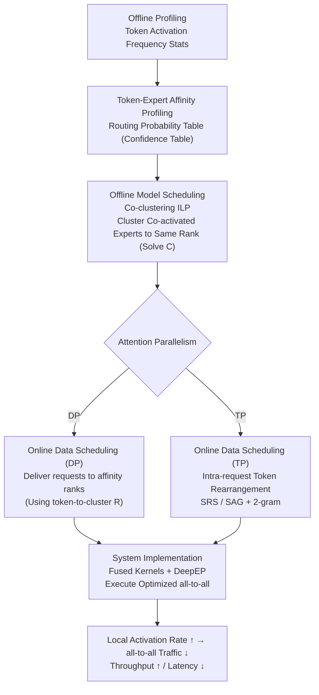

# Semantic Parallelism: Redefining Efficient MoE Inference via Model-Data Co-Scheduling

**Conference**: ICLR 2026  
**arXiv**: [2503.04398](https://arxiv.org/abs/2503.04398)  
**Code**: Implemented based on SGLang (approx. 5000 lines of Python + Triton kernels)  
**Area**: LLM Efficiency  
**Keywords**: Mixture-of-Experts, Expert Parallelism, all-to-all communication, model-data co-scheduling, Token-Expert affinity  

## TL;DR
The authors propose the Semantic Parallelism paradigm, which significantly reduces all-to-all communication overhead in MoE inference by predicting token-expert routing paths and co-scheduling model placement and data distribution. This achieves up to 2.78× throughput improvement in Attention-DP scenarios and up to 24.9% latency reduction in Attention-TP scenarios.

## Background & Motivation
**MoE model inference is constrained by all-to-all communication bottlenecks**: Expert Parallelism (EP) distributes experts across multiple GPUs but requires two all-to-all collective communications to route tokens to remote experts and back. Even on 400GB/s high-speed interconnects, this still accounts for 59.2% of the MoE layer forward latency.

**Existing solutions decouple model placement and data scheduling**: Deciding which GPU hosts which expert and which GPU receives which token are treated as independent problems, leading to significant unnecessary cross-device communication.

**Tokens exhibit context-independent expert affinity**: Experiments reveal that token activation for specific experts is highly concentrated and stable (the median cumulative activation probability of top-k experts reaches 0.833-0.976), providing a basis for predictive routing.

**The wide deployment of MoE models like DeepSeek-V3/R1 and Qwen3** makes EP communication optimization a critical industrial requirement.

## Method

### Overall Architecture
Sem-MoE shifts MoE inference communication optimization from "reactive all-to-all management" to "proactive predictive routing." It first performs offline **profiling** of token-expert affinity to prove that token routing is stable enough to be predicted. Then, it integrates "expert placement" and "token delivery" into a single **co-clustering Integer Linear Programming (ILP)** problem. This ensures that experts frequently activated together are clustered on the same card, and requests/tokens are delivered directly to the device hosting their most likely lightning-strike experts. During deployment, the strategy is implemented via two paths: request-level scheduling for Attention-DP and finer-grained token-level rearrangement for Attention-TP. Finally, a set of fused kernels executes the optimized all-to-all. Consequently, most expert activations become local accesses, and remote all-to-all traffic is structurally minimized—essentially replacing global "any-to-any token shuffling" with "co-located data and models."

### Key Designs

**1. Token-Expert Affinity Profiling: Providing Reliable Priors for Predictive Scheduling**

The premise of this method is whether token routing is stable enough to be "predicted." The authors profiled DeepSeek-V2-Lite on ShareGPT and found that although the gating function $G_L(h_{L,j})=\text{top-}k(\text{softmax}(\mathbf{W}_{L,g}h_{L,j}+\mathbf{b}_{L,g}))$ theoretically depends on context semantics, the same token consistently routes to a narrow and static subset of top-k experts across different contexts. The median F1-score for "predicting based solely on the hottest top-k experts" reaches 0.833–1.000 across layers, while the median max hotness of non-top-k experts is only about 0.05. Activation is highly concentrated and stable. Accordingly, an activation frequency table $\mathbf{T}^{(L)}\in\mathbb{N}^{t\times N}$ (where $t$ is vocabulary size and $N$ is expert count) is maintained for each layer. Normalized routing probabilities $\Pr(E_k^{(L)}\mid x_j)=\mathbf{T}^{(L)}_{j,k}/\sum_k \mathbf{T}^{(L)}_{j,k}$ are stored in a confidence table as a unified prior. OOV tokens are handled using nearest neighbors in embedding space. Profiling is done once offline and can migrate across datasets zero-shot, avoiding online overhead.

**2. Offline Model Scheduling: Clustering Co-activated Experts to the Same Device**

With affinity data, the authors formulate "expert placement" and "token-to-cluster assignment" as a joint 0-1 ILP. Decision variables are the assignment of token $j$ to cluster $i$ ($\mathbf{R}_{ij}\in\{0,1\}$) and the placement of expert $k$ to cluster $i$ ($\mathbf{C}_{ik}\in\{0,1\}$), where the number of clusters equals the EP degree. The objective function is:

$$\mathcal{L}=\theta\sum_{i}\Big|\sum_{j}\mathbf{R}_{ij}\bm{a}_j-\tfrac{S}{E}\Big|+(1-\theta)\sum_{i_1\neq i_2}\sum_{j,k}\mathbf{R}_{i_1 j}\mathbf{C}_{i_2 k}\,\bm{\mathcal{C}}_{p,jk}\,\bm{a}_j$$

The left term balances token frequencies across clusters to promote EP load balancing, while the right term minimizes remote activations (cross-cluster token-expert activations). $\theta$ balances these two goals. Hard constraints ensure each token and expert belongs to exactly one cluster and that experts are distributed evenly. Since direct LP solving is expensive, an alternating optimization approach is used to iteratively approximate a feasible solution. **Model scheduling** implements the resulting $\mathbf{C}$: if $\mathbf{C}_{jk}=1$, expert $j$ is placed on device $k$, and the columns of the gating matrix are shuffled accordingly, achieving expert redistribution transparently to the upper layers.

**3. Online Data Scheduling: Proactive Data Delivery**

Once placement is fixed, the online phase uses the same ILP solution to determine data routing. In Attention-DP, requests are independent, so **inter-request scheduling** is used: an entire request is dispatched to the cluster (DP rank) with its highest aggregate token affinity, $\bm{S}_{\bm{r}}=\arg\max_{j\in\llbracket E\rrbracket}\sum_{i\in\bm{r}}\mathbf{R}_{ij}$. A workload-aware balancing strategy ensures all ranks are utilized for decoding. in Attention-TP, where attention itself is partitioned, **token-level scheduling** is required. Since single-layer prediction may be inaccurate, the authors utilize a Markov dependency between expert choices in adjacent layers, enhancing prediction with a 2-gram device transition model $\Pr(D_k^{(L)}\mid D^{(L-1)},\dots,D^{(L-n)})$. Speculative token rearrangement is embedded into TP's existing communication phases: replacing standard post-attention reduce-scatter with Shuffled-Reduce-Scatter (SRS) followed by a delayed Shuffled-AllGather (SAG). This merges rearrangement with necessary data transformations.

**4. System Implementation: Translating Algorithmic Gains to Latency Reduction**

Theoretical benefits are realized through efficient kernels to prevent rearrangement overhead from consuming communication savings. Sem-MoE is implemented as an SGLang plugin with 5000 lines of Python and custom Triton kernels. DP extends the request scheduler to batch similar requests using affinity info; TP's SRS/SAG relies on an optimized `argsort` kernel (25% faster than PyTorch native) embedded in ring communication. The system integrates the DeepEP communication library to execute optimized all-to-all, ensuring reduced remote activations translate to end-to-end throughput and latency gains.

## Key Experimental Results

### Attention-DP Scenario (Throughput under SLO constraints)

| Model | vs SGLang (TTFT SLO) | vs SGLang (E2E SLO) | vs MoETuner (TTFT) | vs MoETuner (E2E) |
|------|---------------------|--------------------|--------------------|-------------------|
| DeepSeek-V2-Lite | +31% | +221% | +32% | +278% |
| Qwen3-30B-A3B | +98% | +11% | +35% | +32% |

### Attention-TP Scenario (Latency Reduction)

| Model | Input Len 256 | Input Len 512 | Input Len 1024 |
|------|-----------|-----------|------------|
| DeepSeek-V2-Lite p99 TTFT | -12.21% | -10.60% | -18.89% |
| Qwen3-30B-A3B p99 TTFT | -17.16% | -24.90% | -3.80% |

### Key Findings
- Local Activation Rate (LAR) improves by 37-43% over vanilla, reducing EP layer latency by 41.8-46.6%.
- The co-scheduling algorithm achieves 15.4% higher LAR and lower load imbalance compared to the MoETuner baseline.
- Zero-shot migration performance across datasets validates the generalizability of the scheduling strategy.

## Highlights & Insights
- Proposes the "Semantic Parallelism" paradigm, shifting communication optimization from passive to proactive.
- Reveals the context-independent nature of token-expert affinity, providing a theoretical foundation for predictive scheduling.
- Provides a systemic rather than local solution by optimizing both model placement and data scheduling simultaneously.
- The SRS/SAG fusion primitives are elegantly designed, embedding token rearrangement into existing communication flows with only ~1% overhead.

## Limitations & Future Work
- Validated only on 8-GPU single-node setups; performance in multi-node or low-speed interconnect scenarios remains to be verified.
- The prediction model requires offline profiling and does not assist in cold-start scenarios.
- MoE variants with highly dynamic routing mechanisms may require re-profiling if gate functions change significantly.
- Interaction with KV cache optimizations or quantization techniques was not evaluated.

## Related Work & Insights
- **Expert Placement**: MoETuner (ILP optimization), ExFlow (inter-layer affinity), EPLB (DeepSeek load balancing).
- **MoE Inference Systems**: DeepSpeed-MoE, Tutel, vLLM, SGLang.
- **Prefetching/Offloading**: Pre-gated MoE (modifies architecture to predict lower-layer experts)—Sem-MoE requires no architectural changes.
- This work represents the first attempt to optimize model and data scheduling concurrently.

## Rating ⭐⭐⭐⭐⭐
- **Novelty**: 5/5 — Originality of the Semantic Parallelism paradigm and co-scheduling concept.
- **Experimental Thoroughness**: 4/5 — Covers two models and two scenarios, though limited to a single node.
- **Writing Quality**: 4/5 — Clear system descriptions and high-quality diagrams.
- **Value**: 5/5 — Addresses a core bottleneck in MoE inference with high industrial potential.

<!-- RELATED:START -->

## Related Papers

- [\[ICLR 2026\] Libra: Effective yet Efficient Load Balancing for Large-scale MoE Inference](libra_effective_yet_efficient_load_balancing_for_large-scale_moe_inference.md)
- [\[ICLR 2026\] Universal Model Routing for Efficient LLM Inference](universal_model_routing_for_efficient_llm_inference.md)
- [\[ICLR 2026\] Scaling Laws Meet Model Architecture: Toward Inference-Efficient LLMs](scaling_laws_meet_model_architecture_toward_inference-efficient_llms.md)
- [\[ICLR 2026\] ICaRus: Identical Cache Reuse for Efficient Multi-Model Inference](icarus_identical_cache_reuse_for_efficient_multi-model_inference.md)
- [\[ICLR 2026\] FlashDLM: Accelerating Diffusion Language Model Inference via Efficient KV Caching and Guided Diffusion](flashdlm_accelerating_diffusion_language_model_inference_via_efficient_kv_cachin.md)

<!-- RELATED:END -->
