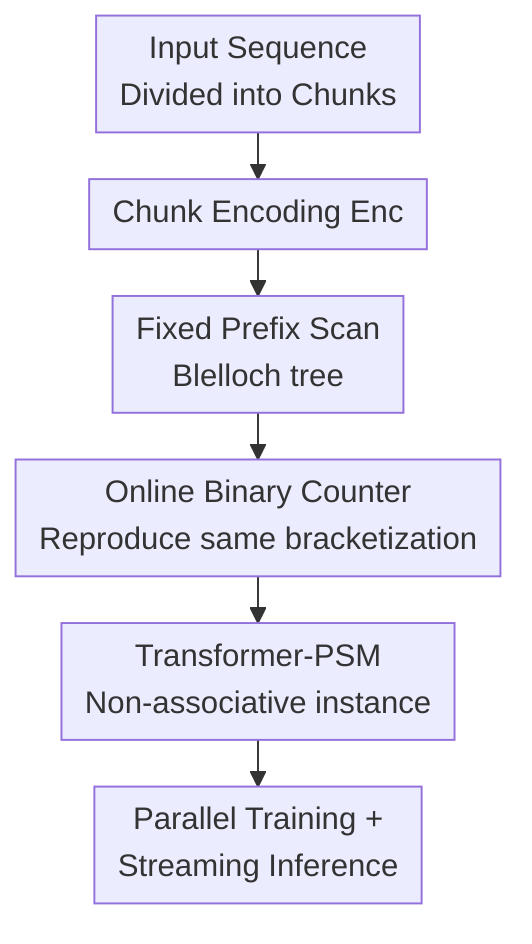

# Sequential Parallel Duality in Prefix Scannable Models

**Conference**: ICLR2026  
**OpenReview**: [https://openreview.net/forum?id=tuLF84azND](https://openreview.net/forum?id=tuLF84azND)  
**Code**: Not yet public (authors promise release upon acceptance)  
**Area**: LLM Efficiency / Efficient Sequence Modeling  
**Keywords**: Prefix Scan, Efficient Inference, State Space Models, Linear Attention, Sequence Model Theory

## TL;DR
This paper utilizes parallel prefix scans to provide a unified characterization of efficient sequence models that are "parallelizable during training and streamable during inference." It extends this class of models to Prefix-Scannable Models (PSMs) by allowing non-associative aggregation operators, enabling Transformer-style softmax aggregation to achieve approximately linear training and $O(\log n)$ memory streaming inference under fixed chunking.

## Background & Motivation
**Background**: Modern language and sequence models face two contradictory requirements. During training, they must be parallelizable along the sequence dimension to maintain high throughput for long sequences. During inference, they must allow for token-by-token streaming generation; otherwise, the KV cache expands linearly with context, leading to uncontrollable latency and memory costs. While Transformers solve training parallelization, they store historical dependencies in all past keys/values. Conversely, new-generation linear RNNs and State Space Models (SSMs) like Mamba, GLA, RetNet, and mLSTM attempt to restore RNN-style streaming states while retaining Transformer-style batch training.

**Limitations of Prior Work**: These efficient models appear distinct in engineering: some originate from SSMs, others from linear attention, fast weight programmers, gated recurrences, or projection updates. While they all claim the dual advantages of "parallel training + linear inference," they lack a unified language to define which models truly possess these properties, why they can be trained via parallel scans, and whether non-linear, non-associative token mixing like softmax attention can fit into such a framework.

**Key Challenge**: The expressive power of Transformers stems from flexible mixing of historical tokens, which typically incurs $O(n)$ inference memory. Linear RNNs/SSMs have minimal inference states but rely on associative or affine state updates, restricting their expressive space. The fundamental tension is not between "parallel training vs. sequential inference" itself, but between the requirement that "state aggregation must be sufficiently regular to scan" and the model's desire for "more general context aggregation."

**Goal**: The authors first formalize Sequential-Parallel Duality (SPD): a sequence model satisfies $\mathrm{SPD}(T(n), m(n))$ if it can compute all training positions using a near-constant depth parallel circuit while performing online inference with small working memory. Subsequently, the paper addresses two questions: Can all existing efficient sequence layers be viewed as prefix scans? If the scan's aggregation operator is broadened from associative operators to arbitrary binary functions, can we still obtain a family of trainable and streamable models?

**Key Insight**: The critical observation is that the Blelloch prefix scan transforms "all prefix states" into an upsweep/downsweep on a binary tree. For associative operators, this tree yields the same result as a left-to-right recurrence. For non-associative operators, consistency can still be maintained if both training and inference adhere to the same fixed binary tree bracketization. Thus, the value of the scan lies not just in computing associative prefix sums, but in serving as a computational skeleton that defines the order of state aggregation.

**Core Idea**: Define the state of a sequence model using a fixed-bracketization prefix scan. View affine recurrences (like Mamba/GLA) as special cases of associative scans, and then utilize an online binary counter to transform non-associative aggregation into streamable Prefix-Scannable Models.

## Method

### Overall Architecture
The paper's contribution is not a single efficient layer, but a framework spanning theoretical definitions to model instances. It first defines the sequential and parallel training perspectives of sequence models, explains existing layers via Blelloch scans, and then relaxes the aggregation operator to derive PSMs. A Transformer-PSM is instantiated to validate this design. Input sequences are divided into chunks; each chunk is encoded into a state element, then passed through a fixed binary tree scan to obtain prefix states for each chunk. A prediction head uses the "prefix state + current chunk" to generate predictions.

From a computational path perspective, the training side uses a static Blelloch scan: chunk encodings $x_i = \mathrm{Enc}(C_i)$ are obtained in parallel, the scan computes the exclusive prefix $s_i$ for each chunk in $O(\log(n/c))$ depth, and chunk predictions $\hat{y}_{ic:(i+1)c-1} = \mathrm{Inf}(s_{i-1}, C_i)$ are also parallelized. The inference side does not store all past tokens but maintains a set of subtree roots binned by size $2^k$. When a new chunk arrives, it merges "carries" like a binary incrementer, representing the historical prefix with at most $O(\log (n/c))$ roots.

### Key Designs
**1. Sequential-Parallel Duality: Defining Efficient Models via Verifiable Conditions**

The paper transforms "efficient sequence models" from an empirical label into a complexity definition. A causal sequence model consists of a state update $U: M \times A \to M$ and a prediction module $F: M \times A \to \mathbb{R}^{|A|}$. Sequential inference involves repeatedly computing $s_t = U(s_{t-1}, a_t)$ and $\hat{y}_t = F(s_{t-1}, a_t)$. The training side is defined as a parallel circuit family $C_n$ that outputs $F(s_{t-1}, a_t)$ at all positions simultaneously. If the training circuit depth is $\tilde{O}(1)$ with total work $T(n)$, and the inference work memory per step is $m(n)$, the model satisfies $\mathrm{SPD}(T(n), m(n))$.

This definition places Transformers, strict RNNs, and SSMs/linear attention in the same coordinate system. A vanilla Transformer is parallelizable but requires $O(n)$ inference memory, thus $\mathrm{SPD}(n^2, n)$. Traditional LSTM/GRU chains have $\Theta(n)$ depth, preventing parallelization and excluding them from the SPD family. Mamba, GLA, and RetNet achieve $\mathrm{SPD}(n, 1)$ or $\mathrm{SPD}(n, \log n)$. This sets the standard: it is not just about "fast inference," but whether the training circuit and online state compute the target model consistently.

**2. Affine Scans Unify Existing Linear RNNs / SSMs: A Shared Associative Skeleton**

The paper notes that most existing efficient layers can be written as affine state updates:

$$
s_t = E_t \rhd s_{t-1} + f_t,
$$

where $E_t$ and $f_t$ are functions of the current token or chunk, and $\rhd$ denotes an action of a monoid on the state space. By representing each step as a tuple $(E_t, f_t)$, one can define an associative aggregation operator:

$$
(E_2, f_2) \oplus (E_1, f_1) = (E_2 \circ E_1, \; f_2 + E_2 \rhd f_1),
$$

with identity $(I, 0)$. The second component of the cumulative aggregation $(E_t, f_t) \oplus \cdots \oplus (E_0, f_0)$ is precisely the recursive state $s_t$. The associativity of $\oplus$ ensures that the Blelloch scan yields the same result as left-to-right recurrence.

This explains how seemingly different models—Linear Attention, DeltaNet, RetNet, mLSTM, Gated RFA, S4/S6, Mamba, and GLA—share the same parallel scan algorithm. Their differences lie in whether $E_t$ is an identity, projection, scalar gate, diagonal gate, or input-dependent matrix, and whether $f_t$ is a value-key outer product or an SSM input. Once lifted to the $(E, f)$ pair, the training side uses the same affine monoid scan. This perspective also defines the boundary: adhering strictly to associative affine updates achieves constant inference state but limits token mixing flexibility.

**3. Non-associative PSM: Fixed Bracketization over Strong Associativity**

The key relaxation in PSMs is that the aggregation function $\mathrm{Agg}_\theta: M \times M \to M$ is no longer required to be associative. Traditional scans rely on associativity because users expect different bracketizations to yield the same result. However, ML models only require the training and inference stages to compute the *same* function. The paper defines the Blelloch tree itself as part of the model: for $x_0\ \mathrm{Agg}\ x_1\ \cdots\ \mathrm{Agg}\ x_{t-1}$, the state $s_t$ is defined by this fixed binary tree bracketization.

In the non-associative case, the static scan during training naturally generates this tree. The inference challenge is reproducing this tree in a streaming fashion. The paper uses an online binary counter: maintaining `root[k]`, where each slot holds at most one root of a complete subtree of size $2^k$. When a new chunk arrives, if `root[0]` is occupied, it merges and carries over (similar to binary addition). The current prefix output is generated by folding all non-empty roots from the most significant to the least significant bit. Consequently, the root set at any time perfectly partitions the history into power-of-two intervals with merging orders consistent with the static Blelloch scan.

This design enables non-associative aggregation to maintain theoretical consistency: inserting a chunk touches a number of slots equal to the trailing ones in the counter, requiring amortized constant $\mathrm{Agg}$ operations. The number of stored roots is at most $\lceil \log_2(t+1) \rceil$, resulting in $O(\log n)$ inference memory. The trade-off is that the state is a collection of hierarchical chunk summaries rather than a single vector, but the benefit is that $\mathrm{Agg}$ can be a more powerful softmax-like module.

**4. Transformer-PSM: Softmax Attention as a Streamable Chunk Aggregator**

To prove that PSMs are not just abstract definitions, the authors construct Transformer-PSM. The `Enc` is a standard token embedding. The aggregator $\mathrm{Agg}_\theta$ is a GPT-2 style Transformer with bidirectional attention masks that concatenates two chunk states $[x_i \mid x_j]$, takes the right-hand portion $\mathrm{RH}(\cdot)$ after the Transformer as the merged result:

$$
\mathrm{Agg}_\theta(x_i,x_j)=\mathrm{RH}(\mathrm{GPT}^{b}_{\theta}([x_i\mid x_j])).
$$

The prediction module $\mathrm{Inf}_\phi$ is a GPT-2 style Transformer with causal masks that concatenates the prefix state $s_{t-1}$ with the current chunk encoding to predict next-token logits:

$$
\mathrm{Inf}_\phi(s_{t-1},x_t)=\mathrm{RH}(\mathrm{GPT}^{c}_{\phi}([s_{t-1}\mid x_t])).
$$

The ingenuity here is that while softmax attention is clearly non-associative, PSM only requires training and inference to respect the same Blelloch bracketization. The chunk size $c$ acts as a continuous dial: smaller $c$ resembles SSMs with lower inference states and shorter local windows; larger $c$ resembles Transformers where intra-chunk self-attention captures stronger local context at the cost of higher per-step computation and cache.

### Loss & Training
The paper uses standard next-token prediction or cross-entropy loss. The training algorithm involves: parallel encoding of all chunks, running a static Blelloch scan to obtain chunk prefix states, and parallel calls to `Inf` for within-chunk token prediction. In experiments, Transformer-PSM uses small GPT-2 style modules for `Agg` and `Inf`. The Adam optimizer is used, with reported configurations including dropout 0.1, weight decay 0.01, and a learning rate of $10^{-4}$ for S5 experiments.

For a sequence of length $n$ and chunk size $c$, training work remains $O(n)$ (with a $c$ factor for intra-chunk attention), and parallel depth is dominated by $O(\log(n/c))$ scan layers. Online inference performs one `Inf` and an amortized constant number of `Agg` operations per chunk. For a fixed $c$, per-token latency is constant-order and memory is $O(c \log(n/c))$, placing PSM into the $\mathrm{SPD}(n, \log n)$ class.

## Key Experimental Results

### Main Results
The experiments verify if Transformer-PSM possesses Transformer-like expressive power and SSM-like inference efficiency across three tasks: S5 state tracking, MQAR (Multi-Query Associative Recall), and WikiText-103 language modeling.

| Task / Dataset | Metric | Transformer-PSM | Main Baseline | Conclusion |
|----------------|--------|-----------------|---------------|------------|
| S5 state tracking | Length Gen. Error | Trained on 4-18, remains low at 160+ tokens | GPT-2, Mamba (error increases with length) | PSM has stronger length generalization for state tracking |
| MQAR | Recall Error Rate | Near perfect with chunk size 64 | Mamba fails under uniform query; T-PSM degrades at 512 with size 32 | Larger chunks preserve associative recall ability |
| WikiText-103 | Perplexity | 24.12 ($c=32$), 22.45 ($c=256$) | GPT-2: 22.28, Mamba: 24.7 | Performance approaches full-context Transformer as chunk size increases |
| 40k token Inference | Latency per token | Consistently below ~0.008s | GPT-2 rises to ~0.04s; Mamba stays ~0.006s | PSM latency is stable over long contexts, similar to Mamba |

The S5 task validates the theoretical claim by requiring the composition of permutations. Transformer-PSM ($c=1$) trained on lengths 4-18 maintains low error rates when extrapolated to 180, while GPT-2 and Mamba degrade significantly. This suggests that the binary tree state of a non-associative PSM might learn more extrapolatable computational structures for compositional tasks.

WikiText-103 results demonstrate the chunk size trade-off. At $c=32$, perplexity is 24.12 (slightly better than Mamba). At $c=256$, it drops to 22.45, nearly reaching the GPT-2 base (22.28). PSMs allow users to pay for intra-chunk attention cost to gain stronger modeling capabilities while avoiding the $O(n)$ KV access of Transformers.

### Ablation Study
| Configuration | Key Metric | Explanation |
|---------------|------------|-------------|
| Transformer-PSM, MQAR $c=64$ | Near 0 error | Large chunks allow local Transformer aggregation to preserve associative recall |
| Transformer-PSM, MQAR $c=32$ | Significant degradation at 512 | Small chunks limit local info in each aggregation, making distant recall harder |
| Transformer-PSM, WikiText $c=32$ | ppl 24.12 | Efficient inference but weaker language modeling |
| Transformer-PSM, WikiText $c=256$ | ppl 22.45 | Closer to GPT-2 (22.28), higher intra-chunk attention cost |
| GPT-2 Long Sequence Inference | ~0.04s/token at 40k | KV cache access grows linearly with history, increasing latency |
| Transformer-PSM Inference | Below ~0.008s/token | Hierarchical chunk summaries control historical access costs |

### Key Findings
- Chunk size is the core empirical knob: small chunks favor SSM efficiency, while large chunks favor Transformer expressivity.
- Non-associative aggregation does not break training-inference consistency, as consistency arises from the fixed Blelloch bracketization, not the operator's associativity.
- On S5 state tracking, Transformer-PSM shows significantly better length generalization than GPT-2 and Mamba, indicating an inductive bias advantage.
- In terms of latency, PSM is not necessarily faster than Mamba but achieves Transformer-like expression with Mamba-order latency.

## Highlights & Insights
- The formalization of "Sequential-Parallel Duality" is highly valuable. While many efficient models empirically demonstrate parallel training or fast inference, this provides a unified $\mathrm{SPD}(T(n), m(n))$ language for comparison.
- The unification of affine aggregators is elegant: lifting $s_t = E_t \rhd s_{t-1} + f_t$ to an $(E, f)$ monoid shows that Linear Attention, Mamba, GLA, and RetNet share the same scan template with different parameterizations.
- The non-associative PSM insight shows that model definitions can include a fixed bracketization strategy. Since static and online scans reproduce the same tree, one is not forced to make softmax attention associative.
- Transformer-PSM suggests a practical direction: future efficient LLMs need not choose between full attention and linear RNNs; they can use a hierarchical structure with strong intra-chunk attention and streamable inter-chunk summaries.

## Limitations & Future Work
- Experimental scale remains small (WikiText-103 and synthetic tasks). The design space is promising, but gains in large-scale pre-training or instruction tuning are not yet demonstrated.
- Fixed bracketization introduces a new inductive bias: the model sees history in a balanced binary tree order rather than natural temporal order. While beneficial for S5, it may have side effects on tasks requiring fine-grained temporal sequence.
- $O(\log n)$ memory is better than $O(n)$, but more complex than $O(1)$ models like Mamba. The constant factors for chunk-level Transformer states in each root might be significant.
- Implementation requires careful hardware optimization for GPU kernels and buffer management.
- Future work could explore adaptive chunking or hierarchical merging strategies to optimize the $c$ vs. accuracy trade-off.

## Related Work & Insights
- **vs. vanilla Transformer**: Transformer training is parallel and expressive, but inference requires growing KV cache; PSM uses hierarchical chunk summaries to fix inference memory and latency.
- **vs. Mamba / SSM**: Mamba uses scan-friendly affine updates for $O(1)$ state; Transformer-PSM allows non-associative softmax-like aggregation to regain Transformer-style recall.
- **vs. GLA / RetNet / Linear Attention**: These are associative specials cases of PSM. This paper explains *why* they scan and provides a path to broader non-associative families.
- **vs. Sliding Window Transformer**: Sliding windows lose all info outside the window; PSM compresses history into hierarchical summaries, theoretically passing distant information to future chunks.

## Rating
- Novelty: ⭐⭐⭐⭐⭐ 
- Experimental Thoroughness: ⭐⭐⭐⭐ 
- Writing Quality: ⭐⭐⭐⭐ 
- Value: ⭐⭐⭐⭐⭐ 

<!-- RELATED:START -->

## Related Papers

- [\[ICLR 2026\] PrefixMemory-Tuning: Modernizing Prefix-Tuning by Decoupling the Prefix from Attention](prefixmemory-tuning_modernizing_prefix-tuning_by_decoupling_the_prefix_from_atte.md)
- [\[ICLR 2026\] Learning to Parallel: Accelerating Diffusion Large Language Models via Learnable Parallel Decoding](learning_to_parallel_accelerating_diffusion_large_language_models_via_learnable_.md)
- [\[ICLR 2026\] TyphoonMLA: A Mixed Naive-Absorb MLA Kernel For Shared Prefix](typhoonmla_a_mixed_naive-absorb_mla_kernel_for_shared_prefix.md)
- [\[ICLR 2026\] Parallel Sampling from Masked Diffusion Models via Conditional Independence Testing](parallel_sampling_from_masked_diffusion_models_via_conditional_independence_test.md)
- [\[ICLR 2026\] ParaRNN: Unlocking Parallel Training of Nonlinear RNNs for Large Language Models](pararnn_unlocking_parallel_training_of_nonlinear_rnns_for_large_language_models.md)

<!-- RELATED:END -->
