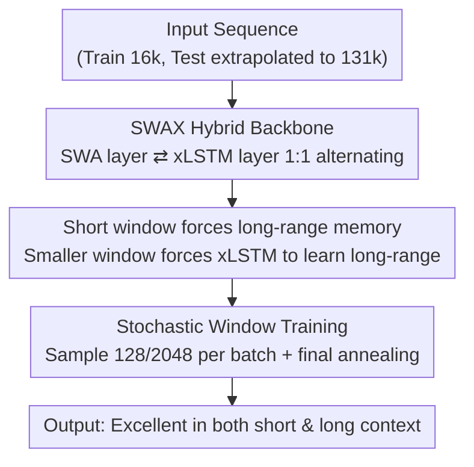

# Short Window Attention Enables Long-Term Memorization

**Conference**: ICLR 2026  
**OpenReview**: [https://openreview.net/forum?id=btgVfhudI1](https://openreview.net/forum?id=btgVfhudI1)  
**Code**: To be confirmed  
**Area**: LLM Efficiency / Long Context / Hybrid Architecture  
**Keywords**: Sliding Window Attention, xLSTM, Linear RNN, Hybrid Architecture, Long-context Memory

## TL;DR
This paper investigates the division of labor between short-term and long-term memory in SWAX, a hybrid architecture alternating Sliding Window Attention (SWA) and xLSTM linear RNNs. It uncovers a counter-intuitive finding: **the shorter the sliding window, the better the long-context retrieval** (as short windows compel the linear RNN to learn long-range dependencies). Based on this, it proposes stochastic window training (randomly switching between windows of 128 or 2048 per batch), enabling the model to achieve optimal results in both short-context and long-context tasks.

## Background & Motivation

**Background**: Modern LLMs rely on the KV Cache of softmax attention as working memory, providing strong long-context performance. However, the KV Cache expands linearly with sequence length, leading to uncontrollable computational and memory costs. Another path involves linear RNNs (SSMs, linear attention, xLSTM, etc.), which iteratively update a fixed-size hidden state. These offer constant computation and memory per token regardless of sequence length, but their recall accuracy has historically lagged behind Transformers. A recent mainstream compromise is the **hybrid architecture**, where most layers use constant-state components (SWA or linear attention) and a few layers retain global softmax attention.

**Limitations of Prior Work**: Hybrid architectures retaining global attention layers still suffer from $O(S)$ state and FLOP growth in those specific layers. Meanwhile, purely constant-state hybrid architectures (e.g., De et al. 2024, which combines linear attention and SWA) face an overlooked issue: **how to choose the sliding window length**. Existing works select window sizes based solely on validation perplexity (PPL), concluding that "longer is better" and treating the choice as a pure trade-off between performance and computation. Crucially, **the impact of window length on long-context retrieval has never been examined**.

**Key Challenge**: In SWA + linear RNN hybrid architectures, the "memory division of labor" between the two components is formed implicitly. If the SWA window is long enough, most dependencies during training fall within the window, allowing the model to "slack off"—it prioritizes the more precise local softmax attention and rarely trains the linear RNN to model long-range dependencies. Consequently, while PPL and short-context performance look promising, the model's long-context performance collapses once sequence lengths exceed the window size because it "never learned to rely on the linear RNN for long-range retrieval."

**Goal**: ① Systematically characterize the real impact of sliding window length on short and long-context tasks; ② Find a training method that preserves the short-context accuracy of long windows while gaining the long-context extrapolation capabilities of short windows.

**Core Idea**: Use **short windows (or even stochastically switched windows) as a form of "regularization"** to force the linear RNN layers to receive more supervisory signals for long-range dependencies, ensuring they specialize in modeling long-term memory rather than offloading all work to the local softmax attention.

## Method

### Overall Architecture

The subject of this study is **SWAX**—a hybrid architecture that stacks **Sliding Window Attention (SWA) layers** and **xLSTM (mLSTM matrix memory) layers** in a 1:1 alternating ratio. SWA layers use softmax attention with a fixed window $w$ to model local dependencies with high precision. xLSTM layers use fixed-size hidden states and a matrix memory $H_t$ to provide an infinite receptive field for long-range dependencies. Since both components have fixed states and constant computation per token, the model's overall costs do not scale with sequence length.

Beyond this backbone, the primary contribution lies in **how to train it**. The paper reveals the counter-intuitive "shorter window, better long-context" rule and then introduces **stochastic window training**. During training, each batch randomly uses either a short window (128) or a long window (2048), followed by a final annealing stage (sampling only the long window) to recover short-context precision. Testing is conducted uniformly with the long window (2048).

### Key Designs

**1. SWAX Backbone: Memory Division via Local Softmax and Global Linear Memory**

To address the dilemma of "poor linear RNN recall vs. computational explosion of softmax attention," SWAX alternates components that both have **fixed state sizes**. SWA layers reduce per-token complexity from $O(S)$ to $O(w)$. xLSTM (mLSTM units) maintains a matrix memory that operates via incremental updates: memory $H_t = \sum_t \phi(k_t) v_t^\top$ and readout $y_t = \phi(q_t)^\top H_t$. The computation is constant at $O(d_{qk}\times d_v)$ regardless of sequence length. xLSTM is selected for its scaling to 7B parameters, efficient Triton kernels, and superior performance of mLSTM over sLSTM on language tasks.

This division is effective because most information for next-token prediction comes from local dependencies. Pure linear models must exhaust most layers modeling local structure, leaving few for long-range tasks. In SWAX, local dependencies are routed to the precise SWA layers, allowing xLSTM layers to **specialize** in long-range modeling. Experiments replicate the counter-intuitive phenomenon from De et al. (2024): hybrid architectures, despite having fewer layers with global receptive fields, actually **outperform** pure SWA or pure xLSTM in long-context recall.

**2. Forcing Long-range Memory: Window Length Determines Supervision for Linear Layers**

This is the central finding. The authors trained SWAX with five fixed windows $\{128, 256, 512, 1024, 2048\}$ and discovered a pattern masked by the "longer is better" PPL consensus: **while a window of 2048 is best for PPL and short-context reasoning, it fails most drastically in long-context retrieval (RULER NIAH)**. At a length of 131k, short windows (128/256/512) retain ~30% NIAH recall, whereas the 2048 window drops to nearly 0%. Averaged across all lengths and NIAH subtasks, a window of 128 performed best, outperforming 2048 by 16 accuracy points (an 88.9% relative gain).

The Mechanism: With a 2048 window, almost all dependencies during training are local. The model optimizes by using local softmax rather than linear layers. Thus, it **never learns to perform long-range retrieval via xLSTM**, failing to extrapolate once dependencies exceed the window. Conversely, short windows force information through xLSTM, training long-term memory. This corrects the misconception that short windows are only for saving FLOPs; they are a vital source of supervision for linear long-term modeling.

**3. Stochastic Window Training + Annealing: Best of Both Worlds**

While short windows favor long context, they harm short-context reasoning—a window of 128 cannot even fit the prompt for many short tasks. To use a large window during inference (to maintain accuracy), the model must see a large window during training (to avoid catastrophic failure caused by RoPE extrapolation). The paper resolves this via **stochastic window training**: for each batch, there is a probability $p$ ($p=0.5$ for 1.4B, $p=0.75$ for 7B) to use a window of 128, otherwise using 2048. This prevents over-reliance on long SWA windows while maintaining the ability to use them. **Annealing** (fixed at 2048 for the final 10% of training) significantly boosts short-context performance without damaging long-context capabilities. Inference is performed with a 2048 window.

The authors equate this "stochastic reduction of window capacity" to **dropout for the attention mechanism**. Stochastic training yields short-context results comparable to or better than a fixed 2048 window and long-context results comparable to or better than a fixed 128 window.

## Key Experimental Results

Experiments focus on language modeling using 1.4B (24 layers, 2048 dim) and 7B (32 layers, 4096 dim) models. All were trained from scratch on 150B tokens with a 16k sequence length, with no long-context fine-tuning. Evaluation uses RULER's needle-in-a-haystack (NIAH) for long context and standard reasoning/commonsense/code benchmarks for short context.

### Main Results

Comparison of 1.4B SWAX with different fixed windows (from Table 1 + Figure 5/6):

| Configuration | Validation PPL ↓ | Short Context Avg ↑ | Long Context NIAH (@131k) |
| :--- | :--- | :--- | :--- |
| xLSTM (Pure linear) | 2.602 | 38.93 | Weak |
| SWAX:128 | 2.551 | 39.81 | ~30% (Best) |
| SWAX:512 | 2.546 | 40.69 | Good |
| SWAX:2048 | **2.523** | **40.88** | ~0% (Worst) |

A clear **Key Challenge** is visible: PPL and short-context scores improve with window length (2048 is best), but long-context recall is the opposite—128 is 16 points higher than 2048 on average NIAH.

Stochastic training aligns both ends (Table 2):

| Model | Train Window | Test Window | Short Context Avg ↑ | Long Context |
| :--- | :--- | :--- | :--- | :--- |
| SWAX 1.4B | 128 | 128 | 39.81 | Good |
| SWAX 1.4B | stochastic | 2048 | 40.81 | Comparable to 128 |
| SWAX 1.4B | 2048 | 2048 | 40.88 | Poor |
| SWAX 7B | stochastic | 2048 | 49.52 | Better than fixed 2048 |
| SWAX 7B | 2048 | 2048 | 49.32 | Poor |

Stochastic training achieved a lower validation PPL (2.502 for 1.4B) than any fixed window. Short-context scores matched or exceeded the 2048 baseline, while long-context scores reached the 128 baseline across both scales.

### Ablation Study

| Configuration | Key Phenomenon | Explanation |
| :--- | :--- | :--- |
| Train vs. Test window | Test window > Train window → Collapse | Naive window expansion with RoPE fails; large windows must be seen during training |
| Annealing (final 10% fixed 2048) | Short context significantly improves, long context remains | Teaches the model to utilize the large test window |
| Sampling probability $p$ | 0.5 for 1.4B, 0.75 for 7B | Controls the ratio of short-window supervision |
| Gated DeltaNet as Linear layer | Same pattern holds | Conclusion is not unique to xLSTM |
| local-global (SWA + Full attention) | Local layers should be small | Conclusions generalize to other hybrid types |

### Key Findings
- **Window length is a "long-range supervision" switch**: Shorter windows force more dependencies outside the window, compelling xLSTM to learn long-range modeling, which contradicts PPL-based conclusions.
- **Stochastic window ≈ Attention dropout**: Intermittently forcing short windows prevents over-reliance on SWA.
- **Transferability**: The findings hold when using Gated DeltaNet or local-global (SWA+Full Attention) architectures.
- On more realistic benchmarks (LongBench / LongBench2 / Babilong), stochastic training generally wins, though fixed 2048 is better in select cases, as these tasks are challenging for models of this size.

## Highlights & Insights
- **Redefining window size as a "memory division knob"**: While previously seen as a computational lever, this work proves window size dictates the amount of long-range supervision received by linear layers.
- **Counter-intuitive yet mechanistically clear**: Better PPL $\neq$ better long context. PPL measures local prediction, while long-range extrapolation depends on "forced" linear memory training.
- **Stochastic window as a one-line training trick**: No architectural changes or parameter overhead. Simply switching windows and annealing achieves the best of both worlds.

## Limitations & Future Work
- Primarily validated at 1.4B/7B scales with 150B tokens and 16k training length; consistency at larger scales or longer training remains to be confirmed.
- Stochastic training is not universally superior on real-world benchmarks like LongBench, indicating a gap between synthetic NIAH and complex long-form tasks.
- Empirical selection of hyper-parameters (probability $p$, annealing ratio, window values 128/2048); lacks an adaptive or theoretical selection criterion.
- Conclusions based on 1:1 inter-layer hybrid design; other ratios or intra-layer mixing are not fully explored.

## Related Work & Insights
- **vs. De et al. (2024)**: They mixed linear attention with SWA but relied on PPL to pick windows, concluding "longer is better." Ours highlights the missing long-context dimension and provides the opposite conclusion.
- **vs. Local-Global Hybrids**: Those still carry $O(S)$ overhead in global layers. SWAX uses only constant-state components. Our short-window findings also generalize to local-global architectures.
- **vs. Memory Mosaic (Zhang & Bottou, 2025)**: They used stochastic masks on long-term memory. Ours applies stochastic windows specifically to the **SWA layer** to weaken over-reliance on softmax attention for retrieval.

## Rating
- Novelty: ⭐⭐⭐⭐⭐ Reinterprets window size as a memory division tool with a clear counter-intuitive conclusion.
- Experimental Thoroughness: ⭐⭐⭐⭐ Covers multiple windows, scales, benchmarks, and architectures, though gap exists with massive scale.
- Writing Quality: ⭐⭐⭐⭐⭐ Mechanism is clearly articulated with solid, progressive argumentation.
- Value: ⭐⭐⭐⭐⭐ A simple, effective training trick with direct implications for efficient long-context architecture design.

<!-- RELATED:START -->

## Related Papers

- [\[ICLR 2026\] InfLLM-V2: Dense-Sparse Switchable Attention for Seamless Short-to-Long Adaptation](infllm-v2_dense-sparse_switchable_attention_for_seamless_short-to-long_adaptatio.md)
- [\[ICLR 2026\] Sparse Attention Adaptation for Long Reasoning](sparse_attention_adaptation_for_long_reasoning.md)
- [\[ICLR 2026\] Smooth Reading: Bridging the Gap of Recurrent LLM to Self-Attention LLM on Long-Context Understanding](smooth_reading_bridging_the_gap_of_recurrent_llm_to_self-attention_llm_on_long-c.md)
- [\[NeurIPS 2025\] Hardware-aligned Hierarchical Sparse Attention for Efficient Long-term Memory Access](../../NeurIPS2025/llm_efficiency/hardware-aligned_hierarchical_sparse_attention_for_efficient_long-term_memory_ac.md)
- [\[ICLR 2026\] Stacked From One: Multi-Scale Self-Injection for Context Window Extension](stacked_from_one_multi-scale_self-injection_for_context_window_extension.md)

<!-- RELATED:END -->
