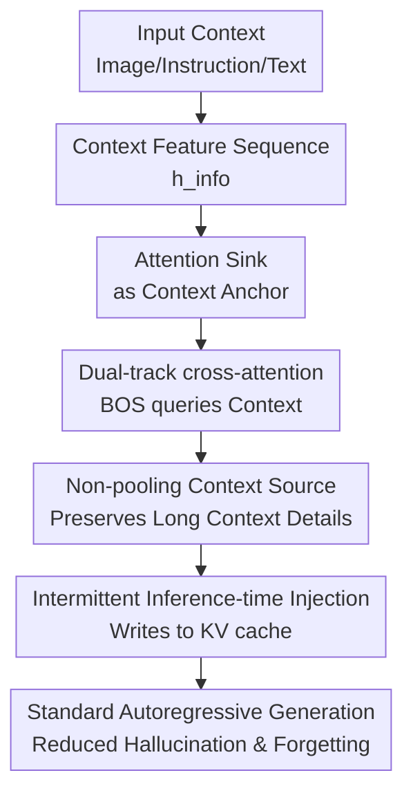

# SinkTrack: Attention Sink based Context Anchoring for Large Language Models

**Conference**: ICLR 2026  
**OpenReview**: [https://openreview.net/forum?id=Gg1aPETCL6](https://openreview.net/forum?id=Gg1aPETCL6)  
**Code**: TBD  
**Area**: LLM Efficiency  
**Keywords**: Attention Sink, Context Anchoring, Long Context Reasoning, Inference-time Intervention, Hallucination Mitigation

## TL;DR
SinkTrack transforms the naturally stable `<BOS>` attention sink in decoder-only LLMs into a context anchor. By utilizing training-free dual-track cross-attention to inject input context into `<BOS>` during the prefill stage, it mitigates hallucinations and long-context forgetting with almost zero additional decoding overhead.

## Background & Motivation
**Background**: Large Language Models (LLMs) and Multimodal Large Language Models (MLLMs) can handle complex tasks like QA, visual reasoning, and multi-turn dialogues. However, the generation process still relies on autoregressive decoding. As each new token is generated, the next attention step must face both the original input and the already generated content; in long answers, extended dialogues, or multimodal reasoning, the latter half of generation is easily led astray by recent tokens.

**Limitations of Prior Work**: This "drift towards recent content" during generation leads to two direct issues. First is hallucination, where models begin using internal priors to complete objects or facts not present in the input. Second is context forgetting, where the model forgets initial format constraints, problem conditions, or image details mid-way. A typical example in the paper involves describing a bus on a road as a plane in VQA, or deviating from a specific required answer format in text reasoning.

**Key Challenge**: The authors attribute the root cause to attention drift: initial input tokens often carry the most critical information, but the attention they receive continuously decays in the late stages of generation. Simultaneously, a contrary phenomenon exists in Transformers known as attention sink: the first token of a sequence, `<BOS>`, consistently receives high attention throughout generation despite its thin semantics. The problem becomes: Is it possible to use this naturally stable position to preserve context without forcibly rewriting the model's attention patterns?

**Goal**: SinkTrack attempts to solve three sub-problems. First, critical information from input images, instructions, or text context must be delivered to `<BOS>` so it is no longer just an empty placeholder. Second, information injection must not damage the original calculation path of the pre-trained model, which could lead to collapse. Finally, the injection process must be lightweight enough not to turn every decoding step into expensive additional inference.

**Key Insight**: The observation is direct: attention drift causes ordinary initial context to be forgotten, while the attention sink ensures `<BOS>` is always "seen." If key context is written into the representation of `<BOS>`, subsequent tokens will continue to retrieve a condensed and stable context clue through `<BOS>`, even if they no longer directly attend to the original input.

**Core Idea**: Utilize training-free dual-track cross-attention to transform `<BOS>` from a passive attention sink into an active context anchor, allowing the model to continuously "see" the initial context during standard autoregressive generation.

## Method
### Overall Architecture
SinkTrack is designed for decoder-only LLMs/MLLMs, requiring no parameter updates or additional training. In designated injection layers, it splits attention computation into two tracks: the `<BOS>` token acts independently as a query to cross-attend to input context features, while other tokens follow the original causal self-attention. The outputs of these two paths are concatenated back into a single sequence representation, and subsequent generation uses the anchor representation already written into the KV cache.

The authors did not arrive at the final structure immediately; they first performed two unsuccessful or partially successful explorations. "Hard injection" directly replaced the Value corresponding to `<BOS>` in the KV cache with the mean vector of the context, which caused model collapse. "Soft injection" used weighted fusion of the context mean vector and the `<BOS>` hidden state, which improved performance but relied on manual tuning of the injection intensity $\alpha$, while average pooling compressed long context into a noisy single vector. The final SinkTrack replaces static fusion with adaptive cross-attention and maintains the original self-attention path for ordinary tokens.

### Key Designs
**1. Attention Sink as Context Anchor: Transforming `<BOS>` from a placeholder to a high-information entry**

Traditionally, the semantics of `<BOS>` are weak, but it possesses a structural advantage: subsequent generated tokens stably assign it high attention. SinkTrack utilizes this phenomenon in reverse: rather than weakening the attention sink or forcing the model to redistribute attention, it writes input context information into the `<BOS>` representation. Thus, the position the model would naturally focus on now carries evidence from images, instructions, or text.

This design targets the time-scale issue of attention drift. While attention for original input tokens decreases as generation progresses, the attention for `<BOS>` acts as a stable channel. Once the Value/hidden representation of `<BOS>` is injected with context, subsequent tokens performing attention aggregation $O_t = \sum_{j=1}^{t} \alpha_{t,j} V_j$ can still retrieve encoded context from $V_{BOS}$, even as their direct weights on original inputs diminish.

**2. Dual-track Cross-attention: Modifying `<BOS>` information sources while preserving original flow for other tokens**

Hard replacement of the KV cache causes model collapse, indicating that pre-trained models are highly sensitive to internal calculation paths. The core correction in SinkTrack is splitting attention into two tracks: the first track processes only `<BOS>`, making its hidden state $H_0^{(l)}$ the query and the context features $h_{info}$ the key/value for cross-attention. The second track processes remaining tokens, which perform standard causal self-attention on the original sequence.

Mathematically, the injection track is defined as $\bar{H}_0^{(l)} = \mathrm{MHA}(Q=H_0^{(l)}, K=h_{info}, V=h_{info})$. This differs from soft injection $\bar{H}_0^{(l)} = \alpha H_0^{(l)} + (1-\alpha) f_{info}$ in that the former allows `<BOS>` to retrieve context based on its current layer state, whereas the latter merely blends in a static vector. After concatenating the outputs, the process continues through the model's original output projection and FFN, preserving positional relationships, causal masks, and the pre-trained attention hierarchy.

**3. Non-pooling Context Source: Avoiding compression of long context into a single noisy vector**

Early hard and soft injection methods used mean pooling to compress image features or text prompts into a single vector $f_{info} \in \mathbb{R}^d$. While workable for short inputs, this showed diminishing returns on tasks like the long-dialogue QuAC: as context grows, a single mean vector struggles to retain local facts, historical questions, and current constraints simultaneously.

SinkTrack's cross-attention does not require equal query and key/value lengths, so the authors removed lossy pooling and used the complete context feature sequence as $K, V$. This allows `<BOS>` to form more targeted queries across different injection layers: early layers might capture global semantics, while later layers select more relevant context segments based on the already enhanced `<BOS>` representation.

**4. Intermittent Inference-time Injection: Limiting enhancement to the prefill side to avoid slowing the decoding loop**

The goal is not a framework requiring repeated external calls but a lightweight internal intervention. The paper adopts an intermittent strategy, injecting every 5 layers; experiments showed that injecting every layer was worse, likely due to excessive interference with the model's representation evolution. Intermittent injection provides enough opportunities for `<BOS>` to absorb context without overriding every attention layer.

Crucially, injection occurs during the prefill/context encoding stage before generation. The enhanced `<BOS>` representation enters the KV cache, and subsequent autoregressive generation follows standard decoding. Latency tests in the appendix support this: prefill for Llama3.1-8B increased from 35.90 ms to only 36.66 ms, an extremely small overhead.

### Loss & Training
SinkTrack requires no training loss and does not update model parameters. It is an inference-time enhancement: given original hidden states $h_{ori}$ and external context hidden states $h_{info}$, it performs hybrid attention in layers meeting injection criteria and reverts to standard causal attention otherwise.

There are three key hyperparameters/rules: the injection layer positions (every 5 layers in the main experiment), the context source (final version uses unpooled $h_{info}$), and the target (cross-attention only for the query of the first token). Since no fine-tuning is required, it avoids catastrophic forgetting and task specialization, though its effectiveness depends on whether the underlying model possesses a stable attention sink pattern.

## Key Experimental Results
### Main Results
Evaluations were conducted on four multimodal and two text datasets. Multimodal tasks include RealWorldQA, MMStar, M3CoT, and POPE; text tasks include QuAC and SQuAD 2.0. Base models include Qwen2.5-VL, Gemma3, MiniCPM3, Qwen2.5, and Llama3.1 (3B to 12B). Baselines are mainly Direct and CoT.

| Scenario | Model / Dataset | Direct Acc | CoT Acc | SinkTrack Acc | Key Note |
| :--- | :--- | :--- | :--- | :--- | :--- |
| Multimodal Avg | Qwen2.5-VL-3B, 4 sets | 35.68 | 39.05 | 55.37 | Most obvious gains on small models. |
| Multimodal Reasoning | Qwen2.5-VL-7B, M3CoT | 39.20 | 44.11 | 66.94 | +22.83% over CoT; massive gains in multi-hop VQA. |
| Hallucination Det. | Qwen2.5-VL-7B, POPE | 78.21 | 83.65 | 85.47 | Acc and Macro-F1 both improved. |
| Text Long Context | Llama3.1-8B, QuAC | 52.45 | 46.95 | 53.51 | CoT hurts performance here; SinkTrack leads. |
| Unanswerable QA | Llama3.1-8B, SQuAD2.0 | 78.69 | 58.19 | 79.83 | Improvement corresponds to +21.6% relative to CoT. |

### Ablation Study
| Configuration | Dataset / Model | Key Metric | Description |
| :--- | :--- | :--- | :--- |
| CoT baseline | M3CoT / Qwen2.5-VL-7B | 43.83 Acc | "Let's think step by step" without internal intervention. |
| Soft Inj: Every Layer | M3CoT / Qwen2.5-VL-7B | 51.02 Acc | Better than CoT, but frequent injection disrupts flow. |
| Soft Inj: Every 5 Layers | M3CoT / Qwen2.5-VL-7B | 60.04 Acc | Intermittent is significantly better than every layer. |
| Soft Inj: Inc. Intensity | M3CoT / Qwen2.5-VL-7B | 59.87 Acc | Stronger late-stage injection shows no advantage. |
| Soft Inj: Dec. Intensity | M3CoT / Qwen2.5-VL-7B | 60.69 Acc | Stronger early anchoring is slightly better. |
| Pooling SinkTrack | QuAC (Segmented) | Diminishing returns | Pooling causes bottlenecks as context grows. |
| SinkTrack (Non-pool) | QuAC (Segmented) | Stable gains | Full sequence $K, V$ mitigates information loss. |

### Key Findings
- SinkTrack's benefits are consistent across multimodal and text tasks, various model families, and scales from 3B to 12B.
- CoT is not always beneficial. For long-context understanding and non-reasoning QA, generating long explanations exacerbates attention drift; SinkTrack anchors context at the representation level.
- Hard injection causes collapse; soft injection proves the anchor concept; final dual-track cross-attention provides necessary adaptivity.
- Mechanism analysis shows SinkTrack does not significantly alter `<BOS>` attention rankings (Spearman correlation $\rho=0.9985$), suggesting it increases information content within a stable channel rather than disrupting the structure.

## Highlights & Insights
- The most clever aspect of SinkTrack is treating the attention sink not as an anomaly to be fixed, but as an information channel.
- The methodological evolution—from hard to soft to dual-track—clearly explains the motivation: balancing context retrieval with the preservation of pre-trained calculation paths.
- It suggests that context compression doesn't always require external retrieval; one can leverage stable internal high-attention sites.
- It highlights that CoT failure is sometimes not due to lack of reasoning but due to "losing the prompt" during long generation.

## Limitations & Future Work
- Anchoring massive context to a single `<BOS>` token faces a capacity bottleneck in fixed dimensions. Very long context might require distributed or dynamic anchors.
- Evaluations are primarily on public benchmarks (QA/VQA); performance on complex workflows like code generation or tool use remains to be seen.
- Reliance on stable attention sinks in decoder-only models: while common, the strength of the sink varies with architectures and position embeddings.

## Related Work & Insights
- **vs Attention Sink / StreamingLLM**: While others use sinks for efficient KV cache management, SinkTrack uses them to reduce hallucination and forgetting.
- **vs Attention Calibration**: Calibration adjusts attention weights; SinkTrack enhances the value/representation of the sink position, utilizing existing weight patterns.
- **vs RAG**: RAG retrieves missing knowledge; SinkTrack ensures the model doesn't forget the knowledge it already has during generation. They are complementary.

## Rating
- Novelty: ⭐⭐⭐⭐⭐ Turning a passive phenomenon into an active anchor is a simple yet distinctive perspective.
- Experimental Thoroughness: ⭐⭐⭐⭐ Broad coverage across models and tasks, though real-world complex workflows could be explored further.
- Writing Quality: ⭐⭐⭐⭐ Clear design evolution and logic.
- Value: ⭐⭐⭐⭐⭐ Training-free, low overhead, and plug-and-play for reliability and hallucination mitigation.

<!-- RELATED:START -->

## Related Papers

- [\[ICLR 2026\] UltraLLaDA: Scaling the Context Length to 128K for Diffusion Large Language Models](ultrallada_scaling_the_context_length_to_128k_for_diffusion_large_language_model.md)
- [\[ICLR 2026\] SparseD: Sparse Attention for Diffusion Language Models](sparsed_sparse_attention_for_diffusion_language_models.md)
- [\[ACL 2026\] 阈值差分注意力：无 Sink、超稀疏且非分散的长上下文注意力](../../ACL2026/llm_efficiency/threshold_differential_attention_for_sink-free_ultra-sparse_and_non-dispersive_l.md)
- [\[ICLR 2026\] DND: Boosting Large Language Models with Dynamic Nested Depth](dnd_boosting_large_language_models_with_dynamic_nested_depth.md)
- [\[ICLR 2026\] KnowProxy: Adapting Large Language Models by Knowledge-guided Proxy](knowproxy_adapting_large_language_models_by_knowledge-guided_proxy.md)

<!-- RELATED:END -->
