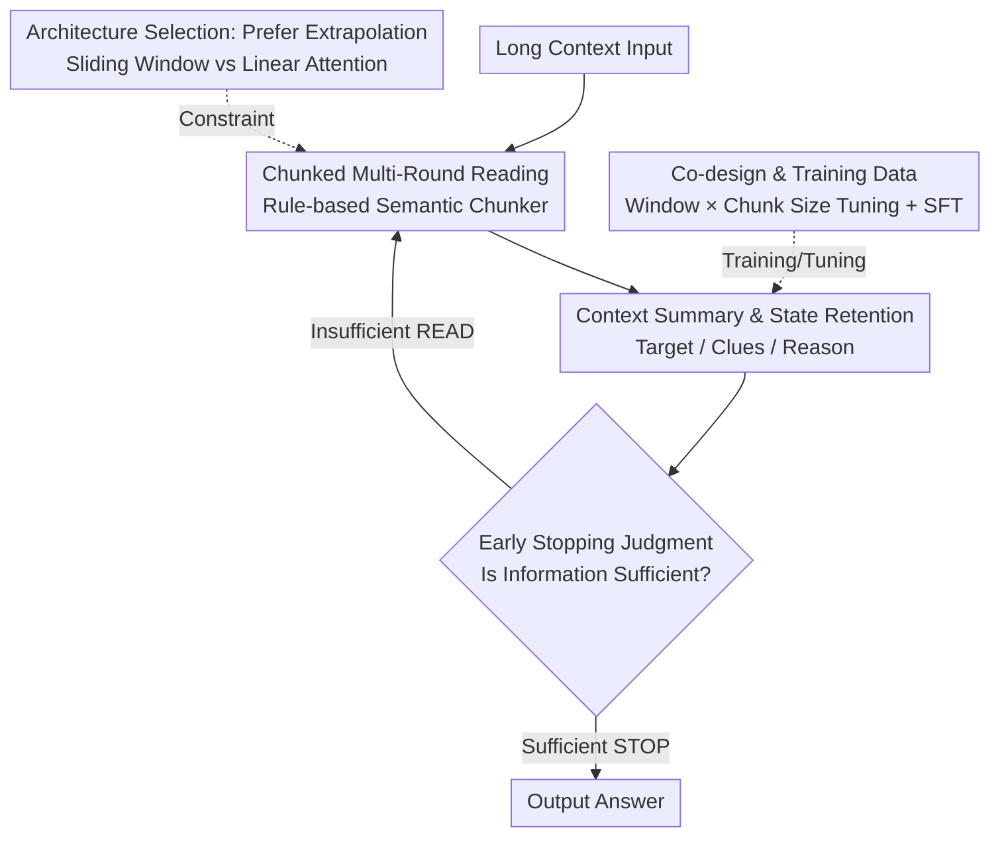

# Smooth Reading: Bridging the Gap of Recurrent LLM to Self-Attention LLM on Long-Context Understanding

**Conference**: ICLR 2026  
**OpenReview**: [https://openreview.net/forum?id=GoaWSQWtOE](https://openreview.net/forum?id=GoaWSQWtOE)  
**Code**: To be confirmed  
**Area**: LLM Efficiency  
**Keywords**: Recurrent LLM, Long Context, Multi-round Inference, Architecture-Inference Co-design, Sliding Window Attention

## TL;DR
Addressing the performance gap where recurrent LLMs (linear complexity with fixed memory) underperform self-attention LLMs on long-context tasks, this paper proposes Smooth Reading. It transforms the "single-pass reading" of the entire context into an "End-to-End Multi-Round (EMR)" inference paradigm—involving chunk-based processing, summarizing-while-reading, and cross-round hidden state accumulation. Furthermore, it identifies that this inference paradigm favors sliding window architectures with strong length extrapolation. Ultimately, this approach improves recurrent models on LongBench from 5.68% behind self-attention to 3.61% ahead, while maintaining a 2.5× training and 2× inference efficiency advantage.

## Background & Motivation
**Background**: Self-attention LLMs demonstrate strong performance in long-context understanding due to global attention over all historical tokens. However, their computational cost grows as $O(L^2)$ and memory usage as $O(L)$ relative to the input length $L$, leading to uncontrollable costs in long-context scenarios. Recurrent LLMs (linear attention, sliding window, etc.) maintain $O(1)$ memory with fixed hidden states and $O(L)$ computation, serving as scalable alternatives that have already matched self-attention in short-context dialogues and long CoT reasoning.

**Limitations of Prior Work**: Recurrent LLMs significantly lag behind specifically in "long-input understanding" tasks. The paper categorizes LLM use cases into three types: short dialogue, long CoT output, and long-input understanding. Recurrent models fall behind in the third category, which is a critical bottleneck for their adoption.

**Key Challenge**: Previous work focused on modifying architectures or expanding memory (stronger state update rules, larger state sizes), but architectural improvements alone have failed to close the gap. This paper argues the root cause is not memory size, but the **mismatch between architecture and inference method**: traditional One-Round (OR) inference requires the model to compress the entire context into a fixed hidden state in a single forward pass. For memory-constrained recurrent models, this causes "memory overwhelm," leading to performance collapse.

**Goal**: Instead of obsessing over increasing memory size, the goal is to change the inference paradigm. By allowing recurrent models to "digest" long text in chunks at their own pace, the limitations of fixed memory can be bypassed.

**Key Insight**: The hidden states of recurrent models are fixed-size and can be preserved and updated across steps. This naturally fits a "chunked iteration and gradual compression" reading approach. By feeding small segments, generating summaries, and updating hidden states, information is compressed into a local working window to avoid memory overload. Meanwhile, linear complexity ensures that the overhead of multi-round processing remains manageable.

**Core Idea**: Replace "single-pass" One-Round (OR) inference with End-to-End Multi-Round (EMR) inference—featuring "chunked multi-round reading, summarizing-while-reading, and cross-round state accumulation"—and co-design the architecture with this inference method to make recurrent LLMs both fast and accurate on long contexts.

## Method

### Overall Architecture
Smooth Reading is a **co-design of recurrent architecture and inference method**, centered on EMR tailored for recurrent LLMs. The framework processes long context by partitioning it into semantically coherent chunks, mimicking human "segment-by-segment" intensive reading. For each chunk, the model produces a structured context summary, updates the fixed-size hidden state, and determines if the current information is sufficient. Once sufficient, it outputs the answer. This avoids overwhelming the fixed memory with excessive new information at once. Since the hidden state is preserved and accumulated across rounds, the model avoids the information loss typical of "discarding states and re-feeding compressed context."

The process follows an agent-like loop with `<READ>`/`<STOP>` actions: Input is partitioned by a chunker → read current chunk → generate context summary and update hidden state → early stopping decision (return to read the next chunk or output the answer). This behavior is **trained into the model** via a supervised fine-tuning (SFT) dataset containing 48,856 entries.

### Key Designs

**1. Chunked Multi-Round Reading (EMR): Replacing "One-Shot" with "Segmented Reading"**

This addresses the "memory overwhelm" issue of OR inference. EMR partitions long inputs into segments of limited size and sequential coherence. In each step, the model issues a `<READ>` action to process one small chunk, introducing only a limited amount of new information. This reduces overflow risk and forces the model to focus on currently salient content. The chunking uses a lightweight, rule-driven hierarchical system based on a priority list of delimiters (e.g., `\n\n\n`, `\n\n`, `\n`, `. `, etc.). To avoid excessive tokenization overhead, chunk length is estimated using $n_{token} \approx \mathrm{Int}(1.5 \times n_{words})$.

The efficiency is maintained because the recurrent model's computation under EMR is $O(\lambda L)$ and memory remains $O(1)$ (where $\lambda>1$ is the context amplification factor from multiple rounds), which is far lower than the $O(L^2)$ computation and $O(L)$ memory of self-attention in OR.

**2. Context Summary and State Retention: Structured Summaries Driving Hidden State Accumulation**

Reading chunks isn't enough; the model must distill useful information. After each chunk, the model produces a **context summary**, expressing key content with fewer tokens and using it to update the hidden state. The summary follows a fixed three-part structure: **Target** (task goal, to prevent distraction), **Clues** (salient information related to the solution), and **Reason** (short justification for the updated clues).

The critical difference is **cross-round hidden state retention**. While Non-End-to-End Multi-Round (NMR) methods in self-attention discard hidden states and re-feed compressed segments (causing information loss), recurrent LLMs preserve and incrementally update their fixed-size hidden states. This allows the accumulation of both recent and long-range information without additional memory cost. The **early stopping mechanism** allows the model to self-evaluate information sufficiency after each chunk and output the answer immediately via `<STOP>`, further saving computation.

**3. Architecture Selection: EMR Prefers "Length Extrapolation" over "Large Single-Pass Memory"**

A counter-intuitive insight of this work is that changing the inference method changes the optimal architectural attributes. OR inference requires all information to reside in memory simultaneously, favoring architectures with the **maximum effective memory**. EMR relies on "dynamic compression + chunked reading," needing to fit only one chunk at a time. This shifts the focus from "raw memory capacity" to "length generalization" beyond the training length. Between two typical recurrent architectures: Linear Attention (e.g., RWKV-7) provides larger effective memory in OR but suffers from poor extrapolation; Sliding Window Attention (SWA) can only remember content within its window (e.g., 4k) but is robust in extrapolation. Consequently, **SWA architectures are more suitable for Smooth Reading**, especially on extremely long sequences.

**4. Co-design and Training Data: Window × Chunk Size Tuning**

Efficiency is determined by the combination of architecture and inference. Given prefill/decoding wall-clock times $p(s)$ and $d(s)$, chunk size $c$, number of chunks $n$, and $L=c\times n$, with average decoding length $g$, the total inference time is:

$$T_{\text{Recurrent-EMR}} = n \cdot c \cdot p(s) + n \cdot g \cdot d(s) = L\left(p(s) + \frac{g}{c}d(s)\right).$$

For fixed $s, c, g$, $T$ grows **linearly** with $L$. Increasing chunk size $c$ reduces rounds and decoding steps, but a larger $c$ requires a larger effective memory (window) to accommodate it; otherwise, performance collapses. Optimal efficiency requires **joint tuning of window size and chunk size**.

To internalize this behavior, an SFT dataset was built by collecting raw data and using a SOTA LLM (DeepSeek-V3) to generate step-by-step summaries, `<READ>`/`<STOP>` actions, and final answers, with chunk sizes varied between 128–4096 to ensure robustness.

## Key Experimental Results

### Main Results
Evaluated on LongBench, Needle-in-a-Haystack (NIAH), RULER, and HELMET. Baselines include Qwen-2.5-3B and recurrent variants SWA-3B-4k and RWKV-7-3B.

LongBench Average Score (Higher is better):

| Architecture × Inference | Model | LongBench Avg |
|--------|------|------|
| Self-Attention + OR | Qwen-2.5-3B-OR | 47.38 |
| Self-Attention + NMR | Qwen-2.5-3B-NMR | 48.37 |
| Recurrent + OR | RWKV-7-3B-OR | 41.43 |
| Recurrent + OR | SWA-3B-4k-OR | 41.70 |
| Recurrent + EMR | RWKV-7-3B-EMR | 48.03 |
| **Recurrent + EMR (Ours)** | **SWA-3B-4k-EMR** | **50.99** |

Key Point: Recurrent models in OR lag behind self-attention by ~5.68 points (41.70 vs 47.38). With EMR, SWA-3B-4k-EMR reaches 50.99, surpassing Qwen-2.5-3B-OR by **3.61 points** and self-attention NMR by 2.62 points. This proves state-retaining EMR is superior to state-discarding NMR.

NIAH Length Extrapolation (Trained at 32k, tested up to 256k):

| Model | 8k–32k Avg | 64k | 128k | 256k |
|------|------|------|------|------|
| Qwen-2.5-3B-OR | 98.13 | 98.00 | 26.00 | 0.00 |
| SWA-3B-4k-OR | 29.20 | 6.80 | 1.80 | 1.60 |
| **SWA-3B-4k-EMR** | **99.93** | **100.00** | **99.80** | **99.60** |

SWA-3B-4k-EMR maintains 99.60% accuracy at 256k, demonstrating the synergy of a "weak-memory architecture + strong-extrapolation inference."

### Ablation Study
Joint effect of window size $W$ and chunk size $C$ on NIAH accuracy (%):

| Config | Accuracy | Description |
|------|---------|------|
| $W$=512, $C$=512 | 97.0 | Chunk ≤ Window, normal |
| $W$=512, $C$=4096 | 0.0 | Chunk ≫ Window → Collapse |
| $W$=4096, $C$=2048 | 100.0 | Sufficient window size |

Efficiency: With $W$=4096, increasing $C$ from 512 to 4096 reduced total time from 646s to 366s. Larger chunks reduce rounds but require $W \geq C$.

### Key Findings
- **Crucial Module is EMR + State Retention**: Replacing OR with EMR boosted the recurrent model's LongBench score from 41.70 to 50.99. EMR significantly outperformed NMR, highlighting "cross-round memory accumulation" as the core gain.
- **Architecture-Inference Synergy**: OR favors RWKV's memory, while EMR favors SWA's extrapolation.
- **Efficiency Gains Scale with Length**: At 64k, SWA-3B-4k-EMR is 2.5× faster in training and 2× faster in inference than Qwen-2.5-3B-OR, reaching 4× with early stopping without loss of accuracy.

## Highlights & Insights
- **Inference as a First-Class Citizen**: While most research focus on architecture, this paper proves inference methods are equally critical. A weak architecture (SWA) with the right method (EMR) can beat a strong baseline.
- **Hidden State Retention as a Recurrent Dividend**: Self-attention multi-round methods either discard states (NMR) or suffer $O((\lambda L)^2)$ complexity (EMR). Recurrent models can accumulate hidden states cross-round at $O(1)$ memory—a structural advantage often overlooked.
- **Structured Summaries (Target/Clues/Reason) are Transferable**: This template converts CoT-style retrieval into an explicit process, applicable to any agent/RAG workflow.
- **Operational Co-design Principles**: The formula $T=L(p(s)+\frac{g}{c}d(s))$ turns hyperparameter tuning from trial-and-error into a derivation of optimal efficiency.

## Limitations & Future Work
- **Reliance on SFT**: The summarizing and early-stopping behaviors must be trained into the model and are not plug-and-play.
- **Fragility of Rule-based Chunking**: Hierarchical delimiters may fail on structured text (code, tables) or continuous text without clear breaks.
- **Architecture Conclusions may be Task-dependent**: SWA's superiority over RWKV was established on standard benchmarks; different tasks might still favor large raw memory.
- **Limited Scale**: Experiments were primarily at the 3B level; verification on larger models (e.g., 70B) is needed.

## Related Work & Insights
- **vs. Architecture Scaling (RWKV-7, Linear Attention)**: These aim to "build a bigger memory" for OR inference. This work suggests keeping memory small and changing the "reading" protocol.
- **vs. Self-Attention NMR (Prompt Compression)**: NMR discards states for $O(1)$ memory at the cost of information. EMR preserves states, outperforming NMR by 2.62 points on LongBench.
- **vs. OPRM**: While OPRM uses RAG to mitigate memory overflow, it lacks the systematic co-design and architectural study presented in this work.

## Rating
- Novelty: ⭐⭐⭐⭐⭐ 
- Experimental Thoroughness: ⭐⭐⭐⭐ 
- Writing Quality: ⭐⭐⭐⭐⭐ 
- Value: ⭐⭐⭐⭐⭐ 

<!-- RELATED:START -->

## Related Papers

- [\[ICLR 2026\] DiSRouter: Distributed Self-Routing for LLM Selections](disrouter_distributed_self-routing_for_llm_selections.md)
- [\[ICLR 2026\] Cartridges: Lightweight and General-Purpose Long Context Representations via Self-Study](cartridges_lightweight_and_general-purpose_long_context_representations_via_self.md)
- [\[ICLR 2026\] MemAgent: Reshaping Long-Context LLM with Multi-Conv RL-based Memory Agent](memagent_reshaping_long-context_llm_with_multi-conv_rl-based_memory_agent.md)
- [\[ICLR 2026\] Understanding and Improving Length Generalization in Hierarchical Sparse Attention Models](understanding_and_improving_length_generalization_in_hierarchical_sparse_attenti.md)
- [\[ICLR 2026\] AutoSP: Unlocking Long-Context LLM Training Via Compiler-Based Sequence Parallelism](autosp_unlocking_long-context_llm_training_via_compiler-based_sequence_paralleli.md)

<!-- RELATED:END -->
