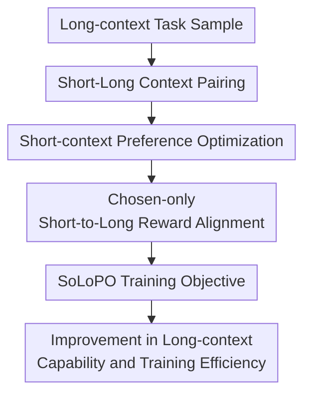

# SoLoPO: Unlocking Long-Context Capabilities in LLMs via Short-to-Long Preference Optimization

**Conference**: ICLR2026  
**OpenReview**: [https://openreview.net/forum?id=iiBjaiikJG](https://openreview.net/forum?id=iiBjaiikJG)  
**Code**: https://github.com/shs910/SoLoPO  
**Area**: LLM Efficiency  
**Keywords**: Long-context alignment, preference optimization, short-to-long transfer, training efficiency, reward alignment  

## TL;DR
SoLoPO decomposes long-context preference optimization into "preference learning on short contexts" and "short-to-long reward consistency." By using shorter and cleaner data to activate the LLM's long-context localization and reasoning capabilities, it significantly reduces the time and memory pressure of long-sequence training.

## Background & Motivation
**Background**: Many LLMs have extended their nominal context windows to 32K, 128K, or even longer. However, a long window does not equate to the stable utilization of long documents. Real-world long-context tasks often require the model to first localize task-relevant evidence within a large amount of irrelevant text and then answer questions, extract information, or complete reasoning based on that evidence. Current mainstream approaches generally follow two routes: one involves direct long-context SFT or preference optimization using long inputs, while the other involves synthesizing long-dependency data first and then aligning the model using preference optimization algorithms such as DPO, SimPO, or ORPO.

**Limitations of Prior Work**: Direct long-context preference optimization is very costly. First, constructing long-text data is unreliable; the longer the text, the harder it is to sample high-quality preference pairs, and model outputs are more prone to unstable errors due to irrelevant interference. Second, during training, each preference sample typically involves processing two long sequences (chosen and rejected), where attention computation grows approximately quadratically with length, consuming significant memory and time. Finally, the standard PO objective only widens the gap between good and bad answers under the same context, without explicitly telling the model "which content in the long input is equivalent to the key information in the short input."

**Key Challenge**: Long-context capability is not a single ability. A model must be able to both localize task-relevant segments in long text and utilize these segments for answering or reasoning. Traditional long PO conflates these two tasks into a single long-input preference loss, which is both inefficient and allows irrelevant context to interfere with preference discrimination. Conversely, training purely on short text lacks the constraints to transfer short-context capabilities to long-context scenarios.

**Goal**: The authors aim to construct a general framework that enables existing preference optimization algorithms like DPO, SimPO, and ORPO to serve long-context alignment more efficiently. Specifically, it aims to reduce the difficulty of preference data sampling, decrease the number of long-text forward passes during training, and maintain or even enhance model performance on real long-context QA, retrieval-based reasoning, and ultra-long input generalization.

**Key Insight**: This paper starts from the "redundancy hypothesis": many long-context tasks do not require the entire document; what truly determines the answer is the task-relevant segment $c_{rel}$, while the rest $c_{irr}$ is mostly interference. If a short context $x_{short}=[c_{rel}; I]$ and a long context $x_{long}=[c_{rel}, c_{irr}; I]$ contain the same task-critical information, then an ideal model should provide consistent reward judgments for the same good answer $y$ under both input conditions.

**Core Idea**: Construct and optimize preference pairs using short contexts, and then transfer short-context capabilities to long-context scenarios using Short-to-Long Reward Alignment (SoLo-RA), thereby decoupling "finding evidence in long text" from "answering based on evidence."

## Method
### Overall Architecture
The input to SoLoPO is not a single long text but a triplet of information: a compressed short context $x_{short}$, a long context $x_{long}$ containing the same task-relevant information mixed with irrelevant documents, and a preference answer pair $(y_w, y_l)$ sampled based on the short context. During training, the model first performs standard preference optimization on $x_{short}$ to learn how to distinguish good and bad answers using clean evidence; then, it applies a short-to-long reward consistency constraint only to the chosen answer $y_w$, ensuring the model provides a similar reward for the same good answer when presented with $x_{long}$.

The key to this process is not merely "replacing long data with short data" but explicitly retaining the short-to-long correspondence: the short context handles high-quality preference learning, while the long context only appears in the reward alignment term, thereby compressing expensive long-text computation to the necessary minimum.

### Key Designs
**1. Short-Long Context Pairing: Converting Long Text Redundancy into Trainable Equivalent Inputs**

SoLoPO first formulates a long-context task as $x_{long}=[c_{rel}, c_{irr}; I]$, where $I$ is the task instruction, $c_{rel}$ is the evidence actually needed to answer the question, and $c_{irr}$ is the irrelevant content mixed in. The corresponding short context is $x_{short}=[c_{rel}; I]$. This step captures the essence of many long-context QA and information extraction tasks: the text is long, but the effective information density is low; model failure is often not due to an inability to answer, but an inability to find the correct evidence amidst the interference.

The authors use the compression ratio $\rho$ to describe the information ratio between short and long inputs. For tasks like QA, information extraction, and multi-document reasoning, usually $\rho < 100\%$, so the short context is significantly shorter than the long context. For tasks like long-document translation where the entire text is relevant, $\rho = 100\%$, and SoLoPO degrades to standard PO, losing its efficiency advantage. This setting clarifies the boundary of the method: it is most suitable for scenarios where "key evidence can be localized within a long input," rather than scenarios where every token is equally important.

**2. Short-context Preference Optimization: Learning to Answer with Evidence on Low-noise Inputs**

Standard long PO compares $y_w$ and $y_l$ directly on $x_{long}$, where preference discrimination can be affected by irrelevant context. SoLoPO instead samples and optimizes preference pairs on $x_{short}$ because the short context retains task-relevant information while removing significant interference, making it easier for the model to generate and distinguish high-quality answers. The theoretical analysis in the paper is also based on an intuitive hypothesis: given the same task-relevant information, distinguishing $y_w \succ y_l$ given a short context is no harder than given a long context, i.e., $p(y_w \succ y_l \mid x_{long}) \le p(y_w \succ y_l \mid x_{short})$.

From a unified GPO perspective, standard preference optimization can be written as a convex loss regarding the reward difference $r_\phi(x,y_w)-r_\phi(x,y_l)$. SoLoPO proves that the upper bound of the long-context preference loss can be controlled by two parts: a preference loss on $x_{short}$ and the reward distance for the same answer under $x_{short}$ and $x_{long}$. Thus, short-context PO is not just a heuristic alternative to save compute, but corresponds to the "evidence utilization/reasoning" part of the long PO upper bound.

**3. Chosen-only Short-to-Long Reward Alignment: Migrating Only Good Answers to Long Contexts**

Short-context PO only guarantees the model can make choices given clean evidence; a mechanism is needed to bridge this capability to long inputs. SoLo-RA does this directly: for the same chosen answer $y_w$, it ensures the rewards given by the model under $x_{short}$ and $x_{long}$ conditions are as consistent as possible by penalizing $|r_\phi(x_{short}, y_w)-r_\phi(x_{long}, y_w)|$. If the model can also give the good answer a high reward under long input, it implies it must localize task-relevant information equivalent to the short context from the long document.

The paper adopts a chosen-only version instead of aligning both chosen and rejected answers. The reason is practical: rejected answers might inherently be outputs like "I don't know" or "No answer" that do not utilize evidence. Forcing such bad answers to align with the long context might increase their probability under long inputs, harming long-context capabilities. Chosen-only SoLo-RA only maintains consistency for good answers across short and long inputs, reducing one long-text forward pass for the rejected sample and avoiding the transfer of bad patterns to long-context scenarios.

**4. General PO Interface: Embedding SoLoPO into DPO, SimPO, and ORPO**

SoLoPO is not an objective hard-coded only for DPO, but a wrapper of "short-context original PO loss + short-long reward distance" that can be applied to different preference optimization algorithms. For DPO, the reward is viewed as $\beta\log \frac{\pi_\theta(y|x)}{\pi_{ref}(y|x)}$; for SimPO, it is $\frac{\beta}{|y|}\log\pi_\theta(y|x)$ normalized by answer length; for ORPO, the odds ratio style $\log\frac{\pi_\theta(y|x)}{1-\pi_\theta(y|x)}$ is used. The short-context PO part follows the original algorithm, and the SoLo-RA part is replaced with the corresponding algorithm's reward distance.

This design makes the contribution of SoLoPO more of a "long-context preference optimization framework" rather than a single loss function. As long as a PO algorithm can define a suitable convex function $f(\cdot)$ and a corresponding upper bound function $s(\cdot)$, a short-to-long reward alignment term can theoretically be constructed. The paper verifies this across DPO, SimPO, and ORPO, explaining why SoLoPO consistently brings gains across different preference optimization paradigms.

### A Complete Example
Suppose a training sample comes from MuSiQue multi-hop QA: The question asks, "In what year was the college that owns a certain school newspaper founded?". The short context $x_{short}$ contains only two pieces of supporting evidence: one stating the newspaper belongs to Houston Baptist University, and the other stating the university was founded in 1960. The long context $x_{long}$ mixes these two pieces of evidence into several irrelevant documents, extending the length from about 1K tokens to about 8K tokens.

During data construction, the model first samples 32 CoT answers based on $x_{short}$. If an answer provides 1960 by following the chain "newspaper's institution → institution's founding year," it is selected as $y_w$; if another answer says "the text does not give a founding date" or the reasoning chain breaks, it is selected as $y_l$. Short-context PO teaches the model to prefer $y_w$ over $y_l$ on clean evidence.

Subsequently, SoLo-RA calculates rewards for $y_w$ under both $x_{short}$ and $x_{long}$. If the model fails to give $y_w$ a high reward in the long context due to too many interfering documents, the reward distance increases, pushing the training to re-localize those two pieces of key evidence within the long text. Thus, what the model learns is not just to memorize the answer to MuSiQue, but to "find evidence in a long context equivalent to the short context and execute the same reasoning."

### Loss & Training
The general objective of SoLoPO can be summarized as the sum of two terms:

$$
L_{SoLoPO}=L_{PO}(x_{short}, y_w, y_l)+\alpha\,s(|r_\phi(x_{short},y_w)-r_\phi(x_{long},y_w)|).
$$

The first term is the original preference optimization algorithm's loss on the short context, and the second term is the chosen-only SoLo-RA, where $\alpha$ controls the strength of reward alignment. On Qwen2.5-7B, the paper sets the optimal $\alpha=3$ for SoLo-DPO and $\alpha=1$ for SoLo-SimPO and SoLo-ORPO; on Llama3.1-8B, SoLo-ORPO is better suited with $\alpha=4$. These values are hyperparameters that need to be adjusted based on the algorithm and base model.

Regarding data construction, the authors synthesize short and long contexts using the MuSiQue training set and the RULER method: short contexts average around 1.1K tokens, and long contexts average around 7.5K tokens. For each short context, 32 CoT outputs are sampled at a temperature of 0.85, then chosen/rejected pairs are selected based on the sub-EM metric against gold answers, resulting in 5,000 training samples. The training implementation is based on LLaMAFactory, FlashAttention 2, DeepSpeed ZeRO stage 3, and bf16, using main models including Qwen2.5-7B-Instruct and Llama3.1-8B-Instruct.

Efficiency comes from changes in the forward pass structure. Standard PO requires processing two long sequences, $(y_w,x_{long})$ and $(y_l,x_{long})$. SoLoPO processes chosen/rejected pairs on short contexts and only the chosen answer on long contexts. If $x_{long}$ has length $N$ and $x_{short}$ has length $\rho N$, ignoring the reference model and assuming quadratic attention growth, standard PO complexity is roughly $2N^2$, while SoLoPO is roughly $(2\rho^2+1)N^2$. When $\rho<1/\sqrt{2}$, SoLoPO provides a computational advantage.

## Key Experimental Results

### Main Results
The main experiments in the paper over LongBenchV1 QA, RULER QA, LongBenchV2, Open LLM Leaderboard, and NIAH-Plus. The core result is that SoLoPO improves long-context performance across various PO algorithms while maintaining short-context capabilities.

| Model/Method | LongBenchV1 QA Avg. | RULER QA Avg. | Remarks |
|--------|------|------|------|
| Qwen2.5-7B-Instruct | 34.4 | 44.0 | Base model without long-context alignment |
| LongPO-Qwen2.5-7B(reimp) | 43.7 | 52.2 | Re-implemented non-decoupled short-to-long DPO baseline |
| Long-DPO | 46.9 | 62.2 | Original DPO trained on long contexts |
| SoLo-DPO | 47.8 | 62.8 | LongBenchV1 +0.9, RULER +0.6 |
| Long-SimPO | 44.6 | 57.5 | Original SimPO trained on long contexts |
| SoLo-SimPO | 48.4 | 63.9 | LongBenchV1 +3.8, RULER +6.4 |
| Long-ORPO | 45.3 | 55.1 | Original ORPO trained on long contexts |
| SoLo-ORPO | 49.5 | 65.1 | LongBenchV1 +4.2, RULER +10.0 |

On Qwen2.5-7B, the gain from SoLoPO for ORPO is particularly significant: LongBenchV1 QA average increased from 45.3 to 49.5, and RULER QA average increased from 55.1 to 65.1. While DPO gains were smaller, it still outperformed Long-DPO, and SoLo-DPO's overall score on LongBenchV2 reached 35.2, exceeding the 33.3 of LongPO(pub).

| Model/Method | LongBenchV2 Overall | <32K | 32K-128K | >128K | Open LLM Leaderboard Avg. |
|--------|------|------|------|------|------|
| Qwen2.5-7B-Instruct | 29.3 | 36.9 | 24.6 | 26.1 | 48.56 |
| LongPO(pub) | 33.3 | 40.5 | 30.0 | 27.8 | 47.86 |
| Long-ORPO | 26.6 | 33.8 | 22.3 | 23.3 | 48.58 |
| SoLo-ORPO | 33.2 | 39.7 | 28.8 | 30.9 | 48.77 |
| Long-DPO | 29.7 | 35.9 | 25.6 | 27.6 | 49.01 |
| SoLo-DPO | 35.2 | 39.3 | 31.8 | 35.0 | 48.12 |
| Long-SimPO | 25.4 | 33.0 | 20.2 | 23.3 | 48.64 |
| SoLo-SimPO | 31.0 | 37.5 | 25.7 | 30.6 | 48.97 |

LongBenchV2 results show that SoLoPO is effective beyond the training length. When evaluating Qwen2.5-7B with YaRN, SoLo-DPO achieved 35.0 on samples exceeding 128K, compared to 27.6 for Long-DPO; SoLo-ORPO also improved from 23.3 for Long-ORPO to 30.9 on samples over 128K. Average scores on the Open LLM Leaderboard remained close to the base model, indicating no significant sacrifice of short-task capabilities for long-context alignment.

### Ablation Study
The paper includes analyses on the form of SoLo-RA, the necessity of decoupling, reward alignment coefficients, and training efficiency. The most critical ablation is NIAH-Plus, which directly examines the model's ability to localize evidence in long contexts.

| Config | NIAH-Plus S-Doc QA | NIAH-Plus M-Doc QA | Avg. | Description |
|------|---------|---------|------|------|
| Qwen2.5-7B-Instruct | 35.66 | 52.63 | 44.14 | Base model |
| DPO expand-long | 55.98 | 68.02 | 62.00 | Non-decoupled, expanding short pairs into long contexts |
| SoLo-DPO | 59.35 | 71.76 | 65.56 | +3.56 avg. over expand-long |
| SimPO expand-long | 51.81 | 53.61 | 52.71 | Non-decoupled SimPO |
| SoLo-SimPO | 60.85 | 72.05 | 66.45 | +13.74 avg. over expand-long |
| ORPO expand-long | 59.60 | 69.92 | 64.76 | Non-decoupled ORPO |
| SoLo-ORPO | 61.64 | 71.46 | 66.55 | +1.79 avg. over expand-long |

These results support the core explanation: simply placing short preference pairs into long contexts is inferior to explicit reward alignment. SoLo-RA ensures the model gives similar rewards for good answers under long inputs, more directly training the "localizing short evidence within long text" capability.

| Training Length/Method | Vanilla ORPO Runtime | SoLo-ORPO Runtime | Efficiency Change | Remarks |
|------|------|------|------|------|
| 4K long context | 72.52 min | 66.63 min | ≈ -8% | Limited advantage when length is short |
| 8K long context | 145.11 min | 83.62 min | ≈ -42% | Short context fixed at 1K |
| 12K long context | 235.98 min | 144.21 min | ≈ -39% | Vanilla requires heavier 2-stage forward |
| 16K long context | OOM | 179.20 min | SoLo trainable | Vanilla is unfeasible in this setting |
| 19K long context | OOM | 205.98 min | SoLo trainable | Significant increase in memory limit |

Efficiency experiments show that SoLoPO's benefits become more pronounced as the long context length increases. Under the same configuration, the paper also reports that SoLoPO increases the maximum trainable length from 9K to 19K (approx. 2.1x); at 9K length, the runtimes for DPO and ORPO were reduced by 52% and 26%, respectively.

### Key Findings
- SoLoPO's improvement does not depend on a specific preference optimization algorithm: DPO, SimPO, and ORPO all benefit, though to different degrees, with ORPO showing the largest gain on RULER with Qwen2.5-7B.
- Chosen-only SoLo-RA is superior to aligning both chosen and rejected answers because rejected answers often lack evidence usage, and migrating them to long contexts introduces counterproductive signals.
- Decoupled training is stronger than non-decoupled "expand-long" training, particularly in NIAH-Plus multi-document retrieval scenarios, indicating that SoLo-RA more effectively trains knowledge localization within the context rather than just increasing long-text exposure.
- While short context is fixed at 1K and long context increases from 4K to 16K, SoLoPO's training efficiency advantage expands rapidly; however, this advantage naturally diminishes in tasks where the compression ratio is near 100%.

## Highlights & Insights
- The most ingenious aspect of SoLoPO is decomposing long-context alignment into two interpretable capabilities: short-context PO for "reasoning with evidence" and SoLo-RA for "localizing equivalent evidence in long text." This decomposition is more precise than simply "feeding more long text" and aligns better with the actual difficulties of long QA.
- Theoretical upper bounds are not just ornamental. They associate long-context PO loss with short-context PO and short-to-long reward distance, ensuring internal consistency across method design, formulas, and ablation studies.
- Chosen-only is a practical training detail. Many rejected answers are essentially invalid or evasive outputs; aligning them would migrate bad patterns to long contexts. Aligning only the chosen answer improves both effectiveness and efficiency.
- The data construction strategy is simple yet representative. By using MuSiQue supporting documents and adding random interfering documents, the authors maintain control over shared evidence for short and long contexts, keeping the "equivalent input" hypothesis clean in experiments.
- This logic can be transferred to other tasks with "short evidence—long environment" structures, such as long-document fact consistency, retrieval-augmented generation, long-context information extraction, and multi-document agent memory compression. The key is constructing short inputs equivalent to the long-input task, rather than blind truncation.

## Limitations & Future Work
- The method depends on the premise that task-relevant information is compressible. For tasks like long-document translation, full-text rewriting, or segment-by-segment summarization where the compression ratio is high or the whole text is relevant, the difference between $x_{short}$ and $x_{long}$ is small, weakening SoLoPO's efficiency and theoretical intuition.
- Current training data is primarily from MuSiQue-synthesized QA scenarios with an average long context of about 7.5K tokens. Although evaluation extends to LongBenchV2 and NIAH-Plus, robustness in real-world business long documents, cross-domain multi-documents, and more complex tasks needs further verification.
- $\alpha$ requires manual tuning, and its optimal value varies across PO algorithms and model scales. Automatically selecting reward alignment strength will be important for scaling SoLoPO to larger models or more tasks.
- SoLoPO still requires processing a long-context forward pass for the chosen answer and cannot entirely eliminate the cost of long-sequence training. For million-token contexts, it may need to be combined with KV compression, sparse attention, data pruning, or sequence parallelism.
- The paper does not directly address long-output generation issues. The authors mention in potential future work that long CoT, long-story generation, and text polishing might also have "long output vs. short output equivalence" structures, but this requires new theoretical and experimental designs.

## Related Work & Insights
- **vs LongPO**: LongPO also utilizes short-to-long ideas but focuses on DPO and applies constraints by replacing $\pi_{ref}(y|x_{long})$ with $\pi_{ref}(y|x_{short})$. SoLoPO is more general, decomposing long PO into short PO and reward alignment, making it applicable to DPO, SimPO, and ORPO, and outperforming LongPO's public checkpoint on LongBenchV2.
- **vs LOGO**: LOGO introduces more negative samples and modifies the SimPO objective for long-context preference optimization, focusing on long-text preference modeling itself. SoLoPO differs by explicitly using short-long equivalent inputs, reducing long-text processing, and splitting capabilities into localization and reasoning.
- **vs LongCE / LongPPL**: LongCE identifies critical tokens in long text and increases loss weights to enhance long-context SFT but requires additional forward passes for token detection. SoLoPO does not perform token-level saliency detection but uses short context as an explicit proxy for task-relevant information, focusing on preference alignment.
- **vs Long-context Data Augmentation**: Methods like LongAlign, LongReward, and LongFaith emphasize synthesizing longer, more authentic instruction-following data. SoLoPO is a complementary direction: it asks not just "how to build long data," but "how long data and short evidence should be connected by the objective function."
- **Insights**: For many long-context tasks, the training objective should explicitly model the consistency of equivalent information across different context lengths. This is more controllable than simply increasing the window or stacking long samples and may become a general design pattern for long-context RAG, memory compression, and context-faithful alignment.

## Rating
- Novelty: ⭐⭐⭐⭐⭐ Derive short PO + short-to-long reward alignment from long PO upper bounds; the concept is clear and generalizes to multiple PO algorithms.
- Experimental Thoroughness: ⭐⭐⭐⭐ Covers multiple base models, PO algorithms, long-context benchmarks, and efficiency experiments, though training data remains concentrated on MuSiQue QA synthesis.
- Writing Quality: ⭐⭐⭐⭐ Theoretical, methodological, and experimental chains are complete with sufficient appendix details; however, dense formula derivations may be a hurdle for readers only interested in implementation.
- Value: ⭐⭐⭐⭐⭐ Highly practical for long-context alignment, specifically for teams aiming to improve long QA/retrieval reasoning capabilities with limited memory.

<!-- RELATED:START -->

*(No content provided in original source for related papers.)*

<!-- RELATED:END -->

## Related Papers

- [\[ICML 2025\] Long-Short Alignment for Effective Long-Context Modeling in LLMs](../../ICML2025/llm_efficiency/long-short_alignment_for_effective_long-context_modeling_in_llms.md)
- [\[ICLR 2026\] AutoSP: Unlocking Long-Context LLM Training Via Compiler-Based Sequence Parallelism](autosp_unlocking_long-context_llm_training_via_compiler-based_sequence_paralleli.md)
- [\[ACL 2026\] BOSCH: Black-Box Binary Optimization for Short-Context Attention-Head Selection in LLMs](../../ACL2026/llm_efficiency/bosch_black-box_binary_optimization_for_short-context_attention-head_selection_i.md)
- [\[ICLR 2026\] Beyond Real: Imaginary Extension of Rotary Position Embeddings for Long-Context LLMs](beyond_real_imaginary_extension_of_rotary_position_embeddings_for_long-context_l.md)
- [\[ICLR 2026\] Short Window Attention Enables Long-Term Memorization](short_window_attention_enables_long-term_memorization.md)

<!-- RELATED:END -->
