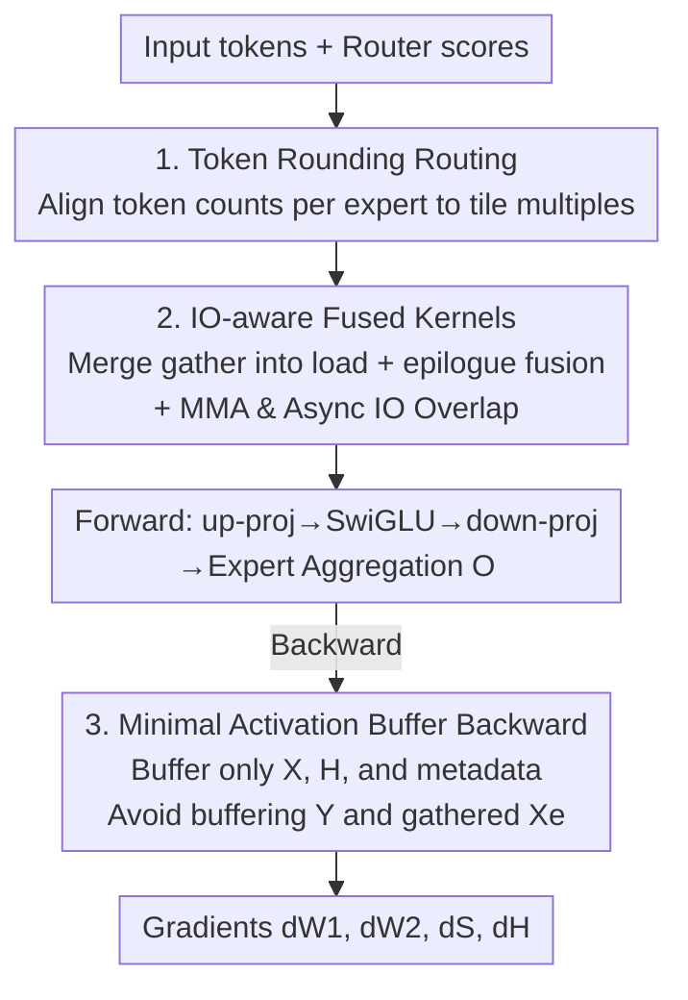

# SonicMoE: Accelerating MoE with IO and Tile-aware Optimizations

**Conference**: ICLR 2026  
**OpenReview**: [https://openreview.net/forum?id=KzTJ1raEgB](https://openreview.net/forum?id=KzTJ1raEgB)  
**Code**: https://github.com/Dao-AILab/sonic-moe  
**Area**: LLM Efficiency  
**Keywords**: MoE Training Acceleration, GPU Operators, Activation Memory, Grouped GEMM, Tile Quantization

## TL;DR
Addressing the increasing memory-bound issues of "fine-grained + high-sparsity" MoE on modern hardware, SonicMoE employs three strategies: rewriting the backward computational graph to minimize activation buffering, utilizing fused kernels that overlap IO with computation, and implementing token rounding routing that aligns tokens per expert with hardware tiles. On Hopper, it increases operator throughput for 7B fine-grained MoE by 1.86× and reduces activation memory by 45% compared to ScatterMoE, while providing an additional 1.16× speedup under high sparsity.

## Background & Motivation

**Background**: Mixture-of-Experts (MoE) has become the de facto standard for scaling language models without significantly increasing FLOPs. Recent trends push two extremes: higher **expert granularity** (smaller $n$, with experts becoming "thinner") and higher **sparsity** (increasing the total number of experts $E$ while keeping the number of active experts $K$ constant). Models like DeepSeek V3, Qwen3-MoE, gpt-oss-120b, and Kimi K2 demonstrate that fine-grained and high-sparsity configurations yield better model quality under the same FLOP budget.

**Limitations of Prior Work**: MoE scaling laws suggest that "quality per FLOP" improves with increased granularity and sparsity, but **reduced FLOPs do not equate to high hardware utilization**. Fine granularity forces each expert to gather tokens from diverse locations and scatter them back, causing an explosion in dynamic IO access. This translates into three hardware-unfriendly behaviors: (1) activation memory scales linearly with the number of active experts, causing buffers for backward passes in fine-grained models to balloon; (2) arithmetic intensity (FLOPs per IO byte) decreases as granularity rises and sparsity increases, shifting operators from being compute-bound to **memory-bandwidth bound**; (3) under high sparsity, the number of tokens per expert decreases, making the **tile quantization effect** (padding needed when tokens do not divide evenly into tiles) in Grouped GEMM a significant waste of compute. Existing SOTA operators like ScatterMoE and MoMoE are not designed for these high IO costs, resulting in significant throughput degradation.

**Key Challenge**: The analytical formula for arithmetic intensity (ignoring $H$ write-back) is:

$$\text{Arithmetic Intensity} = \frac{3}{2 + \tfrac{2G}{d} + \tfrac{3}{T\rho}}$$

where $G = d/n$ is granularity and $\rho = K/E$ is the activation ratio. For a fixed model size (fixed $d$), **increasing granularity $G$ or decreasing the activation ratio $\rho$ reduces arithmetic intensity**. This is the mathematical root of memory-bound issues in fine-grained, high-sparsity models. Regaining throughput requires simultaneously managing activation buffering, IO latency within operators, and padding waste.

**Goal**: Without altering the mathematical equivalence of original MoE or increasing FLOPs, resolve: (a) linear expansion of activation memory with granularity, (b) low operator throughput due to memory-bandwidth constraints, and (c) compute waste from tile quantization under high sparsity.

**Core Idea**: Co-design hardware and architecture. Specifically: **rewrite the computational graph** for backward passes to avoid buffering $O(TKd)$ activations; use gather/epilogue fusion + MMA/Async IO overlap to hide memory latency; and use **token rounding** to align tokens per expert to Grouped GEMM tile multiples, eliminating padding at the source.

## Method

### Overall Architecture
SonicMoE decomposes an entire MoE layer's forward and backward passes into eight operators. Along the pipeline of "Routing → Forward Operators → Backward Operators," it inserts three orthogonal optimizations that can be stacked.

The workflow is as follows: tokens are first processed by the **Token Rounding router**, which decides expert assignments and aligns token counts to tile multiples. Then, **Forward Grouped GEMM operators** fuse gathers into HBM loads and element-wise operations (e.g., SwiGLU) into epilogues, while overlapping MMA with asynchronous IO to hide bandwidth latency. Finally, the backward pass follows a **rewritten computational graph** that buffers only a minimal set ($X$, $H$, and routing metadata), avoiding large activations like $Y$ or gathered $X_e$ that scale with granularity.

### Key Designs

**1. Token Rounding Routing: Aligning Tokens to Tiles to Eliminate Padding Waste**

This addresses compute waste caused by tile quantization under high sparsity. Grouped GEMM partitions compute by tiles (e.g., $M_{tile}=128$). If the tokens per expert $f_e$ is not a multiple of the tile size, padding is required. In sparse models where an expert may only receive a few hundred tokens, this waste can reach double-digit percentages. Token Rounding (TR) is a drop-in two-step routing mechanism: it first calculates vanilla top-K token-choice (TC) results, then sorts tokens for each expert by router scores (similar to expert-choice). The weight matrix is handled such that TC-selected tokens always take priority over EC candidates, ensuring any dropping or padding happens only at the **final tile** of each expert. A `round_and_sparsify` subroutine rounds $f_e$ to the nearest tile multiple—if $\lceil f_e\rceil_{M_{tile}} - f_e < f_e - \lfloor f_e\rfloor_{M_{tile}}$, it adds EC tokens; otherwise, it drops tokens to the previous tile.

The key property is that the **maximum deviation per expert relative to TC routing is strictly limited to one tile**, and the expected total token count remains unchanged. This eliminates Grouped GEMM padding while minimally perturbing the original allocation. Experiments show TR is highly stable as an alternative to TC when average tokens per expert $\bar T_e/M_{tile}\ge 2$.

**2. IO-aware Fused Kernels: Hiding Bandwidth Latency via Fusion and Overlap**

This addresses memory-bandwidth bottlenecks where IO costs grow linearly with granularity. SonicMoE implements two types of fusion in efficient varlen-M / varlen-K Grouped GEMMs: **gather fusion** integrates token gathering into the HBM-to-SMEM load process, eliminating separate gather phases; **epilogue fusion** integrates element-wise operations like SwiGLU/dSwiGLU into the forward up-proj and backward down-proj activation gradient kernels. 

Crucially, **MMA and Async IO are overlapped**. On Hopper, SonicMoE uses a **Ping-Pong scheduling** paradigm where one warpgroup performs IO while another performs GEMM with smaller tiles, switching roles upon completion. This maintains high Tensor Core throughput even with heavy epilogues. On Blackwell, it utilizes TMEM (on-chip accumulator memory) for a two-stage accumulation pipeline, running epilogues concurrently with UMMA accumulation. By hiding IO within computation, SonicMoE achieves 1.86× throughput over ScatterMoE's BF16 operators on 7B models.

**3. Minimal Activation Buffer Backward: Rewriting the Graph to Decouple Memory from Granularity**

This addresses the linear growth of activation memory with granularity. The total FLOPs of an MoE layer are $(6+12)TnKd$. To keep FLOPs constant as granularity $G$ increases (decreasing $n$), $K$ must increase proportionally. Thus, any $O(TKd)$ activation buffer scales with granularity. SonicMoE rewrites the backward computational graph to remain **mathematically equivalent** while avoiding large buffers. Specifically, it **does not buffer** the $TKd$-scale activations $Y$ and gathered $X_e$. For $X$ and $dO$, gather operations are fused with HBM loads to avoid materialization. For $Y$, the authors derived an alternative path to calculate $dS$ and $dH$ without requiring $Y$ or $dY$ (Appendix D), without adding FLOPs.

Consequently, each layer only needs to buffer $X$, $H$, and routing metadata (approx. $2Td + 4TKn$ bytes). This set is the "minimal activation memory required for backward without GEMM recomputation" and is **independent of expert granularity**.

## Key Experimental Results

### Main Results

Activation memory and throughput (H100, 7B fine-grained MoE, $n=256$):

| Metric | Baseline | SonicMoE Performance |
|------|----------|---------------|
| Activation Memory / Layer | ScatterMoE | 45% reduction (more vs. MoMoE; >3 GiB saved per layer at 120B) |
| Operator Throughput | ScatterMoE BF16 | 1.86× improvement |
| Forward Speedup vs. | DeepGEMM (Optimized) | +43% |
| Backward Speedup vs. | ScatterMoE / MoMoE | +83% / +115% |
| Thru. % of Upper Bound | cuBLAS BMM bound | Avg 88% (Max 91%) |

End-to-End: On B300 (OLMoE-sized 7B), SonicMoE outperforms DeepGEMM++ by 28.7% / 22.1% in forward/backward passes. As granularity increases from 2 to 8, the speedup expands from 20.9%/22.1% to 35.2%/30.9%. Using 64 H100s, **SonicMoE achieves 213 B tokens/day, nearing ScatterMoE's 225 B tokens/day on 96 H100s**—providing comparable throughput with 1/3 fewer GPUs.

### Ablation Study

Quality and efficiency of Token Rounding (0.5B–1.8B models, 40B–100B tokens):

| Configuration | Behavior | Key Finding |
|------|------|----------|
| TC top-K | Vanilla Routing | Baseline perplexity / accuracy |
| **TR (Token Rounding)** | Tile Alignment | Perplexity and 11-task avg accuracy **equal to or better** than TC (e.g., 1.8B: TR train ppl 13.34 vs TC 13.51) |
| EC / EC(aux) | Expert-Choice | Significantly worse validation perplexity |
| High-Sparsity Thru. | Large $E$, fixed $K$ | TR provides up to +16% TFLOPS (1.16× speedup) over TC |

### Key Findings
- **Modular Optimizations**: The three optimizations target separate bottlenecks and are additive. The memory algorithm solves granularity-based expansion, fused operators solve bandwidth limits, and token rounding solves padding waste.
- **Scaling with Granularity**: Speedups over DeepGEMM++ increase as granularity grows, directly correlating with the arithmetic intensity formula.
- **Quality Preservation**: Token rounding introduces minimal perturbation (max 1 tile) and maintains or improves downstream accuracy, making its performance gains "free."
- **Stability Zone**: TR is stable when $\bar T_e/M_{tile}\ge 2$; caution is needed in extremely sparse scenarios where experts receive very few tokens.

## Highlights & Insights
- **Root Cause Analysis**: The paper uses the arithmetic intensity formula $3/(2+2G/d+3/(T\rho))$ to mathematically ground why fine-grained models are slow, anchoring engineering optimizations in solid theory.
- **Zero-cost Memory Saving**: By finding an equivalent mathematical path to calculate gradients without $Y$, SonicMoE decouples activation memory from granularity without resorting to compute-heavy recomputation.
- **Algorithm-Hardware Co-design**: Token rounding is a prime example of modifying an algorithmic component (routing) to respect hardware constraints (tile size) while maintaining safety via the "1-tile deviation" constraint.
- **Economic Value**: achieving comparable throughput with 64 GPUs vs 96 GPUs is a compelling end-to-end argument for real-world training cost reduction.

## Limitations & Future Work
- **Hardware Specificity**: The scheduling (Ping-Pong, TMA, TMEM) is heavily optimized for Hopper and Blackwell architectures. Porting to other architectures (e.g., AMD) would require significant effort.
- **Boundary of Token Rounding**: The stability of TR when $\bar T_e/M_{tile} < 2$ is not fully explored; very large $E$ configurations need further testing.
- **Implementation Complexity**: The alternative backward path for mathematical equivalence is complex and raises the bar for reproduction compared to naive buffering.
- **Scale of Evaluation**: Evaluation focused on models up to 1.8B/120B tokens; long-term impacts on massive-scale training (e.g., 70B+ models) remain to be seen.

## Related Work & Insights
- **vs. ScatterMoE**: ScatterMoE buffers activations that grow with granularity and separates gather from GEMM. SonicMoE fuses these and rewrites the graph, yielding 45% less memory and 1.86× throughput.
- **vs. MoMoE / DeepGEMM**: These do not address high IO costs and tile quantization waste. SonicMoE pulls ahead in the fine-grained/sparse regime (e.g., +115% backward vs MoMoE).
- **vs. Rectify-Router**: Both modify token allocation, but Rectify-Router is tile-agnostic. TR specifically targets Grouped GEMM tile structures to eliminate padding FLOPs.

## Rating
- Novelty: ⭐⭐⭐⭐⭐ (Rewriting backward graph + tile-aware routing are innovative and well-grounded).
- Experimental Thoroughness: ⭐⭐⭐⭐⭐ (Covers 0.5B-120B scales, multiple hardware generations, and end-to-end metrics).
- Writing Quality: ⭐⭐⭐⭐ (Technically dense; requires close attention to Appendix D for the gradient derivation).
- Value: ⭐⭐⭐⭐⭐ (Directly addresses the primary bottlenecks of modern MoE training).

<!-- RELATED:START -->

## Related Papers

- [\[ICML 2026\] STAR: Rethinking MoE Routing as Structure-Aware Subspace Learning](../../ICML2026/llm_efficiency/star_rethinking_moe_routing_as_structure-aware_subspace_learning.md)
- [\[ACL 2025\] Accelerating Speculative Decoding via Efficient Context-Aware Draft Generation](../../ACL2025/llm_efficiency/accelerating_speculative_decoding_via_efficient_context-aware_draft_generation.md)
- [\[NeurIPS 2025\] MoESD: Unveil Speculative Decoding's Potential for Accelerating Sparse MoE](../../NeurIPS2025/llm_efficiency/moesd_unveil_speculative_decodings_potential_for_accelerating_sparse_moe.md)
- [\[ICLR 2026\] OPPO: Accelerating PPO-based RLHF via Pipeline Overlap](oppo_accelerating_ppo-based_rlhf_via_pipeline_overlap.md)
- [\[ACL 2026\] Alloc-MoE: Budget-Aware Expert Activation Allocation for Efficient Mixture-of-Experts Inference](../../ACL2026/llm_efficiency/alloc-moe_budget-aware_expert_activation_allocation_for_efficient_mixture-of-exp.md)

<!-- RELATED:END -->
