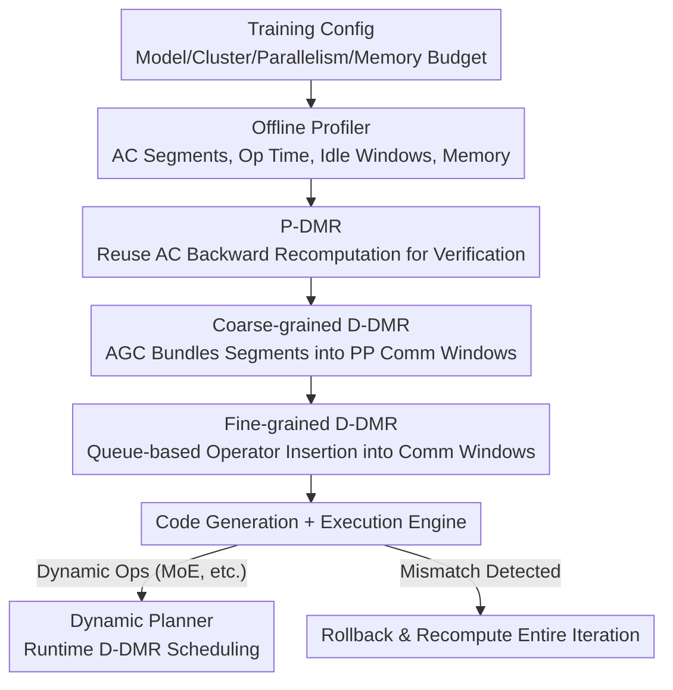

# SpareTrain: Fault-Tolerant LLM Training via Low-Cost Dual Modular Redundancy

**Conference**: ICLR 2026  
**OpenReview**: [https://openreview.net/forum?id=kDeS8jpeiZ](https://openreview.net/forum?id=kDeS8jpeiZ)  
**Code**: None  
**Area**: LLM Efficiency / Fault-tolerant Training Systems  
**Keywords**: Silent Data Corruption, Dual Modular Redundancy, Activation Checkpointing, GPU Idle Utilization, Distributed Training

## TL;DR
SpareTrain integrates Dual Modular Redundancy (DMR)—the most thorough but traditionally most expensive method for detecting Silent Data Corruption (SDC)—into LLM training systems. By recycling redundant computations naturally generated by backpropagation recomputation in Activation Checkpointing (AC) and masking verification tasks within GPU idle windows during communication, it reduces the training throughput loss from ~100% to only 3–14% overhead relative to unprotected training, without weakening detection capabilities.

## Background & Motivation

**Background**: Training Large Language Models (LLMs) involves thousands of GPUs running for months, making hardware reliability a critical issue. The most challenging problem is **Silent Data Corruption (SDC)**—errors that bypass hardware mechanisms like ECC/CRC, silently producing incorrect numerical values that propagate through training. Research indicates that even seemingly negligible gradient noise can lead to parameter divergence or convergence to suboptimal models, and minor errors may irreversibly damage model quality.

**Limitations of Prior Work**: Software methods for SDC detection exist on a spectrum of "coverage vs. overhead." **Dual Modular Redundancy (DMR)** executes every operator twice and compares the results. Under the assumption that the probability of identical errors occurring simultaneously in both executions is negligible, DMR provides **complete detection** and is universally applicable to both linear and non-linear operators. This is the only method offering strong guarantees for arbitrary training workloads. However, it effectively doubles the computation (approx. 100% overhead). Consequently, although DMR-like methods have been proposed, they have never been deployed with full coverage. Other lighter methods (ABFT checksums, gradient outlier detection, training small networks as detectors, or monitoring specific layers) either suffer from false negatives due to numerical precision issues in low-precision formats (FP16/BF16/FP8) or only provide selective coverage and probabilistic guarantees, failing to meet production-level reliability requirements.

**Key Challenge**: The detection capability of DMR is directly tied to its computational overhead—achieving full detection requires recomputing every operator, which appears to be an unavoidable $2\times$ cost.

**Goal**: To minimize the training throughput loss caused by DMR while **not sacrificing SDC detection capabilities**.

**Key Insight**: The authors observe two "free lunches" in large-scale LLM training that can be fed to DMR's verification execution: (1) **Activation Checkpointing (AC)**, widely used to save memory, already recomputes forward operators during the backward pass; this recomputation naturally serves as a "second execution." (2) GPUs in distributed training remain **idle for significant periods** due to communication and pipeline bubbles (empirical measurements show idle ratios of 68% and 77% for two representative models); verification tasks can be "hidden" within these windows.

**Core Idea**: Replace the "immediate recomputation" of naive DMR with two complementary strategies: **Piggyback-DMR** (reusing AC recomputations) and **Deferred-DMR** (hiding execution in communication windows), managed by a three-phase planner that optimally assigns every operator to these strategies.

## Method

### Overall Architecture

SpareTrain is an end-to-end fault-tolerant training system aiming for "Complete DMR + Minimal Overhead." Its core output is a **DMR plan**, which assigns every operator in training to one of four sets: `P-DMR` (leveraging AC recomputation), `D-DMR_inter` (deferred to inter-node communication windows), `D-DMR_intra` (deferred to intra-node communication windows), or `Naïve-DMR` (recomputed immediately if it cannot be fit elsewhere). For deferred tasks, the plan also determines the specific idle window for execution.

The system operates in two stages: **offline** and **online**. In the offline stage, a Profiler runs a few iterations to collect AC segments, execution times and memory footprints of operators, timing and duration of GPU idle windows, and memory usage patterns. A static planner generates the DMR plan and rewrites the training code. In the online stage, the execution engine runs the modified code. If any device detects a mismatch during DMR comparison, the system **rolls back and recomputes the entire iteration**. For operators that cannot be determined offline (e.g., MoE layers), a **dynamic planner** makes runtime decisions based on compute/communication status.

DMR planning follows a three-phase pipeline: Phase 1 assigns AC-recomputed operators to `P-DMR`; Phase 2 performs coarse-grained `D-DMR` by bundling continuous operators into segments to fit into inter-node communication windows; Phase 3 performs fine-grained `D-DMR` by fitting operators individually into remaining intra/inter-node windows; any remaining operators fall back to `Naïve-DMR`.

### Key Designs

**1. Piggyback-DMR: Leveraging AC Recomputation for Verification**

The waste in naive DMR stems from computing every operator twice. AC already performs a second execution: within a segment (e.g., F1–F4), only the input checkpoint (A0) is saved; all intermediate activations are discarded and recomputed during the backward pass. The insight of P-DMR is that **this backward recomputation can serve as the "second execution" for DMR**. The forward pass is the primary execution, and the backward recomputation is the checker execution; comparing their outputs provides DMR coverage for the entire segment.

The only additional cost is that the output of the **last operator** in an AC segment is typically not recomputed during the backward pass (as its output is usually preserved for the gradient calculation). P-DMR must therefore execute the last operator of each segment one extra time. Thus, while naive DMR is "every operator +1," P-DMR is "the entire segment +1 operator," significantly reducing overhead. Furthermore, since the output of the segment's end operator is already present from the forward pass, comparing it incurs minimal memory overhead. In rare cases where P-DMR is more expensive—such as when the last operator requires expensive communication that naive DMR could reuse but P-DMR must repeat—the planner selects naive DMR.

**2. Deferred-DMR + AGC: Delaying and Hiding Verification in Communication Windows**

GPUs in LLM training experience significant idle time due to DP/PP/TP/EP communication and pipeline bubbles. Unlike naive DMR, which recomputes immediately after the primary execution, D-DMR **defers** the checker execution to subsequent idle windows, "hiding" the latency. The trade-off is the need to retain input/output tensors until verification, increasing memory usage. D-DMR utilizes communication-induced idle time and distinguishes between `D-DMR_inter` (masking inter-node communication like PP) and `D-DMR_intra` (masking intra-node communication like TP/EP).

To suppress memory bloat from deferral, the authors propose **Activation–Gradient Checkpointing (AGC)**. Multiple adjacent operators in the computation graph are bundled into a segment and deferred together. This way, **only the boundary tensors of the segment** (inputs/outputs) need to be saved to replay and verify the entire block. Phase 2 assigns **one** AGC segment per Transformer block to `D-DMR_inter`. Segment selection is constrained by **memory headroom** (available budget beyond the peak at that stage) and **time headroom** (available inter-node communication duration). The planner selects the segment with the maximum **Gain**, defined as the saved verification time minus extra costs.

**3. Fine-grained D-DMR: Queue-based Scheduling with Demotion**

Operators not covered by Phases 1 and 2 are handled by Phase 3, which fits them into intra-node windows or remaining PP windows. The mechanism uses a **D-DMR queue**: the static planner scans operators in execution order. Upon reaching a communication window (scheduling point): Step 1 tentatively enqueues all unassigned operators since the last point, checking if the queue exceeds the memory budget; Step 2 **demotes** the operators with the shortest execution times to `Naïve-DMR` until the budget is met; Step 3 selects the subset from the queue that best fits the current window size for `D-DMR_intra` (or `inter`). Intuitively, demoting short operators minimizes loss, while keeping long operators in the queue maximizes the benefit of using idle windows.

**4. Dynamic Planner: Runtime Scheduling for MoE Models**

For non-MoE models, operator paths are fixed and handled offline. However, MoE expert layers (EP) are iteration-dependent and dynamic. Thus, Phase 3 is executed by a **dynamic planner** at runtime for MoE. It enqueues inputs/outputs during the primary execution; upon hitting a static window (e.g., TP), it picks the best subset from the queue; upon hitting a dynamic window (e.g., EP), it dequeues and executes until the window closes or the queue is empty. To prevent infinite queue growth, it monitors memory and forces execution (falling back to `Naïve-DMR`) if limits are approached.

## Key Experimental Results

Implemented on PyTorch 2.9 and TorchTitan, using mixed-precision training and `torch.compile`. Hardware: up to 4 nodes, 8x H200 (141GB) per node, InfiniBand + GPUDirect RDMA, NVSwitch 900GB/s. Memory budgets were simulated at 80GB/94GB. Models: Llama-3-70B, Mistral-Large (123B), and Llama-4-Scout (109B) for MoE. Comparisons: No-DMR, Naïve-Only, and SpareTrain.

### Main Results: Throughput Comparison (Throughput Gain vs. Naïve-Only / Overhead vs. No-DMR)

| Model | Memory | Gain vs. Naïve-Only | Overhead vs. No-DMR |
|------|------|--------------------|----------------|
| Llama-3-70B | 80/94/141GB | +32% / +31% / +33% | 3.3% / 13.8% / 10.9% |
| Mistral-Large | 80/94/141GB | +26% / +21% / +23% | 6.1% / 11.0% / 9.8% |
| Llama-4-Scout (MoE) | 94/141GB | +11% / +14% | 9.8% / 8.1% |

Overall, SpareTrain improves throughput by ~30% compared to Naïve-DMR, meaning "full DMR protection is achieved with only ~10% slowdown." Under 80GB, Llama-3-70B shows the lowest overhead (3.3%) because tight memory forces a higher Pipeline Parallelism degree (PP=3 vs PP=2), creating larger communication windows for `D-DMR_inter`. MoE models show smaller relative gains as communication already consumes a large portion of runtime, making the baseline DMR overhead naturally lower.

### Ablation Study: Throughput Gain (%) by Progressive Phases

| Config | Mistral-Large (80G, PP=4) | Llama-4-Scout (141G, PP=4) |
|------|---------------------------|----------------------------|
| Phase 1 (P-DMR only) | 12.9 / 10.8 / 17.0 | 4.7 / 8.3 / 9.3 |
| Phase 1+2 (+Coarse D-DMR) | 22.5 / 22.5 / 24.1 | 12.0 / 9.9 / 12.0 |
| Phase 1+2+3 (+Fine D-DMR) | 23.1 / 26.1 / 28.8 | 13.7 / 12.0 / 16.5 |

(Values correspond to batch sizes 16/32/64; Phase 3 for MoE is performed by the dynamic planner.)

### Key Findings
- **Substantial contribution from all three phases**: There is a significant jump in performance from Phase 1 to Phase 1+2 (coarse-grained AGC is highly effective), and Phase 3 provides further gains—indicating that both P-DMR and D-DMR are essential.
- **Memory budget dictates the benefit profile**: Tighter memory leads to higher PP degrees, which increases communication window sizes, allowing `D-DMR_inter` to be more aggressive. Thus, 80GB configurations may result in lower overhead than 141GB.
- **MoE overhead is naturally lower**: Due to high communication ratios (77% idle), the computational cost of DMR represents a smaller fraction of total time.

## Highlights & Insights
- **Turning a side effect into "free verification"**: The recomputation in AC was originally a computational penalty paid to save memory. P-DMR reinterprets this as the second execution for DMR, achieving segment-level coverage at near-zero extra cost—an elegant "waste utilization."
- **AGC as an extension of AC**: Extending the "save boundaries, replay the rest" logic from forward activations to backward activations and gradients makes "deferred verification" affordable in terms of memory.
- **Complete detection at ~10% overhead**: For the first time, full DMR protection becomes deployable for large-scale LLM training, which is of great significance for long-duration, high-cardinality clusters.
- **Generalizable scheduling paradigm**: The approach of "Deferred Entry — Demote if over budget — Fit to window" can be applied to any system where redundant/verification tasks need to be integrated into a pipeline with regular idle windows.

## Limitations & Future Work
- **Dependency on idle windows**: The benefits rely on significant GPU idle time from communication. Optimization techniques that overlap compute and communication (e.g., asyncTP) could shrink the available windows for `D-DMR`.
- **Pipeline bubbles remain unused**: The authors state that PP bubbles are too sparse and irregular to utilize effectively; better strategies might further reduce overhead.
- **MoE dynamic planning overhead**: MoE requires runtime decisions which are less efficient than offline planning and require conservative memory estimation.
- **Rollback cost not quantified**: The system recomputes the entire iteration upon detection. While SDC frequency is low, the end-to-end reliability gain considering "rollback frequency x cost" is not detailed.
- **Memory as a primary constraint**: Deferring verification naturally necessitates tensor retention. While AGC/demotion mitigate this, it remains a bottleneck in extremely memory-constrained scenarios.

## Related Work & Insights
- **vs. Naïve DMR**: Both provide identical detection capability (full coverage), but Naïve DMR incurs ~100% overhead. SpareTrain reduces this to 3–14% by reusing AC recomputation and hiding tasks in idle slots.
- **vs. ABFT (Algorithm-Based Fault Tolerance)**: ABFT can protect linear kernels like GEMM with low overhead but is limited by numerical precision in BF16/FP8 and does not cover non-linear operators. SpareTrain's DMR approach is universal.
- **vs. Selective Detection**: Methods like gradient outlier detection or small-model detectors have lower overhead (e.g., 7%) but only offer probabilistic or selective coverage, which may not suffice for mission-critical production environments.

## Rating
- Novelty: ⭐⭐⭐⭐⭐ Systematically repurposing AC recomputation and GPU idle time for DMR is a brilliant and well-executed idea.
- Experimental Thoroughness: ⭐⭐⭐⭐ Covers various models and memory budgets; the three-phase ablation is clear. Lacks end-to-end reliability evaluation with real SDC injections.
- Writing Quality: ⭐⭐⭐⭐ Logic and diagrams (AGC selection, queue scheduling) are very clear.
- Value: ⭐⭐⭐⭐⭐ Makes full DMR protection deployable for LLM training, addressing a major pain point in long-cycle reliability.

<!-- RELATED:START -->

## Related Papers

- [\[ICLR 2026\] PARD: Accelerating LLM Inference with Low-Cost Parallel Draft Model Adaptation](pard_accelerating_llm_inference_with_lowcost_parallel_draft_model_adaptation.md)
- [\[ICLR 2026\] AutoSP: Unlocking Long-Context LLM Training Via Compiler-Based Sequence Parallelism](autosp_unlocking_long-context_llm_training_via_compiler-based_sequence_paralleli.md)
- [\[ICLR 2026\] Prima.cpp: Fast 30-70B LLM Inference on Heterogeneous and Low-Resource Home Clusters](primacpp_fast_30-70b_llm_inference_on_heterogeneous_and_low-resource_home_cluste.md)
- [\[ICLR 2026\] Revisiting Parameter Server in LLM Post-Training](revisiting_parameter_server_in_llm_post-training.md)
- [\[ICLR 2026\] CR-Net: Scaling Parameter-Efficient Training with Cross-Layer Low-Rank Structure](cr-net_scaling_parameter-efficient_training_with_cross-layer_low-rank_structure.md)

<!-- RELATED:END -->
