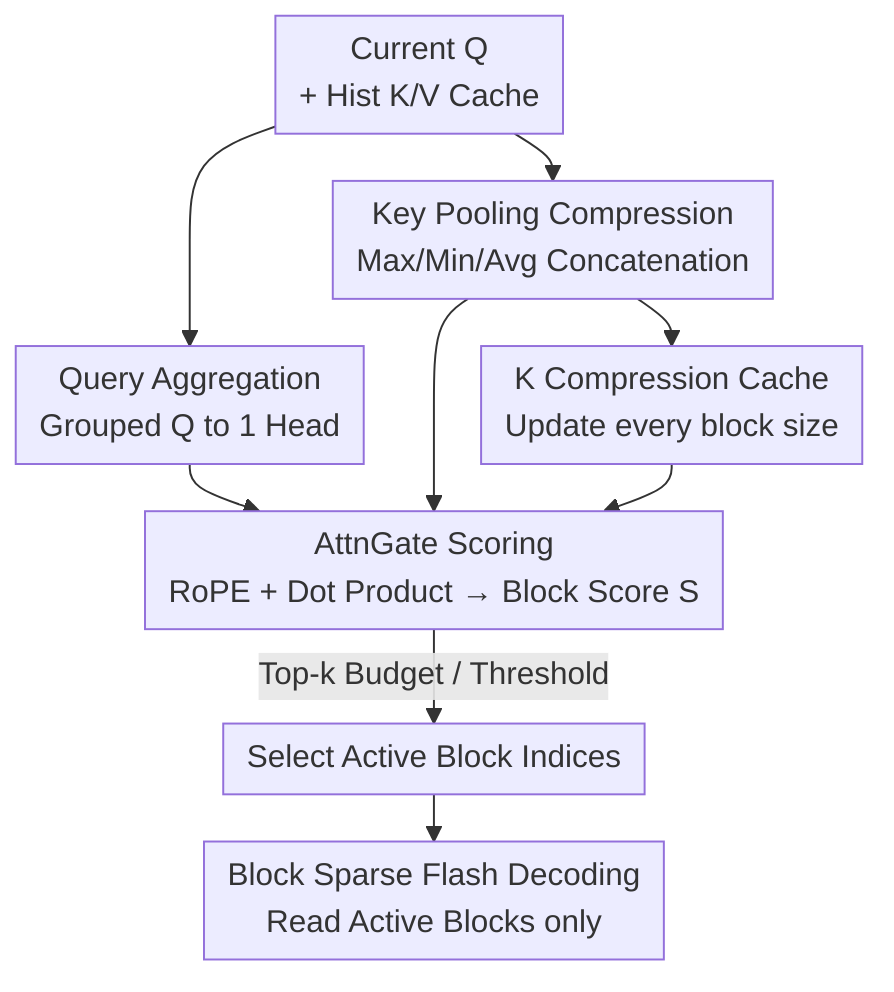

# Sparse Attention Adaptation for Long Reasoning

**Conference**: ICLR 2026  
**OpenReview**: [https://openreview.net/forum?id=c5BOcHM6J8](https://openreview.net/forum?id=c5BOcHM6J8)  
**Code**: To be confirmed  
**Area**: LLM Efficiency / Sparse Attention / Speedup  
**Keywords**: Sparse Attention, Long-chain Reasoning, Self-distillation Gating, KV Cache, Decoding Acceleration

## TL;DR
Ours proposes SeerAttention-R—a sparse attention framework specifically designed for the "long decoding" phase of reasoning models. By using a lightweight, plug-and-play self-distillation attention gate (AttnGate) to learn which KV blocks to activate at each step, it maintains near-lossless reasoning accuracy on benchmarks like AIME with only a 4K token budget. Trained on 0.4B tokens without freezing original model weights, it achieves up to a 9× speedup compared to FlashAttention-3 on H100 using a companion TileLang block-sparse decoding kernel.

## Background & Motivation

**Background**: Reasoning models represented by OpenAI o1, DeepSeek-R1, and Qwen3 rely on "test-time scaling" to improve capabilities—generating longer chains of thought (CoT) to "think" before answering. Empirically, longer generation leads to stronger reasoning: at the same scale, Qwen3-14B generates longer sequences and is stronger than DeepSeek-R1-Distill-Qwen-14B; harder problems (AIME24) require far more tokens than simpler ones (MATH-500).

**Limitations of Prior Work**: Long decoding introduces severe efficiency issues. Under auto-regressive decoding, later tokens must attend to increasingly longer contexts, causing KV cache computation and memory requirements to grow. The cost of generating a single token increases linearly with sequence length, while the total cost of generating the entire segment grows quadratically. Sparse attention is a natural solution for long-sequence efficiency, but it has primarily been studied for general language modeling (especially the prefill stage) rather than for reasoning models requiring ultra-long decoding.

**Key Challenge**: Is the attention in reasoning models actually sparse? If so, can this sparsity be identified cheaply and accurately during the decoding phase? The authors use "oracle sparsity" experiments (directly selecting top-k blocks using ground truth) to prove that decoding attention in reasoning models is inherently sparse; activating only a small fraction of important tokens is sufficient to maintain reasoning ability. The real difficulty lies not in the existence of sparsity, but in "how to efficiently and accurately identify and utilize this sparsity during decoding."

**Goal**: Adapt the authors' previous work SeerAttention (sparse attention for prefill) to the long decoding scenarios of reasoning models. Requirements: (1) support token-by-token auto-regressive decoding; (2) remain plug-and-play without fine-tuning original weights; (3) support large block sizes (64/128) to reduce sparse scheduling overhead and remain hardware-friendly; (4) provide a companion decoding kernel that achieves actual speedup.

**Core Idea**: Retain the core of SeerAttention—using a self-distillation gate to learn attention sparsity—while removing Query sequence-dimension pooling to fit decoding. Sparse decisions are shared across GQA groups. A learned lightweight gate replaces training-free heuristics (like Quest) to accurately predict "which KV blocks to read at this step" even with large block sizes.

## Method

### Overall Architecture

The core of SeerAttention-R is attaching a **learnable AttnGate** to each attention layer of a pre-trained Transformer. At each decoding step, the current Query and compressed historical Keys pass through the gate to calculate importance scores for each KV "block." A small number of blocks are activated based on these scores, and block-sparse Flash Decoding is performed only on these blocks. The original model weights remain frozen, and only the gate itself is trained.

Compared to the prefill-oriented SeerAttention, three key modifications are made: ① **Query no longer undergoes sequence-dimension pooling**—prefill processes entire segments where Q can be compressed, but decoding happens token-by-token, so the gate directly consumes the current token's Q; ② The Q branch uses a linear layer to **aggregate multiple query heads** within the same GQA group into a single head, allowing one group to share a unified sparse selection; ③ The K branch continues using pooling to compress historical Keys. After the gate outputs block scores, they are binarized into block masks via "token budget Top-k" or "thresholding."

The gate calculation can be formulated as ($g$ is the GQA group size, $d$ and $d_{gate}$ are the hidden dimensions of the original model and the gate per head):

$$Q_{gate} = \mathrm{RoPE}\big(W^q_{gate}\,\mathrm{reshape}(Q_{nope}, [\dots, g\cdot d])\big)$$

$$K_{gate} = \mathrm{RoPE}\big(W^k_{gate}\,\mathrm{concat}[P_{max}(K_{nope}), P_{min}(K_{nope}), P_{avg}(K_{nope})]\big)$$

$$S = \mathrm{softmax}\big(Q_{gate} K_{gate}^{\top} / \sqrt{d_{gate}}\big)$$

where $P_{max}/P_{min}/P_{avg}$ are max/min/average pooling along the sequence dimension, and $S$ represents the importance scores per block. The pipeline is as follows:

Mechanism for training the gate: During the training phase, the original model is frozen. The AttnGate uses **self-distillation** to mimic the block-level distribution of the original model's true attention (see Key Design 3). This approach neither modifies original weights nor requires full fine-tuning, making it a "lightweight post-training plugin."

### Key Designs

**1. Removing Query Pooling + GQA Grouped Sparsity: Making the gate decoding-compatible and hardware-friendly**

SeerAttention originally performed block-level sequence pooling for both Q and K. However, decoding follows a token-by-token process where Q has no "sequence" to compress. Ours **removes Q sequence pooling**, allowing the gate to compare the current Q directly with compressed historical Keys. Furthermore, for modern LLMs using GQA, a linear layer in the Q-branch aggregates multiple query heads into a single head. This forces query heads within a group to share the same sparse selection. This motivation is practical—studies like NSA and SAAP found that grouped sparse selection improves efficiency without sacrificing (and sometimes improving) performance, as block-sparse kernels schedule by KV heads.

**2. 3-way K Pooling + Internal RoPE: Retaining selection information with minimal overhead**

Historical Keys must be compressed to a "block-level" representation for cheap scoring, but a single pooling type loses information. Ours uses a **combination of Max, Min, and Avg pooling**. The pooling kernel and stride equal the block size. Max/Min capture outliers (often critical for attention), while Avg preserves the overall distribution. For positional encoding, the gate uses **pre-RoPE Q/K** and re-applies RoPE internally. Since the K-branch is compressed, the position index takes the location of the first token in each block. Experiments show included RoPE is more accurate than excluding it.

**3. Self-Distillation Gate Training: Using the model's own attention as Ground Truth**

The gate does not rely on heuristics but on **self-distillation**. Specifically, whereas the prefill version used 2D max-pooling of the attention map, the decoding version uses **column-wise 1D max-pooling**. To align with GQA sharing, this map is further max-pooled within each query subgroup. The gate is trained using **KL Divergence loss**. To avoid the quadratic complexity of calculating the full attention map, the authors modified the FlashAttention-2 kernel to generate ground truth and attention output simultaneously during the forward pass. This makes training extremely lightweight: 0.4B tokens from OpenR1-MATH-220k with a global batch of 16 for 800 steps is sufficient.

**4. K Compression Cache + Block Sparse Flash Decoding Kernel: Realizing efficiency gains**

To achieve actual speedup, a **K Compression Cache** stores the compressed representation (pooled + linear) of K, preventing the gate from recalculating the K-branch for historical tokens. It **updates only when a full block (e.g., 64) of tokens is generated**. When a sequence is not an integer multiple of the block size, the **last block is always activated** to prevent accuracy loss. With a block size of 64, this cache takes only ~1/128 (<1%) of the original KV cache size. For decoding, a **block-sparse Flash Decoding kernel** implemented in TileLang optimizes memory access, warp specialization, and swizzling on H100.

## Key Experimental Results

Evaluations were performed on four reasoning models (Qwen3-4B/8B/14B, DeepSeek-R1-Distill-Qwen-14B) across four benchmarks (AIME24, AIME25, MATH-500, GPQA-Diamond) with a fixed maximum output of 32,768 tokens. The primary comparison targets are Full Attention and the training-free sparse method **Quest**.

### Main Results

| Configuration | Task | Budget for Near-Lossless Performance | Remarks |
|------|------|------|------|
| Oracle Sparsity (Upper Bound) | AIME24/25 etc. | ~2k tokens | Direct top-k selection using ground truth |
| **SeerAttention-R** | AIME24 | ~4k tokens | Close approximation of ground truth |
| **SeerAttention-R** | MATH-500 / GPQA | ~2k tokens | Lower budget required than AIME |
| Quest (Same Config) | AIME24 | >8k tokens | Heuristics fail with large block sizes |
| Quest (Same Config) | MATH-500 / GPQA | ~8k tokens | Significantly lags behind SeerAttention-R |

SeerAttention-R consistently outperforms Quest across **all models, all benchmarks, and all budgets**. A key finding: **larger models are more tolerant of information loss from sparsity**. The 14B model bridged the gap to dense performance more easily on difficult benchmarks like AIME25.

### Key Designs (Kernel Speedup)

| Configuration | Sparsity | Relative speedup vs FA3 |
|------|--------|------|
| batch 16, seqlen ≥ 32k (TileLang) | 0.9 | Up to ~8.6–9× |
| batch 4, seqlen 32k (TileLang) | 0.9 | ~6× |
| TileLang vs Triton (Same Schedule) | 0.9 | TileLang is ~1.7× faster |

As decoding kernels are I/O-bound, longer sequences and larger batches allow for speedups closer to the theoretical upper bound by saturating bandwidth.

### Key Findings
- **Sparsity exists and near-lossless threshold is low**: Oracle experiments show a 2k token budget provides lossless performance; degradation is negligible even with 1k tokens. This justifies the choice of a 64-block size.
- **Learning > Heuristics, especially for large blocks**: Quest fails at block size 64 with full-layer sparsity even at 8k budget, whereas SeerAttention-R succeeds at 4k. Our learned gate directly enables large block sizes, simplifying system design.
- **Scale Matters**: Sparse attention is more friendly to larger reasoning models, suggesting high value for future, larger models.

## Highlights & Insights
- **Learning a gate to mimic true attention**: Unlike Quest (training-free heuristics), SeerAttention-R fits the actual block-level attention distribution via self-distillation.
- **Large block size is a hidden dividend**: Many sparse methods use small blocks (e.g., 16) to maintain accuracy, which increases scheduling overhead. Our learned gate allows sizes like 64/128 without dropping accuracy, capturing both "precision" and "hardware efficiency."
- **K Compression Cache trick**: Minimal memory overhead (<1%) avoids re-computation and enables potential KV offloading to CPU.
- **Kernel-level ground truth generation**: Avoids memory explosion of full attention maps by piggybacking on FlashAttention forward passes.

## Limitations & Future Work
- **Domain limitation**: Evaluated primarily on math/science reasoning (AIME, MATH-500, GPQA). Generalization to code, long-document QA, or agents is not fully explored.
- **Per-model distillation**: While lightweight, a gate must still be trained per model/layer.
- **Gap on small models**: While 14B models achieve near-dense accuracy, 4B/8B models still show a performance gap at low budgets on difficult benchmarks.

## Related Work & Insights
- **vs Quest**: Quest uses block-level upper bounds for selection and requires small blocks (16); SeerAttention-R uses learned gates for better accuracy with larger blocks (64).
- **vs SeerAttention (Prefill)**: Ours adapts to token-by-token decoding by removing Q pooling and adding GQA sharing and specialized kernels.
- **vs NSA / MoBA**: These require training sparsity into the model weights; SeerAttention-R is a post-training plugin that preserves original weights.

## Rating
- Novelty: ⭐⭐⭐⭐ 
- Experimental Thoroughness: ⭐⭐⭐⭐ 
- Writing Quality: ⭐⭐⭐⭐ 
- Value: ⭐⭐⭐⭐⭐ 

<!-- RELATED:START -->

## Related Papers

- [\[ICLR 2026\] Tactic: Adaptive Sparse Attention with Clustering and Distribution Fitting for Long-Context LLMs](tactic_adaptive_sparse_attention_with_clustering_and_distribution_fitting_for_lo.md)
- [\[ICLR 2026\] vAttention: Verified Sparse Attention via Sampling](vattention_verified_sparse_attention_via_sampling.md)
- [\[ICLR 2026\] InfLLM-V2: Dense-Sparse Switchable Attention for Seamless Short-to-Long Adaptation](infllm-v2_dense-sparse_switchable_attention_for_seamless_short-to-long_adaptatio.md)
- [\[ICLR 2026\] Retrospective Sparse Attention for Efficient Long-Context Generation](retrospective_sparse_attention_for_efficient_long-context_generation.md)
- [\[ICLR 2026\] RESA: Bringing Back What Sparse Attention Ignores with Residual Estimation](resa_bringing_back_what_sparse_attention_ignores_with_residual_estimation.md)

<!-- RELATED:END -->
