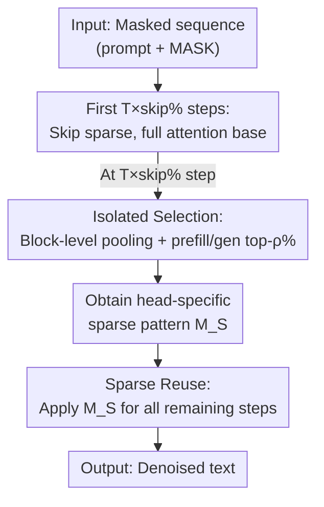

# SparseD: Sparse Attention for Diffusion Language Models

**Conference**: ICLR 2026  
**OpenReview**: [https://openreview.net/forum?id=dwbrZtYP04](https://openreview.net/forum?id=dwbrZtYP04)  
**Code**: https://github.com/INV-WZQ/SparseD  
**Area**: LLM Efficiency / Diffusion Language Models / Sparse Attention  
**Keywords**: Diffusion Language Models, Sparse Attention, Inference Acceleration, Long Context, Lossless Acceleration

## TL;DR
To address the quadratic explosion of bidirectional attention with context length and slow inference in Diffusion Language Models (DLMs), SparseD employs three strategies: using full attention in early steps, one-time pre-computation of head-specific sparse patterns reused across steps, and isolated selection for prefill/generation. It achieves up to 1.50× lossless acceleration relative to FlashAttention on 64k context and 1024 denoising steps.

## Background & Motivation
**Background**: Unlike Autoregressive (AR) models that generate tokens from left to right, Diffusion Language Models (DLMs, e.g., LLaDA, Dream) perform parallel denoising and bidirectional generation for the entire sequence, considered a promising alternative to AR. However, DLMs must repeatedly run bidirectional attention over all tokens across $T$ denoising steps. Since attention complexity is $O(l^2)$ relative to sequence length $l$, inference latency becomes extremely high in long-context scenarios.

**Limitations of Prior Work**: In AR, sparse attention is a mature acceleration method—retaining only a few important query–key pairs (high attention scores). AR attention exhibits distinct and **fixed** sparse patterns (e.g., sink attention, sliding-window) that can be directly applied. However, the authors' empirical tests found that AR sparse patterns fail on DLMs: Slide Window and StreamingLLM drop RULER-4k performance to around 40 (compared to the original 90+).

**Key Challenge**: DLM attention possesses three unique properties incompatible with AR. Based on attention map visualizations, the authors observed: (1) **Large cross-head variance**—different heads in the same layer exhibit diverse patterns like column-like, sliding window, or vertical-column-under-sliding-window, with no uniform fixed pattern; (2) **High similarity across denoising steps**—attention scores for the same head remain nearly constant across different steps; (3) **Critical importance of early steps**—applying sparse attention in the initial steps severely damages generation quality. AR's fixed patterns fail to capture the head-specific structure in (1) and cause quality collapse due to (3).

**Goal**: Design a sparse attention mechanism **specifically for DLMs** that reduces long-context latency while maintaining the precision of the original model (lossless acceleration), without the pre-computation overhead of re-calculating patterns every step.

**Key Insight**: Utilize the three observations as the foundation of the method: since patterns are similar across steps, **compute once and reuse**; since early steps are sensitive, **use full attention initially**; since heads vary, **calculate head-specific patterns for each head individually**.

**Core Idea**: Replace AR-style fixed sparse patterns and step-wise re-calculation with "early full attention + mid-stage one-time pre-computation of head-specific sparse patterns + subsequent reuse," amortizing attention costs for long sequences and multi-step denoising without sacrificing accuracy.

## Method

### Overall Architecture
SparseD divides the denoising process into two segments along the timeline. During the **first $T\times \text{skip}\%$ steps** (default skip=20%), full attention (accelerated by FlashAttention) is used to protect the critical early generation phase. **At the $T\times\text{skip}\%$ step**, a complete attention score computation is performed. After block-level average pooling, the top-$\rho\%$ important blocks are selected individually for each head and for both prefill and generation tokens, forming a head-specific sparse pattern $M_S$. For the **remaining $T\times(1-\text{skip}\%)$ steps**, this $M_S$ is directly reused for sparse attention (supported by FlexAttention for custom patterns) without re-calculation. The pipeline pays the cost of "pre-computing the sparse pattern" at only one point in time; as steps and context length increase, this cost is amortized.

### Key Designs

**1. Skipping Sparse: Reserved full attention for sensitive early steps**

This design addresses the "early steps are critical" observation. The authors conducted a comparative experiment (Figure 2): splitting denoising into Full→Sparse (first $x$ steps full, then sparse) and Sparse→Full (vice-versa). They found that applying sparse attention in early steps causes loss to spike immediately, while delaying sparsity to the middle/late stages results in only marginal loss. SparseD uses full attention for the first $T\times\text{skip}\%$ steps and switches to sparse only after this point. In ablation studies, removing this component (sparse from step 0) dropped RULER-4k from 90.89 to 87.91 (-3.07%), the largest drop among all components.

**2. Isolated Selection: Individual head modeling and prefill/generation balancing**

This addresses "cross-head variance" and a hidden bias. Since heads vary, fixed patterns fail. SparseD calculates attention scores for **each head** and selects important pairs via $S=\bigcup_i \text{Top}_{\rho\%}\{(i,j)\}$. However, generation token attention scores are low in early steps and only rise later. If a unified top-$\rho\%$ selection is used at an early step, prefill tokens dominate the selection, leaving generation tokens with insufficient attention. SparseD **isolates** the selection: prefill and generation tokens each select top blocks at the same ratio $\rho\%$, i.e., $S_i = S_i^{\text{pre}} \cup S_i^{\text{gen}}$. For hardware efficiency, selection is **block-based**: average pooling the attention map $A'=\text{avgpool}(A,\text{block\_size})$ and selecting blocks in $A'$.

**3. Sparse Reusing: One-time pre-computation, full reuse**

This design translates "high similarity across steps" into tangible acceleration. Using Jaccard similarity to quantify stability, the authors found that the top-$\rho$ blocks selected at $T\times\text{skip}\%$ have >90% average similarity with "ground truth" top blocks in subsequent steps. Consequently, SparseD computes $M_S$ once at $T\times\text{skip}\%$, and all subsequent steps run $A(Q,K,M_S)\cdot V$. This is the primary engine for speedup: in ablations, re-computing every step increased latency from 1695s to 30020s (+1671%) with negligible accuracy gain, proving reuse is the key to efficiency, especially as steps increase (1.23× at 128 steps → 1.50× at 1024 steps).

### Loss & Training
SparseD is a **training-free inference-time method** that requires no training or fine-tuning. Key hyperparameters: block_size=32, $\rho$=50% for short contexts; block_size=128, $\rho$=30% for long-context RULER; skip=20% consistently. It uses FlashAttention for the full phase and FlexAttention for the sparse phase.

## Key Experimental Results

### Main Results
Evaluations were conducted on LLaDA-1.5 and Dream-7B-Instruct across MMLU / GSM8K / HumanEval / RULER-4k / RULER-8k (A800 80G). SparseD maintains near-original accuracy, while AR sparse methods collapse and cache-based methods drop significantly in long contexts.

| Model / Method | MMLU | GSM8K | HE | RULER-4k | RULER-8k | Avg. |
|------|------|------|------|------|------|------|
| Dream-7B-Instruct | 66.42 | 80.74 | 53.05 | 90.13 | 71.79 | 72.42 |
| + Slide Window | 63.45 | 70.20 | 34.76 | 41.46 | 34.36 | 48.84 |
| + StreamingLLM | 64.19 | 72.86 | 33.54 | 43.94 | 36.36 | 50.17 |
| + dKV-Cache | 66.32 | 80.67 | 54.88 | 81.41 | 55.08 | 67.67 |
| + Fast-dLLM | 65.51 | 78.17 | 48.78 | 81.68 | 55.64 | 65.95 |
| **+ SparseD** | 66.34 | 80.29 | 53.05 | 89.76 | 72.47 | **72.38** |
| LLaDA-1.5 | 64.24 | 80.38 | 40.85 | 90.45 | 60.73 | 67.33 |
| + Slide Window | 63.72 | 57.77 | 27.44 | 39.20 | 36.32 | 44.89 |
| + StreamingLLM | 63.52 | 52.01 | 37.20 | 40.39 | 36.62 | 45.94 |
| **+ SparseD** | 64.14 | 79.80 | 40.85 | 90.89 | 62.44 | **67.62** |

SparseD shows near-zero loss (Dream -0.04%, LLaDA-1.5 +0.29%). For latency (T=128), advantages emerge beyond 16k: at 64k, it achieves 1.23×/1.25× speedup; at 1024 steps, this rises to 1.50×/1.48× because pre-computation costs are amortized.

### Ablation Study
Ablations on LLaDA-1.5 (Accuracy=RULER-4k, Latency=64k sample).

| Configuration | RULER (%) | Latency (s) | Description |
|------|---------|-------------|------|
| FlashAttention | 90.45 | 2127 | Original baseline |
| SparseD | 90.89 | 1695 | Complete model |
| − Skipping Sparse | 87.91 (-3.07%) | 1552 | Sparse from start, highest accuracy drop |
| − Sparse Reusing | 90.82 (-0.07%) | 30020 (+1671%) | Recompute every step, latency explosion |
| − Isolated Selection | 90.53 (-0.36%) | 1687 | Unified prefill/gen, accuracy drop |

### Key Findings
- **Skip for Accuracy, Reuse for Speed**: Removing "Skipping Sparse" hits quality hardest (-3.07%), while removing "Sparse Reusing" increases latency by nearly 18x. These two components safeguard quality and efficiency respectively.
- **Controllable Pre-computation Overhead**: Block-level selection keeps sparse pattern storage low; $M_S$ consumes only 246MB at 64k. Without block selection, 16k causes OOM.
- **Scaling with Steps and Length**: Speedup increases as context (>16k) and denoising steps (→1024) grow, reaching up to 1.50×.
- **Mismatch of AR Patterns**: StreamingLLM's sink attention fails on DLMs, confirming DLM attention is head-specific and lacks a uniform fixed pattern.

## Highlights & Insights
- **Observation-Driven Paradigm**: Three empirical observations (head heterogeneity, temporal similarity, early sensitivity) map directly to three components, ensuring every design choice is grounded in data.
- **Leveraging Temporal Similarity**: Unlike AR's spatial fixed patterns, SparseD exploits DLM's **temporal** stability (across steps). The "compute once, reuse always" strategy is an advantage unique to DLMs.
- **Isolated Selection as a Crucial Detail**: Under the combination of early pattern fixing and low early scores for generation tokens, unified top-k systematically neglects generation tokens. This bucketed selection fixes the bias.
- **Plug-and-play**: Requires no retraining, making it highly practical for existing DLM deployments.

## Limitations & Future Work
- **Modest Acceleration**: Reaches 1.50× only at extreme context (64k) and steps (1024). Benefits at 4k/8k are negligible compared to FlashAttention.
- **Hyperparameter Tuning**: $\rho$ and block_size require manual adjustment for different context lengths, lacking an adaptive mechanism.
- **Architecture Dependency**: Rooted in LLaDA/Dream properties; generalizability to future DLM architectures needs verification.
- **$O(l^2)$ in Early Phase**: The "skip" segment still uses full attention, which remains a bottleneck for extremely long sequences.

## Related Work & Insights
- **vs Slide Window / StreamingLLM (AR Sparse)**: These use fixed spatial patterns that ignore DLM's head-specific structure and sensitivity in early steps, causing accuracy collapse.
- **vs dKV-Cache / Fast-dLLM (DLM Cache)**: These rely on KV/block caching. They perform well in short contexts but show significant accuracy degradation at 8k context; SparseD offers a complementary, lossless path for long contexts.

## Rating
- Novelty: ⭐⭐⭐⭐ First to systematically characterize DLM-specific attention properties and design a specialized sparse mechanism.
- Experimental Thoroughness: ⭐⭐⭐⭐ Covers two major DLMs, four benchmarks, and long/short contexts plus multi-step variations.
- Writing Quality: ⭐⭐⭐⭐ Clear logical loop from observations to method to results.
- Value: ⭐⭐⭐⭐ Training-free and plug-and-play, providing a lossless acceleration path for long-context DLMs.

<!-- RELATED:START -->

## Related Papers

- [\[ICLR 2026\] Understanding and Improving Length Generalization in Hierarchical Sparse Attention Models](understanding_and_improving_length_generalization_in_hierarchical_sparse_attenti.md)
- [\[ICLR 2026\] Diffusion Language Models Know the Answer Before Decoding](diffusion_language_model_knows_the_answer_before_it_decodes.md)
- [\[ICLR 2026\] Attention Is All You Need for KV Cache in Diffusion LLMs](attention_is_all_you_need_for_kv_cache_in_diffusion_llms.md)
- [\[ICLR 2026\] UltraLLaDA: Scaling the Context Length to 128K for Diffusion Large Language Models](ultrallada_scaling_the_context_length_to_128k_for_diffusion_large_language_model.md)
- [\[ICLR 2026\] Sparse Attention Adaptation for Long Reasoning](sparse_attention_adaptation_for_long_reasoning.md)

<!-- RELATED:END -->
