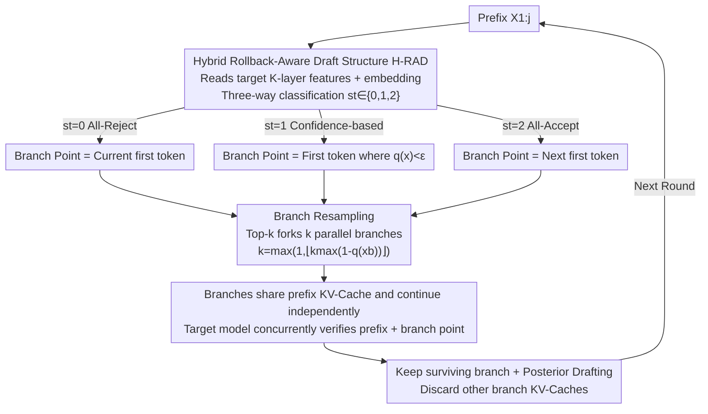

# SpecBranch: Speculative Decoding via Hybrid Drafting and Rollback-Aware Branch Parallelism

**Conference**: ICLR 2026  
**OpenReview**: [https://openreview.net/forum?id=BrnlCSqO6n](https://openreview.net/forum?id=BrnlCSqO6n)  
**Code**: https://github.com/Sylvan820/Specbranch  
**Area**: LLM Efficiency  
**Keywords**: Speculative Decoding, Branch Parallelism, Rollback-Aware, Adaptive Draft Length, Inference Acceleration

## TL;DR
Inspired by CPU branch prediction, SpecBranch allows the draft model to generate multiple "speculative branches" in parallel during the target model's verification phase to hedge against rejections. Using a lightweight three-way classifier (H-RAD) that fuses explicit target features with implicit confidence, it adaptively determines draft lengths and branch points. It reduces the rollback rate from 66–90% to below 40%, achieving a 1.8×∼4.5× end-to-end speedup over autoregressive decoding while maintaining a lossless sampling distribution.

## Background & Motivation

**Background**: Speculative Decoding (SD) is a mainstream paradigm for accelerating LLM autoregressive inference—using a small draft model $M_q$ to generate $\gamma$ candidate tokens in advance, followed by parallel verification by a large target model $M_p$. It transforms "token-by-token serial generation" into "batch parallel verification," decoupling computation from sequence length.

**Limitations of Prior Work**: Standard SD remains **serial**—the draft and target models work in strict alternation: the target model is idle during drafting, and the draft model is idle during verification. This mutual waiting creates "pipeline bubbles," failing to saturate hardware utilization. Parallel SD methods like PEARL attempt to overlap drafting with verification (drafting the next sequence during verification), but introduce a fatal flaw: if any intermediate token is rejected, all subsequent tokens are invalidated (**global invalidation**), causing the parallel pipeline to degrade back to serial execution.

**Key Challenge**: There is an inherent trade-off between parallelization and token rollback. The number of accepted draft tokens approximately follows a **truncated geometric distribution** $P(X=k)=(1-\alpha)\alpha^k\,\mathbb{I}(k<\gamma)+\alpha^\gamma\mathbb{I}(k=\gamma)$, where $\alpha=\mathbb{E}(\beta)$ is the expected acceptance rate. While a longer $\gamma$ allows more parallelism, the probability of rejection $1-\alpha^\gamma$ increases, amplifying the rollback penalty. Especially when the draft and target models are severely mismatched (e.g., 68M vs 13B, $\alpha\le 0.5$), rollback costs negate parallel gains. PEARL has two specific defects: ① **Pre-verification rollback**—it only verifies the first token, remaining oblivious to mid-sequence rejections until the verification ends, wasting computation on invalid tokens; ② **After-verification rollback**—it uses static draft lengths, making the target model a bottleneck for processing invalid branches.

**Goal**: To minimize the waste caused by rollback while maintaining parallelism, specifically by solving two sub-problems: "how to adaptively determine draft length/branch points" and "how to hedge against rejections in parallel during the verification phase."

**Key Insight**: The authors take inspiration from **branch prediction** mechanisms in modern processors. CPUs speculatively execute multiple paths at uncertain branches and discard incorrect ones; similarly, SD can fork multiple candidate branches in parallel at points where the draft model has "low confidence" to hedge against likely rejections.

**Core Idea**: Replace "static serial drafting" with "rollback-aware branch parallelism"—forking an adaptive number of parallel speculative branches at uncertain points and dynamically controlling draft length via a hybrid predictor that fuses implicit confidence and explicit target features.

## Method

### Overall Architecture

SpecBranch splits each decoding round into two pipeline stages: the **draft stage** and the **branch stage**. Two collaborative modules are core: **H-RAD** (Hybrid Rollback-Aware Draft structure) determines "where and how long to draft," and **Branch Resampling** determines "how many branches to fork and how to verify them in parallel."

The data flow works as follows: Given a prefix, H-RAD reads the hidden states of the target model's last $K$ layers plus the new token embedding to output a three-way signal $s_t\in\{0,1,2\}$, determining if the draft should be "All-Reject / Confidence-based / All-Accept," thereby identifying the **branch point** $x_b$. At the branch point, Branch Resampling forks $k$ parallel branches from the draft distribution using Top-$k$, with each branch independently continuing with a shared prefix KV-Cache. Simultaneously, the target model **concurrently** verifies the previous prefix tokens. After verification, the surviving branch is selected, others are discarded along with their KV-Caches, and "posterior drafting" re-selects tokens for the next round based on the latest features to resolve temporal mismatch. This process overlaps drafting and verification, filling pipeline bubbles while minimizing rollback waste.

### Key Designs

**1. Parallel-Rollback Theoretical Analysis and Branch Parallelism: Calculating Parallelism Viability**

The authors quantify the speedup of "ideal parallelism" vs. "parallelism with rollback." Under the ideal case where $\gamma$ tokens are accepted, the single-token latency of Parallel SD is $T_{\text{PSD}}=\max(\gamma t, ct)/\gamma$ (where $t$ is draft time per token and $c=T_p/T_q$ is the speed ratio). Optimal 2× speedup over standard SD is achieved when $\gamma\approx c$ and $c\gg1$. However, considering rollback (Theorem 1), the latency becomes:

$$T_{\text{PSDr}}=\frac{2\cdot\max(\gamma t, ct)}{(1+\alpha^\gamma)\cdot\frac{\alpha(1-\alpha^\gamma)}{1-\alpha}}$$

This formula reveals that minimum latency occurs when $\gamma\le c$. If $\gamma$ is too small, parallel resources are wasted; if too large, rollback accumulation leads to diminishing returns, a trade-off highly dependent on $\alpha$. Well-aligned models ($\alpha\to1$) can use long $\gamma$, while mismatched models ($\alpha\le0.5$) are dominated by rollback penalties. This analysis motivates the adaptive draft length and rejection hedging. The **Branch Resampling** mechanism "pre-hedges likely rejections" and is proven to maintain the original lossless sampling distribution.

**2. H-RAD: Reducing $\gamma$-class Length Prediction to Three-way Classification**

Directly predicting $\gamma$ is inaccurate. Explicit methods (predicting length using target features) lose discriminative power as sequences grow, while implicit methods (thresholding confidence/entropy) require per-task tuning and suffer from error accumulation. H-RAD identifies a **bimodal phenomenon**: target features strongly distinguish between "All-Accept" and "All-Reject" scenarios, leaving ambiguous cases to implicit confidence. It reduces the problem to 3 classes: taking target hidden states from the last $K$ layers and the new token embedding $z_t=\text{Concat}(f_{t-1}, e_t)$, a lightweight MLP yields $s_t=\arg\max(\text{Softmax}(\text{MLP}(z_t)))\in\{0,1,2\}$ to select a hybrid strategy:

$$H_t=\begin{cases}\varnothing & s_t=0\ (\text{Hard: All-Reject})\\ \{x\in X_{1:\gamma}\mid q(x)>\epsilon\} & s_t=1\ (\text{Soft: Confidence-based})\\ X_{1:\gamma} & s_t=2\ (\text{Hard: All-Accept})\end{cases}$$

Hard signals settle the majority of tokens, while soft signals handle uncertainty using draft confidence $q(x)$ with threshold $\epsilon$. This combines the prediction accuracy of explicit features with the robustness of implicit signals. H-RAD is a small 3-layer MLP that converges in 5 minutes on an A100 **without training the draft model**.

**3. Branch Resampling: Forking Adaptive Branches at Uncertain Points**

After identifying branch point $x_b$, SpecBranch does not just bet on one path. It uses Top-$k$ from $q(x_b)$ to fork $k$ parallel branches $B=\text{TopK}(q(x_b),k)$, where the number of branches **scales inversely with confidence**:

$$k=\max\big(1,\ \lfloor k_{\max}\cdot(1-q(x_b))\rfloor\big)$$

Lower confidence for $x_b$ triggers more branches to hedge against rejection. Branches reuse the prefix KV-Cache for efficiency, and draft length is constrained by $c$ to eliminate pipeline bubbles. Simultaneously, the target model verifies the previous prefix. If any token is rejected, the system reverts; if the prefix is accepted, the system verifies branches via $V=\text{Match}(\{q(x_b^i)\},\{p(x_b^i)\})$ to select the survivor. Unlike tree-based methods that fork at every token, SpecBranch only forks at H-RAD's uncertain points, keeping overhead manageable. Finally, a **Posterior Drafting** step ensures decisions are based on the latest target features $(f_{t-1}, e_t)$ after verification.

### Loss & Training
The training of H-RAD applies only to the lightweight 3-layer MLP. Feature vectors $z_t$ are paired with three-way labels $s_t$. It uses ReLU activation and is trained offline for 20 epochs with a batch size of 32, converging in 5 minutes. The draft model remains untouched (training-free) and maintains lossless output.

## Key Experimental Results

### Main Results
Evaluated on weak-alignment (LLaMA 68M&7B, Vicuna 68M&13B) and strong-alignment (Deepseek-Coder 1.3B&33B, LLaMA-3.1 8B&70B) configurations across HumanEval, GSM8K, CNN/DM, and Spec-Bench. Baselines: SpS (Standard SD), AdaEDL, Lookahead, and PEARL.

| Model Config | Method | HumanEval Gain | GSM8K Gain | CNN/DM Gain | Avg Gain |
|----------|------|------|------|------|------|
| LLaMA 68M&7B | PEARL | 1.69× | 1.86× | 1.66× | 1.74× |
| LLaMA 68M&7B | **Ours** | **2.04×** | **2.12×** | **1.87×** | **2.01×** |
| Vicuna 68M&13B | PEARL | 2.02× | 1.61× | 1.68× | 1.77× |
| Vicuna 68M&13B | **Ours** | **2.47×** | **1.95×** | **1.89×** | **2.10×** |
| Deepseek 1.3B&33B | PEARL | 3.39× | 2.78× | 2.63× | 2.93× |
| Deepseek 1.3B&33B | **Ours** | **3.71×** | **3.02×** | **2.97×** | **3.23×** |
| LLaMA-3.1 8B&70B | PEARL | 3.75× | 3.35× | 3.04× | 3.38× |
| LLaMA-3.1 8B&70B | **Ours** | **4.02×** | **3.67×** | **3.37×** | **3.69×** |

SpecBranch outperforms PEARL in all configurations, achieving 1.8×∼4.5× speedup over autoregressive decoding.

**Rollback Rate Comparison (HumanEval)**: Ours suppresses the rollback rate to ~39.6%, compared to 76.6% for SpS, 81.4% for Lookahead, and 90.3% for PEARL.

### Ablation Study

| Config | Observation | Explanation |
|------|------|------|
| Full SpecBranch | Optimal | Synergy between H-RAD and Branch Resampling |
| w/o branch | Higher drop in well-aligned models | Branch Resampling provides more gain for LLaMA-3.1 |
| w/o H-RAD | Higher drop in weak-alignment models | H-RAD is key for Vicuna 68M-13B, raising gain from 1.72× to 1.95× |

### Key Findings
- **Complementary Components**: For mismatched models (Vicuna 68M-13B), rollback is the bottleneck, making H-RAD most impactful. For well-aligned models (LLaMA-3.1 8B-70B), parallelism is key, making Branch Resampling more effective.
- **Robustness**: SpecBranch is less sensitive to the threshold $\epsilon$. While implicit methods dropped from 64 to 49 tokens/s as $\epsilon$ increased, H-RAD only dropped from 72 to 67 tokens/s.
- **Feature Layer $K$**: Increasing $K$ beyond 4 yielded diminishing returns (1-2 tokens/s gain) while significantly increasing memory overhead; $K=4$ was chosen as the balance.

## Highlights & Insights
- **Clean Interdisciplinary Transfer**: Mapping CPU branch prediction to SD—uncertainty as the trigger, Top-$k$ as the speculative execution, and discarding rejected (losing) branches upon verification—is executed precisely.
- **Dimensionality Reduction for Drafting**: By splitting the complex $\gamma$-class length prediction into two easy "Hard" signals and one "Soft" signal, SpecBranch overcomes the limitations of both explicit and implicit methods.
- **Rollback Rate as a Metric**: Quantifying RB reveals why prior parallel methods fail in weak-alignment scenarios (e.g., PEARL's 90% RB).
- **Nearly Zero Cost**: H-RAD is a 5-minute trained MLP, requires no draft model fine-tuning, is lossless, and is easy to integrate.

## Limitations & Future Work
- H-RAD still retains a confidence threshold $\epsilon$; while sensitivity is reduced, it is not fully parameter-free.
- Requires offline training of the MLP and data collection for new target models/tasks.
- Parallel branches incur additional memory and compute overhead; benefits in high-load/batch scenarios need further exploration.
- While modular and orthogonal to methods like EAGLE, actual integration performance remains to be tested.

## Related Work & Insights
- **vs PEARL**: PEARL uses static lengths and only pre-verifies the first token, causing high rollback (90%) and serial degradation. SpecBranch uses H-RAD for adaptive drafting and branch forking to hedge rejections.
- **vs AdaEAGLE**: AdaEAGLE regresses length via target features but loses accuracy for longer lengths. SpecBranch uses multi-layer features and three-way classification for superior accuracy.
- **vs AdaEDL / Kangaroo**: Implicit methods rely heavily on per-task thresholds. H-RAD settles most tokens via hard signals, reducing error accumulation.
- **vs SpecInfer**: Tree-based methods suffer from KV-Cache explosion. SpecBranch forks only at specific uncertain points, maintaining manageable overhead without complex tree-attention.

## Rating
- Novelty: ⭐⭐⭐⭐⭐ First parallel SD framework with rollback-awareness and hybrid drafting.
- Experimental Thoroughness: ⭐⭐⭐⭐⭐ Comprehensive coverage of model scales, baselines, and sensitivity analysis.
- Writing Quality: ⭐⭐⭐⭐ Clear motivation, though some notations in case studies are dense.
- Value: ⭐⭐⭐⭐⭐ Training-free, lossless, and practical for resource-constrained deployment.

<!-- RELATED:START -->

## Related Papers

- [\[ICLR 2026\] Speculative Speculative Decoding](speculative_speculative_decoding.md)
- [\[ICLR 2026\] Overcoming Joint Intractability with Lossless Hierarchical Speculative Decoding](overcoming_joint_intractability_with_lossless_hierarchical_speculative_decoding.md)
- [\[ICLR 2026\] Learning To Draft: Adaptive Speculative Decoding with Reinforcement Learning](learning_to_draft_adaptive_speculative_decoding_with_reinforcement_learning.md)
- [\[ACL 2026\] Speculative Verification: Exploiting Information Gain to Refine Speculative Decoding](../../ACL2026/llm_efficiency/speculative_verification_exploiting_information_gain_to_refine_speculative_decod.md)
- [\[ICLR 2026\] RepSpec: Structural Re-parameterized Draft Model Training for Speculative Decoding](repspec_structural_re-parameterized_draft_model_training_for_speculative_decodin.md)

<!-- RELATED:END -->
