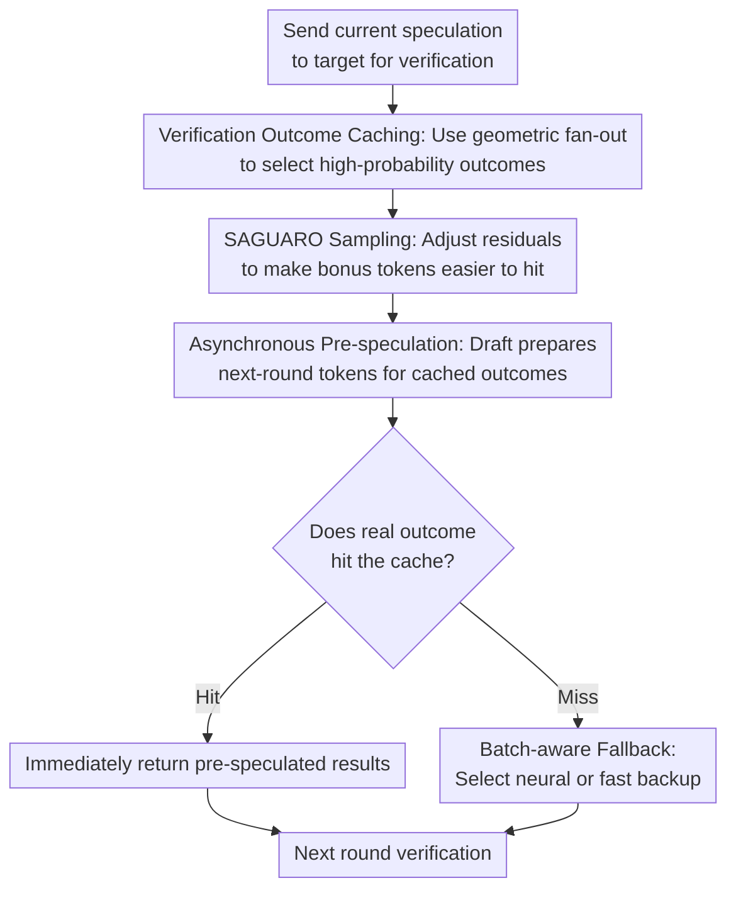

# Speculative Speculative Decoding

**Conference**: ICLR 2026  
**OpenReview**: [https://openreview.net/forum?id=aL1Wnml9Ef](https://openreview.net/forum?id=aL1Wnml9Ef)  
**Code**: https://github.com/tanishqkumar/ssd  
**Area**: LLM Efficiency  
**Keywords**: Speculative Decoding, LLM Inference Acceleration, Asynchronous Inference, Cache Hit, Throughput-Latency Trade-off  

## TL;DR

This paper proposes Speculative Speculative Decoding, which transforms the serial dependency of "draft, then verify, then draft again" in standard speculative decoding into asynchronous pre-speculation: while verification is ongoing, the draft model guesses potential verification outcomes in advance and prepares the next round of candidates. The resulting SAGUARO algorithm is approximately 30% faster than strong speculative decoding baselines on Llama-3.1-70B and approaches a $5\times$ speedup relative to autoregressive decoding.

## Background & Motivation

**Background**: The core bottleneck of LLM decoding stems from autoregressive generation. The target model produces only one token at a time, with the next step depending on the previous result. Even with massive parallel computing power in GPUs, it is difficult to directly reduce single-sequence latency. Speculative decoding (SD) is a common engineering solution: a smaller, faster draft model first guesses the next $K$ tokens, and then a large target model performs a single forward pass to verify these tokens in parallel, with the verification algorithm ensuring the output distribution remains identical to the target model.

**Limitations of Prior Work**: Although standard speculative decoding reduces the number of target model calls, it introduces a new serial chain: the draft model must wait for the previous verification round to finish—knowing how many tokens were accepted and what the bonus token is—before starting the next round of speculation. Consequently, the verifier waits for the draft, and the draft waits for the verifier, preventing true overlapping. This idle time is particularly prominent in low-batch, low-latency scenarios.

**Key Challenge**: The fundamental contradiction in SD is not simply "the draft model is not fast enough," but rather that "the input for the next round of drafting depends on the previous verification outcome." This outcome consists of two parts: the number of accepted draft tokens and the bonus token (from rejection or completion). Without knowing these values in advance, the drafter cannot compute the next round early; if it guesses only one outcome, it risks a cache miss, which eliminates the asynchronous advantage.

**Goal**: The paper aims to further decouple the sequential dependency between drafting and verification. While the verifier processes current candidates, the draft model utilizes independent hardware to parallelize the preparation of the next round of candidates. Simultaneously, it maintains the lossless nature of speculative decoding, meaning it does not change the output distribution of the target model. To achieve this, three sub-problems must be solved: high-probability prediction of verification outcomes, balancing cache hit rate and acceptance rate, and preventing cache misses from slowing down the entire batch.

**Key Insight**: The authors analogize this problem to speculative execution in CPUs: when a branch result is pending, execute the most likely branch ahead of time; if it hits, use it; if it misses, roll back. In LLM inference, "possible verification outcomes" can be treated as branches, and the next-round speculation for each branch can be pre-computed. This approach is promising because draft models are relatively inexpensive and can run in parallel on a different GPU from the target.

**Core Idea**: Replace "starting the draft after verification ends" with "guessing verification outcomes and caching their next-round speculations" to hide drafting latency. SAGUARO further optimizes this asynchronous framework using geometric fan-out, cache-aware sampling, and batch-aware fallback.

## Method

### Overall Architecture

The paper proposes Speculative Speculative Decoding (SSD) as a general framework and introduces SAGUARO as an optimized instance. In the overall process, the target model still verifies only one current speculation, thus not increasing the target compute on the verifier side. Extra work occurs primarily on an independent draft device, which predicts multiple potential verification outcomes during target verification and pre-generates $K$ draft tokens for each outcome.

An SSD iteration works as follows: in round $T$, the target is verifying the sequence $s^{T-1}$ sent from the previous round. Simultaneously, the draft side enumerates several candidate outcomes $v^T=(k,t^*)$, where $k$ is the number of accepted tokens and $t^*$ is the bonus token. The draft prepares the next speculation for each outcome, forming a speculation cache $S_T$. When the target returns the actual outcome, if $v^T \in S_T$, the next round's tokens are immediately available; otherwise, it triggers a fallback.

The reason this framework remains lossless is crucial: the SSD cache only stores "the draft tokens to be verified in the next round." The final acceptance or rejection is still performed by the target following standard speculative decoding rules. If a cache miss occurs, the fallback degrades to standard speculative decoding or a more conservative backup speculator, thus preserving the target distribution while only affecting wait time and extra draft compute.

### Key Designs

**1. Verification Outcome Caching: Fan-out Allocation under Budget Constraints**

SSD must address the reality that the space of verification outcomes is vast. If the speculative lookahead is $K$ and the vocabulary size is $V$, there are approximately $(K+1)V$ outcomes. Since the draft device has a finite budget $B$ for pre-speculations during the target forward pass, SAGUARO cannot guess all tokens equally. Instead, it must decide how many bonus-token guesses to allocate per acceptance length $k$, which is the fan-out $F_k$.

The authors formulate cache hit maximization as a constrained optimization problem: select $F_k$ subject to $\sum_{k=0}^{K}F_k \le B$ to maximize the probability that the actual outcome falls into the cache. Since acceptance lengths approximately follow a geometric distribution, later positions $k$ usually have lower probabilities; however, the "all-accepted" case at $k=K$ has a specific bonus-token distribution. Using a power-law cache miss assumption, the paper derives the SAGUARO cache shape: for $k < K$, the optimal $F_k$ satisfies $F_k = F_0 \cdot a_p^{k/(1+r)}$, and $F_K = F_0 \cdot a_p^{K/(1+r)} \cdot (1-a_p)^{-1/(1+r)}$, where $a_p$ is the primary speculator's acceptance rate and $r$ describes the power-law exponent of cache miss reduction.

**2. SAGUARO Sampling: Reshaping Draft Distribution for Bonus Token Hits**

In standard speculative decoding, the bonus token after a rejection comes from the residual distribution: $r(\cdot) \propto \max(p_{target}(\cdot)-p_{draft}(\cdot), 0)$. This creates a non-intuitive difficulty: tokens most similar to the draft are not necessarily the most likely residual bonus tokens because if $p_{draft}(t)$ is already high, $p_{target}(t)-p_{draft}(t)$ may be small. Since SSD caches are typically based on the top tokens of the draft logits, there is a mismatch between "most likely draft tokens" and "most likely residual tokens."

SAGUARO’s Mechanism makes the sampling distribution actively serve the cache. Given draft logits $z$, fan-out $F$, and a downweighting constant $C \in [0,1]$, it multiplies the probabilities of the top-$F$ draft tokens by $C$ while keeping others the same: $\sigma_{F,C}(z)_t \propto C\exp(z_t)$ if $t \in top_F(z)$, otherwise $\sigma_{F,C}(z)_t \propto \exp(z_t)$. This reduces the probability of cached tokens in the draft distribution, pushing the residual mass toward these cached tokens and increasing the probability that the bonus token hits the cache.

**3. Batch-aware Fallback: Speculator Selection based on Batch Regime**

Asynchronous pre-speculation will inevitably encounter cache misses. The handling of misses determines if SSD is truly faster: if a miss always triggers a just-in-time neural draft, then any single sample miss in a batch forces the entire batch to wait. SAGUARO therefore utilizes a batch-aware fallback. At low batches, cache misses are infrequent, making the high-quality but slower primary neural speculator a viable backup ($E_{miss}$). At high batches, the probability of at least one miss approaches 1, and latency becomes dominated by backup latency $T_b$; here, a very fast but lower-quality backup (like random tokens or n-grams) is preferred.

**4. Asynchronous System Execution: Offloading Extra Compute**

Unlike token-tree speculative decoding, SSD does not force the target model to verify a larger tree. The target verifies only one sequence per round, keeping verifier compute constant. Extra overhead is concentrated on the draft side, which prepares next-round tokens for $B(K+1)F$ branches. The implementation places the target on $4\times$H100 and the draft on a separate $1\times$H100, exchanging outcomes and tokens via NCCL.

## Key Experimental Results

### Main Results

The paper evaluates decode throughput on HumanEval, UltraFeedback, Alpaca, and GSM8k (excluding prefill). For Llama-3.1-70B/1B, SSD achieves a $1.55\times$ to $1.60\times$ speedup over standard SD.

| Model / Drafter | Dataset | AR tok/s | SD tok/s | SSD tok/s | SSD / SD | SSD / AR |
|--------|--------|----------|----------|-----------|----------|----------|
| Llama-3.1-70B / 1B | HumanEval | 54.7 | 176 | 283 | 1.60× | 5.17× |
| Llama-3.1-70B / 1B | UltraFeedback | 54.7 | 138 | 215 | 1.55× | 3.93× |
| Llama-3.1-70B / 1B | Alpaca | 54.7 | 145 | 224 | 1.55× | 4.10× |
| Llama-3.1-70B / 1B | GSM8k | 54.7 | 188 | 301 | 1.60× | 5.50× |
| Llama-3.1-70B / 1B | Average | 54.7 | 161.8 | 255.8 | 1.58× | 4.68× |
| Qwen-3 32B / 0.6B | Average | 88.8 | 136.8 | 203.8 | 1.49× | 2.29× |

### Ablation Study

The "ablation" focuses on component analysis: studying the impact of cache topology, sampling, and fallback on speed and hit rates. 

- **Cache Topology**: Geometric fan-out is more robust than uniform fan-out, especially under high-temperature sampling ($T=0.7, 1.0$), leading to higher end-to-end speeds.
- **Sampling Scheme**: Decreasing $C$ increases cache hit rate but lowers acceptance rate. The optimal $C$ must be chosen to maximize total throughput.
- **Fallback Strategy**: Neural backup is better for small batches, while fast backup prevents the "slowest sample" bottleneck in large batches.

### Key Findings

- The primary gain of SSD comes from hiding drafting latency rather than increasing the number of tokens verified by the target per step.
- Cache hit rate is the critical variable. Guessed outcomes must cover both acceptance lengths and bonus tokens to be robust.
- As sampling temperature increases, bonus tokens become harder to predict. Geometric fan-out and SAGUARO sampling are essential for maintaining hit rates in high-stochasticity scenarios.

## Highlights & Insights

- The transition from standard speculative decoding to "speculating on the speculation" is a natural but non-trivial step. The paper precisely defines verification outcomes and speculation caches with a theoretical speedup formula.
- Geometric fan-out is an elegant design that translates the structural properties of SD (geometric decay of acceptance probability) into a cache budget allocation problem.
- SAGUARO sampling provides a counter-intuitive insight: to make the residual bonus token more predictable, one can purposefully lower the probability of cached tokens in the draft distribution.
- From a system perspective, SSD offloads the burden to independent draft devices, aligning with the trend of prefill/decode disaggregation in LLM serving.

## Limitations & Future Work

- **Resource Requirements**: SAGUARO requires extra draft GPUs and significant draft-side branching. This may not be cost-effective for compute-constrained environments or throughput-oriented offline generation.
- **Implementation Complexity**: Sparse attention masks, KV cache branching, and NCCL synchronization increase engineering maintenance costs.
- **Communication Costs**: The benefits may shift in cross-node deployments or environments with weak network bandwidth where communication overhead might offset latency gains.
- **Parameter Sensitivity**: The constant $C$ and fallback switching points may vary significantly across different model families and tasks, requiring empirical tuning.

## Related Work & Insights

- **vs. Standard Speculative Decoding**: Standard SD reduces target calls but remains serial. SSD maintains lossless verification while overlapping draft and verification time.
- **vs. AMUSD / PEARL**: These methods attempt asynchronous preparation but usually cover only the "all tokens accepted" outcome. SAGUARO generalizes this to any $(k, t^*)$ outcome.
- **vs. EAGLE / Token-Tree**: Tree-based methods (like EAGLE) increase tokens per step by verifying branches. SSD is orthogonal to these; it focuses on parallelizing the time dependency between components.

## Rating

- **Novelty**: ⭐⭐⭐⭐⭐ Abstracting the SD bottleneck into verification outcome prediction is a sharp and well-executed idea.
- **Experimental Thoroughness**: ⭐⭐⭐⭐ Covers various models, datasets, and batch sizes, though real-world multi-node traffic testing would be a valuable addition.
- **Writing Quality**: ⭐⭐⭐⭐⭐ Clear structure moving from theoretical framework to specific challenges and system implementation.
- **Value**: ⭐⭐⭐⭐⭐ High practical value for low-latency LLM serving, providing a reusable paradigm for asynchronous draft compute.

## Related Papers

- [\[ICLR 2026\] Learning To Draft: Adaptive Speculative Decoding with Reinforcement Learning](learning_to_draft_adaptive_speculative_decoding_with_reinforcement_learning.md)
- [\[ICLR 2026\] SpecBranch: Speculative Decoding via Hybrid Drafting and Rollback-Aware Branch Parallelism](specbranch_speculative_decoding_via_hybrid_drafting_and_rollback-aware_branch_pa.md)
- [\[ICLR 2026\] Not-a-Bandit: Provably No-Regret Drafter Selection in Speculative Decoding for LLMs](not-a-bandit_provably_no-regret_drafter_selection_in_speculative_decoding_for_ll.md)
- [\[ICLR 2026\] Overcoming Joint Intractability with Lossless Hierarchical Speculative Decoding](overcoming_joint_intractability_with_lossless_hierarchical_speculative_decoding.md)
- [\[ICLR 2026\] Training-Free Loosely Speculative Decoding: Accepting Semantically Correct Drafts Beyond Exact Match](training-free_loosely_speculative_decoding_accepting_semantically_correct_drafts.md)

<!-- RELATED:END -->

<!-- RELATED:START -->

## Related Papers

- [\[ICLR 2026\] Cactus: Accelerating Auto-Regressive Decoding with Constrained Acceptance Speculative Sampling](cactus_accelerating_auto-regressive_decoding_with_constrained_acceptance_specula.md)
- [\[ICLR 2026\] Not-a-Bandit: Provably No-Regret Drafter Selection in Speculative Decoding for LLMs](not-a-bandit_provably_no-regret_drafter_selection_in_speculative_decoding_for_ll.md)
- [\[ICLR 2026\] Dynamic Speculative Agent Planning](dynamic_speculative_agent_planning.md)
- [\[ICLR 2026\] Training-Free Loosely Speculative Decoding: Accepting Semantically Correct Drafts Beyond Exact Match](training-free_loosely_speculative_decoding_accepting_semantically_correct_drafts.md)
- [\[ICLR 2026\] Self-Speculative Decoding Accelerates Lossless Inference in Any-Order and Any-Subset Autoregressive Models](self-speculative_decoding_accelerates_lossless_inference_in_any-order_and_any-su.md)

<!-- RELATED:END -->
